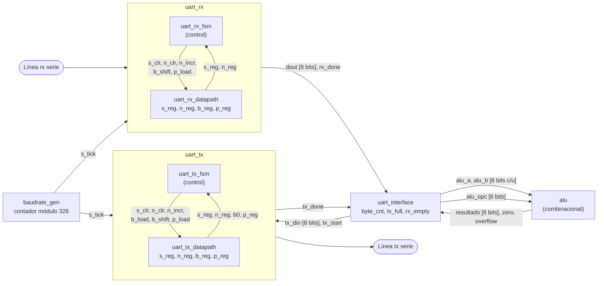
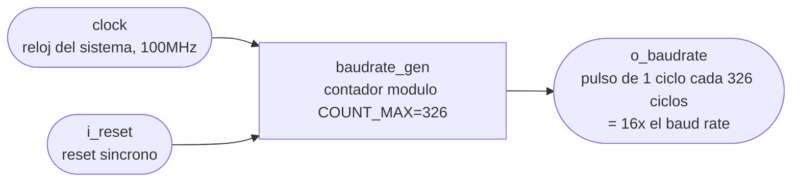
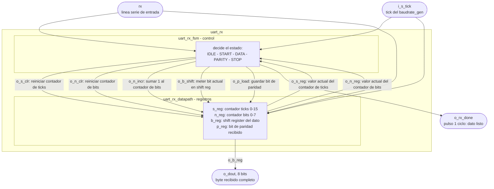
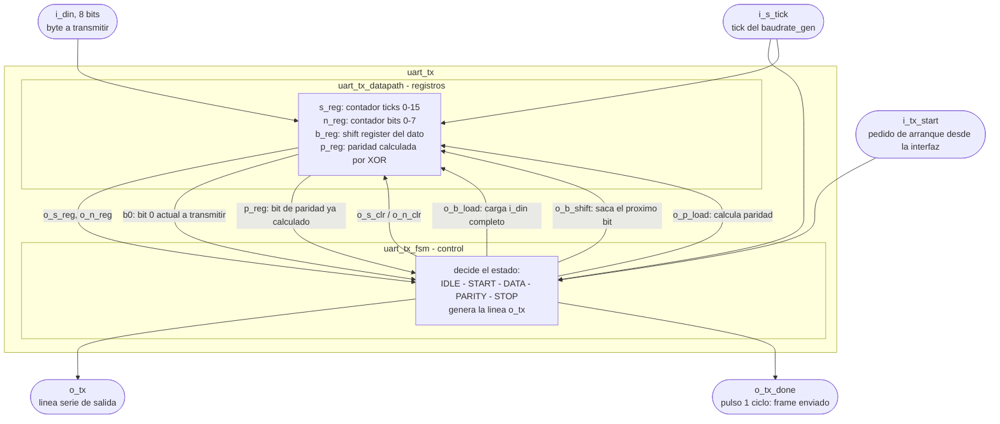
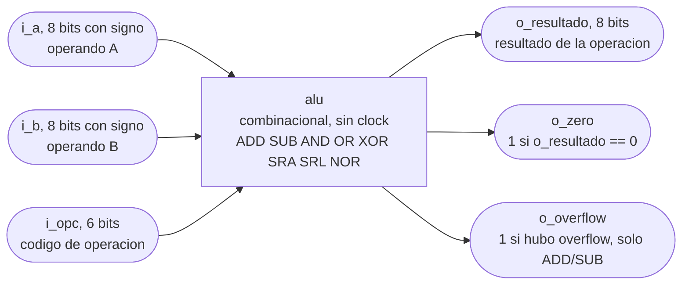
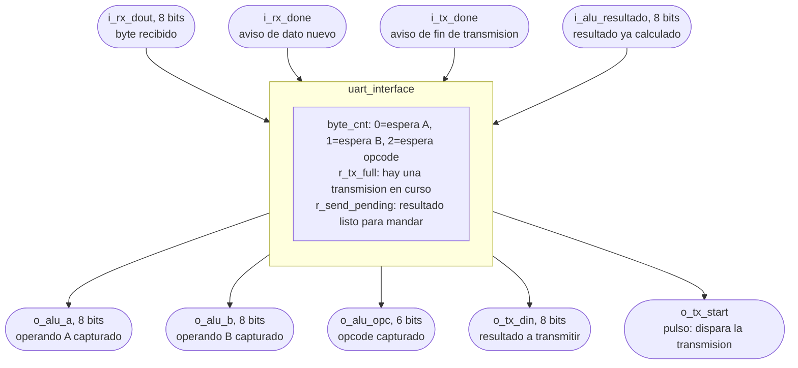

# TP2 - Arquitectura de Computadoras

- Krede, Julian
- Piñera, Nicolas

> [!NOTE]
> El baudrate generator es un contador sincrono cuya funcion principal es generar pulsos periodicos de habilitacion, llamados ticks a una frecuencia exacatmente 16 veces mayor que la tasa de baudios configurada para UART. El receptor UART necesita esta freceunca de sobremeustreo para poder estimar y muestrear con precision el punto medio de cada bit de datos recibido sin necesidad de transmitir una señar de reloj por la linea serie.
>
> $M=\frac{f_{clock}}{16 \cdot \text{Tasa de Baudios}}$
> la $f_{clock}=100MHz$
> la Tasa de Baudios = 19200 baudios
>
> Por lo tanto se neceista un contador modulo 326 que genere un pulso activo durante un ciclo de reloj cada 326 ciclos de reloj del sistema.

## ¿Se puede compartir una sola FSM entre RX y TX?

En teoría los nombres de los estados se parecen (`IDLE`, `START`, `DATA`, `STOP`), pero **lo que pasa en cada estado es sustancialmente distinto**, no es solo un detalle de implementación:

- El **RX** en cada estado hace lo mismo todo el tiempo: "esperá el tick 15, después _leé_ `rx` y metela en el shift register". Es un consumidor pasivo de la línea.
- El **TX** en cada estado tiene que _generar_ la línea: en `START` pone `tx=0` él mismo, en `DATA` va sacando bit por bit del dato que le pasaron (`din`) y poniéndolo en `tx`, en `STOP` pone `tx=1`. Es un productor activo.

Si armaras un `fsm.v` genérico que sirva para los dos, terminarías necesitando parámetros o señales para decirle "en este estado, ¿leés o escribís?", "¿de dónde sacás el bit?", etc. — en la práctica eso te obliga a meter tanta lógica condicional adentro del módulo "genérico" que perdés la ventaja de tenerlo separado, y el código se vuelve más difícil de leer que simplemente teniendo dos FSMs chicas y claras.

**Lo que sí tiene sentido compartir** es la parte que es matemáticamente idéntica en los dos: el patrón "contá hasta 16 ticks y avisá". Eso lo podrías extraer como un módulo contador reusable (por ejemplo `tick_counter16`) que ambas FSMs instancian — ahí sí hay duplicación real que vale la pena eliminar. Pero la lógica de "qué hacer en cada estado" conviene dejarla separada, una FSM para cada uno.

Dicho esto: la separación control/datapath que armamos para el RX está buena — pero al TX le va a quedar una forma parecida _en estructura_, no en contenido.

## Ahora, lo que preguntaste: qué son `b`, `s`, `n`, `p` — con ejemplo concreto

Pensalo así: llega un byte por la línea serie, pero **te llega un bit por vez, separados en el tiempo**, no todos juntos. Tu trabajo es ir "juntando" esos bits sueltos hasta tener el byte completo. Cada letra es una pieza de esa tarea:

**`s` — contador de ticks (el "cronómetro" de cada bit)**
Recordá: el `baudrate_gen` te tira un pulso (`tick`) 16 veces por cada bit que dura en la línea. `s` cuenta esos pulsos, de 0 a 15, para saber _en qué momento dentro del bit actual estás_. Cuando `s` llega a 15, es "ya pasó un bit entero, momento de leer el próximo". Es como un cronómetro que reinicia cada vez que termina de medir un bit.

**`n` — contador de bits de datos (¿cuántos bits ya agarré?)**
El byte tiene 8 bits. `n` es simplemente "voy en el bit número 3 de 8", "voy en el 7 de 8", etc. Cuando `n` llega a 7 (el octavo bit, contando desde 0), sabés que ya no quedan más bits de datos por leer y toca pasar al bit de paridad. Es un contador de "cuántas veces ya usé el cronómetro `s`".

**`b` — el shift register (donde armás el byte, bit a bit)**

Acá está el concepto más importante. Un **shift register** es un registro donde, en vez de escribir todo el valor de una vez, vas **entrando un bit nuevo por un extremo y empujando los que ya tenías hacia el otro lado**, como una fila de gente donde entra uno nuevo por la puerta y todos los demás se corren un lugar.

Ejemplo concreto: supongamos que te llega el byte `1011_0010` (LSB primero, o sea el primer bit que llega es el de más a la derecha, el `0`).

```txt
Llega bit 0 (el primer '0' de 10110010):
b = 0000_0000  -->  b = 0000_0000   (shift, entra el 0 por la izquierda)

Llega bit 1 (siguiente bit, '1'):
b = 0000_0000  -->  b = 1000_0000   (el 1 entra por la izquierda, todo se corre a la derecha)

Llega bit 2 (siguiente, '0'):
b = 1000_0000  -->  b = 0100_0000

... y así 8 veces hasta completar los 8 bits
```

Por qué entra "por la izquierda" y no se escribe directamente en su posición final: porque cuando te llega el primer bit, **todavía no sabés dónde va a terminar** — depende de cuántos bits más vengan después. El shift register resuelve esto automáticamente: a medida que van entrando bits nuevos, los viejos se van corriendo solos a su posición correcta. Al final de los 8 shifts, el primer bit que llegó (que es el bit 0, el LSB) terminó en la posición 0 del registro — exactamente donde tiene que estar.

Esa es la línea `b_next = {rx, b_reg[7:1]}` que escribimos: "el bit nuevo (`rx`) entra por arriba, y lo que ya tenía `b_reg` se corre un lugar hacia la derecha, perdiendo el bit que ya estaba más a la derecha" (que ya no hace falta porque ya se usó).

**`p` — el bit de paridad recibido**
Es simplemente 1 bit guardado aparte, no forma parte del dato — es el noveno "casillero" del frame, que consumís igual que los demás pero no metés en el shift register de 8 bits para no arruinar el dato.

## Resumiendo con una analogía

Pensalo como estar anotando un número de teléfono que te dictan de a un dígito por vez, con pausas entre dígito y dígito:

- `s` es el reloj que usás para saber cuándo terminó la pausa y toca anotar el próximo dígito.
- `n` es "voy en el dígito 4 de 10".
- `b` es el papel donde vas anotando, corriendo lo ya escrito para hacerle lugar al nuevo dígito.
- `p` sería un dígito de verificación aparte que también te dictan, pero no forma parte del número en sí.

Dale. Tres módulos, cada uno con un rol bien delimitado:

**`uart_rx_fsm` (el control)**
Es el "cerebro" que decide en qué momento del proceso estás (`IDLE`, `START`, `DATA`, `PARITY`, `STOP`) y cuándo hay que pasar al siguiente. No toca ningún dato — no sabe qué bit vino ni cuántos van. Solo mira `rx`, `s_tick` y los contadores (`s_reg`, `n_reg`) para decidir, y en respuesta emite pulsos de orden ("reiniciá el contador", "metelo en el shift register", "avisá que terminaste"). Es pura lógica de decisión.

**`uart_rx_datapath` (los registros de trabajo)**
Es el "músculo" que obedece. No decide nada por sí mismo — cada contador y el shift register se mueven únicamente cuando la FSM les manda el pulso correspondiente. Acá viven `s_reg` (contador de ticks), `n_reg` (contador de bits), `b_reg` (shift register del dato) y `p_reg` (bit de paridad recibido).

**`uart_rx` (el wrapper)**
Es el módulo público que da la cara hacia afuera — el que vas a instanciar en el resto del proyecto (la interfaz, el testbench). Adentro conecta la FSM con el datapath (cableando las señales de control de una hacia la otra) y expone solo lo que le importa al resto del sistema: `dout` y `rx_done_tick`. Todo el cableado interno queda oculto.

Un detalle a notar: esta FSM es tipo Mealy en sentido técnico porque las condiciones del case dependen tanto del estado (state_reg) como de entradas (s_tick, s_reg, n_reg, rx) — pero las salidas de control (s_clr, b_shift, etc.) solo cambian en los flancos donde también cambia el estado, así que en la práctica se comporta de forma bastante predecible, sin los glitches típicos que preocupan en un Mealy "puro" con salidas combinacionales sensibles a ruido en la entrada.

---

Mismo patrón que el RX: **3 módulos**. La arquitectura control/datapath no es exclusiva del receptor — es un patrón general para cualquier lógica secuencial con una FSM, así que el TX se estructura igual, aunque el contenido interno cambie bastante (recordá lo que hablamos: el TX _genera_ la línea en vez de leerla).

## `uart_tx_fsm` (el control)

Decide en qué estado del proceso de transmisión estás (`IDLE`, `START`, `DATA`, `PARITY`, `STOP`) y cuándo pasar al siguiente. Igual que en el RX, no toca el dato en sí — solo mira los contadores y emite pulsos de orden hacia el datapath. La diferencia grande respecto al RX: acá el "disparador" no es una caída de línea (`~rx`), sino una señal externa `tx_start` que le llega de la interfaz cuando la ALU quiere mandar un byte.

## `uart_tx_datapath` (los registros de trabajo)

Tiene los mismos tipos de registros que el RX en espíritu, pero usados al revés:

- Un contador de ticks (`s_reg`), igual que en el RX — mide cuánto dura cada bit en la línea.
- Un contador de bits (`n_reg`) — cuántos bits de dato ya salieron.
- Un shift register (`b_reg`) — pero acá, en vez de ir **metiendo** bits que llegan, va **sacando** bits que ya tenía cargados (el dato completo que la interfaz le pasó al arrancar). Cada shift saca el bit menos significativo y lo pone en la línea `tx`.
- Un registro para el bit de paridad a transmitir (`p_reg`) — a diferencia del RX, acá sí hay que **calcularlo**, no solo guardarlo: es el XOR de los 8 bits de dato (si es paridad par, por ejemplo).

## `uart_tx` (el wrapper)

Instancia la FSM y el datapath, cablea las señales de control entre ambos, y expone hacia afuera lo que necesita el resto del sistema: `tx` (la línea serie de salida), `tx_done_tick` (avisa que terminó de mandar el byte) y recibe `din`/`tx_start` desde la interfaz.

## La diferencia clave de diseño que vas a notar al escribirlo

En el RX, `s_reg` avanzaba automáticamente con cada `s_tick` sin que la FSM tuviera que pedirlo — porque el RX siempre está "escuchando" mientras está en un estado activo. En el TX pasa lo mismo, pero además vas a necesitar que el datapath **cargue el dato completo de una sola vez** al arrancar (`b_reg <= din` cuando la FSM pide `load`), algo que el RX nunca necesitó porque él arma el dato de a un bit, nunca lo recibe entero.

---

## Tabla resumen de señales y flags

| Módulo                | Señal                                          | Dir. | Ancho | Qué significa                                                           |
| --------------------- | ---------------------------------------------- | ---- | ----- | ----------------------------------------------------------------------- |
| **baudrate_gen**      | `clock`, `i_reset`                             | in   | 1     | Reloj del sistema y reset síncrono                                      |
|                       | `o_baudrate`                                   | out  | 1     | Pulso de 1 ciclo cada 326 ciclos de clock (el `tick`, 16x el baud rate) |
| **uart_rx_fsm**       | `rx`                                           | in   | 1     | Línea serie de entrada                                                  |
|                       | `i_s_tick`                                     | in   | 1     | Tick del baudrate_gen                                                   |
|                       | `i_s_reg`                                      | in   | 4     | Lee el contador de ticks actual (para saber si llegó a 7 o a 15)        |
|                       | `i_n_reg`                                      | in   | 3     | Lee el contador de bits actual (para saber si ya van 8)                 |
|                       | `o_s_clr`                                      | out  | 1     | Pulso: "reiniciá el contador de ticks"                                  |
|                       | `o_n_clr`                                      | out  | 1     | Pulso: "reiniciá el contador de bits"                                   |
|                       | `o_n_incr`                                     | out  | 1     | Pulso: "sumá 1 al contador de bits"                                     |
|                       | `o_b_shift`                                    | out  | 1     | Pulso: "meté el bit actual de `rx` en el shift register"                |
|                       | `o_p_load`                                     | out  | 1     | Pulso: "guardá el bit actual como paridad"                              |
|                       | `o_rx_done`                                    | out  | 1     | Pulso final: "ya armé el byte completo, es válido"                      |
| **uart_rx_datapath**  | `i_din` — n/a (no tiene, el dato lo arma solo) |      |       |                                                                         |
|                       | `o_s_reg`                                      | out  | 4     | Contador de ticks (0-15)                                                |
|                       | `o_n_reg`                                      | out  | 3     | Contador de bits recibidos (0-7)                                        |
|                       | `o_b_reg`                                      | out  | 8     | Shift register — el byte que se va armando                              |
|                       | `o_p_reg`                                      | out  | 1     | Bit de paridad recibido (guardado sin validar)                          |
| **uart_rx (wrapper)** | `rx`, `i_s_tick`                               | in   | 1     | Pasan directo a fsm y datapath                                          |
|                       | `o_dout`                                       | out  | 8     | El byte recibido = `w_b_reg` del datapath                               |
|                       | `o_rx_done`                                    | out  | 1     | = `o_rx_done` de la fsm                                                 |
| **uart_tx_fsm**       | `i_tx_start`                                   | in   | 1     | Pedido externo: "arrancá a transmitir"                                  |
|                       | `i_b0`                                         | in   | 1     | Bit 0 actual del shift register (el que hay que sacar por `tx` ahora)   |
|                       | `i_p_reg`                                      | in   | 1     | Bit de paridad ya calculado                                             |
|                       | `o_b_load`                                     | out  | 1     | Pulso: "cargá el dato completo (`din`) en el shift register"            |
|                       | `o_b_shift`                                    | out  | 1     | Pulso: "corré el shift register para exponer el próximo bit"            |
|                       | `o_tx`                                         | out  | 1     | La línea serie de salida (1=reposo, 0=start, bit por bit en DATA, etc.) |
|                       | `o_tx_done`                                    | out  | 1     | Pulso final: "ya mandé el frame completo"                               |
| **uart_tx_datapath**  | `i_din`                                        | in   | 8     | El byte completo a transmitir                                           |
|                       | `o_b_reg`                                      | out  | 8     | Shift register — se vacía bit a bit hacia `tx`                          |
|                       | `o_p_reg`                                      | out  | 1     | Paridad calculada por XOR de `i_din`                                    |
| **uart_tx (wrapper)** | `i_din`, `i_tx_start`                          | in   | —     | Pasan directo a fsm/datapath                                            |
|                       | `o_tx`                                         | out  | 1     | = `o_tx` de la fsm                                                      |
|                       | `o_tx_done`                                    | out  | 1     | = `o_tx_done` de la fsm                                                 |
| **alu**               | `i_a`, `i_b`                                   | in   | 8 c/u | Operandos (con signo)                                                   |
|                       | `i_opc`                                        | in   | 6     | Código de operación                                                     |
|                       | `o_resultado`                                  | out  | 8     | Resultado de la operación                                               |
|                       | `o_zero`                                       | out  | 1     | 1 si `o_resultado == 0`                                                 |
|                       | `o_overflow`                                   | out  | 1     | 1 si hubo overflow (solo ADD/SUB)                                       |
| **uart_interface**    | `i_rx_dout`, `i_rx_done`                       | in   | —     | Vienen del `uart_rx`                                                    |
|                       | `i_tx_done`                                    | in   | 1     | Viene del `uart_tx`                                                     |
|                       | `i_alu_resultado`                              | in   | 8     | Viene de la `alu`                                                       |
|                       | `o_alu_a`, `o_alu_b`, `o_alu_opc`              | out  | 8,8,6 | Registros que alimentan la ALU, cargados byte a byte                    |
|                       | `o_tx_din`, `o_tx_start`                       | out  | —     | Van hacia el `uart_tx`, para mandar el resultado                        |
|                       | (interno) `byte_cnt`                           | reg  | 2     | Contador de secuencia: 0=esperando A, 1=esperando B, 2=esperando opcode |
|                       | (interno) `r_tx_full`                          | reg  | 1     | Evita reiniciar una transmisión mientras hay una en curso               |
|                       | (interno) `r_send_pending`                     | reg  | 1     | "El resultado ya está listo, hay que mandarlo apenas se pueda"          |

## Diagrama Mermaid (código para el informe)



Este diagrama muestra el flujo completo: la línea serie entra por `rx`, el `baudrate_gen` sincroniza tanto RX como TX con su `tick`, el RX arma el byte y se lo pasa a la interfaz, la interfaz va acumulando A/B/opcode y alimenta la ALU (que responde casi instantáneamente por ser combinacional), y el resultado vuelve a salir por TX hacia la línea serie.

Si tu informe usa LaTeX en vez de un editor que renderice Mermaid nativamente (Word/Notion/GitHub sí lo soportan, Overleaf necesita un paquete aparte), avisame y te paso una alternativa en TikZ o directo una imagen exportada.

Van los 5, cada uno con las señales detalladas como "pines" del módulo, así el informe queda claro con solo mirar el dibujo.

## 1. baudrate_gen



## 2. uart_rx (fsm + datapath + wrapper)



## 3. uart_tx (fsm + datapath + wrapper)



## 4. alu



## 5. uart_interface



Todos usan `flowchart` estándar, así que renderizan igual en GitHub, VS Code (con la extensión de Mermaid), Notion o Word con plugin — si tu informe va en LaTeX/Overleaf avisame y te los paso a TikZ.
