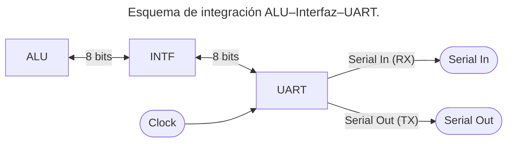
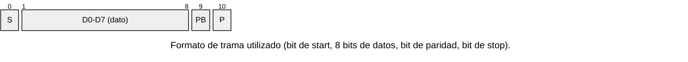
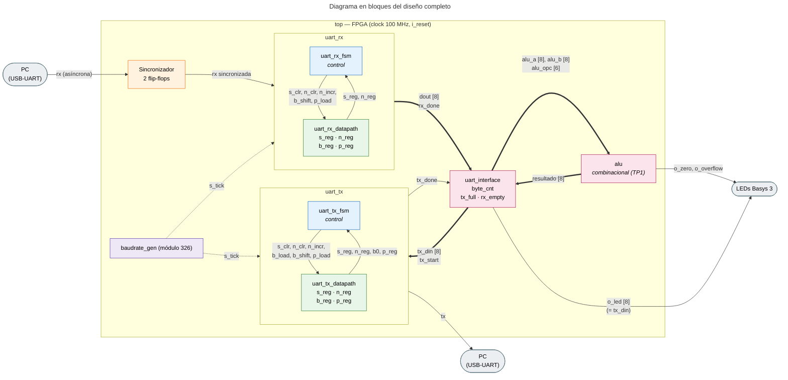
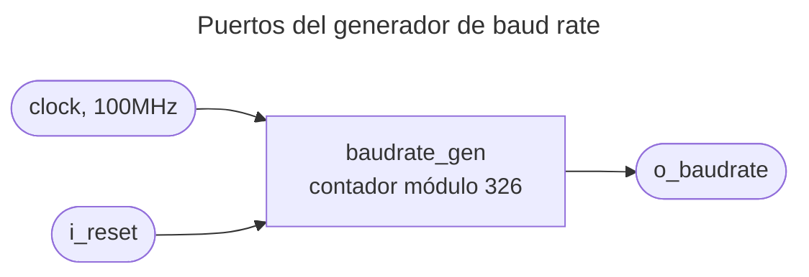
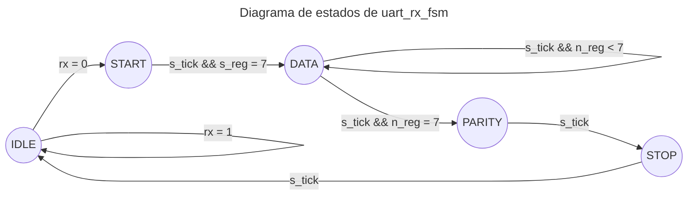
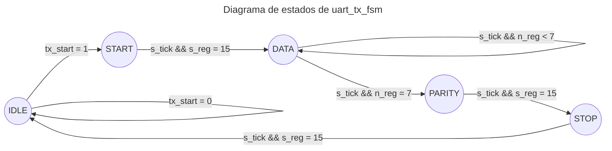
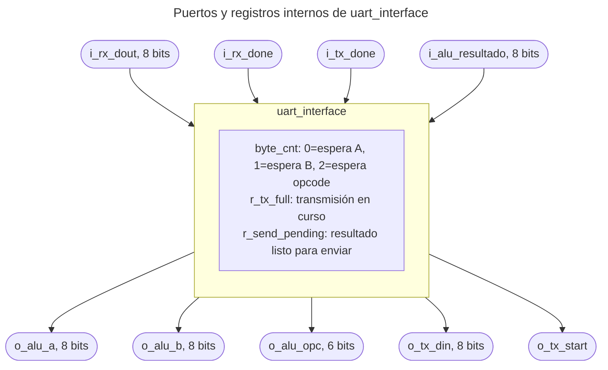
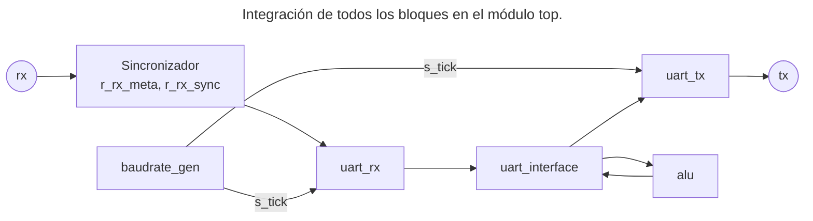

# Trabajo Práctico 2 - Arquitectura de Computadoras

## Módulo UART

## Nombre

- Krede, Julian
- Piñera, Nicolas

## UNC - Facultad de Ciencias Exactas, Físicas y Naturales

## Cátedra: Arquitectura de Computadoras

---

## Índice

1. [Introducción](#1---introducción)

---

## 1 - Introducción

La comunicación entre sistemas digitales que no comparten una señal de reloj común, requiere protocolos de transmisión asíncrona que resuelvan el problema de sincronización sin necesidad de una línea de clock adicional. La **UART (Universal Asynchronous Receiver Transmitter)** es uno de los protocolos más difundidos para este propósito, utilizado ampliamente en sistemas embebidos y comunicación con periféricos por su simplicidad de implementación y bajo requerimiento de hardware.

El presente trabajo práctico tiene como objetivo el diseño e implementación de un **módulo UART completo (transmisor y receptor)** en Verilog, sobre placa **Basys 3**, integrado con la ALU desarrollada en el TP anterior. El sistema resultante permite recibir por puerto serie los operandos y el código de operación, ejecutar el cálculo correspondiente, y transmitir el resultado de vuelta por el mismo medio.

Para el diseño de los módulos RX y TX se adoptó una arquitectura de separación entre control y datapath, con el objetivo de aislar la lógica de decisión de estados (implementada como máquina de estados finita) de los registros encargados de almacenar y desplazar los datos. Esta decisión de diseño facilita la verificación individual de cada componente y mejora la legibilidad del código.

---

## 2. Especificación

El enunciado plantea implementar en la placa Basys 3 los módulos **transmisor (TX)** y **receptor (RX)** de una UART (_Universal Asynchronous Receiver Transmitter_), e integrarlos junto con una **interfaz de control** a la **ALU** desarrollada en el TP1, de modo que esta última pueda operarse a través del puerto serie de la placa en lugar de los switches físicos utilizados anteriormente.

A continuación se muestra el esquema general planteado en el enunciado: la ALU se conecta a un bus paralelo de 8 bits a través de un circuito de interfaz (INTF), que a su vez se comunica con el módulo UART mediante las líneas serie `Serial Out` y `Serial In`.



### 2.1 Formato de trama

De acuerdo con las diapositivas de la cátedra, cada byte transmitido por la UART se encapsula en una trama compuesta por un **bit de start**, los **bits de datos**, un **bit de paridad** y uno o más **bits de stop**.



Para este trabajo se adoptaron los siguientes parámetros de trama:

| Parámetro      | Valor     | Observación                                                                                      |
| -------------- | --------- | ------------------------------------------------------------------------------------------------ |
| Bits de datos  | 8         | Coincide con el ancho del bus de la ALU                                                          |
| Bit de paridad | Sí, par   | Se recibe y se transmite, **no se valida** contra el dato                                        |
| Bits de stop   | 1         | —                                                                                                |
| Baud rate      | 19200 bps | Definido por la cátedra                                                                          |
| Oversampling   | 16x       | El receptor muestrea cada bit en su punto medio para tolerar el desfasaje de reloj entre tx y rx |

### 2.2 Generación del baud rate

El **baudrate generator** es un contador síncrono cuya función principal es generar pulsos periódicos de habilitación, llamados **ticks**, a una frecuencia exactamente **16 veces mayor** que la tasa de baudios configurada para UART. El receptor UART necesita esta frecuencia de sobremuestreo para poder estimar y muestrear con precisión el punto medio de cada bit de datos recibido sin necesidad de transmitir una señal de reloj por la línea serie.

Con un **clock** de placa de $100 [MHz]$ y un **baud rate** de $19200 [bps]$ con **oversampling 16x**, la cantidad de ciclos de reloj entre cada _tick_ de muestreo es:

$$
M= \frac{f_{clock}}{16 \cdot \text{Tasa de Baudios}}
$$

$$
M= \frac{100\,000\,000}{19200 \times 16} \approx 326
$$

El generador de baud rate se implementa entonces como un **contador módulo 326** que emite un pulso de un ciclo de clock cada vez que alcanza su valor máximo.

### 2.3 Protocolo de comunicación con la ALU

A diferencia del TP1, donde los operandos y el opcode se cargaban de forma independiente mediante switches y señales de selección dedicadas (`i_abc`), en este trabajo los tres valores deben transmitirse por un único canal serie. Dado que el enunciado no especifica un formato de mensaje, el grupo definió el siguiente protocolo:

1. Se envían tres bytes en una secuencia fija: **operando A**, **operando B** y **opcode**.
2. El byte de **opcode** contiene directamente el código de 6 bits definido en la Tabla 1 del TP1, tomando los 6 bits menos significativos del byte recibido.
3. Al recibirse el tercer byte (opcode), la interfaz dispara automáticamente el cálculo en la ALU y la transmisión del resultado por el mismo puerto serie, sin requerir un comando adicional.

Esta decisión de diseño simplifica la lógica de la interfaz a un contador de 3 posiciones, a costa de requerir que el emisor respete estrictamente el orden A → B → opcode en cada transacción.

### 2.4 Sincronización de la línea de entrada

La línea `rx` proviene de un dispositivo externo (la PC, a través del conversor USB-UART) cuyo reloj no guarda ninguna relación de fase con el `clock` de 100 MHz de la FPGA. Es, por lo tanto, una señal **asíncrona** respecto al dominio de reloj del diseño.

Si esta señal ingresara directamente a los registros de `uart_rx_fsm` y `uart_rx_datapath`, un cambio de `rx` que ocurra dentro de la ventana de _setup/hold_ de un flanco de `clock` podría dejar a alguno de esos flip-flops en un estado **metaestable**: un voltaje intermedio, no interpretable de forma confiable como `0` o `1`, que tarda un tiempo indeterminado en resolverse. Si distintos flip-flops del receptor leyeran ese valor metaestable en el mismo ciclo, cada uno podría resolverlo hacia un lado distinto, dejando a la FSM y al datapath desincronizados entre sí.

Para evitarlo, se instanció un sincronizador de dos flip-flops entre el puerto `rx` del módulo `top` y la entrada `rx` de `uart_rx`:

```verilog
reg r_rx_meta, r_rx_sync;

always @(posedge clock)
begin
  if (i_reset)
  begin
    r_rx_meta <= 1'b1;
    r_rx_sync <= 1'b1;
  end
  else
  begin
    r_rx_meta <= rx;
    r_rx_sync <= r_rx_meta;
  end
end
```

El primer flip-flop (`r_rx_meta`) es el único expuesto directamente a la señal asíncrona, y dispone de un ciclo de clock completo (10 ns) para resolver una eventual metaestabilidad antes de ser leído por el segundo flip-flop (`r_rx_sync`). Esta es la señal que finalmente se conecta a `uart_rx`, garantizando que toda la lógica interna del receptor observe siempre el mismo valor de `rx` en cada ciclo de clock.

Ambos registros se inicializan en `1` (no en `0`), ya que ese es el nivel de reposo de la línea UART; inicializarlos en `0` haría que, tras un reset, el receptor interprete erróneamente el reposo como el comienzo de un bit de start.

Dado que el retardo introducido es de solo dos ciclos de clock (20 ns) frente a una duración de bit de aproximadamente 52 μs a 19200 baudios, la sincronización no afecta el muestreo de la trama.

---

## 3. Diseño

### 3.1 Arquitectura general

El sistema se estructuró en cinco bloques principales, más un sincronizador de entrada: `baudrate_gen`, `uart_rx`, `uart_tx`, `uart_interface` y la `alu` reutilizada sin modificaciones del TP1. El diagrama a continuación muestra las conexiones entre
todos los bloques.



_Diagrama en bloques del módulo `top`. Las flechas gruesas indican buses de datos, las punteadas la base de tiempo (`s_tick`) y las finas señales de control de 1 bit. Dentro de `uart_rx` y `uart_tx` se muestra la separación entre FSM (control, en azul) y datapath (registros, en verde). Las señales `clock` e `i_reset` llegan a todos los bloques secuenciales y se omiten por claridad._

**Separación control/datapath.** Tanto `uart_rx` como `uart_tx` se dividieron internamente en **dos** módulos: uno de control (`*_fsm`), que implementa la máquina de estados y decide _cuándo_ actuar, y uno de datapath (`*_datapath`), que contiene los registros de trabajo y ejecuta las órdenes del control mediante pulsos de un ciclo (`s_clr`, `b_shift`, etc.). Esta separación permite verificar cada componente de forma aislada y mantiene la lógica de decisión de estados desacoplada del almacenamiento de datos.

**Por qué no se comparte una única FSM entre RX y TX.** Si bien ambas máquinas de estado utilizan los mismos nombres (`IDLE`, `START`, `DATA`, `PARITY`, `STOP`), su comportamiento en cada estado es sustancialmente distinto: el receptor es un consumidor pasivo de la línea (muestrea `rx` y desplaza el valor hacia el shift register), mientras que el transmisor es un productor activo (genera el nivel de `tx` en cada estado a partir de un dato ya cargado). Unificarlas en un único módulo requeriría lógica condicional adicional para distinguir el modo de operación, incrementando la complejidad en lugar de reducirla. Se optó, en cambio, por dos FSMs independientes con una estructura análoga, lo que además preserva la operación _full-duplex_ de la UART (recepción y transmisión simultáneas, al ser líneas físicas independientes).

### 3.2 Generador de baud rate (`baudrate_gen`)



El módulo implementa un contador módulo `COUNT_MAX` (326, según el cálculo de la Sección 2.2) que emite un pulso de un ciclo de clock (`o_baudrate`) cada vez que alcanza su valor máximo, y se reinicia. Este pulso constituye la base de tiempo compartida por `uart_rx` y `uart_tx` para el muestreo y la generación de cada bit, respectivamente.

### 3.3 Módulo `uart_rx`

#### 3.3.1 Arquitectura interna

El receptor se compone de tres módulos:

- **`uart_rx_fsm` (control):** determina en qué estado del proceso de recepción se encuentra (`IDLE`, `START`, `DATA`, `PARITY`, `STOP`) y en qué momento corresponde avanzar al siguiente. No accede directamente al dato recibido; lee únicamente `rx`, el pulso `s_tick` y los contadores del datapath (`s_reg`, `n_reg`), y en función de ellos emite pulsos de control de un ciclo hacia el datapath.
- **`uart_rx_datapath` (registros de trabajo):** contiene los registros que ejecutan las órdenes de la FSM: el contador de ticks (`s_reg`), el contador de bits recibidos (`n_reg`), el shift register del dato (`b_reg`) y el registro de paridad (`p_reg`). Ninguno de estos registros cambia de valor si la FSM no lo solicita explícitamente.
- **`uart_rx` (wrapper):** instancia ambos módulos, conecta las señales de control entre sí y expone hacia el resto del sistema únicamente `o_dout` (el byte recibido) y `o_rx_done` (aviso de dato válido).

#### 3.3.2 Máquina de estados



| Estado   | Condición de permanencia | Condición de transición                      | Acción al transicionar                                |
| -------- | ------------------------ | -------------------------------------------- | ----------------------------------------------------- |
| `IDLE`   | `rx = 1`                 | `rx = 0`                                     | `s_clr`                                               |
| `START`  | —                        | `s_tick` y `s_reg = 7` (mitad del start bit) | `s_clr`, `n_clr`                                      |
| `DATA`   | `n_reg < 7`              | `s_tick` y `s_reg = 15` y `n_reg = 7`        | `s_clr`, `b_shift` en cada bit; `PARITY` al completar |
| `PARITY` | —                        | `s_tick` y `s_reg = 15`                      | `s_clr`, `p_load`                                     |
| `STOP`   | —                        | `s_tick` y `s_reg = 15`                      | `rx_done`                                             |

El umbral de `s_reg = 7` en `START` (en lugar de 15) permite confirmar el start bit en su punto medio, evitando iniciar la recepción ante un pulso espurio de corta duración en la línea. Los umbrales de `s_reg = 15` en los estados siguientes muestrean cada bit en su punto medio, el instante más alejado de los flancos y, por lo tanto, más estable frente a desfasajes entre los relojes de transmisor y receptor.

Formalmente, esta FSM corresponde a una máquina de **Mealy**, ya que las condiciones del `case` dependen tanto del estado actual como de entradas (`s_tick`, `s_reg`, `n_reg`, `rx`). Sin embargo, las salidas de control solo cambian en los mismos flancos en que cambia el estado, por lo que el diseño no presenta los _glitches_ característicos de una máquina de Mealy con salidas combinacionales sensibles a ruido en la entrada.

#### 3.3.3 Datapath

El datapath mantiene cuatro registros:

- **`s_reg`:** contador de ticks (0–15) que mide el avance dentro del bit actual. Se reinicia por pedido de la FSM (`s_clr`) y se incrementa en cada `s_tick`.
- **`n_reg`:** contador de bits de datos recibidos (0–7).
- **`b_reg`:** shift register de 8 bits donde se ensambla el dato. Cada pulso `b_shift` ejecuta `b_reg <= {rx, b_reg[7:1]}`: el bit entrante se inserta por la posición más significativa mientras los bits ya almacenados se desplazan una posición hacia el bit menos significativo. Dado que el protocolo UART transmite el bit menos significativo primero, este mecanismo garantiza que, tras ocho desplazamientos, cada bit recibido quede ubicado en su posición final correcta.
- **`p_reg`:** almacena el bit de paridad recibido; se limita a consumir correctamente ese campo de la trama.

### 3.4 Módulo `uart_tx`

#### 3.4.1 Arquitectura interna

El transmisor sigue la misma estructura de tres módulos que el receptor (`uart_tx_fsm`, `uart_tx_datapath`, `uart_tx` como wrapper), con dos diferencias funcionales relevantes:

- El disparo de la transmisión no surge de una condición sobre la línea, sino de una señal externa, `i_tx_start`, generada por `uart_interface`.
- La FSM genera activamente el nivel de `o_tx` en cada estado (`1` en reposo, `0` durante el start bit, el bit correspondiente del dato durante `DATA`, el bit de paridad durante `PARITY`, `1` durante el stop bit), a diferencia del RX, que nunca escribe sobre `rx`.

#### 3.4.2 Máquina de estados



| Estado   | `o_tx`              | Condición de transición | Acción al transicionar                              |
| -------- | ------------------- | ----------------------- | --------------------------------------------------- |
| `IDLE`   | `1`                 | `i_tx_start = 1`        | `s_clr`, `b_load`, `p_load`                         |
| `START`  | `0`                 | `s_tick` y `s_reg = 15` | `s_clr`, `n_clr`                                    |
| `DATA`   | bit 0 del shift reg | `s_tick` y `s_reg = 15` | `s_clr`, `b_shift`; `PARITY` al completar el 8º bit |
| `PARITY` | bit de paridad      | `s_tick` y `s_reg = 15` | `s_clr`                                             |
| `STOP`   | `1`                 | `s_tick` y `s_reg = 15` | `tx_done`                                           |

A diferencia del RX, en `IDLE` el transmisor ejecuta dos acciones simultáneas al recibir `tx_start`: la carga completa del dato en el shift register (`b_load`) y el cálculo de la paridad (`p_load`), ambas resueltas en el mismo flanco de clock por tratarse de operaciones combinacionales sobre el mismo dato de entrada (`i_din`).

#### 3.4.3 Datapath

El datapath del TX reutiliza el mismo esquema de contadores que el RX (`s_reg`, `n_reg`), pero con dos diferencias en el manejo del dato:

- **Shift register (`b_reg`):** admite dos operaciones excluyentes. La carga completa (`b_load`) ejecuta `b_reg <= i_din`, trayendo el byte entero de una vez. El desplazamiento (`b_shift`) ejecuta `b_reg <= {1'b0, b_reg[7:1]}`,  exponiendo en la posición 0 el próximo bit a transmitir; el valor insertado por la posición más significativa es indistinto, ya que el contador `n_reg` impide que esos bits lleguen a transmitirse.
- **Paridad (`p_reg`):** a diferencia del RX, que solo almacena el bit recibido, aquí se calcula mediante el operador de reducción XOR sobre el dato completo: `p_reg <= ^i_din` (paridad par). Este cálculo es la base para que el receptor del otro extremo pueda, si se implementara la validación, verificar la integridad de la trama.

### 3.5 Interfaz (`uart_interface`)



La interfaz resuelve el desacople entre el bus paralelo de la ALU (que opera en un único ciclo de clock) y la UART (donde cada byte tarda miles de ciclos en transmitirse o recibirse). Implementa el protocolo de tres bytes definido en la Sección 2.3 mediante un contador de dos bits, `byte_cnt`, que indica cuál de los tres registros (`o_alu_a`, `o_alu_b`, `o_alu_opc`) corresponde cargar con el próximo byte recibido. Al completarse el tercer byte, se activa internamente `r_send_pending`; dado que la ALU es combinacional, su resultado (`i_alu_resultado`) queda estable antes del siguiente flanco de clock, por lo que en el ciclo inmediato posterior la interfaz captura el resultado en `o_tx_din` y dispara `o_tx_start`.

El registro `r_tx_full` evita que se inicie una nueva transmisión mientras la anterior está en curso, liberándose recién cuando `uart_tx` reporta `i_tx_done`.

### 3.6 Módulo `top`



El módulo `top` instancia y conecta los cinco bloques descritos en las subsecciones anteriores. Adicionalmente, incorpora el sincronizador de dos flip-flops descrito en la Sección 2.4, interpuesto entre el puerto `rx` y la entrada del módulo `uart_rx`, de forma que este último nunca observa la línea serie en su forma asíncrona original.

### 3.7 Asignación de pines

| Puerto                 | Recurso            | Función                                           |
| ---------------------- | ------------------ | ------------------------------------------------- |
| `clock`                | Oscilador 100 MHz  | Reloj del sistema                                 |
| `i_reset`              | Botón (BTNC)       | Reset síncrono                                    |
| `rx`                   | Pin USB-UART (RXD) | Entrada serie desde la PC                         |
| `tx`                   | Pin USB-UART (TXD) | Salida serie hacia la PC                          |
| `o_zero`, `o_overflow` | LEDs               | Flags de la ALU, expuestos para depuración visual |

---

## Tabla resumen de señales y flags

| Módulo                | Señal                                          | Dir. | Ancho | Qué significa                                                           |
| --------------------- | ---------------------------------------------- | ---- | ----- | ----------------------------------------------------------------------- |
| **baudrate_gen**      | `clock`, `i_reset`                             | in   | 1     | Reloj del sistema y reset síncrono                                      |
|                       | `o_baudrate`                                   | out  | 1     | Pulso de 1 ciclo cada 326 ciclos de clock (el `tick`, 16x el baud rate) |
| **uart_rx_fsm**       | `rx`                                           | in   | 1     | Línea serie de entrada                                                  |
|                       | `i_s_tick`                                     | in   | 1     | Tick del baudrate_gen                                                   |
|                       | `i_s_reg`                                      | in   | 4     | Lee el contador de ticks actual (para saber si llegó a 7 o a 15)        |
|                       | `i_n_reg`                                      | in   | 3     | Lee el contador de bits actual (para saber si ya van 8)                 |
|                       | `o_s_clr`                                      | out  | 1     | Pulso: "reiniciá el contador de ticks"                                  |
|                       | `o_n_clr`                                      | out  | 1     | Pulso: "reiniciá el contador de bits"                                   |
|                       | `o_n_incr`                                     | out  | 1     | Pulso: "sumá 1 al contador de bits"                                     |
|                       | `o_b_shift`                                    | out  | 1     | Pulso: "meté el bit actual de `rx` en el shift register"                |
|                       | `o_p_load`                                     | out  | 1     | Pulso: "guardá el bit actual como paridad"                              |
|                       | `o_rx_done`                                    | out  | 1     | Pulso final: "ya armé el byte completo, es válido"                      |
| **uart_rx_datapath**  | `i_din` — n/a (no tiene, el dato lo arma solo) |      |       |                                                                         |
|                       | `o_s_reg`                                      | out  | 4     | Contador de ticks (0-15)                                                |
|                       | `o_n_reg`                                      | out  | 3     | Contador de bits recibidos (0-7)                                        |
|                       | `o_b_reg`                                      | out  | 8     | Shift register — el byte que se va armando                              |
|                       | `o_p_reg`                                      | out  | 1     | Bit de paridad recibido (guardado sin validar)                          |
| **uart_rx (wrapper)** | `rx`, `i_s_tick`                               | in   | 1     | Pasan directo a fsm y datapath                                          |
|                       | `o_dout`                                       | out  | 8     | El byte recibido = `w_b_reg` del datapath                               |
|                       | `o_rx_done`                                    | out  | 1     | = `o_rx_done` de la fsm                                                 |
| **uart_tx_fsm**       | `i_tx_start`                                   | in   | 1     | Pedido externo: "arrancá a transmitir"                                  |
|                       | `i_b0`                                         | in   | 1     | Bit 0 actual del shift register (el que hay que sacar por `tx` ahora)   |
|                       | `i_p_reg`                                      | in   | 1     | Bit de paridad ya calculado                                             |
|                       | `o_b_load`                                     | out  | 1     | Pulso: "cargá el dato completo (`din`) en el shift register"            |
|                       | `o_b_shift`                                    | out  | 1     | Pulso: "corré el shift register para exponer el próximo bit"            |
|                       | `o_tx`                                         | out  | 1     | La línea serie de salida (1=reposo, 0=start, bit por bit en DATA, etc.) |
|                       | `o_tx_done`                                    | out  | 1     | Pulso final: "ya mandé el frame completo"                               |
| **uart_tx_datapath**  | `i_din`                                        | in   | 8     | El byte completo a transmitir                                           |
|                       | `o_b_reg`                                      | out  | 8     | Shift register — se vacía bit a bit hacia `tx`                          |
|                       | `o_p_reg`                                      | out  | 1     | Paridad calculada por XOR de `i_din`                                    |
| **uart_tx (wrapper)** | `i_din`, `i_tx_start`                          | in   | —     | Pasan directo a fsm/datapath                                            |
|                       | `o_tx`                                         | out  | 1     | = `o_tx` de la fsm                                                      |
|                       | `o_tx_done`                                    | out  | 1     | = `o_tx_done` de la fsm                                                 |
| **alu**               | `i_a`, `i_b`                                   | in   | 8 c/u | Operandos (con signo)                                                   |
|                       | `i_opc`                                        | in   | 6     | Código de operación                                                     |
|                       | `o_resultado`                                  | out  | 8     | Resultado de la operación                                               |
|                       | `o_zero`                                       | out  | 1     | 1 si `o_resultado == 0`                                                 |
|                       | `o_overflow`                                   | out  | 1     | 1 si hubo overflow (solo ADD/SUB)                                       |
| **uart_interface**    | `i_rx_dout`, `i_rx_done`                       | in   | —     | Vienen del `uart_rx`                                                    |
|                       | `i_tx_done`                                    | in   | 1     | Viene del `uart_tx`                                                     |
|                       | `i_alu_resultado`                              | in   | 8     | Viene de la `alu`                                                       |
|                       | `o_alu_a`, `o_alu_b`, `o_alu_opc`              | out  | 8,8,6 | Registros que alimentan la ALU, cargados byte a byte                    |
|                       | `o_tx_din`, `o_tx_start`                       | out  | —     | Van hacia el `uart_tx`, para mandar el resultado                        |
|                       | (interno) `byte_cnt`                           | reg  | 2     | Contador de secuencia: 0=esperando A, 1=esperando B, 2=esperando opcode |
|                       | (interno) `r_tx_full`                          | reg  | 1     | Evita reiniciar una transmisión mientras hay una en curso               |
|                       | (interno) `r_send_pending`                     | reg  | 1     | "El resultado ya está listo, hay que mandarlo apenas se pueda"          |
