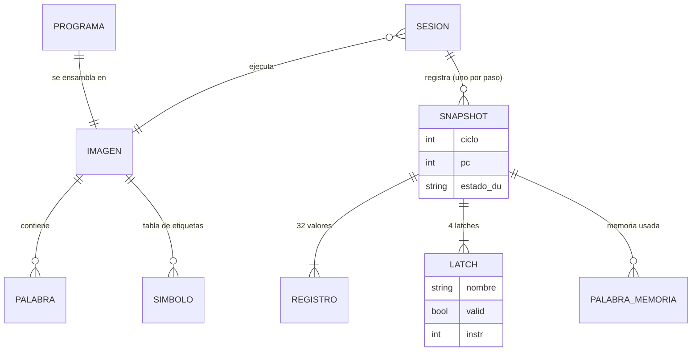
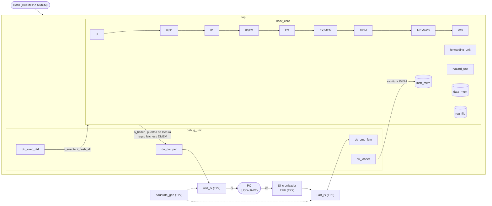
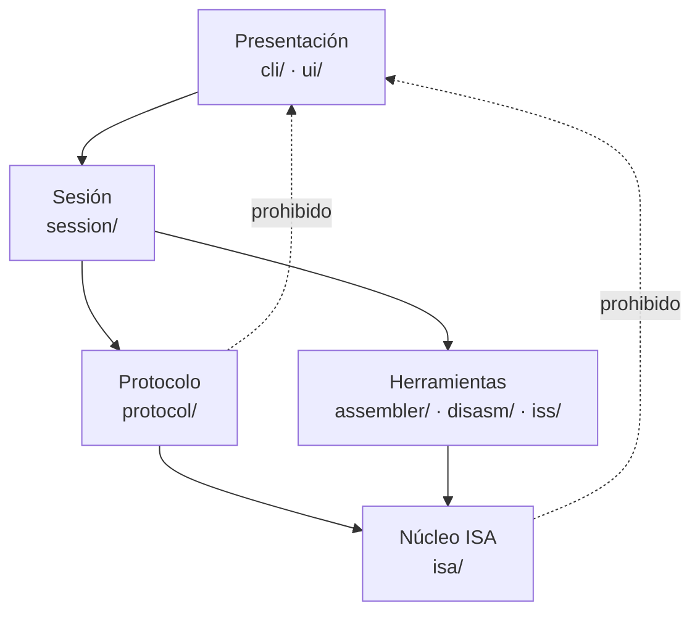
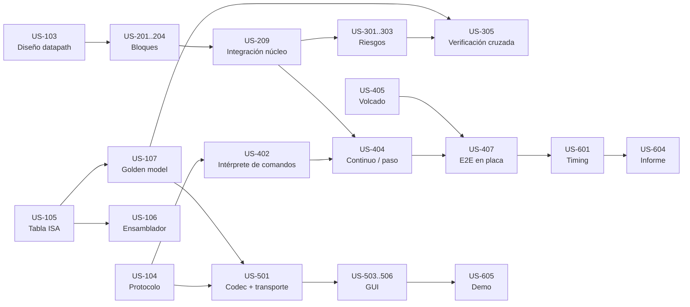

# Plan de Desarrollo Detallado: Procesador RISC-V Segmentado con Debug Unit (TP Final — Arquitectura de Computadoras)

**Equipo:** Krede, Julián · Piñera, Nicolás
**Cátedra:** Arquitectura de Computadoras — FCEFyN, UNC
**Plazo objetivo:** 10 a 12 semanas desde el inicio del desarrollo (2,5 a 3 meses)
**Plataforma:** Basys 3 (Artix-7 XC7A35T-1CPG236C)

> **Cómo leer este documento:** todo lo marcado como **ADR pendiente** es una decisión que el equipo todavía no tomó. En la sección 9 cada una tiene su contexto, alternativas y una recomendación. Hasta que se aprueben, las historias de usuario que dependen de ellas describen la **opción recomendada** y lo aclaran con la etiqueta _(sujeto a ADR-0XX)_.

---

## 1. Descripción General del Producto

### 1.1 Planteamiento del problema

El trabajo final pide pasar de dos bloques aislados que ya funcionan en placa (una ALU de 8 bits del TP1 y una UART del TP2) a un **procesador completo**, programable desde la PC y observable ciclo a ciclo. Hoy no existe ninguna de las piezas centrales.

| #   | Problema                                                       | Impacto (técnico)                                                                    | Línea base actual                                                                                 |
| --- | -------------------------------------------------------------- | ------------------------------------------------------------------------------------ | ------------------------------------------------------------------------------------------------- |
| 1   | No existe un datapath segmentado RISC-V                        | No se puede ejecutar ningún programa                                                 | 0 de 5 etapas implementadas; 0 de 4 latches (IF/ID, ID/EX, EX/MEM, MEM/WB)                        |
| 2   | La ALU del TP1 no cubre RV32I                                  | No soporta operandos de 32 bits ni comparaciones con/sin signo                       | 8 bits; 6 de 10 operaciones R-type necesarias (faltan SLL, SLT, SLTU; NOR sobra); opcodes propios |
| 3   | No hay manejo de riesgos                                       | Cualquier dependencia de datos o salto produce resultados incorrectos                | 0 mecanismos (forwarding, stall, flush)                                                           |
| 4   | La interfaz UART solo sabe operar la ALU                       | No hay forma de mandar comandos (cargar, ejecutar, paso a paso, leer estado)         | 1 protocolo fijo de 3 bytes (A → B → opcode) en `uart_interface.v`                                |
| 5   | No hay forma de cargar programas sin resintetizar              | Cada programa nuevo requeriría regenerar el bitstream (~minutos por iteración)       | 0 herramientas de ensamblado; 0 mecanismos de carga dinámica                                      |
| 6   | El estado interno del procesador no es observable              | Imposible depurar riesgos o verificar resultados en placa                            | Solo 8 LEDs visibles; 0 bytes de estado enviados a la PC                                          |
| 7   | No hay interfaz de usuario para interactuar con la placa       | La defensa y la depuración dependerían de mandar bytes a mano con una terminal serie | 0 interfaces (CLI/TUI/GUI)                                                                        |
| 8   | El comportamiento temporal del sistema completo es desconocido | No se sabe si 100 MHz es viable con memorias, forwarding y Debug Unit                | Diseño TP2 (UART+ALU): WNS 4,899 ns a 100 MHz (f_max ≈ 196 MHz); pipeline: no medido              |

**Síntesis:** hoy se tiene una UART verificada en placa (`uart_rx`, `uart_tx`, `baudrate_gen`, sincronizador de 2 flip-flops) y una ALU combinacional de 8 bits. Falta el procesador segmentado con manejo de riesgos, una Debug Unit que reemplace a `uart_interface`, un toolchain en la PC (ensamblador, carga y eventualmente un simulador de referencia), una interfaz para observar el estado, y el cierre del análisis temporal del sistema integrado.

### 1.2 Visión del producto

Un **procesador RISC-V (subconjunto de RV32I) segmentado en 5 etapas sobre la Basys 3, completamente observable y controlable desde la PC**: se escribe un programa en assembly, se ensambla, se carga por UART sin resintetizar, y se ejecuta en modo continuo o ciclo a ciclo, viendo en una interfaz cómo avanzan las instrucciones por el pipeline, cómo cambian los registros y la memoria, y dónde actúan forwarding, stalls y flushes.

Es un **proyecto de aprendizaje** (trabajo final de la materia). El objetivo no es solo que funcione, sino poder **explicar y justificar cada decisión** en el informe y en la defensa. Por eso el documento pone el mismo peso en los ADRs que en el código.

**Pilares:**

1. **Corrección:** cada instrucción se comporta según la especificación RV32I oficial (no según las diapositivas, que tienen errores — ver sección 17).
2. **Observabilidad:** todo el estado relevante (32 registros, 4 latches, memoria de datos usada, PC) se puede ver en cualquier ciclo.
3. **Reprogramabilidad:** cargar un programa nuevo es una operación de segundos, sin abrir Vivado.
4. **Clock intacto:** el reloj nunca pasa por lógica; toda la pausa/avance del procesador se hace con señales de habilitación.
5. **Decisiones documentadas:** cada elección no trivial tiene su ADR con alternativas y porqué.

### 1.3 Metas y no metas

**En el alcance (v1.0):**

- **Pipeline de 5 etapas** (IF, ID, EX, MEM, WB) con las **32 instrucciones** del enunciado más una instrucción **HALT** (codificación: ADR-004).
- **Manejo de riesgos:**
  - _Estructurales:_ memorias de instrucciones y de datos separadas (arquitectura Harvard).
  - _De datos:_ estrategia definida en ADR-007 (recomendado: forwarding completo + stall por load-use).
  - _De control:_ flush de instrucciones en saltos y branches tomados (punto de resolución en ADR-006).
- **Debug Unit** por UART que permita: cargar programa, ejecutar en modo continuo, ejecutar paso a paso, y volcar a la PC los 32 registros, los 4 latches y la memoria de datos usada.
- **Pipeline vacío al terminar** en ambos modos.
- **Reprogramación dinámica** sin resintetizar, con una política explícita sobre qué se limpia (ADR-009).
- **Comportamiento definido ante un programa sin HALT** (ADR-010).
- **Toolchain de PC:** ensamblador (ADR-013), interfaz de usuario (ADR-012) y, si se aprueba, simulador de referencia (ADR-014).
- **Programas de prueba en assembly:** uno o más por instrucción, uno por tipo de riesgo, y programas de demostración.
- **Análisis temporal:** camino crítico, skew, frecuencia óptima y aplicación de esa frecuencia con Clock Wizard si corresponde (ADR-016).
- **Informe final** que responda todas las preguntas del enunciado.

**Fuera de alcance (v1.0):**

- **Resto de RV32I:** `auipc`, `blt`, `bge`, `bltu`, `bgeu`, `fence`, `ecall`, `ebreak`, CSRs. No los pide el enunciado.
- **Extensiones** (M: multiplicación/división, C: instrucciones comprimidas, etc.).
- **Excepciones e interrupciones**, incluyendo instrucción ilegal y accesos desalineados (se define un comportamiento simple en ADR-018, no una trampa).
- **Predicción dinámica de saltos**, caché y jerarquía de memoria.
- **Compilación desde C.** Solo se soporta assembly escrito a mano.
- **Breakpoints por hardware** y ejecución "hasta la dirección X" → roadmap (sección 16).
- **Navegación hacia atrás en hardware** (el hardware no puede "deshacer" ciclos; el historial se guarda del lado de la PC, ver US-506).

### 1.4 Métricas de éxito

| Métrica                                                    | Definición / cómo se mide                                                                                                                                | Objetivo                                  |
| ---------------------------------------------------------- | -------------------------------------------------------------------------------------------------------------------------------------------------------- | ----------------------------------------- |
| **⭐ North Star — Programas de prueba correctos en placa** | % de programas de la suite (`asm/tests/` + `asm/demos/`) cuyo estado final leído desde la FPGA (registros + memoria usada) coincide con el esperado      | **100 %**                                 |
| Cobertura de instrucciones                                 | Instrucciones del enunciado con al menos un programa de prueba autoverificable                                                                           | **32/32 + HALT**                          |
| Cobertura de riesgos                                       | Casos verificados en simulación: forwarding EX/MEM→EX, MEM/WB→EX, load-use, doble dependencia, `x0` como destino, branch tomado/no tomado, `jal`, `jalr` | **100 % de los casos listados en US-304** |
| Reprogramación                                             | Cargas consecutivas de programas distintos sin reprogramar el bitstream, todas con resultado correcto                                                    | **≥ 5 seguidas**                          |
| Equivalencia paso a paso vs. continuo                      | Mismo programa ejecutado en ambos modos termina con el mismo estado final                                                                                | **100 % de la suite**                     |
| Pipeline vacío al terminar                                 | Tras detectar HALT y drenar, los 4 latches tienen `valid = 0`                                                                                            | **Siempre**                               |
| Timing                                                     | WNS y WHS del reporte post-implementación a la frecuencia elegida                                                                                        | **≥ 0 ns** (0 endpoints con falla)        |
| Latencia de un paso                                        | Tiempo desde que el usuario pide un STEP hasta que la GUI muestra el estado nuevo                                                                        | **< 1 s** (ver NFR-4)                     |

---

## 2. Contexto del Dominio

Esta sección fija el vocabulario técnico del proyecto. Se incluye porque el enunciado usa términos sin definirlos y porque varios tienen trampas (ver sección 17).

### 2.1 Glosario

| Término                                | Significado                                                                                                                                                                                                                                       |
| -------------------------------------- | ------------------------------------------------------------------------------------------------------------------------------------------------------------------------------------------------------------------------------------------------- |
| **ISA** (Instruction Set Architecture) | El "contrato" entre software y hardware: qué instrucciones existen y qué hacen. Acá: un subconjunto de **RV32I** (RISC-V, 32 bits, enteros).                                                                                                      |
| **Pipeline / segmentación**            | Dividir la ejecución de una instrucción en etapas, cada una en un ciclo, para que en cada ciclo haya hasta 5 instrucciones en vuelo (una por etapa).                                                                                              |
| **IF / ID / EX / MEM / WB**            | _Instruction Fetch_ (buscar la instrucción), _Instruction Decode_ (decodificar y leer registros), _Execute_ (ALU), _Memory access_ (load/store), _Write Back_ (escribir el resultado en el banco de registros).                                   |
| **Latch / registro de segmentación**   | Banco de flip-flops entre dos etapas (IF/ID, ID/EX, EX/MEM, MEM/WB). Congela todo lo que una instrucción necesita para seguir: datos **y** señales de control. El enunciado les dice "latches"; técnicamente son registros disparados por flanco. |
| **Riesgo (hazard)**                    | Situación en la que la instrucción siguiente no puede ejecutarse en el ciclo que le toca. Tres tipos: estructural, de datos y de control.                                                                                                         |
| **Forwarding / bypass**                | Llevar un resultado desde EX/MEM o MEM/WB directamente a la entrada de la ALU, sin esperar a que se escriba en el banco de registros.                                                                                                             |
| **Stall / burbuja**                    | Frenar las etapas tempranas del pipeline un ciclo e insertar una instrucción "vacía" (NOP) en la siguiente. Necesario, por ejemplo, cuando una instrucción usa el dato de un `lw` inmediatamente anterior (**load-use**).                         |
| **Flush**                              | Anular (convertir en burbuja) instrucciones que se buscaron de forma especulativa y que no debían ejecutarse, típicamente después de un salto tomado.                                                                                             |
| **Clock enable (CE)**                  | Entrada de habilitación de un flip-flop: si está en 0, el flip-flop mantiene su valor aunque llegue el flanco. Es la forma correcta de "pausar" lógica sin tocar el reloj.                                                                        |
| **Clock gating**                       | Apagar el reloj pasándolo por una compuerta lógica. **Prohibido por el enunciado** ("el clock no debe verse intervenido") y mala práctica en FPGA: introduce skew y glitches.                                                                     |
| **Skew**                               | Diferencia en el tiempo de llegada del **mismo flanco de reloj** a dos flip-flops distintos. Lo causa la red de distribución del reloj (y cualquier lógica metida en ella), no la lógica de datos.                                                |
| **Camino crítico**                     | El camino de datos registro→registro con mayor retardo. Define la frecuencia máxima.                                                                                                                                                              |
| **WNS / WHS**                          | _Worst Negative Slack_ (margen de setup) y _Worst Hold Slack_ (margen de hold) del reporte de timing de Vivado. Si ambos son ≥ 0, el diseño cumple a esa frecuencia.                                                                              |
| **MMCM / Clock Wizard**                | Bloque de hardware del Artix-7 (y el IP de Vivado que lo configura) que genera relojes de otras frecuencias a partir del de 100 MHz, por la red dedicada de reloj. Usarlo **no** es intervenir el clock.                                          |
| **BRAM / memoria distribuida**         | Dos formas de implementar memoria en la FPGA: bloques dedicados (lectura sincrónica, 1 ciclo de latencia) o LUTs (lectura combinacional). Ver ADR-005.                                                                                            |
| **Golden model / ISS**                 | _Instruction Set Simulator_: un simulador en software que ejecuta el programa instrucción por instrucción según la ISA, sin pipeline. Sirve como referencia para comparar resultados. Ver ADR-014.                                                |
| **HALT**                               | Instrucción de parada. **No existe en RV32I**: el equipo define su codificación (ADR-004).                                                                                                                                                        |

### 2.2 Instrucciones a implementar (referencia de codificación)

Fuente: especificación oficial RISC-V (volumen no privilegiado, RV32I). Esta tabla es la **fuente única de verdad** para el control del procesador, el ensamblador y el golden model — se implementa una sola vez en software (US-105) y se refleja en `control_unit.v` / `alu_control.v`.

| #   | Instrucción | Formato   | opcode                           | funct3 | funct7    | Operación                                                                           |
| --- | ----------- | --------- | -------------------------------- | ------ | --------- | ----------------------------------------------------------------------------------- |
| 1   | `add`       | R         | `0110011`                        | `000`  | `0000000` | rd = rs1 + rs2                                                                      |
| 2   | `sub`       | R         | `0110011`                        | `000`  | `0100000` | rd = rs1 − rs2                                                                      |
| 3   | `sll`       | R         | `0110011`                        | `001`  | `0000000` | rd = rs1 << rs2[4:0]                                                                |
| 4   | `slt`       | R         | `0110011`                        | `010`  | `0000000` | rd = (rs1 < rs2) con signo                                                          |
| 5   | `sltu`      | R         | `0110011`                        | `011`  | `0000000` | rd = (rs1 < rs2) sin signo                                                          |
| 6   | `xor`       | R         | `0110011`                        | `100`  | `0000000` | rd = rs1 ^ rs2                                                                      |
| 7   | `srl`       | R         | `0110011`                        | `101`  | `0000000` | rd = rs1 >> rs2[4:0] (lógico)                                                       |
| 8   | `sra`       | R         | `0110011`                        | `101`  | `0100000` | rd = rs1 >>> rs2[4:0] (aritmético)                                                  |
| 9   | `or`        | R         | `0110011`                        | `110`  | `0000000` | rd = rs1 \| rs2                                                                     |
| 10  | `and`       | R         | `0110011`                        | `111`  | `0000000` | rd = rs1 & rs2                                                                      |
| 11  | `addi`      | I         | `0010011`                        | `000`  | —         | rd = rs1 + imm                                                                      |
| 12  | `slti`      | I         | `0010011`                        | `010`  | —         | rd = (rs1 < imm) con signo                                                          |
| 13  | `sltiu`     | I         | `0010011`                        | `011`  | —         | rd = (rs1 < imm) sin signo (imm se extiende con signo y luego se compara sin signo) |
| 14  | `xori`      | I         | `0010011`                        | `100`  | —         | rd = rs1 ^ imm                                                                      |
| 15  | `ori`       | I         | `0010011`                        | `110`  | —         | rd = rs1 \| imm                                                                     |
| 16  | `andi`      | I         | `0010011`                        | `111`  | —         | rd = rs1 & imm                                                                      |
| 17  | `slli`      | I         | `0010011`                        | `001`  | `0000000` | rd = rs1 << shamt (shamt = imm[4:0])                                                |
| 18  | `srli`      | I         | `0010011`                        | `101`  | `0000000` | rd = rs1 >> shamt                                                                   |
| 19  | `srai`      | I         | `0010011`                        | `101`  | `0100000` | rd = rs1 >>> shamt                                                                  |
| 20  | `lb`        | I         | `0000011`                        | `000`  | —         | rd = sext(M[rs1+imm][7:0])                                                          |
| 21  | `lh`        | I         | `0000011`                        | `001`  | —         | rd = sext(M[rs1+imm][15:0])                                                         |
| 22  | `lw`        | I         | `0000011`                        | `010`  | —         | rd = M[rs1+imm][31:0]                                                               |
| 23  | `lbu`       | I         | `0000011`                        | `100`  | —         | rd = zext(M[rs1+imm][7:0])                                                          |
| 24  | `lhu`       | I         | `0000011`                        | `101`  | —         | rd = zext(M[rs1+imm][15:0])                                                         |
| 25  | `jalr`      | I         | `1100111`                        | `000`  | —         | rd = PC+4; PC = (rs1+imm) & ~1                                                      |
| 26  | `sb`        | S         | `0100011`                        | `000`  | —         | M[rs1+imm][7:0] = rs2[7:0]                                                          |
| 27  | `sh`        | S         | `0100011`                        | `001`  | —         | M[rs1+imm][15:0] = rs2[15:0]                                                        |
| 28  | `sw`        | S         | `0100011`                        | `010`  | —         | M[rs1+imm][31:0] = rs2                                                              |
| 29  | `beq`       | B         | `1100011`                        | `000`  | —         | si rs1 == rs2: PC = PC + imm                                                        |
| 30  | `bne`       | B         | `1100011`                        | `001`  | —         | si rs1 != rs2: PC = PC + imm                                                        |
| 31  | `lui`       | U         | `0110111`                        | —      | —         | rd = imm[31:12] << 12                                                               |
| 32  | `jal`       | J         | `1101111`                        | —      | —         | rd = PC+4; PC = PC + imm                                                            |
| 33  | `halt`      | (ADR-004) | propuesto `0001011` (_custom-0_) | —      | —         | Detiene la búsqueda de instrucciones y drena el pipeline                            |

**Observaciones que impactan el diseño:**

- En los formatos S, B y J el inmediato está **partido y reordenado** en la instrucción (ej. B: `imm[12|10:5]` en [31:25] y `imm[4:1|11]` en [11:7]). El generador de inmediatos (`imm_gen.v`) y el ensamblador tienen que reordenarlos exactamente igual — es la fuente más común de bugs.
- En B y J el bit 0 del inmediato es siempre 0 (no se codifica): los saltos son múltiplos de 2 bytes.
- `x0` vale siempre 0: escribirlo no tiene efecto, y el forwarding **nunca** debe reenviar un "resultado" con destino `x0`.
- RISC-V es **little-endian**: el byte menos significativo de una palabra está en la dirección más baja. Importa para `lb`/`lh`/`sb`/`sh` y para cómo se envían las palabras por UART.

### 2.3 Riesgos: qué los provoca en este procesador

| Tipo        | Ejemplo concreto                                                         | Solución prevista                                                          |
| ----------- | ------------------------------------------------------------------------ | -------------------------------------------------------------------------- |
| Estructural | IF lee instrucciones y MEM lee/escribe datos en el mismo ciclo           | Memorias separadas (Harvard)                                               |
| Estructural | WB escribe el banco de registros mientras ID lo lee                      | Banco con escritura y lectura en el mismo ciclo + bypass interno (ADR-007) |
| Datos       | `add x1,x2,x3` seguido de `sub x4,x1,x5`                                 | Forwarding EX/MEM → EX                                                     |
| Datos       | `lw x1,0(x2)` seguido de `add x3,x1,x4`                                  | 1 ciclo de stall + forwarding MEM/WB → EX                                  |
| Datos       | Store que usa como dato un registro recién calculado                     | Forwarding también sobre el operando `rs2` que va a memoria                |
| Control     | `beq` tomado: ya se buscaron 1 o 2 instrucciones que no deben ejecutarse | Flush (penalidad según ADR-006)                                            |
| Control     | `jal` / `jalr`                                                           | Flush; `jal` puede resolverse antes que `jalr` (ADR-006)                   |
| Control     | HALT detrás de un branch tomado                                          | El HALT se descarta junto con el flush (ver regla R-EJ-4, sección 7)       |

---

## 3. Perfiles de Usuario

| Perfil                                     | Rol y contexto                                                                                                            | Objetivo principal                                                                                                 | Problema actual                                                          |
| ------------------------------------------ | ------------------------------------------------------------------------------------------------------------------------- | ------------------------------------------------------------------------------------------------------------------ | ------------------------------------------------------------------------ |
| **Equipo desarrollador** (Julián, Nicolás) | Diseñan, simulan e implementan el procesador y el software de PC. Trabajan en Linux (y Windows), con Vivado y la Basys 3. | Verificar rápido si un cambio de hardware rompe algo, y depurar riesgos viendo el pipeline ciclo a ciclo           | Sin herramientas, cada prueba en placa implica resintetizar y mirar LEDs |
| **Docente evaluador** (cátedra)            | Evalúa el funcionamiento en la defensa y el informe                                                                       | Ver que el procesador ejecuta correctamente programas propios o sugeridos, y que las decisiones están justificadas | —                                                                        |
| **Usuario de la interfaz en la defensa**   | Cualquiera de los dos anteriores, frente a la GUI con la placa conectada                                                  | Escribir/cargar un programa, correrlo, avanzar paso a paso y entender qué pasa en cada etapa sin leer bytes crudos | La UART actual solo acepta 3 bytes para la ALU                           |

### Perfil ampliado del usuario principal (equipo en sesión de depuración)

- **Escenario típico:** un programa de prueba de forwarding da un valor incorrecto en `x5`. El equipo lo corre paso a paso, ve en qué ciclo la instrucción consumidora entra a EX, y comprueba en el latch ID/EX si el valor de `rs1` llegó forwardeado o el viejo del banco de registros.
- **Qué necesita ver de un vistazo:** qué instrucción (desensamblada, no en hexadecimal) hay en cada etapa; si hubo stall o flush en ese ciclo; qué registros cambiaron respecto del paso anterior.
- **Qué necesita hacer rápido:** editar el assembly, volver a ensamblar y recargar en segundos, sin tocar Vivado.
- **Qué le evita horas de debugging:** poder comparar automáticamente el estado de la placa contra lo que "debería" dar el programa (golden model, ADR-014).

---

## 4. Arquitectura de Datos

En este proyecto "datos" son las estructuras de información que viajan entre la PC y la FPGA, y las que viven dentro del procesador. Se documentan acá porque son el contrato entre el equipo de hardware y el de software: si cambia un campo del latch, cambian el serializador de la Debug Unit, el decodificador de la PC y la vista de la GUI.

### 4.1 Entidades principales

- **Programa fuente** (`.asm`): texto en assembly RISC-V con etiquetas y comentarios.
- **Imagen de programa**: lista de palabras de 32 bits producida por el ensamblador (más tabla de símbolos para la GUI).
- **Memoria de instrucciones (IMEM)**: palabras de 32 bits, escrita solo por la Debug Unit, leída por IF.
- **Memoria de datos (DMEM)**: direccionada por byte, accedida por palabra/media palabra/byte desde MEM, y leída por la Debug Unit para el volcado.
- **Banco de registros**: 32 × 32 bits, `x0` fijo en 0.
- **Latches IF/ID, ID/EX, EX/MEM, MEM/WB**: ver 4.2.
- **Comando**: mensaje PC → FPGA (cargar, ejecutar, paso, volcar, reset, abortar).
- **Snapshot (volcado)**: mensaje FPGA → PC con el estado completo en un ciclo.
- **Sesión** (solo en PC): secuencia de snapshots de una ejecución, para historial y comparación.

### 4.2 Contenido de los latches _(propuesta — se congela en US-103, formato de envío en ADR-017)_

| Latch      | Campos de datos                                                                            | Campos de control                                                                                                             | Metadatos de depuración                             |
| ---------- | ------------------------------------------------------------------------------------------ | ----------------------------------------------------------------------------------------------------------------------------- | --------------------------------------------------- |
| **IF/ID**  | `pc`, `pc_plus4`, `instr`                                                                  | —                                                                                                                             | `valid`                                             |
| **ID/EX**  | `pc`, `pc_plus4`, `rs1_data`, `rs2_data`, `imm`, `rs1`, `rs2`, `rd`, `funct3`, `funct7_b5` | `reg_write`, `mem_read`, `mem_write`, `result_src[1:0]` (ALU / memoria / PC+4), `alu_src`, `alu_op`, `branch`, `jump`, `jalr` | `valid`, `halt`, `instr` (copia, solo para mostrar) |
| **EX/MEM** | `alu_result`, `store_data` (rs2 ya forwardeado), `rd`, `pc_plus4`, `funct3`                | `reg_write`, `mem_read`, `mem_write`, `result_src`                                                                            | `valid`, `halt`, `instr`                            |
| **MEM/WB** | `alu_result`, `mem_data` (ya extendido), `pc_plus4`, `rd`                                  | `reg_write`, `result_src`                                                                                                     | `valid`, `halt`, `instr`                            |

**Por qué se agrega `instr` a los latches posteriores:** no la necesita el datapath, pero sin ella la GUI no puede mostrar "qué instrucción está en EX". El costo es 96 flip-flops extra; se justifica en el informe como lógica de depuración (y puede excluirse con un parámetro `DEBUG_TRACE`).

**Por qué `valid`:** distingue una burbuja (stall/flush/reset) de una instrucción real que casualmente codifica como `addi x0,x0,0`. Es lo que permite afirmar "el pipeline está vacío".

**Señales de riesgo del ciclo** (no son parte de un latch, pero viajan en el snapshot): `stall`, `flush_if_id`, `flush_id_ex`, `fwd_a[1:0]`, `fwd_b[1:0]`. Sin ellas la GUI no podría marcar dónde actuó cada mecanismo (US-504).

### 4.3 Reglas de integridad

- `x0` se lee siempre como 0, sin importar lo que haya en el flip-flop (o no se implementa el registro 0).
- Un latch con `valid = 0` tiene todas sus señales de control de escritura (`reg_write`, `mem_write`) forzadas a 0: una burbuja nunca modifica estado.
- La IMEM solo puede escribirse cuando el procesador está en estado `IDLE` o `HALTED` de la Debug Unit (nunca durante `RUN`).
- La DMEM tiene dos puertos (o un árbitro): el del procesador y el de la Debug Unit. La Debug Unit solo lee cuando el procesador está detenido (enable = 0), por lo que nunca hay conflicto real.
- El snapshot se toma siempre con el pipeline congelado: todos los valores enviados corresponden al **mismo ciclo**.

### 4.4 Modelo de datos del lado de la PC

El diagrama muestra cómo se relacionan las entidades que maneja el software de la PC (sesión, snapshots y lo que contiene cada uno).



### 4.5 Presupuesto de volcado (dimensionamiento)

| Contenido                                         | Tamaño aproximado              |
| ------------------------------------------------- | ------------------------------ |
| 32 registros × 4 bytes                            | 128 B                          |
| 4 latches (según 4.2, empaquetados a byte)        | ~70 B                          |
| PC, contador de ciclos, estado de la Debug Unit   | ~10 B                          |
| Memoria usada (depende del programa y de ADR-008) | 0 a N × 8 B (dirección + dato) |
| **Total típico**                                  | **~210 B + memoria**           |

A 19200 bps con trama de 11 bits (start + 8 datos + paridad + stop) se transmiten ~1745 B/s → **~120 ms por snapshot** sin memoria. A 115200 bps → **~20 ms**. Ambos cumplen NFR-4, pero el volcado de una memoria grande a 19200 bps puede tardar segundos: es el principal argumento de ADR-002.

---

## 5. Arquitectura de Software

Por acuerdo del equipo, esta sección no desarrolla la arquitectura interna del Verilog ni del assembly (se resuelve en US-103 con el diagrama del datapath). Solo se incluye un **mapa de módulos de hardware** para ubicar las rutas de archivos que aparecen en las historias de usuario, y la **arquitectura completa del software de PC**.

### 5.1 Mapa de módulos de hardware (referencia)

El diagrama muestra qué módulo contiene a cuál y qué señales cruzan entre la Debug Unit y el núcleo.



**Regla de oro del hardware:** el reloj llega a todos los flip-flops por la red global (BUFG / MMCM) **sin pasar por ninguna compuerta**. `i_enable` entra como _clock enable_ a PC, latches, banco de registros y puertos de escritura de memoria. La Debug Unit y la UART **siempre** están habilitadas.

### 5.2 Software de PC — capas y responsabilidades _(sujeto a ADR-011 y ADR-012)_

Se asume Python (ADR-011, recomendado). La organización es en capas, al estilo de los proyectos anteriores del equipo, pero adaptada a una herramienta y no a un sistema con base de datos:

| Capa                                               | Responsabilidad                                                                                  | Ejemplos                                                                                      |
| -------------------------------------------------- | ------------------------------------------------------------------------------------------------ | --------------------------------------------------------------------------------------------- |
| **Núcleo ISA** (`isa/`)                            | Tabla única de instrucciones: formatos, opcodes, codificación y decodificación de campos         | `InstructionSpec`, `encode()`, `decode()`                                                     |
| **Herramientas** (`assembler/`, `disasm/`, `iss/`) | Ensamblar, desensamblar, simular. Dependen solo del núcleo ISA                                   | `Assembler`, `Disassembler`, `GoldenModel`                                                    |
| **Protocolo** (`protocol/`)                        | Codificar comandos y decodificar snapshots; abstraer el transporte                               | `CommandCodec`, `SnapshotDecoder`, `Transport` (interfaz), `SerialTransport`, `FakeTransport` |
| **Sesión / aplicación** (`session/`)               | Casos de uso: cargar, correr, paso, volcar; historial de snapshots; comparación con golden model | `DebugSession`, `SnapshotHistory`, `StateDiff`                                                |
| **Presentación** (`cli/`, `ui/`)                   | Interfaz con el usuario. Única capa que conoce el framework elegido en ADR-012                   | `cli/main.py`, `ui/app.py` y vistas                                                           |

### 5.3 Regla de dependencias

Las flechas indican "puede importar a"; la punteada es una dependencia prohibida.



- Nada fuera de `ui/` importa el framework gráfico. Si ADR-012 cambia (por ejemplo de Textual a PySide6), solo se reescribe `ui/`.
- Nada fuera de `protocol/serial_transport.py` importa `pyserial`. Así, `FakeTransport` permite probar toda la GUI **sin placa**.

### 5.4 Patrones de diseño usados

- **Fuente única de verdad (tabla de instrucciones):** `isa/instrucciones.py` define las 33 instrucciones una vez; ensamblador, desensamblador y golden model la consumen. Evita que el ensamblador codifique `srai` de una forma y el desensamblador la interprete de otra.
- **Transporte intercambiable (Strategy):** `Transport` con `SerialTransport` (placa real) y `FakeTransport` (respaldado por el golden model, simula respuestas de la FPGA). Permite desarrollar la GUI en paralelo al hardware.
- **Snapshot inmutable:** cada volcado se convierte en un objeto `Snapshot` inmutable (`@dataclass(frozen=True)`); la vista compara dos snapshots para resaltar cambios.
- **Composition Root:** `cli/main.py` y `ui/app.py` son los únicos lugares donde se decide qué transporte se usa (`--port /dev/ttyUSB1` o `--fake`).

### 5.5 Estructura de directorios de referencia (software de PC)

```text
tools/
├── pyproject.toml
├── riscv_toolkit/
│   ├── isa/
│   │   ├── instrucciones.py     # tabla de las 33 instrucciones
│   │   ├── formatos.py          # empaquetado de campos R/I/S/B/U/J
│   │   └── registros.py         # nombres x0..x31 y ABI (zero, ra, sp, ...)
│   ├── assembler/
│   │   ├── lexer.py
│   │   ├── parser.py
│   │   ├── assembler.py         # dos pasadas: símbolos y codificación
│   │   └── errores.py
│   ├── disasm/
│   │   └── disassembler.py
│   ├── iss/
│   │   └── golden_model.py      # (sujeto a ADR-014)
│   ├── protocol/
│   │   ├── comandos.py          # constantes del protocolo (ADR-003)
│   │   ├── codec.py             # tramas, checksum
│   │   ├── snapshot.py          # dataclasses Snapshot, LatchIFID, ...
│   │   ├── transport.py         # interfaz Transport
│   │   ├── serial_transport.py
│   │   └── fake_transport.py
│   ├── session/
│   │   ├── debug_session.py
│   │   ├── history.py
│   │   └── diff.py
│   ├── cli/
│   │   └── main.py
│   └── ui/                      # (framework según ADR-012)
│       ├── app.py
│       └── views/
│           ├── pipeline_view.py
│           ├── registers_view.py
│           ├── memory_view.py
│           └── editor_view.py
└── tests/
```

### 5.6 ¿Qué va en cada capa? Guía práctica

- **"¿Dónde pongo el cálculo del inmediato de un branch?"** → en `isa/formatos.py`. Lo usan el ensamblador (para codificar) y el desensamblador/golden model (para decodificar).
- **"¿Dónde pongo la lógica de 'si el comando no recibe ACK en 2 s, reintentar'?"** → en `session/debug_session.py`, no en la GUI.
- **"¿Dónde pongo el color del stall en la vista del pipeline?"** → en `ui/views/pipeline_view.py`. La sesión solo informa `stall=True`; cómo se pinta es de la vista.
- **"¿Dónde pongo el parseo de los bytes del latch ID/EX?"** → en `protocol/snapshot.py`. La GUI recibe un objeto `LatchIDEX` con campos con nombre, nunca bytes.

---

## 6. Acuerdo de Ingeniería y Estándares

### 6.1 Principios de desarrollo

- **Diseño antes que código** (tip 3 del enunciado): ningún módulo Verilog se escribe sin que su interfaz (puertos y comportamiento) esté en el diagrama de US-103.
- **Cada módulo con su testbench:** un módulo sin testbench autoverificable no se integra.
- **Commits atómicos** con formato `tipo(alcance): descripción` — tipos: `feat`, `fix`, `test`, `docs`, `refactor`, `sim`, `synth`. Ej.: `feat(core): forwarding desde EX/MEM`.
- **Ramas por historia de usuario:** `feature/us-301-forwarding`. Merge a `develop` por Pull Request revisado por el otro integrante.
- **Higiene del repositorio:** no se suben carpetas generadas por Vivado (`*.runs/`, `*.cache/`, `*.sim/`, `.Xil/`). El proyecto se regenera con un script TCL (US-101). Los bitstreams (`.bit`) solo se publican como artefacto de release (sección 13).

### 6.2 Estilo de Verilog (heredado del TP2)

- Prefijos de puertos `i_` / `o_`; registros internos `r_`; wires `w_`.
- Reset **sincrónico** en todos los módulos.
- Un bloque `always` por registro o grupo de registros relacionados (estilo acordado en el TP2 por legibilidad).
- Estados de FSM con `localparam`; FSM con bloque secuencial de estado y bloque combinacional de próximo estado/salidas.
- Separación control / datapath cuando el módulo tiene una FSM (como `uart_rx_fsm` / `uart_rx_datapath`).
- Lógica combinacional con valores por defecto al inicio del `always @(*)` para no inferir latches.
- Parámetros para anchos (`NBIT`, `ADDR_BITS`, etc.), nunca números mágicos.
- **Prohibido** cualquier expresión que involucre `clock` fuera de `@(posedge clock)`.

### 6.3 Calidad y pruebas

- **Hardware:** testbenches autoverificables (comparan contra valores esperados e imprimen `PASS`/`FAIL` con un contador de errores). Simulador según ADR-015.
- **Assembly:** cada programa de prueba termina escribiendo en memoria una "firma" (ej. `0x600D` en una dirección fija si pasó, `0xBAD0 + n` si falló el chequeo n) antes del HALT, para que el resultado sea verificable automáticamente.
- **Python:** `pytest` para ensamblador, desensamblador, codec y golden model; `ruff` como linter. Cobertura objetivo en sección 12.
- **Síntesis:** todo merge a `develop` que toque RTL debe sintetizar sin _critical warnings_ y sin latches inferidos (se revisa el reporte de síntesis).

### 6.4 Gestión de tareas — prioridad y esfuerzo

| Prioridad | Descripción                            |
| --------- | -------------------------------------- |
| Urgente   | Bloqueante; detiene otras historias    |
| Alta      | Impacto directo en la entrega del hito |
| Media     | Importante pero no bloquea             |
| Baja      | Mejora o refinamiento                  |

| Tamaño | Esfuerzo estimado                                  |
| ------ | -------------------------------------------------- |
| S      | 1–2 días·persona                                   |
| M      | 3–5 días·persona                                   |
| L      | 6–10 días·persona                                  |
| XL     | > 10 días·persona (partir en historias más chicas) |

"Día·persona" = una jornada de trabajo efectivo de un integrante en el proyecto.

---

## 7. Reglas de Negocio Consolidadas

Reglas que aplican a todo el sistema. Las específicas de una historia están dentro de esa historia.

**Ejecución y pipeline:**

- **R-EJ-1.** El reloj del sistema nunca pasa por lógica combinacional. Pausar, avanzar o congelar el procesador se hace exclusivamente con `i_enable` (clock enable) y señales de flush/stall.
- **R-EJ-2.** Un "paso" (STEP) equivale a **exactamente un flanco de reloj con `i_enable = 1`** para el núcleo. Ni más, ni menos.
- **R-EJ-3.** La instrucción HALT se detecta en ID. A partir de ese ciclo, IF deja de buscar instrucciones (el PC se congela y a IF/ID entran burbujas) y el HALT sigue avanzando como una instrucción marcada.
- **R-EJ-4.** Si una instrucción más vieja que el HALT provoca un flush (branch/jump tomado), el HALT se descarta junto con las demás instrucciones especulativas: la ejecución continúa en el destino del salto.
- **R-EJ-5.** La ejecución se considera **terminada** cuando el HALT llega a WB. En ese momento todas las instrucciones anteriores ya completaron WB y no hay ninguna posterior en vuelo → el pipeline está vacío (todos los `valid = 0` en el ciclo siguiente). Recién entonces la Debug Unit pasa a `HALTED`.
- **R-EJ-6.** Una burbuja (`valid = 0`) nunca escribe registros ni memoria.
- **R-EJ-7.** El resultado de un programa debe ser idéntico en modo continuo y en modo paso a paso.

**Debug Unit y protocolo:**

- **R-DU-1.** Comandos válidos según estado: `LOAD` y `RESET` solo en `IDLE`/`HALTED`; `RUN` y `STEP` solo en `READY`/`STEPPING`; `DUMP` en cualquier estado salvo `RUN`; `ABORT` solo en `RUN`. Un comando inválido para el estado actual responde `NACK` con código de error y no cambia nada.
- **R-DU-2.** Todo comando recibe respuesta (`ACK`, `NACK` o datos). La PC nunca queda esperando indefinidamente sin saber si el comando llegó (timeout del lado de la PC).
- **R-DU-3.** Todo snapshot se toma con el núcleo congelado.
- **R-DU-4.** Toda trama de datos lleva un checksum (ADR-003); una carga con checksum inválido se rechaza completa.

**Programas:**

- **R-PR-1.** Todo programa debe terminar en HALT. El ensamblador agrega uno automáticamente al final si falta, con una advertencia (_sujeto a ADR-013_).
- **R-PR-2.** El tamaño de un programa no puede superar la capacidad de la IMEM (ADR-008); el ensamblador lo rechaza antes de enviar.
- **R-PR-3.** El PC arranca en la dirección 0 en cada ejecución nueva.

**Reprogramación** (política completa en ADR-009):

- **R-RP-1.** Cargar un programa nuevo deja el sistema en el mismo estado que un reset, salvo por el contenido de la IMEM.

---

## 8. Requisitos No Funcionales (NFR)

| ID     | Requisito                            | Medición / Umbral                                                                                                        | Severidad  |
| ------ | ------------------------------------ | ------------------------------------------------------------------------------------------------------------------------ | ---------- |
| NFR-1  | Timing                               | WNS ≥ 0 y WHS ≥ 0 post-implementación a la frecuencia elegida en ADR-016                                                 | Bloqueante |
| NFR-2  | Reloj intacto                        | 0 instancias de lógica en la red de reloj (verificable en el esquemático post-síntesis y con `report_clock_networks`)    | Bloqueante |
| NFR-3  | Recursos                             | Diseño completo < 50 % de LUTs y < 50 % de BRAM del XC7A35T (margen para depuración con ILA si hiciera falta)            | Media      |
| NFR-4  | Latencia de un paso                  | STEP + recepción del snapshot + actualización de la GUI < 1 s con el volcado típico (sección 4.5)                        | Alta       |
| NFR-5  | Tiempo de carga                      | Ensamblar y cargar un programa de 256 instrucciones < 3 s                                                                | Alta       |
| NFR-6  | Robustez del enlace                  | Una trama corrupta (checksum inválido) o incompleta (timeout) nunca deja la Debug Unit colgada; vuelve a esperar comando | Bloqueante |
| NFR-7  | Portabilidad del software de PC      | Funciona en Linux (Mint/Ubuntu) y Windows 10+, detectando el puerto serie de la Basys 3                                  | Alta       |
| NFR-8  | Reproducibilidad del proyecto Vivado | El proyecto se regenera desde el repositorio con un solo script, sin pasos manuales en la GUI de Vivado                  | Alta       |
| NFR-9  | Desarrollo sin placa                 | Toda la interfaz de PC es usable en modo `--fake` (sin FPGA)                                                             | Media      |
| NFR-10 | Cobertura de tests Python            | ≥ 80 % general; ≥ 95 % en `isa/`, `assembler/` y `protocol/codec.py`                                                     | Alta       |

---

## 9. Registro de Decisiones Arquitectónicas (ADR)

### 9.1 Tabla resumen

| ID      | Título                                                    | Estado                                   | Recomendación                                                             | Bloquea                |
| ------- | --------------------------------------------------------- | ---------------------------------------- | ------------------------------------------------------------------------- | ---------------------- |
| ADR-001 | Control de ejecución por clock enable                     | **Aprobado** (impuesto por el enunciado) | `i_enable` global al núcleo; sin clock gating                             | Hito 2                 |
| ADR-002 | Parámetros de la UART                                     | Pendiente                                | Reutilizar RX/TX del TP2; subir a 115200 bps                              | US-401                 |
| ADR-003 | Protocolo de comandos de la Debug Unit                    | Pendiente                                | Comando de 1 byte + tramas con cabecera, longitud y checksum              | US-104, Hito 4, US-501 |
| ADR-004 | Codificación de HALT                                      | Pendiente                                | Opcode _custom-0_ (`0001011`), palabra `0x0000000B`                       | US-105, US-203         |
| ADR-005 | Implementación de memorias                                | Pendiente                                | BRAM inferida (o IP Block Memory Generator) con lectura sincrónica        | US-204                 |
| ADR-006 | Punto de resolución de saltos                             | Pendiente                                | Branches y `jalr` en EX; `jal` en ID                                      | US-303                 |
| ADR-007 | Estrategia de riesgos de datos y banco de registros       | Pendiente                                | Forwarding completo + stall load-use; bypass interno en el banco          | US-202, Hito 3         |
| ADR-008 | Tamaños de memoria y definición de "memoria usada"        | Pendiente                                | IMEM 1 KiB, DMEM 1 KiB; bitmap de palabras escritas                       | US-204, US-405         |
| ADR-009 | Política de reprogramación                                | Pendiente                                | Limpiar pipeline, registros y DMEM; rellenar IMEM con HALT                | US-403                 |
| ADR-010 | Comportamiento sin instrucción de parada                  | Pendiente                                | Relleno con HALT + comando ABORT + límite de ciclos opcional              | US-406                 |
| ADR-011 | Lenguaje del software de PC                               | Pendiente                                | Python 3.11+                                                              | Hito 1 (US-105)        |
| ADR-012 | Tecnología de la interfaz de usuario                      | Pendiente                                | Textual (TUI) o Flet/PySide6 (GUI) — ver análisis                         | Hito 5                 |
| ADR-013 | Ensamblador propio vs. toolchain externo                  | Pendiente                                | Ensamblador propio de dos pasadas                                         | US-106                 |
| ADR-014 | Simulador de referencia (golden model)                    | Pendiente                                | Sí, ISS propio en Python                                                  | US-107, US-305, US-506 |
| ADR-015 | Simulador HDL y framework de verificación                 | Pendiente                                | Vivado xsim con testbenches Verilog; Icarus opcional                      | US-102                 |
| ADR-016 | Frecuencia de operación y generación de reloj             | Pendiente                                | Decidir con datos de US-601; Clock Wizard si 100 MHz no cierra            | Hito 6                 |
| ADR-017 | Formato de volcado de latches                             | Pendiente                                | Campos de la sección 4.2, empaquetados a byte, orden fijo                 | US-103, US-405         |
| ADR-018 | Accesos desalineados, endianness e instrucciones ilegales | Pendiente                                | Little-endian; desalineado = se ignoran bits bajos; ilegal = NOP          | US-204                 |
| ADR-019 | Reutilización de la ALU del TP1                           | Pendiente                                | Reescribirla a 32 bits con opcodes internos nuevos, manteniendo el estilo | US-201                 |
| ADR-020 | Versión de Vivado de referencia                           | Pendiente                                | Fijar una sola versión para ambos integrantes                             | US-101                 |

**Estructura canónica de un ADR** (`docs/adr/template.md`): Contexto → Decisión → Alternativas consideradas → Consecuencias (positivas / negativas / restricciones). Se escriben en `docs/adr/ADR-0XX-titulo.md` y se referencian en el informe.

### 9.2 Detalle de cada ADR

#### ADR-001 — Control de ejecución por clock enable _(Aprobado)_

- **Contexto:** el enunciado exige modo paso a paso ("se ejecuta un ciclo de clock") y a la vez prohíbe intervenir el clock. Son compatibles si "ejecutar un ciclo" se interpreta como "avanzar el procesador un ciclo".
- **Decisión:** el núcleo recibe `i_enable`. Todos sus elementos de estado (PC, latches, banco de registros, puertos de escritura de memoria, puerto de lectura de BRAM si aplica) solo cambian cuando `i_enable = 1`. La Debug Unit genera `i_enable` como un pulso de 1 ciclo (STEP) o como nivel sostenido (RUN).
- **Alternativas descartadas:** clock gating con una AND (introduce skew y glitches, prohibido); usar `BUFGCE` (buffer de reloj con enable, técnicamente válido en Xilinx pero es "intervenir el clock" en el sentido del enunciado y complica el análisis).
- **Consecuencias:** (+) timing limpio y analizable con un único dominio de reloj; (+) Debug Unit y UART siguen funcionando mientras el núcleo está congelado. (−) `i_enable` tiene un _fan-out_ enorme (cientos de flip-flops) y puede aparecer en el camino crítico → se analiza en US-601 y, si hace falta, se registra/replica.

#### ADR-002 — Parámetros de la UART

- **Contexto:** RX/TX del TP2 funcionan a 19200 bps, 8 bits, paridad par (recibida pero no validada), 1 stop. `COUNT_MAX = 326` está calculado para 100 MHz.
- **Alternativas:** (a) mantener 19200 bps (cero riesgo, ~120 ms por snapshot sin memoria); (b) subir a 115200 bps (`COUNT_MAX = 54` a 100 MHz, error de 0,46 %, ~20 ms por snapshot); (c) validar la paridad recibida y descartar bytes erróneos.
- **Recomendación:** (b) + (c). La velocidad importa en modo paso a paso con volcado de memoria. Validar la paridad es barato y aporta a NFR-6. El checksum de ADR-003 cubre lo que la paridad no detecta.
- **Restricción:** `COUNT_MAX` se convierte en parámetro calculado a partir de `CLK_FREQ_HZ` y `BAUD`, porque ADR-016 puede cambiar la frecuencia. Fórmula: `COUNT_MAX = round(CLK_FREQ_HZ / (16 × BAUD))`; verificar que el error resultante sea < 2 %.

#### ADR-003 — Protocolo de comandos de la Debug Unit

- **Contexto:** el enunciado no define el protocolo. Debe soportar comandos con y sin argumentos, respuestas de tamaño variable y detección de errores.
- **Propuesta:**
  - **PC → FPGA:** 1 byte de comando, seguido de argumentos si corresponde.

    | Byte         | Comando | Argumentos                                                                  | Respuesta                                            |
    | ------------ | ------- | --------------------------------------------------------------------------- | ---------------------------------------------------- |
    | `0x4C` ('L') | `LOAD`  | `N` (2 bytes) + `N` palabras de 4 bytes (little-endian) + checksum (1 byte) | `ACK` / `NACK(err)`                                  |
    | `0x52` ('R') | `RUN`   | —                                                                           | `ACK`, y al terminar un snapshot con estado `HALTED` |
    | `0x53` ('S') | `STEP`  | —                                                                           | Snapshot                                             |
    | `0x44` ('D') | `DUMP`  | —                                                                           | Snapshot                                             |
    | `0x58` ('X') | `RESET` | —                                                                           | `ACK`                                                |
    | `0x41` ('A') | `ABORT` | —                                                                           | Snapshot con estado `ABORTED`                        |
    | `0x3F` ('?') | `PING`  | —                                                                           | `ACK` + versión del hardware (1 byte)                |

  - **FPGA → PC:** trama `[0xA5][tipo][longitud (2 bytes)][payload][checksum]`, donde checksum = XOR de todos los bytes del payload.

- **Alternativas:** comandos ASCII legibles tipo `step\n` (más fácil de probar con una terminal, más lógica de parseo en hardware); comandos binarios sin checksum (más simple, pero una trama corrupta desincroniza todo).
- **Consecuencias:** (+) cualquier comando se puede probar a mano desde una terminal serie enviando un carácter; (+) el checksum permite rechazar cargas corruptas. (−) hay que mantener sincronizados `protocol/comandos.py` y `du_cmd_fsm.v` → se genera la constante desde un único archivo (ver Convenciones, sección 15).

#### ADR-004 — Codificación de HALT

- **Contexto:** HALT no existe en RV32I. La codificación elegida afecta al decodificador, al ensamblador y a la respuesta de "¿qué pasa sin HALT?".
- **Alternativas:**
  - (a) `0x00000000`: la especificación RISC-V define esta palabra como **ilegal** a propósito, justamente para atrapar ejecución de memoria vacía. Ventaja: una IMEM limpia en cero se detiene sola. Desventaja: esconde el problema de "programa sin HALT", que el enunciado quiere que se analice.
  - (b) `0xFFFFFFFF`: también ilegal en RV32I; mismo razonamiento, sin la ventaja de la memoria en cero.
  - (c) Reutilizar la codificación de `ecall` (`0x00000073`): es la instrucción con la que un programa real le devuelve el control al sistema operativo; semánticamente parecida. Pero es parte de RV32I con otro significado.
  - (d) Opcode _custom-0_ (`0001011`), por ejemplo `0x0000000B`: RISC-V reserva ese espacio de opcodes para extensiones propias, así que no choca con ninguna instrucción estándar.
- **Recomendación:** (d). Es la opción "correcta según la especificación" y fácil de defender en el informe.

#### ADR-005 — Implementación de memorias

- **Contexto:** el enunciado sugiere investigar los IP cores de memoria de Vivado. La elección cambia el diseño de IF y MEM.
- **Alternativas:**
  - (a) **Memoria distribuida** (LUTs), lectura combinacional: es como el datapath de los libros (el dato está disponible en el mismo ciclo). Consume LUTs y alarga el camino crítico con tamaños grandes.
  - (b) **BRAM** (inferida con código Verilog de plantilla, o con el IP _Block Memory Generator_), lectura **sincrónica**: el dato aparece un ciclo después de presentar la dirección. No consume LUTs y es rápida, pero obliga a adaptar IF (presentar a la IMEM el **próximo** PC, de modo que la salida de la BRAM haga de parte del latch IF/ID) y MEM (la lectura ocurre en el flanco de fin de MEM).
  - (c) IP _Block Memory Generator_ en modo _true dual port_: un puerto para el núcleo y otro para la Debug Unit.
- **Recomendación:** (b) con BRAM **inferida** en modo dual port (un puerto para el núcleo y otro para la Debug Unit). Es lo que el enunciado sugiere, se simula sin depender del IP, y el diagrama de US-103 debe mostrar explícitamente cómo se alinea el PC con la lectura sincrónica. Si la inferencia da problemas, se pasa a (c).
- **Restricción clave:** el puerto de lectura del núcleo también debe respetar `i_enable` (el _enable_ del puerto de la BRAM), o la instrucción en IF/ID cambia durante un stall.

#### ADR-006 — Punto de resolución de saltos

- **Contexto:** cuanto más temprano se decide un salto, menos instrucciones se descartan, pero más complejo es el hardware.
- **Alternativas:**
  - (a) Todo en EX: `beq`/`bne` comparan en la ALU (o un comparador aparte), `jal`/`jalr` calculan el destino en EX. Penalidad: 2 instrucciones descartadas. Es el diseño más simple.
  - (b) Todo en ID: comparador de igualdad y sumador de destino en ID. Penalidad: 1 instrucción. Requiere forwarding **hacia ID** y stalls extra cuando el branch depende de una instrucción inmediatamente anterior.
  - (c) Mixto: `jal` en ID (su destino es `PC + imm`, no depende de registros), `beq`/`bne`/`jalr` en EX.
- **Recomendación:** (c). `jal` es gratis de adelantar y reduce su penalidad a 1; los branches quedan en EX sin agregar forwarding hacia ID. Se documenta la penalidad de cada tipo en el informe, y (b) queda como mejora en el roadmap.

#### ADR-007 — Estrategia de riesgos de datos y banco de registros

- **Contexto:** el enunciado enumera los tipos de riesgo pero no exige una solución.
- **Alternativas:** (a) solo stalls (detectar dependencias y frenar hasta que el dato esté en el banco); (b) forwarding completo + stall solo para load-use; (c) delegar en el programador/ensamblador la inserción de NOPs.
- **Recomendación:** (b). (a) es más simple pero hace los programas mucho más lentos y es poco interesante de mostrar; (c) no resuelve el problema en hardware.
- **Sub-decisión — escritura y lectura del banco en el mismo ciclo:** si WB escribe `x5` en el mismo ciclo en que ID lee `x5`, ID debe ver el valor nuevo. Opciones: escribir en el flanco de bajada (usa ambos flancos, reduce a la mitad el tiempo disponible y es discutible respecto de "no intervenir el clock") o **bypass interno** (si `wr_en && wr_addr == rd_addr && wr_addr != 0`, la lectura devuelve el dato que se está escribiendo). **Recomendado: bypass interno.**

#### ADR-008 — Tamaños de memoria y definición de "memoria usada"

- **Contexto:** el enunciado pide enviar la "memoria de datos usada" sin definir "usada" ni tamaños.
- **Tamaños recomendados:** IMEM 256 palabras (1 KiB), DMEM 256 palabras (1 KiB). Cada una cabe en un bloque BRAM18; alcanza de sobra para los programas de prueba. Parametrizables.
- **Alternativas para "usada":**
  - (a) Bitmap de 1 bit por palabra que se pone en 1 cuando el programa escribe esa palabra; se envían solo las palabras marcadas, con su dirección.
  - (b) Registro de la dirección más alta escrita; se envía el rango `[0, max]`.
  - (c) La PC pide un rango explícito (`DUMP_MEM addr, len`).
  - (d) Enviar siempre toda la DMEM.
- **Recomendación:** (a) — responde literalmente "memoria usada" y minimiza bytes — más (c) como comando auxiliar para ver datos iniciales que el programa solo lee. Se documenta que "usada" = "escrita por el programa desde la última carga".

#### ADR-009 — Política de reprogramación (responde las preguntas a–d del enunciado)

| Pregunta del enunciado             | ¿Hace falta?                                                                                                                                 | Recomendación y porqué                                                                                                                                                                     |
| ---------------------------------- | -------------------------------------------------------------------------------------------------------------------------------------------- | ------------------------------------------------------------------------------------------------------------------------------------------------------------------------------------------ |
| a. ¿Vaciar la memoria de datos?    | No es imprescindible para la corrección (un programa correcto no depende de basura previa), pero sí para la **observabilidad**               | Limpiar el bitmap de "usada" siempre; limpiar el contenido de la DMEM (recorrerla escribiendo ceros, 256 ciclos ≈ 2,5 µs) para que dos ejecuciones del mismo programa den el mismo volcado |
| b. ¿Vaciar los registros?          | Igual que la memoria: no para un programa correcto, sí para **reproducibilidad** y para comparar contra el golden model, que arranca en cero | Resetear a 0                                                                                                                                                                               |
| c. ¿Vaciar el pipeline?            | **Sí, obligatorio.** Si quedan instrucciones del programa anterior en los latches, se completarían con el programa nuevo cargado             | Flush de los 4 latches (`valid = 0`) y PC = 0                                                                                                                                              |
| d. ¿Vaciar la memoria de programa? | Depende de ADR-010: si el programa nuevo es más corto que el anterior, las instrucciones viejas siguen ahí después del HALT nuevo            | Rellenar las posiciones no cargadas con HALT (lo hace el `du_loader` escribiendo el resto de la IMEM)                                                                                      |

- **Decisión resultante (propuesta):** `LOAD` = reset del núcleo + limpieza de DMEM y bitmap + escritura de la IMEM completa (programa + relleno de HALT).

#### ADR-010 — Comportamiento sin instrucción de parada

- **Contexto:** pregunta explícita del enunciado. Sin un mecanismo de protección, el PC sigue incrementándose, se sale del rango de la IMEM, los bits altos de la dirección se ignoran y el PC "da la vuelta": el procesador ejecuta en loop lo que haya en memoria (restos de programas anteriores o ceros) y en modo continuo **nunca termina** ni envía el volcado.
- **Alternativas de mitigación (combinables):**
  - (a) Relleno de la IMEM con HALT en cada carga (ADR-009).
  - (b) El ensamblador agrega un HALT final si falta (R-PR-1).
  - (c) Comando `ABORT` que detiene la ejecución en modo continuo y drena el pipeline.
  - (d) Límite de ciclos (_watchdog_) configurable: si `RUN` supera N ciclos, se detiene solo con estado `TIMEOUT`.
  - (e) Detectar PC fuera del rango cargado → detener.
- **Recomendación:** (a) + (b) + (c). Con (a) y (b), un programa sin HALT termina igual. (c) cubre el caso que (a) no cubre: un loop infinito (`j loop`), que ningún relleno detiene. (d) queda como opción si sobra tiempo.

#### ADR-011 — Lenguaje del software de PC

- **Alternativas:** Python (más experiencia del equipo, `pyserial`, ecosistema de TUI/GUI); C/C++ (más rápido, innecesario para este volumen); Go (buen soporte serie, menos opciones de GUI).
- **Recomendación:** Python 3.11+, gestionado con `pyproject.toml`, `ruff` y `pytest`.

#### ADR-012 — Tecnología de la interfaz de usuario

- **Contexto:** el enunciado pide ser creativos (GUI, TUI o CLI) y la interfaz no tiene que ser muy elaborada, pero sí prolija.
- **Alternativas:**

  | Opción                               | Pros                                                                                                               | Contras                                                                              |
  | ------------------------------------ | ------------------------------------------------------------------------------------------------------------------ | ------------------------------------------------------------------------------------ |
  | **Textual** (TUI en terminal)        | Muy vistosa para el esfuerzo; tablas, colores, atajos de teclado; corre en cualquier terminal; se ve "de hardware" | No tiene editor de código rico; menos libertad para dibujar el diagrama del pipeline |
  | **Flet** (GUI, Python puro)          | Ya usado en StatsPro; rápido de armar                                                                              | Menos control fino de layout; dependencia de runtime Flutter                         |
  | **PySide6 / Qt** (GUI de escritorio) | Muy completo; editor con resaltado de sintaxis; dibujo libre del pipeline                                          | Curva de aprendizaje mayor; más código                                               |
  | **Web local** (FastAPI + navegador)  | Máxima libertad visual (SVG del pipeline)                                                                          | Dos procesos, websockets, más piezas que mantener                                    |

- **Recomendación:** **Textual** si prima el tiempo (el plazo es de 3 meses con hardware complejo); **PySide6** si se quiere un diagrama gráfico del datapath animado. En ambos casos se mantiene una CLI (US-502) para pruebas automáticas.

#### ADR-013 — Ensamblador propio vs. toolchain externo

- **Alternativas:** (a) ensamblador propio en Python de dos pasadas (primera pasada: direcciones y etiquetas; segunda: codificación); (b) `riscv64-unknown-elf-as` + `objcopy` para extraer el binario; (c) exportar desde un simulador educativo (RARS/Venus).
- **Recomendación:** (a). Son 33 instrucciones; se reutiliza la tabla de `isa/` para el desensamblador y el golden model; permite soportar `halt` de forma nativa (con (b) y (c) habría que usar `.word 0x0000000B`) y mensajes de error propios. Responde al "no copien, sean únicos". (b) se usa en los tests para **validar** que el ensamblador propio codifica igual que el oficial en las 32 instrucciones estándar.
- **Alcance del ensamblador:** etiquetas, comentarios `#`, registros por número (`x5`) y nombre ABI (`t0`), inmediatos decimales/hex, sintaxis `offset(rs1)`, directiva `.word` para insertar palabras crudas en el programa (no hay sección `.data`: los datos iniciales de la DMEM se escriben con instrucciones `sw`/`sh`/`sb`, lo que además ejercita los stores), pseudoinstrucciones mínimas: `nop`, `li` (solo cuando cabe en 12 bits, o `lui`+`addi`), `mv`, `j`, `ret`. _Las pseudoinstrucciones son opcionales y se confirman en este ADR._

#### ADR-014 — Simulador de referencia (golden model)

- **Contexto:** para saber si el resultado de la placa es correcto hace falta un "resultado esperado". Sin golden model, se calcula a mano por programa.
- **Alternativas:** (a) ISS propio en Python (~300 líneas: un loop que decodifica y ejecuta sin pipeline); (b) usar RARS/Spike como referencia manual; (c) no tener referencia: cada programa de prueba se autoverifica con su firma en memoria (sección 6.3).
- **Recomendación:** (a) + (c). El ISS habilita: comparación automática placa vs. referencia (North Star), el `FakeTransport` para desarrollar la GUI sin placa (NFR-9) y un modo "verificar" en la GUI. Costo estimado: ~3 días·persona (US-107).

#### ADR-015 — Simulador HDL y framework de verificación

- **Alternativas:** (a) Vivado xsim con testbenches Verilog (ya instalado, mismo entorno que síntesis); (b) Icarus Verilog + GTKWave (rápido, scriptable, permite CI en GitHub Actions); (c) cocotb (testbenches en Python, reutiliza el golden model directamente).
- **Recomendación:** (a) como base, con los testbenches escritos en Verilog estándar (sin características exclusivas de SystemVerilog) para que también corran en (b). (c) solo si el equipo quiere invertir en ello: es lo más potente pero es otra herramienta más que aprender.

#### ADR-016 — Frecuencia de operación y generación de reloj

- **Contexto:** el enunciado pide encontrar la frecuencia óptima y aplicarla si hay skew/problemas de timing.
- **Decisión a tomar con datos** (US-601/602): si el diseño cierra a 100 MHz con margen, se documenta y se puede explorar una frecuencia mayor; si no cierra, se usa el Clock Wizard (MMCM) para generar una frecuencia menor. En ambos casos: recalcular `COUNT_MAX` (ADR-002), agregar la restricción del reloj generado, y documentar WNS/WHS/skew antes y después.

#### ADR-017 — Formato de volcado de latches

- **Propuesta:** cada latch se serializa con los campos de la sección 4.2 en orden fijo, cada campo redondeado a bytes enteros, little-endian. La versión del formato va en el `PING`. El orden se define **una sola vez** en `docs/protocolo.md` y se implementa en `du_dumper.v` y `protocol/snapshot.py`.

#### ADR-018 — Accesos desalineados, endianness e instrucciones ilegales

- **Endianness:** little-endian (como exige RISC-V).
- **Desalineados** (`lw` en dirección no múltiplo de 4, `lh` en impar): RISC-V permite que el hardware no los soporte. Recomendado: se ignoran los bits bajos de la dirección (se accede a la palabra/media palabra alineada) y se documenta. El ensamblador/golden model emite una advertencia si puede detectarlo.
- **Instrucción ilegal** (opcode no reconocido): se trata como NOP (`valid` se mantiene, sin escrituras). Se documenta como limitación.

#### ADR-019 — Reutilización de la ALU del TP1

- **Contexto:** `alu.v` es de 8 bits, usa opcodes de 6 bits propios (herencia de MIPS: `100000` = ADD, etc.) y no tiene SLL, SLT, SLTU.
- **Alternativas:** (a) extenderla: `MSB = 32`, agregar operaciones, mantener opcodes; (b) reescribirla con una codificación interna de 4 bits generada por `alu_control.v` a partir de `funct3`/`funct7`.
- **Recomendación:** (b), conservando el estilo del TP1 (`case`, valores por defecto, flags). Los opcodes estilo MIPS no aportan nada en RISC-V y el flag de overflow no es necesario (RV32I no lo usa). Se documenta en el informe como evolución de la ALU del TP1.

#### ADR-020 — Versión de Vivado de referencia

- **Contexto:** el informe del TP2 menciona Vivado 2025.2, y al menos una máquina del equipo tiene 2026.1. Los proyectos y los IP no siempre abren igual entre versiones.
- **Recomendación:** fijar una versión y declararla en el `README.md` y en el script de generación del proyecto. Si se usa IP (Clock Wizard, Block Memory Generator), versionar el `.xci` y regenerarlo desde el script.

---

## 10. Hitos, Épicas e Historias de Usuario

### 10.0 Visión general del plan

| Hito      | Versión | Nombre                                        | Épicas | Historias | Esfuerzo estimado     |
| --------- | ------- | --------------------------------------------- | ------ | --------- | --------------------- |
| 1         | v0.1    | Fundaciones, diseño y toolchain de ensamblado | 3      | 7         | ~19 días·persona      |
| 2         | v0.2    | Núcleo del pipeline (sin riesgos)             | 2      | 9         | ~24 días·persona      |
| 3         | v0.3    | Manejo de riesgos y verificación              | 2      | 5         | ~13 días·persona      |
| 4         | v0.4    | Debug Unit y control por UART                 | 3      | 7         | ~20 días·persona      |
| 5         | v0.5    | Interfaz de usuario en PC                     | 3      | 6         | ~17 días·persona      |
| 6         | v1.0    | Timing, integración final y entrega           | 3      | 5         | ~12 días·persona      |
| **Total** |         |                                               | **16** | **39**    | **~105 días·persona** |

> **Capacidad vs. esfuerzo:** 2 personas × 10–12 semanas × 5 días = 100–120 días·persona **si la dedicación fuera completa**. Con dedicación parcial (cursado, pasantía) el plan está ajustado: las historias marcadas con prioridad **Baja** son las primeras candidatas a recortar, y el Hito 5 tiene un "mínimo viable" definido (CLI + vista de pipeline) por si hace falta.

**Paralelismo entre integrantes:** a partir del Hito 2 el trabajo se divide en dos **pistas** que avanzan en paralelo y se juntan en la integración en placa (US-407):

- **Pista A — Hardware del núcleo:** Hitos 2 y 3.
- **Pista B — Debug Unit y software de PC:** Hito 4 (contra un núcleo _stub_ hasta que el real esté listo) y Hito 5 (contra `FakeTransport`).

El contrato que permite trabajar en paralelo son **US-103** (interfaz del núcleo y contenido de latches) y **US-104** (protocolo). Por eso son Urgentes.

Dependencias principales entre historias (las no obvias):



**Cronograma de referencia** (semanas relativas al inicio; se ajusta cuando se fije la fecha de entrega):

| Semana | Pista A (núcleo)                                              | Pista B (Debug Unit / PC)                                                                      |
| ------ | ------------------------------------------------------------- | ---------------------------------------------------------------------------------------------- |
| 1–2    | Hito 1 completo (ambos): repo, diseño, protocolo, tabla ISA   | Hito 1: ensamblador y golden model                                                             |
| 3–5    | Hito 2: bloques y etapas                                      | US-401/402 (UART y comandos) contra núcleo _stub_; US-501/502 (codec, CLI) con `FakeTransport` |
| 6–7    | Hito 3: riesgos + suite de pruebas                            | US-403/404/405/406 (carga, ejecución, volcado)                                                 |
| 8      | Integración núcleo real + Debug Unit (ambos): US-407 en placa | ←                                                                                              |
| 9–10   | Hito 6: US-601/602/603 (timing)                               | Hito 5: GUI (US-503 a US-506)                                                                  |
| 11     | US-604 informe (ambos)                                        | US-604 informe (ambos)                                                                         |
| 12     | Buffer, correcciones, US-605 ensayo de defensa                | ←                                                                                              |

---

### Hito 1 — Fundaciones, Diseño y Toolchain de Ensamblado (v0.1)

**Objetivo del hito:** dejar el repositorio listo para trabajar de a dos, el diseño del datapath y el protocolo congelados como contrato entre pistas, y el toolchain de PC capaz de convertir assembly en código máquina verificado. Al final del hito se puede escribir un programa, ensamblarlo y saber qué debería dar, aunque todavía no haya procesador.

**Épicas:** 3 · **Historias:** 7 · **Esfuerzo total estimado:** ~19 días·persona

**Decisiones previas requeridas:** ADR-011 (lenguaje de PC), ADR-013 (ensamblador), ADR-014 (golden model), ADR-015 (simulador HDL), ADR-020 (versión de Vivado).

### Épica H1-E1: Repositorio y Entorno de Verificación

#### US-101 — Estructura del Repositorio y Proyecto Vivado Reproducible

- **Esfuerzo:** S (1–2 días) · **Prioridad:** Urgente (bloqueante) · **Dependencias:** ADR-020
- **Objetivo Funcional:** que cualquiera de los dos integrantes pueda clonar el repositorio y regenerar el proyecto de Vivado idéntico con un solo comando, sin subir archivos generados.
- **Narrativa:** Como integrante del equipo, quiero regenerar el proyecto de Vivado desde un script, para no pelear con conflictos de archivos `.xpr` ni con carpetas generadas en Git.
- **Detalle técnico:**
  - **Estructura de carpetas** según sección 14 (`hw/`, `asm/`, `tools/`, `docs/`).
  - **Migración del TP2:** copiar `baudrate_gen.v`, `uart_rx*.v`, `uart_tx*.v` a `hw/rtl/uart/` sin modificaciones (los cambios de ADR-002 van en US-401). `uart_interface.v` y la `alu.v` del TP1 se guardan en `hw/rtl/legacy/` solo como referencia, fuera del proyecto de síntesis.
  - **Script `hw/scripts/create_project.tcl`:** crea el proyecto para `xc7a35tcpg236-1`, agrega fuentes de `hw/rtl/**`, testbenches de `hw/tb/**`, restricciones de `hw/constraints/basys3.xdc`, e IPs de `hw/ip/**` si los hay.
  - **Script `hw/scripts/build.tcl`:** síntesis + implementación + bitstream + reportes (`report_timing_summary`, `report_utilization`, `report_power`, `report_clock_networks`) a `hw/reports/`.
  - **`Makefile`** en la raíz con objetivos `project`, `sim`, `build`, `program`, `test-py`.
  - **`.gitignore`** para Vivado (`*.runs/`, `*.cache/`, `*.sim/`, `*.hw/`, `*.ip_user_files/`, `.Xil/`, `*.jou`, `*.log`, `*.str`) y Python (`__pycache__/`, `.venv/`).
- **Criterios de Aceptación:**
  - **AC1.** `make project` en una copia limpia genera el proyecto sin errores en la versión de Vivado fijada en ADR-020.
  - **AC2.** Ningún archivo generado por Vivado aparece en `git status` después de sintetizar.
  - **AC3.** El `top` del TP2 (UART + ALU) sintetiza con el nuevo proyecto y sigue funcionando en placa (prueba de humo de la migración).
  - **AC4.** El `README.md` indica versión de Vivado, versión de Python y los comandos del `Makefile`.
  - **AC5.** Plantilla de ADR en `docs/adr/template.md` y los ADR-001 a ADR-020 creados como archivos (aunque estén pendientes).
- **Testing Mínimo:** _manual:_ clonar en la otra máquina del equipo y ejecutar `make project && make build`.
- **Archivos a crear:**

```text
Makefile
README.md
.gitignore
hw/
├── rtl/
│   ├── uart/
│   │   ├── baudrate_gen.v       ✅ (TP2)
│   │   ├── uart_rx.v            ✅ (TP2)
│   │   ├── uart_rx_fsm.v        ✅ (TP2)
│   │   ├── uart_rx_datapath.v   ✅ (TP2)
│   │   ├── uart_tx.v            ✅ (TP2)
│   │   ├── uart_tx_fsm.v        ✅ (TP2)
│   │   └── uart_tx_datapath.v   ✅ (TP2)
│   └── legacy/
│       ├── alu_tp1.v            ✅ (solo referencia)
│       └── uart_interface.v     ✅ (solo referencia, se reemplaza)
├── constraints/basys3.xdc
└── scripts/
    ├── create_project.tcl
    └── build.tcl
docs/adr/template.md
```

#### US-102 — Infraestructura de Simulación y Testbenches Autoverificables

- **Esfuerzo:** M (3 días) · **Prioridad:** Urgente (bloqueante) · **Dependencias:** US-101, ADR-015
- **Objetivo Funcional:** tener una forma estándar y rápida de simular cualquier módulo y saber si pasó o falló sin mirar formas de onda.
- **Narrativa:** Como desarrollador, quiero correr `make sim TB=tb_alu` y obtener un `PASS`/`FAIL` claro, para detectar regresiones en segundos.
- **Detalle técnico:**
  - **Include `hw/tb/common/tb_utils.vh`:** tareas `check_eq(nombre, obtenido, esperado)` que incrementa un contador de errores e imprime el detalle; `tb_finish()` que imprime `TEST PASSED` o `TEST FAILED (N errores)` y termina.
  - **Script `hw/scripts/sim.tcl`** (xsim en modo batch) que compila, elabora y corre un testbench por nombre, y devuelve código de salida ≠ 0 si el log contiene `TEST FAILED`.
  - **Soporte `$readmemh`:** convención para cargar programas `.hex` en la IMEM desde el testbench (usada en US-209 en adelante).
  - **Testbench de ejemplo:** `tb_uart_loopback.v` (TX conectado a RX del TP2) como prueba de la infraestructura.
  - **Objetivo `make sim-all`:** corre todos los `tb_*.v` y resume cuántos pasaron.
- **Criterios de Aceptación:**
  - **AC1.** `make sim TB=tb_uart_loopback` imprime `TEST PASSED` y sale con código 0.
  - **AC2.** Si se modifica el dato esperado del testbench, imprime `TEST FAILED (1 errores)` y sale con código ≠ 0.
  - **AC3.** `make sim-all` lista cada testbench con su resultado y un total.
  - **AC4.** Los testbenches usan solo Verilog-2001 (sin SystemVerilog), para poder correrlos también en Icarus si ADR-015 lo habilita.
  - **AC5.** Se puede generar el archivo de ondas (`.wdb`/`.vcd`) con `WAVES=1` para depurar.
- **Testing Mínimo:** la propia prueba de loopback.
- **Archivos a crear:**

```text
hw/tb/common/tb_utils.vh
hw/tb/uart/tb_uart_loopback.v
hw/scripts/sim.tcl
```

### Épica H1-E2: Diseño y Contratos

#### US-103 — Diagrama del Datapath Segmentado y Especificación de Interfaces

- **Esfuerzo:** M (3 días) · **Prioridad:** Urgente (bloqueante) · **Dependencias:** ADR-005, ADR-006, ADR-007, ADR-017
- **Objetivo Funcional:** cumplir el tip del enunciado "diseñen, dibujen y esquematicen antes de escribir la primera línea", y congelar la interfaz del núcleo para que la pista B pueda construir la Debug Unit en paralelo.
- **Narrativa:** Como integrante del equipo, quiero un diagrama completo del datapath con todas las señales, para que ambos implementemos contra el mismo contrato y no descubramos incompatibilidades en la integración.
- **Detalle técnico:**
  - **Diagrama del datapath** (draw.io, exportado a SVG/PNG en `docs/diagramas/`): 5 etapas, 4 latches con sus campos (sección 4.2), multiplexores con nombre de su señal de selección, forwarding unit, hazard unit, punto de resolución de saltos (ADR-006), memorias con lectura sincrónica si aplica (ADR-005) y cómo se alinea el PC con ellas.
  - **Tabla de señales de control** por instrucción (las 33): `reg_write`, `mem_read`, `mem_write`, `result_src`, `alu_src`, `alu_op`, `branch`, `jump`, `jalr`, `imm_type`, `halt`.
  - **Especificación de la interfaz de `riscv_core`** en `docs/interfaces/riscv_core.md`:
    - Entradas: `clock`, `i_reset`, `i_enable`, `i_flush_all`, puerto de escritura IMEM (`i_imem_we`, `i_imem_addr`, `i_imem_wdata`), puerto de lectura de depuración (`i_dbg_reg_addr`, `i_dbg_mem_addr`).
    - Salidas: `o_halted`, `o_pc`, `o_dbg_reg_data`, `o_dbg_mem_data`, `o_dbg_mem_used`, y los latches como buses planos (`o_if_id`, `o_id_ex`, `o_ex_mem`, `o_mem_wb`) con anchos definidos.
  - **Diagrama de estados de la Debug Unit** (`IDLE`, `LOADING`, `READY`, `RUN`, `STEPPING`, `DUMPING`, `HALTED`) con transiciones por comando.
- **Criterios de Aceptación:**
  - **AC1.** El diagrama muestra cada señal que cruza un latch; ninguna señal "aparece" en una etapa sin haber viajado por el latch anterior.
  - **AC2.** La tabla de control cubre las 33 instrucciones y fue revisada por ambos integrantes contra la tabla de la sección 2.2.
  - **AC3.** Los anchos de `o_if_id`, `o_id_ex`, `o_ex_mem`, `o_mem_wb` están fijados en bits y coinciden con ADR-017.
  - **AC4.** Se recorrió "en papel" la ejecución de un programa de 6 instrucciones con un load-use y un `beq` tomado, ciclo por ciclo, y el diagrama alcanza para explicarlo.
  - **AC5.** El documento de interfaz está versionado; cualquier cambio posterior requiere avisar a la otra pista y actualizar `docs/interfaces/`.
- **Entidades/Modelos implicados:** latches, señales de control, estados de la Debug Unit.
- **Testing Mínimo:** revisión cruzada (cada integrante revisa lo que diseñó el otro).
- **Archivos a crear:**

```text
docs/diagramas/
├── datapath_pipeline.drawio
├── datapath_pipeline.svg
└── debug_unit_fsm.svg
docs/interfaces/
├── riscv_core.md
└── tabla_control.md
```

#### US-104 — Especificación del Protocolo de la Debug Unit

- **Esfuerzo:** S (1,5 días) · **Prioridad:** Urgente (bloqueante) · **Dependencias:** ADR-002, ADR-003, ADR-008, ADR-017
- **Objetivo Funcional:** fijar byte a byte el protocolo PC ↔ FPGA para que la Debug Unit (pista A/B hardware) y el codec de Python (pista B software) se implementen por separado y funcionen juntos al primer intento.
- **Narrativa:** Como desarrollador del software de PC, quiero una especificación exacta de cada comando y respuesta, para implementar el codec sin esperar a que el hardware esté listo.
- **Detalle técnico:**
  - **`docs/protocolo.md`** con: parámetros de UART, tabla de comandos (ADR-003), formato de trama de respuesta, códigos de error de `NACK` (comando inválido para el estado, checksum incorrecto, tamaño excedido, timeout de recepción), layout completo del snapshot (orden de campos, tamaños, endianness), secuencias de ejemplo con bytes reales en hexadecimal para cada comando.
  - **Diagrama de secuencia** de `LOAD` → `STEP` × 3 → `RUN` → snapshot final.
  - **Timeout de recepción en hardware:** si un comando con argumentos se interrumpe (por ejemplo, la PC se desconecta a mitad de un `LOAD`), la Debug Unit vuelve a `IDLE` tras un tiempo definido (propuesta: 100 ms sin bytes).
- **Criterios de Aceptación:**
  - **AC1.** Cada comando tiene al menos un ejemplo de bytes exactos de ida y de vuelta.
  - **AC2.** El layout del snapshot suma exactamente la cantidad de bytes declarada en el campo `longitud`.
  - **AC3.** Están definidos todos los códigos de error y en qué estado queda la Debug Unit después de cada uno.
  - **AC4.** El documento incluye un número de versión del protocolo, que devuelve el comando `PING`.
- **Reglas de Negocio:** R-DU-1 a R-DU-4.
- **Testing Mínimo:** los ejemplos de bytes del documento se convierten en casos de prueba de US-501 y del testbench de US-402.
- **Archivos a crear:**

```text
docs/protocolo.md
docs/diagramas/secuencia_protocolo.md   (Mermaid)
```

### Épica H1-E3: Toolchain de Ensamblado y Referencia

#### US-105 — Tabla ISA Compartida (Fuente Única de Verdad)

- **Esfuerzo:** S (1 día) · **Prioridad:** Urgente (bloqueante) · **Dependencias:** ADR-004, ADR-011
- **Objetivo Funcional:** definir las 33 instrucciones una sola vez en código, con funciones de codificación y decodificación de campos, para que ensamblador, desensamblador y golden model no puedan divergir.
- **Narrativa:** Como desarrollador, quiero una tabla ISA única, para que un error de codificación se corrija en un solo lugar.
- **Detalle técnico (`tools/riscv_toolkit/isa/`):**
  - **`instrucciones.py`:** `@dataclass(frozen=True) InstructionSpec(mnemonico, formato, opcode, funct3, funct7)` y el diccionario `INSTRUCCIONES` con las 33 entradas de la sección 2.2.
  - **`formatos.py`:** `encode_r(...)`, `encode_i(...)`, `encode_s(...)`, `encode_b(...)`, `encode_u(...)`, `encode_j(...)` y sus inversas `decode_*` que devuelven campos + inmediato extendido en signo; `sign_extend(valor, bits)`.
  - **`registros.py`:** mapeo `x0..x31` y nombres ABI (`zero`, `ra`, `sp`, `gp`, `tp`, `t0–t6`, `s0/fp–s11`, `a0–a7`).
- **Criterios de Aceptación:**
  - **AC1.** Las 33 instrucciones están en la tabla con los valores de la sección 2.2.
  - **AC2.** Para cada formato, `decode(encode(campos)) == campos` en todos los casos de prueba, incluyendo inmediatos negativos y extremos (−2048, 2047 en I/S; −4096, 4094 en B; ±1 MiB en J).
  - **AC3.** `encode_b` y `encode_j` rechazan inmediatos impares o fuera de rango con una excepción clara.
  - **AC4.** El módulo no importa nada fuera de la biblioteca estándar.
- **Testing Mínimo:** _unitarias_ (`tests/isa/test_formatos.py`): ida y vuelta por formato; casos borde de inmediatos; `test_tabla_completa` verifica que existen exactamente 33 mnemónicos.
- **Archivos a crear:**

```text
tools/riscv_toolkit/isa/
├── __init__.py
├── instrucciones.py
├── formatos.py
└── registros.py
tools/tests/isa/test_formatos.py
```

#### US-106 — Ensamblador de Dos Pasadas y Desensamblador

- **Esfuerzo:** L (6 días) · **Prioridad:** Urgente (bloqueante) · **Dependencias:** US-105, ADR-013
- **Objetivo Funcional:** cumplir el requisito del enunciado de "contar con un mecanismo para traducir instrucciones a lenguaje máquina", produciendo imágenes listas para cargar por UART y para simulación.
- **Narrativa:** Como usuario, quiero escribir mi programa en assembly con etiquetas y comentarios y obtener el código máquina, para no calcular a mano offsets de saltos ni inmediatos partidos.
- **Detalle técnico (`tools/riscv_toolkit/assembler/`, `disasm/`):**
  - **`lexer.py`:** tokens (mnemónico, registro, inmediato decimal/hex/negativo, etiqueta, `(`, `)`, `,`, comentario `#`, directiva).
  - **`parser.py`:** una línea → `LineaAsm(etiqueta, mnemonico, operandos, nro_linea)`; valida cantidad y tipo de operandos por formato.
  - **`assembler.py`:** clase `Assembler` con `ensamblar(texto) -> Imagen`:
    - _Primera pasada:_ asigna direcciones (PC += 4 por instrucción, expandiendo pseudoinstrucciones) y arma la tabla de símbolos.
    - _Segunda pasada:_ resuelve etiquetas como offsets relativos al PC (branches, `jal`) y codifica con `isa/formatos.py`.
    - Agrega HALT final si falta (R-PR-1) con una advertencia.
  - **`Imagen`:** `palabras: list[int]`, `simbolos: dict[str,int]`, `mapa_lineas: dict[int, int]` (dirección → línea de fuente, para que la GUI resalte la línea en ejecución).
  - **Formatos de salida:** `.hex` (una palabra por línea, para `$readmemh`), `.bin` (little-endian, para UART) y listado `.lst` (dirección, palabra, fuente).
  - **`disassembler.py`:** `desensamblar(palabra) -> str` (ej. `0x00A28293` → `addi t0, t0, 10`); para palabras no reconocidas devuelve `.word 0x...`.
  - **CLI:** `rvasm programa.asm -o programa.hex --format hex|bin|lst`.
- **Criterios de Aceptación:**
  - **AC1.** Ensambla las 33 instrucciones con registros por número y por nombre ABI.
  - **AC2.** Las 32 instrucciones estándar producen **exactamente** la misma palabra que `riscv64-unknown-elf-as -march=rv32i` para un archivo de prueba que las contiene todas (ADR-013).
  - **AC3.** Etiquetas hacia adelante y hacia atrás se resuelven correctamente en `beq`, `bne` y `jal`.
  - **AC4.** Errores con número de línea y mensaje claro: mnemónico desconocido, registro inválido, inmediato fuera de rango, etiqueta inexistente o duplicada, cantidad de operandos incorrecta. El ensamblado se aborta sin generar salida.
  - **AC5.** Un programa que excede la IMEM (ADR-008) se rechaza (R-PR-2).
  - **AC6.** `desensamblar(ensamblar(x))` reproduce la instrucción original (salvo formato de etiquetas, que se muestran como direcciones).
  - **AC7.** Pseudoinstrucciones aprobadas en ADR-013 se expanden correctamente y el listado `.lst` muestra la expansión.
- **Reglas de Negocio:** R-PR-1, R-PR-2; inmediatos de `slli/srli/srai` limitados a 0–31.
- **Entidades/Modelos implicados:** `LineaAsm`, `Imagen`, `InstructionSpec`.
- **Testing Mínimo:**
  - _Unitarias:_ `test_lexer.py`, `test_parser.py`, `test_assembler.py` (una prueba por instrucción, por error, por pseudoinstrucción), `test_disassembler.py`.
  - _Contraste:_ `test_vs_gnu.py` compara contra un archivo de referencia `.hex` generado una vez con el toolchain GNU y versionado en `tools/tests/fixtures/` (así los tests no requieren tener GNU instalado).
- **Archivos a crear:**

```text
tools/riscv_toolkit/assembler/
├── __init__.py
├── lexer.py
├── parser.py
├── assembler.py
├── imagen.py
└── errores.py
tools/riscv_toolkit/disasm/disassembler.py
tools/riscv_toolkit/cli/rvasm.py
tools/tests/assembler/
├── test_lexer.py
├── test_parser.py
├── test_assembler.py
├── test_disassembler.py
├── test_vs_gnu.py
└── fixtures/todas_las_instrucciones.{asm,hex}
```

#### US-107 — Simulador de Referencia (Golden Model)

- **Esfuerzo:** M (3 días) · **Prioridad:** Alta · **Dependencias:** US-105, ADR-014
- **Objetivo Funcional:** tener un "resultado esperado" automático para cualquier programa, y la base del modo sin placa de la GUI.
- **Narrativa:** Como desarrollador, quiero ejecutar un programa en un simulador de software fiel a la ISA, para comparar su estado final con el de la placa sin calcularlo a mano.
- **Detalle técnico (`tools/riscv_toolkit/iss/golden_model.py`):**
  - Clase `GoldenModel(imem_words, dmem_size)` con estado `pc`, `regs[32]`, `dmem: bytearray`, `mem_escrita: set[int]`, `instrucciones_retiradas`.
  - `step()` ejecuta **una instrucción** (no un ciclo: no modela el pipeline); `run(max_instr)` hasta HALT o límite.
  - Semántica según sección 2.2: extensión de signo/cero en loads, enmascarado de `jalr` (`& ~1`), `shamt` de 5 bits, `x0` siempre 0, aritmética en 32 bits con `& 0xFFFFFFFF`.
  - Comportamiento de desalineados e ilegales según ADR-018.
  - `estado_final() -> EstadoArquitectonico(regs, mem_usada, pc)` en el mismo formato que la sección de registros/memoria del snapshot.
  - CLI: `rvsim programa.asm --dump` imprime registros y memoria usada.
- **Criterios de Aceptación:**
  - **AC1.** Cada una de las 33 instrucciones tiene un test con valores borde (overflow en `add`, `sra` de negativos, `sltu` con `-1`, `lb` de `0x80`, `lbu` de `0x80`, `jalr` con dirección impar).
  - **AC2.** Un programa sin HALT se detiene al llegar a `max_instr` e informa `TIMEOUT`, sin colgarse.
  - **AC3.** `mem_escrita` coincide con la definición de "memoria usada" de ADR-008.
  - **AC4.** El golden model no depende de `assembler/` (recibe palabras, no texto).
- **Testing Mínimo:** _unitarias_ (`tests/iss/test_golden_model.py`) por instrucción; _integración:_ ensamblar y correr los programas de `asm/tests/` verificando la firma de éxito.
- **Archivos a crear:**

```text
tools/riscv_toolkit/iss/
├── __init__.py
└── golden_model.py
tools/riscv_toolkit/cli/rvsim.py
tools/tests/iss/test_golden_model.py
```

---

### Hito 2 — Núcleo del Pipeline sin Riesgos (v0.2)

**Objetivo del hito:** tener el procesador de 5 etapas ejecutando en simulación las 33 instrucciones, en programas **sin dependencias cercanas** (separadas con NOPs a mano), con HALT y drenado del pipeline funcionando. Es la base sobre la que el Hito 3 agrega el manejo de riesgos.

**Épicas:** 2 · **Historias:** 9 · **Esfuerzo total estimado:** ~24 días·persona

**Decisiones previas requeridas:** ADR-001 (aprobado), ADR-004, ADR-005, ADR-008, ADR-018, ADR-019. US-103 cerrada.

### Épica H2-E1: Bloques Funcionales

#### US-201 — ALU de 32 bits y Control de ALU

- **Esfuerzo:** M (3 días) · **Prioridad:** Urgente (bloqueante) · **Dependencias:** US-102, US-103, ADR-019
- **Objetivo Funcional:** ejecutar todas las operaciones aritméticas, lógicas, de comparación y desplazamiento de RV32I, evolucionando la ALU del TP1.
- **Narrativa:** Como procesador, necesito una ALU de 32 bits que resuelva las 10 operaciones de RV32I, para ejecutar instrucciones R, I, loads, stores y branches.
- **Detalle técnico:**
  - **`hw/rtl/core/alu.v`** — combinacional, parámetro `NBIT = 32`:
    - Entradas `i_a`, `i_b` (32), `i_alu_ctrl` (4). Salidas `o_result` (32), `o_zero`.
    - Operaciones internas (`localparam`): `ALU_ADD`, `ALU_SUB`, `ALU_SLL`, `ALU_SLT`, `ALU_SLTU`, `ALU_XOR`, `ALU_SRL`, `ALU_SRA`, `ALU_OR`, `ALU_AND`, `ALU_PASS_B` (para `lui`).
    - Desplazamientos con `i_b[4:0]`; `SRA` con `$signed(i_a) >>> i_b[4:0]`; `SLT` con comparación `$signed`, `SLTU` sin signo.
    - Valores por defecto antes del `case` (sin latches), como en el TP1.
  - **`hw/rtl/core/alu_control.v`** — combinacional: a partir de `alu_op` (2 bits del control principal), `funct3` y `funct7_b5` genera `alu_ctrl`:
    - `alu_op = 00` → ADD (loads, stores, `jalr`).
    - `alu_op = 01` → SUB (comparación de `beq`/`bne` vía `o_zero`).
    - `alu_op = 10` → R-type: `funct3` + `funct7_b5`.
    - `alu_op = 11` → I-type aritmético: `funct3`; `funct7_b5` **solo** se mira si `funct3 = 101` (distingue `srli`/`srai`).
- **Criterios de Aceptación:**
  - **AC1.** Las 10 operaciones dan el resultado correcto en 32 bits, incluyendo casos borde: `0x7FFFFFFF + 1`, `0 − 1`, `SRA` de `0x80000000` por 31 (= `0xFFFFFFFF`), `SRL` del mismo (= `1`), `SLT(−1, 1) = 1`, `SLTU(−1, 1) = 0`, desplazamiento por 0 y por 31.
  - **AC2.** `alu_control` **no** interpreta `addi x1, x0, -1024` como `sub`: el bit 30 del inmediato de un `addi` (que puede ser 1) no afecta a la operación. Es el bug clásico de reutilizar la lógica de R-type para I-type.
  - **AC3.** `srai` y `srli` se distinguen correctamente por `funct7_b5`.
  - **AC4.** Síntesis sin latches inferidos en ambos módulos.
- **Reglas de Negocio:** aritmética módulo 2³², sin excepción por overflow (RV32I no las tiene).
- **Testing Mínimo:** `tb_alu.v` (tabla de vectores con los casos de AC1, ≥ 40 vectores), `tb_alu_control.v` (todas las combinaciones válidas de `alu_op`/`funct3`/`funct7_b5`).
- **Archivos a crear:**

```text
hw/rtl/core/alu.v
hw/rtl/core/alu_control.v
hw/tb/core/tb_alu.v
hw/tb/core/tb_alu_control.v
```

#### US-202 — Banco de Registros con Bypass y Puerto de Depuración

- **Esfuerzo:** S (1,5 días) · **Prioridad:** Urgente (bloqueante) · **Dependencias:** US-102, ADR-007
- **Objetivo Funcional:** almacenar los 32 registros con dos lecturas y una escritura por ciclo, resolviendo el riesgo WB→ID, y permitir que la Debug Unit lea cualquier registro sin interferir.
- **Narrativa:** Como procesador, necesito leer dos registros y escribir uno en el mismo ciclo, viendo en ID el valor que WB está escribiendo, para no necesitar un stall extra.
- **Detalle técnico (`hw/rtl/core/reg_file.v`):**
  - 32 × 32 bits implementado con flip-flops (permite reset sincrónico, requerido por ADR-009).
  - Lectura combinacional por `i_rs1_addr`, `i_rs2_addr`; escritura sincrónica con `i_we && i_enable && i_rd_addr != 0`.
  - **Bypass interno** (ADR-007): si se escribe y se lee la misma dirección (≠ 0) en el mismo ciclo, la lectura devuelve `i_wr_data`.
  - **Tercer puerto de lectura** `i_dbg_addr` → `o_dbg_data`, combinacional, para la Debug Unit.
  - `x0` devuelve siempre 0 en los tres puertos.
- **Criterios de Aceptación:**
  - **AC1.** Escribir `x0` no tiene efecto; leerlo da 0.
  - **AC2.** Lectura y escritura del mismo registro en el mismo ciclo devuelve el valor nuevo (bypass).
  - **AC3.** Con `i_enable = 0` no se escribe ningún registro aunque `i_we = 1`.
  - **AC4.** Tras `i_reset`, los 32 registros valen 0.
  - **AC5.** El puerto de depuración lee correctamente mientras los otros dos puertos operan.
- **Testing Mínimo:** `tb_reg_file.v` con los 5 casos de AC.
- **Archivos a crear:**

```text
hw/rtl/core/reg_file.v
hw/tb/core/tb_reg_file.v
```

#### US-203 — Unidad de Control Principal y Generador de Inmediatos

- **Esfuerzo:** M (3 días) · **Prioridad:** Urgente (bloqueante) · **Dependencias:** US-103, ADR-004
- **Objetivo Funcional:** decodificar las 33 instrucciones en las señales de control de la tabla de US-103 y extraer el inmediato correcto de cada formato.
- **Narrativa:** Como procesador, necesito traducir cada opcode en señales de control y reconstruir el inmediato partido de cada formato, para que las etapas siguientes sepan qué hacer.
- **Detalle técnico:**
  - **`hw/rtl/core/control_unit.v`** (combinacional, entrada `opcode`): salidas `reg_write`, `mem_read`, `mem_write`, `result_src[1:0]`, `alu_src`, `alu_a_src[1:0]` (rs1 / 0 / PC, si hace falta para `lui`/`jal`), `alu_op[1:0]`, `branch`, `jump`, `jalr`, `imm_type[2:0]`, `halt`. Opcode no reconocido → todas las escrituras en 0 (ADR-018).
  - **`hw/rtl/core/imm_gen.v`** (combinacional): según `imm_type` arma el inmediato de 32 bits extendido en signo:
    - I: `{{20{inst[31]}}, inst[31:20]}`
    - S: `{{20{inst[31]}}, inst[31:25], inst[11:7]}`
    - B: `{{19{inst[31]}}, inst[31], inst[7], inst[30:25], inst[11:8], 1'b0}`
    - U: `{inst[31:12], 12'b0}`
    - J: `{{11{inst[31]}}, inst[31], inst[19:12], inst[20], inst[30:21], 1'b0}`
- **Criterios de Aceptación:**
  - **AC1.** Para cada una de las 33 instrucciones, las señales coinciden con `docs/interfaces/tabla_control.md`.
  - **AC2.** `imm_gen` coincide con `isa/formatos.py` (US-105) para un conjunto de ≥ 50 instrucciones generadas por el ensamblador con inmediatos positivos, negativos y extremos (el testbench lee el `.hex` y un archivo de inmediatos esperados generado por Python).
  - **AC3.** El opcode de HALT activa `halt = 1` y ninguna señal de escritura.
  - **AC4.** Un opcode inválido no activa ninguna escritura.
- **Testing Mínimo:** `tb_control_unit.v` (una verificación por instrucción), `tb_imm_gen.v` (vectores cruzados con Python).
- **Archivos a crear:**

```text
hw/rtl/core/control_unit.v
hw/rtl/core/imm_gen.v
hw/tb/core/tb_control_unit.v
hw/tb/core/tb_imm_gen.v
tools/scripts/gen_imm_vectors.py
```

#### US-204 — Memorias de Instrucciones y Datos con Accesos de Byte y Media Palabra

- **Esfuerzo:** M (4 días) · **Prioridad:** Urgente (bloqueante) · **Dependencias:** US-103, ADR-005, ADR-008, ADR-018
- **Objetivo Funcional:** proveer memoria de programa escribible desde la Debug Unit y memoria de datos con soporte para `lb/lh/lw/lbu/lhu/sb/sh/sw`, observable por la Debug Unit.
- **Narrativa:** Como procesador, necesito memorias separadas de instrucciones y datos con accesos de 8, 16 y 32 bits, para ejecutar loads y stores de cualquier tamaño sin riesgos estructurales.
- **Detalle técnico:**
  - **`hw/rtl/core/instr_mem.v`:** dual port (puerto A: lectura del núcleo, con enable = `i_enable`; puerto B: escritura de la Debug Unit). Tamaño parametrizable `IMEM_WORDS` (256 por defecto). Implementación según ADR-005 (plantilla de inferencia de BRAM de Xilinx o IP). Inicialización opcional con `$readmemh` solo para simulación.
  - **`hw/rtl/core/data_mem.v`:** palabras de 32 bits con **write enable por byte** (`i_be[3:0]`), puerto del núcleo (lectura/escritura) y puerto de depuración (lectura por dirección). Registro `used_bitmap[DMEM_WORDS-1:0]`: se pone en 1 al escribir la palabra; se limpia con `i_clear` (ADR-008/009). Soporte de limpieza de contenido (ADR-009).
  - **`hw/rtl/core/store_align.v`:** a partir de `funct3` y `addr[1:0]` genera `be[3:0]` y el dato replicado en la posición correcta (`sb` en offset 2 → `be = 0100`, dato en `[23:16]`).
  - **`hw/rtl/core/load_extend.v`:** a partir de `funct3` y `addr[1:0]` selecciona el byte/media palabra de la palabra leída y extiende con signo (`lb`, `lh`) o con cero (`lbu`, `lhu`).
  - Desalineados según ADR-018.
- **Criterios de Aceptación:**
  - **AC1.** `sb` en cada uno de los 4 offsets modifica solo ese byte; `sh` en offsets 0 y 2 modifica solo esa media palabra.
  - **AC2.** `lb` de `0x80` da `0xFFFFFF80`; `lbu` da `0x00000080`; `lh` de `0x8000` da `0xFFFF8000`; `lhu` da `0x00008000`.
  - **AC3.** Little-endian: `sw 0x11223344` en la dirección 0 y luego `lbu` de la dirección 0 da `0x44`.
  - **AC4.** El bitmap marca exactamente las palabras escritas y se limpia con `i_clear`.
  - **AC5.** Con `i_enable = 0` la memoria no se escribe y (si es BRAM) la salida de lectura del núcleo se mantiene.
  - **AC6.** El reporte de síntesis confirma que las memorias se implementaron con el recurso elegido en ADR-005 (BRAM o LUTRAM).
  - **AC7.** La Debug Unit puede escribir la IMEM mientras el núcleo está congelado, y leer cualquier palabra de la DMEM.
- **Testing Mínimo:** `tb_data_mem.v` (AC1–AC5 con `store_align` y `load_extend`), `tb_instr_mem.v` (escritura por puerto B y lectura sincrónica por puerto A).
- **Archivos a crear:**

```text
hw/rtl/core/instr_mem.v
hw/rtl/core/data_mem.v
hw/rtl/core/store_align.v
hw/rtl/core/load_extend.v
hw/tb/core/tb_data_mem.v
hw/tb/core/tb_instr_mem.v
```

### Épica H2-E2: Etapas, Latches e Integración del Núcleo

#### US-205 — Etapa IF, Registro PC y Latch IF/ID

- **Esfuerzo:** S (2 días) · **Prioridad:** Urgente (bloqueante) · **Dependencias:** US-204
- **Objetivo Funcional:** buscar una instrucción por ciclo, calcular el PC siguiente y dejar el lugar preparado para stall, flush y HALT.
- **Narrativa:** Como procesador, necesito buscar la instrucción apuntada por el PC y avanzar al siguiente, pudiendo congelarme o redirigirme cuando otra etapa lo pida.
- **Detalle técnico:**
  - **`hw/rtl/core/if_stage.v`:** registro `pc` (reset a 0, actualiza solo con `i_enable && !i_stall && !i_halt_fetch`); mux de próximo PC con prioridad: redirección de EX (branch/`jalr`) > redirección de ID (`jal`, ADR-006) > `pc + 4`.
  - Alineación del PC con la lectura sincrónica de la IMEM según ADR-005 (documentada en US-103).
  - **`hw/rtl/core/if_id_reg.v`:** campos `pc`, `pc_plus4`, `instr`, `valid`. Con `i_flush` → `valid = 0` e `instr = NOP`. Con `i_stall` → mantiene. Todo condicionado a `i_enable`.
  - Entradas de control previstas aunque todavía no se usen: `i_stall`, `i_flush`, `i_redirect_*`, `i_halt_fetch`.
- **Criterios de Aceptación:**
  - **AC1.** Sin stalls ni saltos, IF/ID recibe las instrucciones de las direcciones 0, 4, 8, … en ciclos consecutivos.
  - **AC2.** Con `i_stall = 1`, PC e IF/ID mantienen su valor.
  - **AC3.** Con `i_flush = 1`, IF/ID queda con `valid = 0` en el ciclo siguiente.
  - **AC4.** Con `i_enable = 0` nada cambia, durante cualquier cantidad de ciclos.
  - **AC5.** Con una redirección, la próxima instrucción buscada es la del destino.
- **Testing Mínimo:** `tb_if_stage.v` con la IMEM precargada.
- **Archivos a crear:**

```text
hw/rtl/core/if_stage.v
hw/rtl/core/if_id_reg.v
hw/tb/core/tb_if_stage.v
```

#### US-206 — Etapa ID y Latch ID/EX

- **Esfuerzo:** S (1,5 días) · **Prioridad:** Urgente (bloqueante) · **Dependencias:** US-202, US-203, US-205
- **Objetivo Funcional:** decodificar la instrucción, leer registros, generar el inmediato y empaquetar todo en ID/EX; detectar HALT.
- **Narrativa:** Como procesador, necesito decodificar la instrucción de IF/ID y pasar a EX todo lo que necesita, incluyendo sus señales de control.
- **Detalle técnico:**
  - **`hw/rtl/core/id_stage.v`:** instancia `control_unit`, `imm_gen` y los puertos de lectura de `reg_file`; extrae `rs1`, `rs2`, `rd`, `funct3`, `funct7_b5`; calcula el destino de `jal` (`pc + imm`) si ADR-006 lo resuelve en ID; genera `o_halt_detected` (solo si `valid`).
  - **`hw/rtl/core/id_ex_reg.v`:** campos de la sección 4.2. Con `i_bubble` (stall de load-use, Hito 3) o `i_flush` → `valid = 0` y controles de escritura en 0.
- **Criterios de Aceptación:**
  - **AC1.** Para cada tipo de instrucción, ID/EX contiene los operandos, el inmediato y las señales correctas en el ciclo siguiente.
  - **AC2.** Una instrucción con `valid = 0` en IF/ID produce `valid = 0` y controles en 0 en ID/EX.
  - **AC3.** `o_halt_detected` se activa solo para HALT válido.
- **Testing Mínimo:** `tb_id_stage.v`.
- **Archivos a crear:**

```text
hw/rtl/core/id_stage.v
hw/rtl/core/id_ex_reg.v
hw/tb/core/tb_id_stage.v
```

#### US-207 — Etapa EX y Latch EX/MEM

- **Esfuerzo:** S (2 días) · **Prioridad:** Urgente (bloqueante) · **Dependencias:** US-201, US-206
- **Objetivo Funcional:** ejecutar la operación, evaluar branches, calcular destinos de salto y dejar preparados los multiplexores de forwarding.
- **Narrativa:** Como procesador, necesito calcular el resultado de la instrucción y decidir si un branch se toma, para actualizar el flujo del programa.
- **Detalle técnico:**
  - **`hw/rtl/core/ex_stage.v`:**
    - Muxes de forwarding de 3 entradas para operando A y B (valor de ID/EX, EX/MEM, MEM/WB), con selectores `i_fwd_a`, `i_fwd_b` (en este hito siempre `00`).
    - Mux `alu_src` (registro / inmediato) y `alu_a_src` (rs1 / 0 / PC).
    - Instancia `alu` y `alu_control`.
    - Decisión de branch: `beq` → `zero`, `bne` → `!zero`; `branch_taken = valid && branch && condición`.
    - Destinos: `pc + imm` (branch) y `(rs1 + imm) & ~1` (`jalr`). Salida `o_redirect`, `o_redirect_pc`.
  - **`hw/rtl/core/ex_mem_reg.v`:** campos de la sección 4.2; `store_data` es el **rs2 ya forwardeado**.
- **Criterios de Aceptación:**
  - **AC1.** Resultados correctos de la ALU para R, I, load/store (dirección), `lui`.
  - **AC2.** `beq`/`bne` tomados y no tomados generan `o_redirect` correcto; el destino es correcto con offsets positivos y negativos.
  - **AC3.** `jalr` limpia el bit 0 del destino.
  - **AC4.** `store_data` toma el valor forwardeado cuando `i_fwd_b ≠ 00` (preparado para el Hito 3).
- **Testing Mínimo:** `tb_ex_stage.v`.
- **Archivos a crear:**

```text
hw/rtl/core/ex_stage.v
hw/rtl/core/ex_mem_reg.v
hw/tb/core/tb_ex_stage.v
```

#### US-208 — Etapas MEM y WB, y Latch MEM/WB

- **Esfuerzo:** S (1,5 días) · **Prioridad:** Urgente (bloqueante) · **Dependencias:** US-204, US-207
- **Objetivo Funcional:** acceder a la memoria de datos y escribir el resultado final en el banco de registros.
- **Narrativa:** Como procesador, necesito leer o escribir la memoria de datos y luego elegir qué valor se escribe en el registro destino (ALU, memoria o PC+4).
- **Detalle técnico:**
  - **`hw/rtl/core/mem_stage.v`:** conecta `store_align`, `data_mem` (puerto del núcleo) y `load_extend`. Escritura solo si `valid && mem_write && i_enable`.
  - **`hw/rtl/core/mem_wb_reg.v`:** campos de la sección 4.2.
  - **`hw/rtl/core/wb_stage.v`:** mux `result_src`: `00` ALU, `01` memoria, `10` PC+4 (`jal`/`jalr`). Genera `o_wb_we = valid && reg_write`, `o_wb_rd`, `o_wb_data` hacia `reg_file` y hacia la forwarding unit. Genera `o_halt_retired` cuando llega un HALT válido.
  - Alineación temporal de la lectura sincrónica de la DMEM (ADR-005) documentada en el código.
- **Criterios de Aceptación:**
  - **AC1.** Un `lw` escribe en `rd` el dato de memoria; un `add` el de la ALU; un `jal` el `pc + 4`.
  - **AC2.** Un store nunca escribe en el banco de registros.
  - **AC3.** `o_halt_retired` se activa exactamente un ciclo, cuando el HALT está en WB.
- **Testing Mínimo:** `tb_mem_wb.v`.
- **Archivos a crear:**

```text
hw/rtl/core/mem_stage.v
hw/rtl/core/mem_wb_reg.v
hw/rtl/core/wb_stage.v
hw/tb/core/tb_mem_wb.v
```

#### US-209 — Integración del Núcleo, HALT y Drenado del Pipeline

- **Esfuerzo:** M (5 días) · **Prioridad:** Urgente (bloqueante) · **Dependencias:** US-205 a US-208, US-106, US-107
- **Objetivo Funcional:** unir todas las etapas en `riscv_core`, con la interfaz de US-103, y demostrar la ejecución correcta de programas sin dependencias cercanas, terminando con el pipeline vacío.
- **Narrativa:** Como equipo, queremos correr un programa ensamblado en la simulación del núcleo completo y ver que el estado final coincide con el golden model, para tener la base funcional antes de agregar riesgos.
- **Detalle técnico:**
  - **`hw/rtl/core/riscv_core.v`:** instancia etapas, latches, `reg_file`, memorias; expone la interfaz de `docs/interfaces/riscv_core.md` (enable, flush global, puertos de depuración, latches como buses planos, `o_halted`).
  - **Lógica de HALT** (R-EJ-3 a R-EJ-5): al detectarlo en ID se activa `halt_fetch` (PC congelado, burbujas en IF/ID); cuando `o_halt_retired`, se levanta `o_halted` y el núcleo ignora `i_enable` hasta un reset o `i_flush_all`.
  - **`i_flush_all`:** pone los 4 latches en `valid = 0` y el PC en 0 (usado por la Debug Unit en ADR-009).
  - **Testbench de sistema `tb_core_programs.v`:** carga un `.hex` con `$readmemh`, corre hasta `o_halted` o un límite de ciclos, y compara los registros y la memoria usada contra un archivo `.expected` generado por `rvsim --expect` (golden model).
  - **Programas de este hito** (`asm/tests/h2/`): uno por grupo de instrucciones (R, I aritméticas, shifts, loads/stores, `lui`, branches, `jal`/`jalr`), **con 3 NOPs entre instrucciones dependientes** (porque todavía no hay forwarding).
- **Criterios de Aceptación:**
  - **AC1.** Todos los programas de `asm/tests/h2/` terminan con registros y memoria idénticos al golden model.
  - **AC2.** Al activarse `o_halted`, los 4 latches tienen `valid = 0` (pipeline vacío).
  - **AC3.** Instrucciones posteriores al HALT en la memoria nunca llegan a EX.
  - **AC4.** Con `i_enable` alternando aleatoriamente entre 0 y 1 durante la ejecución, el estado final es el mismo que con `i_enable = 1` fijo (prueba temprana de R-EJ-7).
  - **AC5.** El núcleo sintetiza e implementa a 100 MHz (primer dato de timing, sin optimizar).
- **Reglas de Negocio:** R-EJ-2 a R-EJ-7.
- **Testing Mínimo:** `tb_core_programs.v` parametrizado por programa; `make sim-programs` corre toda la carpeta.
- **Archivos a crear:**

```text
hw/rtl/core/riscv_core.v
hw/tb/core/tb_core_programs.v
asm/tests/h2/
├── r_type.asm
├── i_arith.asm
├── shifts.asm
├── loads_stores.asm
├── lui.asm
├── branches.asm
└── jumps.asm
tools/riscv_toolkit/cli/rvsim.py   (agrega --expect)
```

---

### Hito 3 — Manejo de Riesgos y Verificación (v0.3)

**Objetivo del hito:** que el procesador ejecute correctamente cualquier programa, sin NOPs manuales, resolviendo riesgos de datos y de control en hardware, y contar con una suite de programas de prueba que lo demuestre automáticamente contra el golden model.

**Épicas:** 2 · **Historias:** 5 · **Esfuerzo total estimado:** ~13 días·persona

**Decisiones previas requeridas:** ADR-006, ADR-007.

### Épica H3-E1: Unidades de Riesgo

#### US-301 — Unidad de Forwarding

- **Esfuerzo:** M (3 días) · **Prioridad:** Urgente (bloqueante) · **Dependencias:** US-209, ADR-007
- **Objetivo Funcional:** eliminar los stalls por dependencias de datos entre instrucciones aritméticas consecutivas.
- **Narrativa:** Como procesador, quiero usar el resultado de una instrucción anterior apenas está calculado, sin esperar a que se escriba en el banco de registros.
- **Detalle técnico (`hw/rtl/core/forwarding_unit.v`, combinacional):**
  - Entradas: `id_ex_rs1`, `id_ex_rs2`, `ex_mem_rd`, `ex_mem_reg_write`, `ex_mem_valid`, `mem_wb_rd`, `mem_wb_reg_write`, `mem_wb_valid`.
  - Salidas `fwd_a`, `fwd_b`: `10` = desde EX/MEM, `01` = desde MEM/WB, `00` = sin forwarding.
  - Prioridad a EX/MEM (el dato más reciente) cuando ambos coinciden.
  - Nunca reenvía si `rd == 0` o si la instrucción productora no es válida.
  - El valor reenviado desde MEM/WB es el **resultado final de WB** (incluye dato de load y `pc + 4`).
- **Criterios de Aceptación:**
  - **AC1.** `add x1,…` seguido de `sub x2,x1,…` → `fwd_a = 10`.
  - **AC2.** Productor a 2 instrucciones de distancia → `fwd = 01`.
  - **AC3.** Doble coincidencia (EX/MEM y MEM/WB escriben el mismo `rd`) → gana EX/MEM.
  - **AC4.** `rd = x0` nunca genera forwarding.
  - **AC5.** Forwarding sobre `rs2` de un store (`add x5,…` seguido de `sw x5, 0(x6)`) guarda el valor nuevo.
  - **AC6.** Forwarding del resultado de `jal` (`pc + 4`) hacia una instrucción que usa `ra`.
- **Testing Mínimo:** `tb_forwarding_unit.v` (vectores de AC1–AC4) + programas de US-304.
- **Archivos a crear:**

```text
hw/rtl/core/forwarding_unit.v
hw/tb/core/tb_forwarding_unit.v
```

#### US-302 — Detección de Load-Use y Stall

- **Esfuerzo:** S (2 días) · **Prioridad:** Urgente (bloqueante) · **Dependencias:** US-301
- **Objetivo Funcional:** frenar el pipeline exactamente un ciclo cuando una instrucción usa el dato de un load inmediatamente anterior, el único caso que el forwarding no resuelve.
- **Narrativa:** Como procesador, necesito esperar un ciclo cuando el dato que necesito todavía está saliendo de la memoria, para no usar un valor viejo.
- **Detalle técnico (`hw/rtl/core/hazard_unit.v`):**
  - Condición: `id_ex_valid && id_ex_mem_read && id_ex_rd != 0 && (id_ex_rd == if_id_rs1 || id_ex_rd == if_id_rs2)`, considerando si la instrucción en ID realmente **usa** `rs1`/`rs2` (ej. `lui` y `jal` no los usan: no debe haber stall falso).
  - Acción: `stall` → PC e IF/ID se mantienen; `bubble` → ID/EX recibe una burbuja.
  - Exponer `o_stall` hacia afuera del núcleo para el volcado (ADR-017).
- **Criterios de Aceptación:**
  - **AC1.** `lw x1,0(x2)` + `add x3,x1,x4` → exactamente 1 ciclo de stall y resultado correcto.
  - **AC2.** `lw x1,…` + instrucción independiente + `add x3,x1,…` → 0 stalls (lo resuelve el forwarding desde MEM/WB).
  - **AC3.** `lw x1,…` + `lui x1,…` → 0 stalls (no hay lectura de `x1`).
  - **AC4.** `lw x1,…` + `sw x1,…` (el dato cargado se guarda) → resultado correcto.
  - **AC5.** `lw x0,…` + uso de `x0` → 0 stalls.
- **Testing Mínimo:** `tb_hazard_unit.v` + programas de US-304.
- **Archivos a crear:**

```text
hw/rtl/core/hazard_unit.v
hw/tb/core/tb_hazard_unit.v
```

#### US-303 — Riesgos de Control: Flush en Branches y Saltos

- **Esfuerzo:** M (3 días) · **Prioridad:** Urgente (bloqueante) · **Dependencias:** US-301, US-302, ADR-006
- **Objetivo Funcional:** descartar las instrucciones buscadas especulativamente cuando un branch o salto cambia el flujo, incluyendo la interacción con HALT y con stalls.
- **Narrativa:** Como procesador, necesito anular las instrucciones que entraron al pipeline por error después de un salto, para que nunca modifiquen el estado.
- **Detalle técnico:**
  - En `hazard_unit.v`: `flush_if_id` y `flush_id_ex` según el punto de resolución (ADR-006). Con la recomendación mixta: branch tomado / `jalr` en EX → flush de IF/ID e ID/EX (penalidad 2); `jal` en ID → flush de IF/ID (penalidad 1).
  - **Prioridades cuando coinciden eventos en el mismo ciclo:** una redirección desde EX anula cualquier stall o redirección originada en ID (la instrucción de ID era especulativa).
  - **HALT especulativo** (R-EJ-4): si el HALT está en IF/ID o ID/EX cuando EX redirige, se descarta y `halt_fetch` se desactiva.
  - Exponer `o_flush` para el volcado.
- **Criterios de Aceptación:**
  - **AC1.** `beq` tomado: las 2 instrucciones siguientes en memoria nunca escriben registros ni memoria.
  - **AC2.** `beq` no tomado: 0 ciclos de penalidad.
  - **AC3.** Loop con contador (`addi` + `bne` hacia atrás) ejecuta la cantidad exacta de iteraciones.
  - **AC4.** `jal` guarda `pc + 4` y salta; `jalr` a una dirección calculada (retorno de subrutina con `ret`).
  - **AC5.** Branch que depende del resultado de un `lw` inmediatamente anterior: stall + comparación correcta.
  - **AC6.** HALT ubicado inmediatamente después de un `beq` tomado **no** detiene la ejecución.
  - **AC7.** Branch tomado mientras hay un stall de load-use en ID: el comportamiento es correcto (gana el flush).
- **Testing Mínimo:** programas de US-304 (grupo control).
- **Archivos a crear:**

```text
hw/rtl/core/hazard_unit.v   (extensión)
hw/rtl/core/riscv_core.v    (conexión de flush/stall)
```

### Épica H3-E2: Suite de Programas y Verificación Cruzada

#### US-304 — Suite de Programas de Prueba en Assembly

- **Esfuerzo:** M (3 días) · **Prioridad:** Alta · **Dependencias:** US-106
- **Objetivo Funcional:** cumplir el requisito "el programa debe estar escrito en ensamblador" con un conjunto de programas que cubra todas las instrucciones, todos los riesgos y sirva de demostración.
- **Narrativa:** Como equipo, queremos programas que se autoverifiquen, para demostrar en la defensa que cada instrucción y cada riesgo funcionan.
- **Detalle técnico (`asm/`):**
  - **`asm/tests/instr/`:** un programa por instrucción o familia, con casos borde (los de US-201 y US-204) y firma en memoria (sección 6.3).
  - **`asm/tests/hazards/`:** `fwd_ex_mem.asm`, `fwd_mem_wb.asm`, `fwd_doble.asm`, `fwd_store_data.asm`, `load_use.asm`, `load_use_store.asm`, `x0_no_forward.asm`, `branch_taken.asm`, `branch_not_taken.asm`, `branch_after_load.asm`, `jal_jalr.asm`, `halt_after_branch.asm`, `halt_speculative.asm`.
  - **`asm/demos/`:** programas "lindos" para la defensa: suma de un arreglo, Fibonacci iterativo, copia de cadena byte a byte (`lbu`/`sb`), ordenamiento burbuja de 8 números, subrutina con `jal`/`ret`.
  - **`asm/special/`:** `no_halt.asm` (sin HALT), `infinite_loop.asm` (para ADR-010).
  - Cada archivo con un encabezado de comentario: qué prueba, valores esperados, cantidad de ciclos esperada (para calcular CPI).
- **Criterios de Aceptación:**
  - **AC1.** Las 33 instrucciones aparecen en al menos un programa de `asm/tests/instr/`.
  - **AC2.** Todos los casos de riesgo de la métrica "Cobertura de riesgos" (sección 1.4) tienen un programa.
  - **AC3.** Cada programa de `tests/` escribe su firma de éxito/falla en la dirección fija acordada.
  - **AC4.** Todos ensamblan sin errores y pasan en el golden model.
- **Testing Mínimo:** `tools/tests/test_asm_suite.py` ensambla y corre toda la carpeta en el golden model.
- **Archivos a crear:**

```text
asm/
├── README.md             (convención de firma y dirección de resultado)
├── tests/instr/*.asm
├── tests/hazards/*.asm
├── demos/*.asm
└── special/*.asm
```

#### US-305 — Verificación Cruzada Automática Núcleo vs. Golden Model

- **Esfuerzo:** S (2 días) · **Prioridad:** Alta · **Dependencias:** US-107, US-209, US-301 a US-304
- **Objetivo Funcional:** correr toda la suite en simulación del RTL y comparar automáticamente con el golden model, reportando además la cantidad de ciclos (para calcular CPI en el informe).
- **Narrativa:** Como equipo, queremos un único comando que nos diga si el procesador pasa todos los programas, para detectar regresiones cada vez que tocamos el hardware.
- **Detalle técnico:**
  - **`tools/scripts/verify_rtl.py`:** para cada `.asm` → ensambla, genera `.expected` con el golden model, corre `tb_core_programs` en xsim, parsea el volcado final del testbench y compara; reporta tabla `programa | resultado | ciclos | instrucciones | CPI | stalls | flushes`.
  - El testbench cuenta stalls y flushes observando las señales expuestas.
  - Objetivo `make verify`.
- **Criterios de Aceptación:**
  - **AC1.** `make verify` corre toda la suite y termina con código ≠ 0 si algún programa falla.
  - **AC2.** Ante una diferencia, muestra qué registro/dirección difiere, con valor esperado y obtenido.
  - **AC3.** La tabla de ciclos/CPI se guarda en `docs/informe/datos/cpi.csv` para usar en el informe.
  - **AC4.** 100 % de la suite pasa al cerrar el hito.
- **Testing Mínimo:** el propio script sobre la suite; una prueba negativa (romper a propósito el forwarding) debe hacer fallar programas de `hazards/`.
- **Archivos a crear:**

```text
tools/scripts/verify_rtl.py
docs/informe/datos/cpi.csv
```

---

### Hito 4 — Debug Unit y Control por UART (v0.4)

**Objetivo del hito:** reemplazar `uart_interface` por una Debug Unit que permita cargar programas, ejecutarlos en modo continuo o paso a paso y volcar el estado completo a la PC, todo por UART y sin resintetizar. Al final del hito, el procesador funciona **en la placa** controlado por la CLI.

**Épicas:** 3 · **Historias:** 7 · **Esfuerzo total estimado:** ~20 días·persona

**Decisiones previas requeridas:** ADR-002, ADR-003, ADR-008, ADR-009, ADR-010, ADR-017. US-104 cerrada.

**Nota de paralelismo:** US-401 a US-406 se desarrollan contra un **núcleo stub** (`core_stub.v`: un módulo con la misma interfaz que `riscv_core`, latches y registros con valores fijos o de contador, y `o_halted` programable). Así la pista B no espera al Hito 3.

### Épica H4-E1: Comunicación y Recepción de Comandos

#### US-401 — Adaptación de la UART del TP2 y Nuevo Top

- **Esfuerzo:** S (1,5 días) · **Prioridad:** Urgente (bloqueante) · **Dependencias:** US-101, ADR-002
- **Objetivo Funcional:** reutilizar la UART del TP2 con los parámetros nuevos y las mejoras pendientes que el propio informe del TP2 identificó.
- **Narrativa:** Como equipo, queremos reutilizar la UART ya probada con la velocidad nueva y el sincronizador bien restringido, para no reescribir algo que funciona.
- **Detalle técnico:**
  - **`baudrate_gen.v`:** `COUNT_MAX` pasa a calcularse desde los parámetros `CLK_FREQ_HZ` y `BAUD` en el `top` (`localparam COUNT_MAX = (CLK_FREQ_HZ + 8*BAUD) / (16*BAUD)`, redondeo), y el ancho `BITS` se deriva con `$clog2`.
  - **Validación de paridad en RX** (si ADR-002 la aprueba): `uart_rx` expone `o_parity_err` comparando `p_reg` con `^b_reg`.
  - **Sincronizador:** atributo `(* ASYNC_REG = "TRUE" *)` en `r_rx_meta` y `r_rx_sync`, y `set_false_path -from [get_ports rx]` en el `.xdc` (mejoras señaladas en la sección 4.2.3 del informe del TP2).
  - **`hw/rtl/top.v` nuevo:** `clock`, `i_reset` (BTNC), `rx`, `tx`, LEDs de estado (ej. LED0 = `READY`, LED1 = `RUN`, LED2 = `HALTED`, LED3 = error de trama) e instancias de UART, Debug Unit y núcleo (stub o real).
- **Criterios de Aceptación:**
  - **AC1.** Loopback en placa a la velocidad de ADR-002: la PC envía 1000 bytes aleatorios a un eco temporal y los recibe sin errores.
  - **AC2.** `COUNT_MAX` resultante produce un error de baud rate < 2 % (verificado en un comentario y en el testbench).
  - **AC3.** El reporte de _Check Timing_ ya no marca `rx` como entrada sin restricción.
  - **AC4.** Un byte con paridad errónea (inyectado en simulación) activa `o_parity_err`.
- **Testing Mínimo:** `tb_uart_loopback.v` actualizado a la velocidad nueva; prueba en placa con `tools/scripts/uart_echo_test.py`.
- **Archivos a crear:**

```text
hw/rtl/top.v                       (nuevo)
hw/rtl/uart/baudrate_gen.v         ⚠️ (TP2, se parametriza)
hw/rtl/uart/uart_rx.v              ⚠️ (TP2, se agrega o_parity_err)
hw/constraints/basys3.xdc          (false path + LEDs)
tools/scripts/uart_echo_test.py
```

#### US-402 — Intérprete de Comandos de la Debug Unit

- **Esfuerzo:** M (3 días) · **Prioridad:** Urgente (bloqueante) · **Dependencias:** US-104, US-401
- **Objetivo Funcional:** recibir bytes de la UART, reconocer comandos, validarlos según el estado actual y despachar la acción al submódulo correspondiente.
- **Narrativa:** Como usuario de la PC, quiero que la placa entienda mis comandos y me avise si uno no es válido en ese momento, para nunca dejarla en un estado incierto.
- **Detalle técnico:**
  - **`hw/rtl/debug/debug_unit.v`:** wrapper que instancia `du_cmd_fsm`, `du_loader`, `du_exec_ctrl`, `du_dumper` y un multiplexor de acceso a `uart_tx` (solo un submódulo transmite a la vez).
  - **`hw/rtl/debug/du_cmd_fsm.v`:** FSM con los estados de US-103 (`IDLE`, `LOADING`, `READY`, `RUN`, `STEPPING`, `DUMPING`, `HALTED`), separada en control/datapath como en el TP2.
    - Tabla de comandos válidos por estado (R-DU-1); comando inválido → `NACK(ERR_ESTADO)`.
    - Comando desconocido → `NACK(ERR_CMD)`.
    - **Timeout de recepción** (US-104): contador que vuelve a `IDLE` si se interrumpe una trama con argumentos.
    - Durante `RUN`, sigue escuchando la UART para aceptar `ABORT`.
  - **`hw/rtl/debug/du_tx_mux.v`** con handshake `i_tx_done`.
  - **`hw/tb/debug/core_stub.v`:** núcleo falso para las pruebas de la pista B.
- **Criterios de Aceptación:**
  - **AC1.** `PING` responde `ACK` + versión en cualquier estado.
  - **AC2.** `STEP` en `IDLE` (sin programa cargado) responde `NACK(ERR_ESTADO)` y el estado no cambia.
  - **AC3.** Un byte desconocido responde `NACK(ERR_CMD)`.
  - **AC4.** Un `LOAD` interrumpido a la mitad vuelve a `IDLE` tras el timeout y el siguiente `PING` funciona.
  - **AC5.** Los ejemplos de bytes de `docs/protocolo.md` se reproducen exactamente en el testbench.
- **Reglas de Negocio:** R-DU-1, R-DU-2.
- **Testing Mínimo:** `tb_du_cmd_fsm.v` con un modelo de UART de PC en el testbench (tarea `send_byte`/`recv_byte`) y el `core_stub`.
- **Archivos a crear:**

```text
hw/rtl/debug/
├── debug_unit.v
├── du_cmd_fsm.v
└── du_tx_mux.v
hw/tb/debug/
├── core_stub.v
├── uart_host_model.vh
└── tb_du_cmd_fsm.v
```

### Épica H4-E2: Carga y Ejecución

#### US-403 — Carga y Reprogramación Dinámica del Programa

- **Esfuerzo:** M (3 días) · **Prioridad:** Urgente (bloqueante) · **Dependencias:** US-402, US-204, ADR-009
- **Objetivo Funcional:** cumplir "la carga del programa debe llevarse a cabo a través de UART y sin resintetizar" y "permitir la reprogramación de manera dinámica", con la política de limpieza de ADR-009.
- **Narrativa:** Como usuario, quiero cargar un programa nuevo cuantas veces quiera sin tocar Vivado, y que cada ejecución arranque desde un estado limpio.
- **Detalle técnico (`hw/rtl/debug/du_loader.v`):**
  - Recibe `N` (2 bytes) y valida `N ≤ IMEM_WORDS` → si no, `NACK(ERR_TAMANO)`.
  - Arma palabras de 4 bytes little-endian y las escribe en la IMEM por el puerto B; acumula el checksum XOR.
  - Al final: si el checksum no coincide → `NACK(ERR_CHECKSUM)` y la IMEM queda rellena con HALT (estado seguro); si coincide:
    1. rellena las posiciones `N..IMEM_WORDS-1` con HALT (ADR-009 d);
    2. activa `i_flush_all` del núcleo (pipeline vacío, PC = 0);
    3. resetea el banco de registros;
    4. limpia DMEM y bitmap (recorrido de `DMEM_WORDS` ciclos);
    5. responde `ACK` y pasa a `READY`.
  - `RESET` ejecuta los pasos 2–4 sin tocar la IMEM (para re-ejecutar el mismo programa).
- **Criterios de Aceptación:**
  - **AC1.** Un programa cargado se ejecuta correctamente; cargando otro distinto a continuación, el segundo se ejecuta correctamente sin restos del primero (ni en registros, ni en memoria, ni en el pipeline).
  - **AC2.** Cargar un programa más corto que el anterior: las instrucciones viejas que quedaban después nunca se ejecutan (relleno con HALT).
  - **AC3.** Checksum incorrecto → `NACK` y no se puede ejecutar hasta una carga válida.
  - **AC4.** `RESET` + `RUN` del mismo programa da exactamente el mismo resultado que la primera ejecución.
  - **AC5.** Cinco cargas consecutivas de programas distintos, todas correctas (métrica de la sección 1.4).
- **Reglas de Negocio:** R-RP-1, R-PR-3, R-DU-4.
- **Testing Mínimo:** `tb_du_loader.v` (AC1–AC4 en simulación con el núcleo real cuando esté disponible).
- **Archivos a crear:**

```text
hw/rtl/debug/du_loader.v
hw/tb/debug/tb_du_loader.v
```

#### US-404 — Modos de Ejecución Continuo y Paso a Paso

- **Esfuerzo:** M (3 días) · **Prioridad:** Urgente (bloqueante) · **Dependencias:** US-402, US-209, ADR-001
- **Objetivo Funcional:** cumplir los dos modos de operación del enunciado controlando el núcleo exclusivamente con `i_enable`.
- **Narrativa:** Como usuario, quiero ejecutar el programa completo con un comando o avanzar de a un ciclo de clock, viendo el estado en cada paso.
- **Detalle técnico (`hw/rtl/debug/du_exec_ctrl.v`):**
  - **`RUN`:** `i_enable = 1` sostenido hasta `o_halted` del núcleo (o `ABORT`); luego dispara el volcado (US-405) y pasa a `HALTED`.
  - **`STEP`:** pulso de `i_enable` de **exactamente 1 ciclo** (R-EJ-2), luego volcado, y vuelve a `READY`/`STEPPING`; si ese paso completó el HALT, pasa a `HALTED`.
  - Contador de ciclos ejecutados (32 bits) incluido en el snapshot.
  - `i_enable` sale de un flip-flop (no de lógica combinacional), para facilitar el timing (ADR-001).
- **Criterios de Aceptación:**
  - **AC1.** Cada `STEP` avanza el contador de ciclos en exactamente 1 y el PC/latches cambian lo que corresponde a un ciclo.
  - **AC2.** El mismo programa ejecutado con `RUN` y con `STEP` repetido hasta `HALTED` termina con idéntico estado (R-EJ-7).
  - **AC3.** Al terminar en ambos modos, el snapshot final muestra los 4 latches con `valid = 0`.
  - **AC4.** El reloj no aparece en ninguna expresión lógica (verificado por revisión de código y por `report_clock_networks`: un único reloj, sin compuertas).
  - **AC5.** `STEP` en `HALTED` responde `NACK(ERR_ESTADO)`.
- **Reglas de Negocio:** R-EJ-1, R-EJ-2, R-EJ-5, R-EJ-7.
- **Testing Mínimo:** `tb_du_exec_ctrl.v` con el núcleo real y un programa de la suite, comparando `RUN` vs. `STEP`.
- **Archivos a crear:**

```text
hw/rtl/debug/du_exec_ctrl.v
hw/tb/debug/tb_du_exec_ctrl.v
```

#### US-406 — Programas sin Instrucción de Parada y Comando ABORT

- **Esfuerzo:** S (1,5 días) · **Prioridad:** Alta · **Dependencias:** US-404, ADR-010
- **Objetivo Funcional:** responder en la práctica la pregunta "¿qué sucede si en mi memoria no se encuentra una instrucción de parada?" y garantizar que la placa nunca quede fuera de control.
- **Narrativa:** Como usuario, quiero poder detener un programa que quedó en un loop infinito y ver en qué estado quedó, sin reiniciar la placa.
- **Detalle técnico:**
  - **`ABORT`** en `du_exec_ctrl.v`: activa en el núcleo una entrada `i_force_halt` que se comporta como si se hubiera decodificado un HALT (deja de buscar, drena), de modo que el pipeline queda vacío también al abortar (R-EJ-5). Estado final `ABORTED`.
  - **Watchdog opcional** (prioridad Baja dentro de la historia): límite de ciclos configurable por un comando; al superarlo, mismo mecanismo con estado `TIMEOUT`.
  - Documentar en el informe el experimento: `no_halt.asm` con y sin relleno de HALT (forzando el relleno a 0 con un parámetro de simulación), mostrando que sin protección el PC da la vuelta y el procesador re-ejecuta memoria vieja.
- **Criterios de Aceptación:**
  - **AC1.** `infinite_loop.asm` en `RUN` + `ABORT` → snapshot con estado `ABORTED` y latches vacíos.
  - **AC2.** `no_halt.asm` cargado normalmente termina solo gracias al relleno con HALT.
  - **AC3.** La simulación sin relleno muestra el PC volviendo a 0 (evidencia para el informe).
- **Testing Mínimo:** `tb_du_abort.v`; prueba manual en placa.
- **Archivos a crear:**

```text
hw/rtl/debug/du_exec_ctrl.v   (extensión)
hw/rtl/core/riscv_core.v      (i_force_halt)
hw/tb/debug/tb_du_abort.v
```

### Épica H4-E3: Volcado de Estado y Validación en Placa

#### US-405 — Volcado de Registros, Latches y Memoria Usada

- **Esfuerzo:** M (5 días) · **Prioridad:** Urgente (bloqueante) · **Dependencias:** US-402, US-103, ADR-008, ADR-017
- **Objetivo Funcional:** cumplir "se deben enviar a la PC: el contenido de los 32 registros, de los latches intermedios y de la memoria de datos usada".
- **Narrativa:** Como usuario, quiero recibir en la PC una foto completa del procesador en el ciclo actual, para visualizarla e interpretarla.
- **Detalle técnico (`hw/rtl/debug/du_dumper.v`):**
  - FSM serializadora que arma la trama `[0xA5][tipo][longitud][payload][checksum]`:
    1. Encabezado: estado de la Debug Unit, PC, contador de ciclos, señales de riesgo del ciclo (`stall`, `flush`, `fwd_a`, `fwd_b`).
    2. 32 registros: recorre `i_dbg_reg_addr` de 0 a 31 y envía 4 bytes little-endian de cada uno.
    3. Latches: toma una **copia** de los buses `o_if_id`, `o_id_ex`, `o_ex_mem`, `o_mem_wb` al empezar (el núcleo está congelado, pero la copia hace explícito que todo es del mismo ciclo, R-DU-3) y los envía byte a byte en el orden de ADR-017.
    4. Memoria usada: recorre el bitmap; por cada palabra marcada envía `dirección (2 bytes) + dato (4 bytes)`; antes envía la cantidad de palabras.
  - La longitud total se calcula antes de transmitir (se conoce la cantidad de palabras usadas contando el bitmap en una pasada previa, o se envía la sección de memoria como una segunda trama — decisión documentada en `docs/protocolo.md`).
  - Handshake con `uart_tx` vía `du_tx_mux`.
- **Criterios de Aceptación:**
  - **AC1.** El snapshot contiene exactamente los campos de `docs/protocolo.md` en el orden definido, con el checksum correcto.
  - **AC2.** Los valores de registros y memoria coinciden con los del núcleo en simulación, en al menos 3 momentos distintos de un programa.
  - **AC3.** Un programa que no escribe memoria envía 0 palabras en la sección de memoria.
  - **AC4.** El núcleo no avanza durante el volcado.
  - **AC5.** Tiempo de volcado medido en simulación consistente con la sección 4.5.
- **Reglas de Negocio:** R-DU-3, R-DU-4.
- **Testing Mínimo:** `tb_du_dumper.v` con decodificador del snapshot en el testbench; en Python, `test_codec.py` decodifica una captura real de la simulación.
- **Archivos a crear:**

```text
hw/rtl/debug/du_dumper.v
hw/tb/debug/tb_du_dumper.v
tools/tests/fixtures/snapshot_sim.bin
```

#### US-407 — Validación de Extremo a Extremo en Placa

- **Esfuerzo:** M (3 días) · **Prioridad:** Urgente (bloqueante) · **Dependencias:** US-403 a US-406, US-305, US-502
- **Objetivo Funcional:** demostrar en la Basys 3 que todo el flujo funciona: ensamblar → cargar → ejecutar → volcar → comparar, para toda la suite.
- **Narrativa:** Como equipo, queremos correr toda la suite de programas en la placa real con un comando, para medir la North Star y tener evidencia para el informe.
- **Detalle técnico:**
  - Integración del núcleo real (Hito 3) en `top.v` en lugar del stub.
  - **`tools/scripts/verify_board.py`:** usa `DebugSession` (US-502) para, por cada programa: `LOAD` → `RUN` → comparar el snapshot final contra el golden model. Modo `--step` que ejecuta todo con `STEP` y compara el resultado con el de `RUN`.
  - Prueba de reprogramación: cargar y ejecutar 5 programas distintos seguidos sin reset.
  - Reporte en `docs/informe/datos/resultados_placa.md`.
- **Criterios de Aceptación:**
  - **AC1.** 100 % de la suite pasa en placa en modo `RUN` (North Star).
  - **AC2.** Modo `--step` da el mismo resultado que `RUN` en toda la suite.
  - **AC3.** 5 reprogramaciones consecutivas correctas.
  - **AC4.** El bitstream usado se guarda con su hash de commit para poder reproducir la prueba.
- **Testing Mínimo:** el propio script.
- **Archivos a crear:**

```text
tools/scripts/verify_board.py
docs/informe/datos/resultados_placa.md
```

---

### Hito 5 — Interfaz de Usuario en PC (v0.5)

**Objetivo del hito:** una interfaz prolija que permita escribir o abrir un programa, ensamblarlo, cargarlo, ejecutarlo en ambos modos y **entender** qué pasa en el pipeline en cada ciclo, además de una CLI para automatización.

**Épicas:** 3 · **Historias:** 6 · **Esfuerzo total estimado:** ~17 días·persona

**Decisiones previas requeridas:** ADR-012 (bloquea US-503 a US-506). US-104 cerrada.

**Mínimo viable si falta tiempo:** US-501, US-502, US-503 y US-504. US-505 puede reducirse a tablas sin resaltado y US-506 es la primera candidata a recortar.

### Épica H5-E1: Comunicación y Sesión

#### US-501 — Codec del Protocolo y Transportes (Serie y Simulado)

- **Esfuerzo:** S (2 días) · **Prioridad:** Urgente (bloqueante) · **Dependencias:** US-104, US-107
- **Objetivo Funcional:** traducir comandos a bytes y bytes a objetos `Snapshot`, independizando al resto del software del puerto serie.
- **Narrativa:** Como desarrollador de la GUI, quiero trabajar con objetos `Snapshot` con campos con nombre y poder usar un transporte simulado, para desarrollar la interfaz antes de que la placa esté lista.
- **Detalle técnico (`tools/riscv_toolkit/protocol/`):**
  - **`comandos.py`:** constantes de comandos, tipos de trama y códigos de error (ADR-003).
  - **`codec.py`:** `encode_load(palabras)`, `encode_cmd(cmd)`, `FrameReader` que acumula bytes y devuelve tramas completas validando cabecera, longitud y checksum.
  - **`snapshot.py`:** `@dataclass(frozen=True)` `Snapshot`, `LatchIFID`, `LatchIDEX`, `LatchEXMEM`, `LatchMEMWB`, `RiesgosCiclo`; `Snapshot.from_bytes(payload)`.
  - **`transport.py`:** interfaz `Transport` con `write(bytes)`, `read(n, timeout)`, `close()`.
  - **`serial_transport.py`:** `pyserial`; detección automática del puerto de la Basys 3 (VID/PID del conversor FTDI) con opción de elegirlo manualmente.
  - **`fake_transport.py`:** implementa el protocolo respaldado por `GoldenModel`: `LOAD`/`RUN`/`STEP` operan sobre el ISS; los latches se completan con las instrucciones más recientes (aproximación sin riesgos) y el snapshot se marca `simulado = True`.
- **Criterios de Aceptación:**
  - **AC1.** Los ejemplos de bytes de `docs/protocolo.md` se codifican/decodifican exactamente (tests de tabla).
  - **AC2.** `Snapshot.from_bytes` decodifica la captura real `snapshot_sim.bin` de US-405.
  - **AC3.** Tramas con checksum erróneo, longitud inconsistente o truncadas se rechazan con una excepción específica, sin romper la lectura de la trama siguiente.
  - **AC4.** Con `FakeTransport`, ejecutar un programa de la suite con `RUN` da el mismo estado final que el golden model.
  - **AC5.** Solo `serial_transport.py` importa `serial`.
- **Testing Mínimo:** `test_codec.py`, `test_snapshot.py`, `test_fake_transport.py`.
- **Archivos a crear:**

```text
tools/riscv_toolkit/protocol/
├── comandos.py
├── codec.py
├── snapshot.py
├── transport.py
├── serial_transport.py
└── fake_transport.py
tools/tests/protocol/
├── test_codec.py
├── test_snapshot.py
└── test_fake_transport.py
```

#### US-502 — Sesión de Depuración y CLI

- **Esfuerzo:** S (2 días) · **Prioridad:** Urgente (bloqueante) · **Dependencias:** US-501, US-106
- **Objetivo Funcional:** ofrecer los casos de uso (cargar, correr, paso, volcar, abortar) como API reutilizable y como línea de comandos, base de la GUI y de las pruebas automáticas en placa.
- **Narrativa:** Como usuario, quiero manejar la placa desde la terminal con comandos simples, y como desarrollador, quiero que la GUI y los scripts usen exactamente la misma lógica.
- **Detalle técnico:**
  - **`session/debug_session.py`:** clase `DebugSession(transport)` con `ping()`, `load(imagen)`, `run()`, `step()`, `dump()`, `reset()`, `abort()`; manejo de `ACK`/`NACK` como excepciones con el código de error; timeouts configurables; reintento de `PING` al conectar.
  - **`session/history.py`:** `SnapshotHistory` (lista de snapshots de la sesión, con índice actual).
  - **`session/diff.py`:** `diff(a, b) -> CambiosEstado` (registros y palabras de memoria que cambiaron).
  - **`cli/main.py`** (comando `rvdbg`): subcomandos `ping`, `load <archivo.asm>`, `run`, `step [N]`, `dump`, `reset`, `abort`, y `shell` (modo interactivo); opciones `--port`, `--fake`, `--json` (salida en JSON para scripts).
- **Criterios de Aceptación:**
  - **AC1.** `rvdbg --fake load demos/fibonacci.asm && rvdbg --fake run` muestra registros y memoria finales.
  - **AC2.** Un `NACK` se muestra con un mensaje legible (ej. "No se puede ejecutar STEP: el procesador está detenido (HALTED). Cargá o reseteá el programa.").
  - **AC3.** Si la placa no responde, el comando termina con error tras el timeout, sin colgarse.
  - **AC4.** `--json` produce salida parseable usada por `verify_board.py`.
- **Testing Mínimo:** `test_debug_session.py` con `FakeTransport` y con un transporte que inyecta errores.
- **Archivos a crear:**

```text
tools/riscv_toolkit/session/
├── debug_session.py
├── history.py
└── diff.py
tools/riscv_toolkit/cli/main.py
tools/tests/session/test_debug_session.py
```

### Épica H5-E2: Interfaz Base y Visualización del Pipeline

#### US-503 — Estructura de la Interfaz: Conexión, Programa y Controles

- **Esfuerzo:** M (3 días) · **Prioridad:** Alta · **Dependencias:** US-502, ADR-012
- **Objetivo Funcional:** la pantalla principal desde la que se hace todo el flujo sin tocar la terminal.
- **Narrativa:** Como usuario en la defensa, quiero abrir un programa, ensamblarlo, cargarlo y ejecutarlo desde una sola pantalla con botones o atajos claros.
- **Detalle técnico (`tools/riscv_toolkit/ui/`, framework según ADR-012):**
  - **Barra de conexión:** puerto serie (lista detectada), botón conectar, indicador de estado (desconectado / conectado / simulado), versión de hardware (de `PING`).
  - **Panel de programa:** abrir `.asm`, editar (editor simple con numeración de líneas; resaltado de sintaxis si el framework lo permite), botón **Ensamblar** con lista de errores clickeable (lleva a la línea), vista del listado (dirección / hex / instrucción).
  - **Controles de ejecución:** Cargar, Correr, Paso, Paso ×N, Abortar, Reset; habilitados/deshabilitados según el estado de la Debug Unit (espejo de R-DU-1).
  - **Barra de estado:** estado de la Debug Unit, ciclo actual, PC, cantidad de stalls/flushes acumulados.
  - Atajos de teclado (ej. `F5` correr, `F10` paso, `Ctrl+L` cargar).
  - Las operaciones de UART corren fuera del hilo de la interfaz (la UI nunca se congela).
- **Criterios de Aceptación:**
  - **AC1.** Flujo completo abrir → ensamblar → cargar → correr sin usar la terminal, con placa y en modo `--fake`.
  - **AC2.** Un error de ensamblado muestra línea y mensaje y no permite cargar.
  - **AC3.** Los botones inválidos para el estado actual están deshabilitados.
  - **AC4.** Durante un `RUN` largo la interfaz sigue respondiendo y el botón Abortar funciona.
  - **AC5.** La línea del programa correspondiente a la instrucción en IF (o en WB, configurable) se resalta en el editor tras cada paso (usa `mapa_lineas` de US-106).
- **Testing Mínimo:** manual guiado con checklist en `docs/manual/checklist_ui.md`; pruebas automáticas de la lógica de habilitación de botones si el framework lo permite.
- **Archivos a crear:**

```text
tools/riscv_toolkit/ui/
├── app.py
├── state.py              (estado de la UI, independiente del framework)
└── views/
    ├── connection_bar.py
    ├── editor_view.py
    └── controls_view.py
docs/manual/checklist_ui.md
```

#### US-504 — Vista del Pipeline

- **Esfuerzo:** M (5 días) · **Prioridad:** Alta · **Dependencias:** US-503
- **Objetivo Funcional:** la pieza "creativa" central: ver de un vistazo qué instrucción está en cada etapa y qué mecanismos de riesgo actuaron en el ciclo.
- **Narrativa:** Como usuario, quiero ver las 5 etapas con la instrucción desensamblada en cada una y señalados los stalls, flushes y forwardings, para entender el funcionamiento del pipeline paso a paso.
- **Detalle técnico (`ui/views/pipeline_view.py`):**
  - **5 columnas** IF / ID / EX / MEM / WB con: instrucción desensamblada (de `instr` de cada latch, US-106), PC, y marca visual de **burbuja** si `valid = 0`.
  - **Indicadores del ciclo** (de `RiesgosCiclo`): stall (IF e ID congelados, burbuja en EX), flush (instrucciones anuladas tachadas), forwarding (flecha o etiqueta "A ← EX/MEM", "B ← MEM/WB" sobre EX).
  - **Detalle de latch:** al seleccionar un latch se muestran todos sus campos con nombre (tabla campo / valor hex / valor decimal).
  - **Diagrama tipo "carta de pipeline"** (instrucciones en filas, ciclos en columnas, como la figura de "Segmentado" del enunciado) construido a partir del historial de la sesión.
- **Criterios de Aceptación:**
  - **AC1.** En `load_use.asm`, en el ciclo del stall la vista muestra la burbuja en EX y la misma instrucción en ID durante dos ciclos.
  - **AC2.** En `branch_taken.asm`, las instrucciones anuladas se ven marcadas como flush.
  - **AC3.** En `fwd_ex_mem.asm` se ve el indicador de forwarding en el ciclo correcto.
  - **AC4.** La carta de pipeline de un programa de 10 instrucciones coincide con la dibujada a mano en US-103 (AC4 de esa historia).
  - **AC5.** Todos los campos de los 4 latches son visibles con su nombre.
- **Testing Mínimo:** manual con los programas de `asm/tests/hazards/`; captura de pantalla de cada caso para el informe.
- **Archivos a crear:**

```text
tools/riscv_toolkit/ui/views/
├── pipeline_view.py
├── latch_detail_view.py
└── pipeline_chart_view.py
```

### Épica H5-E3: Estado Arquitectónico e Historial

#### US-505 — Vistas de Registros y Memoria con Resaltado de Cambios

- **Esfuerzo:** S (2 días) · **Prioridad:** Alta · **Dependencias:** US-503
- **Objetivo Funcional:** mostrar los 32 registros y la memoria usada de forma legible, destacando qué cambió en el último paso.
- **Narrativa:** Como usuario, quiero ver los registros con su nombre ABI y la memoria usada, y que se resalte lo que acaba de cambiar, para seguir la ejecución sin comparar números a ojo.
- **Detalle técnico:**
  - **`registers_view.py`:** tabla 32 filas: `xN`, nombre ABI, valor en hex, decimal con signo y sin signo (formato conmutable); fila resaltada si cambió respecto del snapshot anterior (usa `session/diff.py`).
  - **`memory_view.py`:** tabla de palabras usadas: dirección, hex, 4 bytes individuales, ASCII (útil para el demo de cadenas); resaltado de cambios; opción de pedir un rango con el comando auxiliar de ADR-008 (c).
- **Criterios de Aceptación:**
  - **AC1.** Tras un `addi x5,x0,-1`, `x5 (t0)` se muestra como `0xFFFFFFFF`, `-1` y `4294967295`, y resaltado.
  - **AC2.** Un `sb` resalta la palabra afectada y el byte cambiado.
  - **AC3.** La vista de memoria muestra solo la memoria usada por defecto.
- **Testing Mínimo:** manual + test unitario de `diff.py`.
- **Archivos a crear:**

```text
tools/riscv_toolkit/ui/views/registers_view.py
tools/riscv_toolkit/ui/views/memory_view.py
```

#### US-506 — Historial de Pasos, Exportación y Verificación contra Golden Model

- **Esfuerzo:** M (3 días) · **Prioridad:** Media · **Dependencias:** US-504, US-505, US-107
- **Objetivo Funcional:** permitir "volver atrás" para revisar ciclos anteriores (del lado de la PC) y verificar con un clic si el resultado de la placa es el esperado.
- **Narrativa:** Como usuario, quiero revisar el estado de ciclos anteriores sin re-ejecutar, y comprobar automáticamente que el resultado de la placa coincide con el esperado.
- **Detalle técnico:**
  - **Línea de tiempo:** control para navegar por los snapshots de la sesión (solo lectura: el hardware no retrocede; se aclara en la UI).
  - **Exportar sesión** a JSON (todos los snapshots + programa) y **reabrirla** sin placa, para el informe o para mostrar en la defensa si la placa falla.
  - **Botón Verificar:** corre el mismo programa en el golden model y muestra un panel con las diferencias (registro/dirección, esperado, obtenido) o "✔ coincide".
- **Criterios de Aceptación:**
  - **AC1.** Navegar hacia atrás muestra exactamente el estado de ese ciclo en todas las vistas.
  - **AC2.** Una sesión exportada se reabre y se navega igual que en vivo.
  - **AC3.** Verificar sobre un programa correcto indica coincidencia; alterando a mano un valor en un snapshot de prueba, muestra la diferencia.
- **Testing Mínimo:** `test_history.py`, `test_export_import.py`; manual para la vista.
- **Archivos a crear:**

```text
tools/riscv_toolkit/ui/views/timeline_view.py
tools/riscv_toolkit/ui/views/verify_view.py
tools/riscv_toolkit/session/export.py
tools/tests/session/test_export_import.py
```

---

### Hito 6 — Timing, Integración Final y Entrega (v1.0)

**Objetivo del hito:** responder las preguntas de la sección "Clock" del enunciado con datos de Vivado, aplicar la frecuencia óptima, cerrar el informe y dejar la defensa preparada.

**Épicas:** 3 · **Historias:** 5 · **Esfuerzo total estimado:** ~12 días·persona

**Decisiones previas requeridas:** ADR-016 (se decide dentro de este hito con los datos de US-601).

### Épica H6-E1: Análisis y Ajuste de Timing

#### US-601 — Análisis del Camino Crítico y del Skew

- **Esfuerzo:** S (2 días) · **Prioridad:** Urgente (bloqueante) · **Dependencias:** US-407
- **Objetivo Funcional:** responder "¿cuál es el camino crítico de mi sistema?" y "¿genera skew? ¿qué consecuencias tiene?" con evidencia de los reportes.
- **Narrativa:** Como equipo, queremos identificar el camino más lento del sistema integrado y entender si hay problemas de skew, para decidir la frecuencia con fundamentos.
- **Detalle técnico:**
  - `report_timing_summary`, `report_timing -max_paths 10 -sort_by slack` (setup) y `-delay_type min` (hold), `report_clock_networks`, `report_clock_utilization`.
  - Para el peor camino: tabla etapa por etapa (como en el informe del TP2: registro de origen, niveles de lógica, ruteo, destino), identificando a qué parte del pipeline corresponde. Candidatos esperables: forwarding → ALU → decisión de branch → mux de PC; fan-out de `i_enable`; lectura de BRAM → load_extend → forwarding.
  - **Skew:** extraer el _clock skew_ reportado en los caminos críticos; explicar por qué es chico (una sola red global, sin lógica en el reloj — consecuencia directa de ADR-001) y qué pasaría si se hubiera usado clock gating.
- **Criterios de Aceptación:**
  - **AC1.** Documento `docs/informe/timing.md` con los 10 peores caminos de setup y de hold, y el análisis detallado del peor.
  - **AC2.** Valor de skew de los caminos críticos, con explicación de su origen y consecuencias.
  - **AC3.** Respuesta explícita a las dos preguntas del enunciado.
- **Testing Mínimo:** no aplica (análisis).
- **Archivos a crear:**

```text
docs/informe/timing.md
hw/reports/timing_*.rpt
```

#### US-602 — Frecuencia Óptima y Clock Wizard

- **Esfuerzo:** M (3 días) · **Prioridad:** Alta · **Dependencias:** US-601, ADR-016
- **Objetivo Funcional:** "encontrar la frecuencia de funcionamiento óptima" y "aplicarla en el sistema".
- **Narrativa:** Como equipo, queremos que el procesador corra a la mayor frecuencia que cumpla timing con margen, generada correctamente por el MMCM.
- **Detalle técnico:**
  - Barrido: implementar con restricciones de reloj a varias frecuencias (ej. 100, 110, 125, 140, 150 MHz) con un script TCL, registrando WNS/WHS de cada una; la óptima es la mayor con WNS ≥ margen definido (ej. 0,3 ns).
  - Instanciar **Clock Wizard** (MMCM) con la frecuencia elegida; salida por BUFG; usar `locked` del MMCM como condición de reset del sistema.
  - Recalcular `COUNT_MAX` (ADR-002) con la nueva `CLK_FREQ_HZ`.
  - Re-correr `verify_board.py` completo con la nueva frecuencia.
- **Criterios de Aceptación:**
  - **AC1.** Tabla frecuencia → WNS/WHS en `docs/informe/timing.md`.
  - **AC2.** El diseño final cumple timing a la frecuencia elegida (NFR-1).
  - **AC3.** La UART sigue funcionando (error de baud < 2 %) y la suite completa pasa en placa (North Star al 100 % a la nueva frecuencia).
  - **AC4.** El reset del sistema espera a `locked`.
- **Testing Mínimo:** `verify_board.py` completo.
- **Archivos a crear:**

```text
hw/ip/clk_wiz_0/clk_wiz_0.xci
hw/scripts/freq_sweep.tcl
hw/rtl/top.v   (instancia del MMCM)
```

### Épica H6-E2: Métricas del Sistema

#### US-603 — Métricas de Recursos, Potencia y Rendimiento

- **Esfuerzo:** S (1,5 días) · **Prioridad:** Media · **Dependencias:** US-602
- **Objetivo Funcional:** "generar métricas de funcionamiento utilizando las herramientas de Vivado", más métricas de rendimiento del procesador.
- **Narrativa:** Como equipo, queremos cuantificar cuánto ocupa, cuánto consume y qué tan rápido ejecuta el procesador, para el informe.
- **Detalle técnico:**
  - Utilización total y **por módulo** (síntesis con `-flatten_hierarchy none`, como en el TP2): núcleo, cada unidad de riesgo, Debug Unit, UART, memorias.
  - Potencia estática/dinámica (`report_power`).
  - Rendimiento: CPI por programa (de `cpi.csv`, US-305), penalidad promedio por branch, % de ciclos perdidos en stalls/flushes; tiempo de ejecución a la frecuencia final.
  - Comparación con el TP2 (recursos y frecuencia).
- **Criterios de Aceptación:**
  - **AC1.** Tablas de utilización total y por módulo, potencia y CPI en `docs/informe/metricas.md`.
  - **AC2.** Cada tabla tiene al menos un párrafo de interpretación (qué ocupa más y por qué).
- **Archivos a crear:**

```text
docs/informe/metricas.md
hw/reports/utilization_hier.rpt
hw/reports/power.rpt
```

### Épica H6-E3: Documentación y Defensa

#### US-604 — Informe Final

- **Esfuerzo:** M (5 días) · **Prioridad:** Urgente (bloqueante) · **Dependencias:** US-601 a US-603
- **Objetivo Funcional:** entregar el informe que documente el diseño, las decisiones y sus porqués (requisito explícito del enunciado) y responda todas las preguntas planteadas.
- **Narrativa:** Como equipo, queremos un informe completo y consistente con el código, para aprobar el trabajo y que sirva como referencia.
- **Detalle técnico (`docs/informe/`, Markdown + Mermaid como en el TP2, _formato a confirmar con la cátedra_):**
  1. Introducción y marco teórico (pipeline, riesgos) — breve.
  2. Especificación: ISA implementada, HALT, errores del enunciado detectados (sección 17 de este PRD).
  3. Diseño del núcleo: datapath, latches, control, riesgos (con cartas de pipeline de la GUI).
  4. Debug Unit: estados, protocolo, carga, modos.
  5. Software de PC: ensamblador, golden model, interfaz (capturas).
  6. Verificación: estrategia, suite, resultados en simulación y en placa.
  7. **Respuestas a las preguntas del enunciado:** ¿vaciar memoria? ¿registros? ¿pipeline? ¿memoria de programa? (ADR-009); ¿qué pasa sin HALT? (ADR-010 + experimento de US-406); camino crítico, skew y frecuencia (US-601/602).
  8. Síntesis e implementación: métricas (US-603).
  9. Decisiones de diseño: resumen de todos los ADR.
  10. Manual de usuario (instalación del software, uso de la GUI y la CLI).
- **Criterios de Aceptación:**
  - **AC1.** Las 8 preguntas explícitas del enunciado tienen una respuesta identificable con título propio.
  - **AC2.** Todos los ADR aprobados están resumidos con su porqué.
  - **AC3.** Todos los números del informe salen de reportes o scripts versionados (no se escriben a mano).
  - **AC4.** El manual permite a alguien ajeno al equipo instalar y usar la GUI.
- **Archivos a crear:**

```text
docs/informe/
├── informe.md
├── timing.md
├── metricas.md
├── datos/
└── img/
docs/manual/usuario.md
```

#### US-605 — Preparación de la Demostración y la Defensa

- **Esfuerzo:** S (1 día) · **Prioridad:** Alta · **Dependencias:** US-604, US-503 a US-506
- **Objetivo Funcional:** llegar a la defensa con un guion probado y un plan B.
- **Narrativa:** Como equipo, queremos un guion de demostración ensayado, para mostrar todo en pocos minutos y sin sorpresas.
- **Detalle técnico:**
  - Guion: carga de un demo → paso a paso mostrando un load-use y un branch tomado en la vista del pipeline → `RUN` de otro demo → reprogramación → `ABORT` de un loop infinito → verificación contra golden model.
  - **Plan B:** sesiones exportadas (US-506) de todos los casos, para mostrar sin placa si algo falla; bitstream del release descargable (sección 13).
  - Checklist de hardware: cable, drivers, puerto, versión del bitstream.
- **Criterios de Aceptación:**
  - **AC1.** El guion se ensayó completo al menos una vez en una máquina distinta a la de desarrollo.
  - **AC2.** Las sesiones de plan B están en el repositorio.
- **Archivos a crear:**

```text
docs/defensa/guion.md
docs/defensa/sesiones/*.json
```

---

## 11. Definición de "Hecho" (DoD)

Una historia de usuario se considera **Hecha** cuando cumple **todos** los puntos que le apliquen:

1. **Código integrado:** merge a `develop` por Pull Request revisado por el otro integrante; commits con formato `tipo(alcance): descripción`.
2. **Hardware — testbench:** cada módulo nuevo o modificado tiene su testbench autoverificable y `make sim-all` pasa completo.
3. **Hardware — regresión:** si la historia toca el núcleo o la Debug Unit, `make verify` (US-305) pasa al 100 %.
4. **Hardware — síntesis limpia:** sintetiza sin _critical warnings_, sin latches inferidos y sin nuevas advertencias de _multi-driven nets_; implementa cumpliendo timing a la frecuencia vigente (a partir del Hito 2).
5. **Reloj intacto:** ninguna expresión usa `clock` fuera de `@(posedge clock)` (revisión en el PR).
6. **Software:** `pytest` pasa, `ruff` sin errores, cobertura según NFR-10.
7. **Contratos actualizados:** si cambió la interfaz del núcleo, el protocolo o el contenido de un latch, están actualizados `docs/interfaces/`, `docs/protocolo.md`, `du_dumper.v` y `protocol/snapshot.py` **en el mismo PR**.
8. **ADR:** si la historia requirió una decisión, el ADR está aprobado y en `docs/adr/`.
9. **Estilo:** respeta la sección 6.2 (Verilog) y la sección 15 (convenciones).
10. **Documentación:** encabezado de comentario en cada módulo Verilog (propósito, puertos, parámetros) y docstring en cada función pública de Python.
11. **Si incluye UI:** probada con placa y en modo `--fake`.
12. **CHANGELOG:** entrada en `[Unreleased]`.

---

## 12. Catálogo Técnico de Criticidad

### 12.1 Severidad de defectos

| Severidad   | Definición en este proyecto                                                                           | Ejemplos                                                                                       | Tiempo de respuesta esperado                                         |
| ----------- | ----------------------------------------------------------------------------------------------------- | ---------------------------------------------------------------------------------------------- | -------------------------------------------------------------------- |
| **Crítico** | El procesador produce un resultado arquitectónico incorrecto, se cuelga, o la placa deja de responder | Forwarding de `x0`; flush que no anula un store; Debug Unit que no vuelve de un `LOAD` cortado | Se atiende antes de cualquier otra tarea; bloquea merges a `develop` |
| **Alto**    | El estado se ejecuta bien pero se **observa** mal, o falla un modo de operación                       | Latch volcado con campos corridos; `STEP` que avanza 2 ciclos                                  | Dentro de la semana; bloquea el cierre del hito                      |
| **Medio**   | Falla del software de PC con alternativa                                                              | La GUI no resalta cambios; el ensamblador da un mensaje de error confuso                       | Antes del cierre del hito                                            |
| **Bajo**    | Cosmético o de documentación                                                                          | Colores, textos, typos                                                                         | Cuando haya tiempo                                                   |

### 12.2 Módulos críticos

Un módulo es **crítico** si cumple al menos uno: decide qué instrucción se ejecuta o se anula; decide qué dato se escribe en estado arquitectónico; o es parte del contrato PC ↔ FPGA.

| Módulo                                   | Criticidad | Justificación                                           | Cobertura objetivo                   |
| ---------------------------------------- | ---------- | ------------------------------------------------------- | ------------------------------------ |
| `forwarding_unit.v`, `hazard_unit.v`     | Crítico    | Un error produce resultados silenciosamente incorrectos | 100 % de los casos de US-301/302/303 |
| `if_stage.v`, `ex_stage.v` (redirección) | Crítico    | Controlan el flujo del programa                         | Todos los programas de `hazards/`    |
| `store_align.v`, `load_extend.v`         | Crítico    | 16 combinaciones tamaño × offset × signo                | 100 % de combinaciones               |
| `du_exec_ctrl.v`                         | Crítico    | Garantiza R-EJ-2 (un paso = un ciclo)                   | AC de US-404                         |
| `du_loader.v`                            | Crítico    | Reprogramación y política de limpieza                   | AC de US-403                         |
| `isa/`, `assembler/`                     | Crítico    | Un error de codificación invalida todas las pruebas     | ≥ 95 % + contraste con GNU           |
| `protocol/codec.py`, `du_dumper.v`       | Crítico    | Contrato de observabilidad                              | ≥ 95 % + captura real                |
| `ui/`                                    | No crítico | Solo presentación                                       | Checklist manual                     |

**Ubicación del catálogo vivo:** `docs/catalogo-criticidad.md` (se inicializa en US-101 y se revisa al cierre de cada hito).

---

## 13. Proceso de Liberación de Versiones

### 13.1 Versionado semántico

`vMAJOR.MINOR.PATCH`:

- **MINOR** sube al cerrar cada hito: H1 → `v0.1.0`, H2 → `v0.2.0`, …, H6 → `v1.0.0` (versión de entrega).
- **PATCH** para correcciones sin funcionalidad nueva (ej. `v0.4.1`).
- **Versión del protocolo** (ADR-003) independiente: cambia solo si cambia el formato de comandos o snapshot; el software de PC verifica con `PING` que la versión del hardware sea compatible.

### 13.2 Estrategia de ramas

| Rama                         | Propósito                                                                            |
| ---------------------------- | ------------------------------------------------------------------------------------ |
| `main`                       | Solo versiones cerradas (merge desde `develop` al cerrar un hito), cada una con tag. |
| `develop`                    | Integración; recibe los PR de `feature/`.                                            |
| `feature/us-XXX-descripcion` | Una rama por historia de usuario. Ej. `feature/us-302-load-use`.                     |
| `hotfix/descripcion`         | Corrección urgente sobre una versión ya entregada o por entregar.                    |

### 13.3 Proceso de release paso a paso

1. Verificar en `develop`: `make sim-all`, `make verify`, `pytest` en verde; a partir del Hito 4, `verify_board.py` en placa.
2. Generar el bitstream con `make build` desde un árbol limpio.
3. Mover `[Unreleased]` a `[vX.Y.0] - AAAA-MM-DD` en `CHANGELOG.md`.
4. Merge `--no-ff` de `develop` a `main`; tag anotado `vX.Y.0` con la descripción del hito.
5. Crear el GitHub Release adjuntando: `top.bit`, `timing_summary.rpt`, `utilization.rpt` y el paquete del software de PC. Así, la defensa se puede hacer programando la placa con el bitstream del release, sin sintetizar.

### 13.4 Formato del `CHANGELOG.md`

**Keep a Changelog**: sección `[Unreleased]` arriba; una sección por versión con `Added`, `Changed`, `Fixed`, `Removed`. Se separan los cambios de hardware y de software con prefijos `[hw]` / `[sw]`.

### 13.5 Hotfix

1. `git checkout -b hotfix/descripcion main`.
2. Corrección mínima + programa o test de regresión que falle sin el fix.
3. PATCH en `CHANGELOG.md`, merge a `main` con tag y también a `develop`.

---

## 14. Estructura de Repositorio Final

```text
tp-final-riscv/
├── Makefile                    # project, sim, sim-all, verify, build, program, test-py
├── README.md                   # versiones de herramientas y cómo empezar
├── CHANGELOG.md
├── hw/
│   ├── rtl/
│   │   ├── top.v               # UART + Debug Unit + núcleo + MMCM
│   │   ├── uart/               # reutilizado del TP2 (baudrate_gen, uart_rx*, uart_tx*)
│   │   ├── core/               # riscv_core y todas sus etapas, latches y unidades
│   │   ├── debug/              # debug_unit y submódulos du_*
│   │   └── legacy/             # alu del TP1 y uart_interface (solo referencia, fuera de síntesis)
│   ├── tb/
│   │   ├── common/             # tb_utils.vh, uart_host_model.vh
│   │   ├── uart/
│   │   ├── core/
│   │   └── debug/              # incluye core_stub.v
│   ├── constraints/basys3.xdc
│   ├── ip/                     # .xci del Clock Wizard (y memorias si ADR-005 elige IP)
│   ├── scripts/                # create_project.tcl, build.tcl, sim.tcl, freq_sweep.tcl
│   └── reports/                # reportes generados por build.tcl (versionados en releases)
├── asm/
│   ├── README.md               # convención de firma de resultado
│   ├── tests/                  # h2/, instr/, hazards/
│   ├── demos/                  # programas para la defensa
│   └── special/                # no_halt, infinite_loop
├── tools/                      # software de PC (Python)
│   ├── pyproject.toml
│   ├── riscv_toolkit/          # isa, assembler, disasm, iss, protocol, session, cli, ui
│   ├── scripts/                # verify_rtl.py, verify_board.py, uart_echo_test.py, gen_*.py
│   └── tests/
└── docs/
    ├── PRD.md                  # este documento
    ├── adr/                    # ADR-001 … ADR-020
    ├── interfaces/             # riscv_core.md, tabla_control.md
    ├── protocolo.md
    ├── diagramas/
    ├── catalogo-criticidad.md
    ├── informe/
    ├── manual/
    └── defensa/
```

---

## 15. Convenciones Rápidas

- **Idioma:** documentación, comentarios e informe en español; nombres de módulos, señales, clases y funciones siguiendo el estilo del TP2 (identificadores en inglés técnico con prefijos `i_`/`o_`/`r_`/`w_`). _Si el equipo prefiere nombres en español en Python, se fija acá y se aplica a todo `tools/`._
- **Un módulo Verilog por archivo**, con el mismo nombre que el archivo.
- **Constantes compartidas hardware/software** (comandos, códigos de error, opcode de HALT, tamaños de memoria): se definen en `docs/protocolo.md` y se reflejan en `hw/rtl/debug/du_defs.vh` y `tools/riscv_toolkit/protocol/comandos.py`; opcionalmente un script genera el `.vh` desde Python para que no puedan divergir.
- **Direcciones y valores en hexadecimal** en logs, GUI e informe (`0x0000_0010`), con separador cada 4 dígitos en la GUI.
- **Registros** se muestran como `xN (abi)` en la GUI, ej. `x5 (t0)`.
- **Programas de prueba:** un archivo por caso, nombre en minúsculas con guion bajo, encabezado con qué prueba y resultado esperado.
- **Nada de números mágicos** en Verilog: todo tamaño es un parámetro o `localparam`.
- **Reportes de Vivado** que respalden números del informe se guardan en `hw/reports/` con la versión del release.

---

## 16. Roadmap Futuro (fuera de alcance v1.0)

> Ideas de mejora, **no son compromisos de entrega**. Cada una se corresponde con un ítem de "Fuera de alcance" (sección 1.3) o con una alternativa descartada en un ADR.

- **Resto de RV32I:** `auipc`, `blt`, `bge`, `bltu`, `bgeu` (cambios mínimos: comparador con signo/sin signo en el branch). Permitiría correr programas generados por un compilador C.
- **Resolución de branches en ID** (ADR-006 alternativa b): penalidad de 1 ciclo, con forwarding hacia ID. Buen experimento para comparar CPI.
- **Predicción de saltos** estática (backward taken / forward not taken) o dinámica con BHT de 2 bits.
- **Breakpoints por hardware** y comando "correr hasta PC = X".
- **Extensión M** (multiplicación/división) con una unidad multiciclo que genere stalls.
- **Excepciones** por instrucción ilegal y accesos desalineados.
- **Sección `.data` en el ensamblador** con un comando `LOAD_DATA` para inicializar la DMEM.
- **Visualización animada del datapath** (diagrama del procesador con los caminos activos resaltados en cada ciclo).
- **Verificación con cocotb** reutilizando el golden model directamente en la simulación del RTL.

---

## 17. Incoherencias y Errores de la Presentación del TP

Revisión de la presentación `TRABAJO_FINAL_2026.pdf` contra la especificación oficial de RISC-V. Se documenta para: (1) no implementar algo mal por seguir la diapositiva; (2) dejar asentado en el informe cada interpretación que tomó el equipo; (3) llevar preguntas concretas a la cátedra.

### 17.1 Errores técnicos

| #   | Diapositiva    | Qué dice                                                                            | Qué es correcto (especificación RV32I)                                                                                                                                                                                                                                                                                                                                                                      | Impacto en el proyecto                                                                                           |
| --- | -------------- | ----------------------------------------------------------------------------------- | ----------------------------------------------------------------------------------------------------------------------------------------------------------------------------------------------------------------------------------------------------------------------------------------------------------------------------------------------------------------------------------------------------------- | ---------------------------------------------------------------------------------------------------------------- |
| E1  | Tipo J (`jal`) | "La dirección a la que se salta es la almacenada en el registro rd"                 | `rd` **recibe** la dirección de retorno (`PC + 4`). El destino del salto es `PC + imm`, con el inmediato de 21 bits codificado en la instrucción. El salto a una dirección contenida en un registro es `jalr` (tipo I, destino `(rs1 + imm) & ~1`).                                                                                                                                                         | Se implementa según la especificación (US-207, US-303).                                                          |
| E2  | B-Type (`beq`) | La figura de codificación rotula como `rs1` tanto los bits [24:20] como los [19:15] | Los bits [24:20] son **`rs2`** y los [19:15] son `rs1`. `beq` compara dos registros distintos.                                                                                                                                                                                                                                                                                                              | Se usa la tabla de la sección 2.2.                                                                               |
| E3  | Tipo I         | La tabla de ejemplo incluye `ld` (_load doubleword_, funct3 `011`)                  | `ld` pertenece a **RV64I** (registros de 64 bits), no a RV32I. Tampoco figura en la lista de instrucciones a implementar, que pide `lb/lh/lw/lbu/lhu`.                                                                                                                                                                                                                                                      | No se implementa `ld`. Se toma RV32I como base (ver A1).                                                         |
| E4  | Clock          | "¿Este camino crítico genera skew en mi sistema?"                                   | Conceptualmente, el camino crítico (retardo de **datos** entre registros) no genera skew. El skew es la diferencia de llegada del **reloj** a distintos flip-flops y lo causan la red de distribución del reloj y cualquier lógica que se le intercale (por eso se prohíbe intervenir el clock). Lo que sí ocurre es que el skew **afecta** al margen del camino crítico (puede sumarle o restarle tiempo). | En el informe (US-601) se responde la pregunta aclarando la distinción, con el valor de skew que reporta Vivado. |
| E5  | Clock          | "De encontrarse skew: encontrar la frecuencia óptima…"                              | En un diseño real **siempre** hay algo de skew; la condición relevante es si el diseño cumple timing (WNS/WHS ≥ 0) a la frecuencia deseada.                                                                                                                                                                                                                                                                 | Se interpreta como "si el análisis muestra problemas de timing o margen insuficiente" (ADR-016).                 |

### 17.2 Cosas que el enunciado no define

| #   | Tema                                           | Qué falta definir                                                                                                                                                                                                         | Interpretación / decisión del equipo                                                                    |
| --- | ---------------------------------------------- | ------------------------------------------------------------------------------------------------------------------------------------------------------------------------------------------------------------------------- | ------------------------------------------------------------------------------------------------------- |
| A1  | Variante de la ISA                             | Dice "RISC-V" sin aclarar RV32 o RV64. El ejemplo de `ld` y el libro de referencia (edición RISC-V de Patterson & Hennessy usa RV64) sugieren 64 bits; la lista de instrucciones sugiere 32 (hay `lw`, no hay `ld`/`sd`). | **RV32I** (registros de 32 bits).                                                                       |
| A2  | Instrucción HALT                               | Se exige "contar con una instrucción HALT o de stop", pero no existe en RV32I y no se da una codificación.                                                                                                                | ADR-004 (propuesto: opcode _custom-0_).                                                                 |
| A3  | "Memoria de datos usada"                       | No se define "usada": ¿escrita?, ¿leída?, ¿un rango?, ¿toda?                                                                                                                                                              | ADR-008 (propuesto: palabras escritas desde la última carga).                                           |
| A4  | Contenido de los latches                       | "El contenido de los latches intermedios" no especifica qué campos deben enviarse (¿solo datos o también señales de control?).                                                                                            | Sección 4.2 y ADR-017: datos + control + `valid` + instrucción.                                         |
| A5  | Protocolo de comunicación                      | No se define formato de comandos, respuestas, ni detección de errores.                                                                                                                                                    | ADR-003.                                                                                                |
| A6  | Baud rate y trama                              | No se indica si se mantienen los parámetros del TP2 (19200 bps).                                                                                                                                                          | ADR-002.                                                                                                |
| A7  | Tamaños de memoria                             | No se indica tamaño de memoria de programa ni de datos.                                                                                                                                                                   | ADR-008 (1 KiB + 1 KiB, parametrizable).                                                                |
| A8  | Manejo de riesgos                              | Se enumeran los tipos de riesgo pero no se exige una solución concreta (forwarding, stalls, NOPs por software).                                                                                                           | ADR-007 (forwarding + stall load-use) y ADR-006 (flush).                                                |
| A9  | Accesos desalineados e instrucciones inválidas | No se menciona qué debe pasar.                                                                                                                                                                                            | ADR-018.                                                                                                |
| A10 | Endianness                                     | No se menciona. RISC-V es little-endian por especificación.                                                                                                                                                               | Little-endian.                                                                                          |
| A11 | Qué significa "terminar" en modo paso a paso   | Se exige pipeline vacío "al momento de terminar la ejecución" en ambos modos, pero en paso a paso el usuario podría dejar de avanzar en cualquier momento.                                                                | "Terminar" = el HALT llegó a WB (R-EJ-5), en cualquier modo. Además, `ABORT` también drena el pipeline. |
| A12 | Datos iniciales en memoria                     | No se indica si el programa puede traer datos precargados en la memoria de datos.                                                                                                                                         | No: los datos iniciales se escriben con stores (ADR-013); `.data` queda en el roadmap.                  |
| A13 | Pseudoinstrucciones                            | No se indica si el ensamblador debe soportar `li`, `mv`, `j`, `ret`, `nop`.                                                                                                                                               | ADR-013 (mínimas, opcionales).                                                                          |
| A14 | Formato del informe y de la defensa            | No se especifica formato de entrega, extensión, ni duración de la defensa.                                                                                                                                                | A confirmar con la cátedra; se asume Markdown como en el TP2.                                           |
| A15 | Bibliografía                                   | "Pipeline: Libro" no identifica el libro ni la edición.                                                                                                                                                                   | A confirmar (probablemente Patterson & Hennessy, _Computer Organization and Design — RISC-V Edition_).  |

### 17.3 Aparentes contradicciones

| #   | Contradicción aparente                                                                                                                         | Resolución                                                                                                                                                                                                                               |
| --- | ---------------------------------------------------------------------------------------------------------------------------------------------- | ---------------------------------------------------------------------------------------------------------------------------------------------------------------------------------------------------------------------------------------- |
| C1  | "Paso a paso: enviando un comando se ejecuta **un ciclo de clock**" vs. "El clock no debe verse intervenido en ninguna parte del proyecto".    | Se resuelve con _clock enable_: el reloj corre siempre, y lo que se habilita por un ciclo es el avance del procesador (ADR-001).                                                                                                         |
| C2  | "Investiguen … Clock Wizard" vs. "el clock no debe verse intervenido".                                                                         | Generar una frecuencia distinta con el MMCM por la red dedicada de reloj **no** es intervenirlo; lo prohibido es meter lógica en el camino del reloj (compuertas, divisores con flip-flops usados como reloj). Se explica en el informe. |
| C3  | "Tipo J … la dirección a la que se salta es la almacenada en rd" (describe `jalr`) vs. `jalr` listado correctamente dentro de I-Type al final. | La diapositiva de tipo J mezcla la semántica de `jal` y `jalr`; se sigue la especificación (E1).                                                                                                                                         |

### 17.4 Errores menores y de redacción

- "Riegos" → **Riesgos**; "Instucciones" (varias diapositivas) → **Instrucciones**; "Imediatas" → **Inmediatas**; "Inmediato Superior" vs. "Imediatas" (inconsistencia ortográfica del mismo término); "un condición" → **una condición**; "inspirence" → **inspírense**; "Disenien" → **Diseñen**; "Asegurense del que hagan" → **Asegúrense de que lo que hagan**.
- La diapositiva de campos de instrucción muestra solo el formato R como si fuera general; los formatos I, S, B, U y J tienen otra distribución del inmediato (se muestran después, pero sin decirlo).
- La tabla de tipo I rotula el inmediato de los loads como "address" (dirección): en realidad es un **desplazamiento** que se suma a `rs1` para formar la dirección.
- En la figura de `beq`, el campo `imm[4:1|11]` está bien, pero combinado con E2 la figura completa no permite reconstruir la instrucción correctamente.
- La figura de `lui` usa `imm[31:12]` como nombre del campo, correcto, pero la descripción dice "inmediato de 20 bits para cargar la parte más significativa" sin aclarar que los 12 bits bajos del registro quedan en **cero** (no se conservan).

### 17.5 Preguntas sugeridas para la cátedra

1. ¿Se espera RV32I (32 bits)? La diapositiva de tipo I muestra `ld`, que es de RV64.
2. ¿Hay alguna codificación sugerida para HALT, o queda a criterio del grupo?
3. ¿"Memoria de datos usada" significa las posiciones escritas por el programa, o alguna otra definición?
4. ¿Qué nivel de detalle se espera del volcado de latches: solo datos, o también señales de control?
5. ¿Se mantiene 19200 bps como en el TP2 o se puede elegir otra velocidad?
6. ¿Es aceptable resolver los riesgos de datos con stalls en lugar de forwarding, o se espera forwarding?
7. ¿Formato y extensión del informe? ¿Duración y modalidad de la defensa (programas propios o provistos por la cátedra)?
8. ¿Cuál es el libro de referencia indicado en la bibliografía?
