# Plan de Desarrollo Detallado: Procesador RISC-V Segmentado con Debug Unit (TP Final — Arquitectura de Computadoras)

**Equipo:** Krede, Julián · Piñera, Nicolás
**Cátedra:** Arquitectura de Computadoras — FCEFyN, UNC
**Plazo objetivo:** 10 a 12 semanas desde el inicio del desarrollo (2,5 a 3 meses)
**Plataforma:** Basys 3 (Artix-7 XC7A35T-1CPG236C)

---

## 1. Descripción General del Producto

### 1.1 Planteamiento del problema

El trabajo final pide pasar de dos bloques aislados que ya funcionan en placa (ALU de 8 bits y UART) a un **procesador completo**, programable desde la PC y observable ciclo a ciclo.

| Problema                                                       | Impacto (técnico)                                                            | Línea base actual                                                          |
| -------------------------------------------------------------- | ---------------------------------------------------------------------------- | -------------------------------------------------------------------------- |
| No existe un datapath segmentado RISC-V                        | No se puede ejecutar ningún programa                                         | 0 de 5 etapas implementadas; 0 de 4 latches (IF/ID, ID/EX, EX/MEM, MEM/WB) |
| La ALU del TP1 no cubre RV32I                                  | No soporta operandos de 32 bits ni comparaciones con/sin signo               | 8 bits; 6 de 10 operaciones R-type necesarias                              |
| No hay manejo de riesgos                                       | Cualquier dependencia de datos o salto produce resultados incorrectos        | 0 mecanismos (forwarding, stall, flush)                                    |
| La interfaz UART solo sabe operar la ALU                       | No hay forma de mandar comandos (cargar, ejecutar, paso a paso, leer estado) | 1 protocolo fijo de 3 bytes (A → B → opcode)                               |
| No hay forma de cargar programas sin resintetizar              | Cada programa nuevo requeriría regenerar el bitstream                        | 0 herramientas de ensamblado; 0 mecanismos de carga dinámica               |
| El estado interno del procesador no es observable              | Imposible depurar riesgos o verificar resultados en placa                    | Solo 8 LEDs visibles; 0 bytes de estado enviados a la PC                   |
| No hay interfaz para interactuar con la placa                  | La defensa y la depuración dependerían de mandar bytes a mano                | 0 interfaces (CLI/TUI/GUI)                                                 |
| El comportamiento temporal del sistema completo es desconocido | No se sabe si 100 MHz es viable con memorias, forwarding y Debug Unit        | Diseño TP2: WNS 4,899 ns a 100 MHz; pipeline: no medido                    |

**Síntesis:** hoy se tiene una UART verificada en placa y una ALU combinacional de 8 bits. Falta el procesador segmentado con manejo de riesgos, una Debug Unit que reemplace a `uart_interface`, un toolchain en la PC (ensamblador, carga y eventualmente un simulador de referencia), una interfaz para observar el estado, y el cierre del análisis temporal del sistema integrado.

### 1.2 Visión del producto

Un **procesador RISC-V (subconjunto de RV32I) segmentado en 5 etapas sobre la Basys 3, completamente observable y controlable desde la PC**: se escribe un programa en assembly, se ensambla, se carga por UART sin resintetizar, y se ejecuta en modo continuo o ciclo a ciclo, viendo en una interfaz cómo avanzan las instrucciones por el pipeline, cómo cambian los registros y la memoria, y dónde actúan forwarding, stalls y flushes.

**Pilares:**

1. **Corrección:** cada instrucción se comporta según la especificación RV32I oficial (no según las diapositivas, que tienen errores).
2. **Observabilidad:** todo el estado relevante (32 registros, 4 latches, memoria de datos usada, PC) se puede ver en cualquier ciclo.
3. **Reprogramabilidad:** cargar un programa nuevo es una operación de segundos, sin abrir Vivado.
4. **Clock intacto:** el reloj nunca pasa por lógica; toda la pausa/avance del procesador se hace con señales de habilitación.
5. **Decisiones documentadas:** cada elección no trivial tiene su ADR con alternativas y porqué.

### 1.3 Metas y no metas

**En el alcance:**

- **Pipeline de 5 etapas** (IF, ID, EX, MEM, WB) con las **32 instrucciones** del enunciado más una instrucción **HALT**.
- **Manejo de riesgos:**
  - _Estructurales:_ memorias de instrucciones y de datos separadas (arquitectura Harvard).
  - _De datos:_ forwarding completo + stall por load-use, con bypass interno en el banco de registros (ADR-007).
  - _De control:_ predicción _not-taken_ con flush; `jal` se resuelve en ID y `beq`/`bne`/`jalr` en EX (ADR-006).
- **Debug Unit** por UART que permita: cargar programa, ejecutar en modo continuo, ejecutar paso a paso, y volcar a la PC los 32 registros, los 4 latches y la memoria de datos usada.
- **Pipeline vacío al terminar** en ambos modos.
- **Reprogramación dinámica** sin resintetizar, con una política explícita sobre qué se limpia (ADR-009).
- **Comportamiento definido ante un programa sin HALT** (ADR-010).
- **Toolchain de PC:** ensamblador propio (ADR-013), GUI en Flet + CLI (ADR-012) y simulador de referencia / golden model (ADR-014).
- **Programas de prueba en assembly:** uno o más por instrucción, uno por tipo de riesgo, y programas de demostración.
- **Análisis temporal:** camino crítico, skew, frecuencia óptima y aplicación de esa frecuencia con Clock Wizard si corresponde (ADR-016).
- **Informe final** que responda todas las preguntas del enunciado.

---

## 2. Contexto del Dominio

Esta sección fija el vocabulario técnico del proyecto. Se incluye porque el enunciado usa términos sin definirlos y porque varios tienen trampas (ver sección 14).

### 2.1 Glosario

| Término                             | Significado                                                                                                                                                                           |
| ----------------------------------- | ------------------------------------------------------------------------------------------------------------------------------------------------------------------------------------- |
| Instruction Set Architecture        | El contrato entre software y hardware: qué instrucciones existen y qué hacen. Un subconjunto de **RV32I** (RISC-V, 32 bits, enteros).                                                 |
| **Pipeline**                        | Dividir la ejecución de una instrucción en etapas, cada una en un ciclo, para que en cada ciclo haya hasta 5 instrucciones en vuelo.                                                  |
| **IF / ID / EX / MEM / WB**         | Buscar la instrucción, Decodificar y leer registros,_Execute_, _Memory access_ (load/store), _Write Back_ (escribir el resultado en el banco de registros).                           |
| **Latch, registro de segmentación** | Banco de flip-flops entre dos etapas (IF/ID, ID/EX, EX/MEM, MEM/WB). Congela todo lo que una instrucción necesita para seguir: datos **y** señales de control.                        |
| **Riesgo (hazard)**                 | Situación en la que la instrucción siguiente no puede ejecutarse en el ciclo que le toca. Tres tipos: estructural, de datos y de control.                                             |
| **Forwarding / bypass**             | Llevar un resultado desde EX/MEM o MEM/WB directamente a la entrada de la ALU, sin esperar a que se escriba en el banco de registros.                                                 |
| **Stall**                           | Frenar las etapas tempranas del pipeline un ciclo e insertar una instrucción "vacía" (NOP) en la siguiente.                                                                           |
| **Flush**                           | Anular instrucciones que se buscaron de forma especulativa y que no debían ejecutarse, típicamente después de un salto tomado.                                                        |
| **Clock enable (CE)**               | Entrada de habilitación de un flip-flop: si está en 0, el flip-flop mantiene su valor aunque llegue el flanco. Es la forma correcta de "pausar" lógica sin tocar el reloj.            |
| **Clock gating**                    | Apagar el reloj pasándolo por una compuerta lógica. **Prohibido por el enunciado** ("el clock no debe verse intervenido") y mala práctica en FPGA: introduce skew y glitches.         |
| **Skew**                            | Diferencia en el tiempo de llegada del **mismo flanco de reloj** a dos flip-flops distintos. Lo causa la red de distribución del reloj (y cualquier lógica metida en ella)            |
| **Camino crítico**                  | El camino de datos registro→registro con mayor retardo. Define la frecuencia máxima.                                                                                                  |
| **WNS / WHS**                       | _Worst Negative Slack_ (margen de setup) y _Worst Hold Slack_ (margen de hold) del reporte de timing de Vivado. Si ambos son ≥ 0, el diseño cumple a esa frecuencia.                  |
| **MMCM / Clock Wizard**             | Bloque de hardware del Artix-7 que genera relojes de otras frecuencias a partir del de 100 MHz, por la red dedicada de reloj. Usarlo **no** es intervenir el clock.                   |
| **BRAM / memoria distribuida**      | Dos formas de implementar memoria en la FPGA: bloques dedicados (lectura sincrónica, 1 ciclo de latencia) o LUTs (lectura combinacional).                                             |
| **Golden model / ISS**              | _Instruction Set Simulator_: un simulador en software que ejecuta el programa instrucción por instrucción según la ISA, sin pipeline. Sirve como referencia para comparar resultados. |
| **HALT**                            | Instrucción de parada. **No existe en RV32I**: el equipo define su codificación.                                                                                                      |

### 2.2 Instrucciones a implementar (referencia de codificación)

Fuente: especificación oficial RISC-V (volumen no privilegiado, RV32I). Esta tabla es la **fuente única de verdad** para el control del procesador, el ensamblador y el golden model — se implementa una sola vez en software (US-105) y se refleja en `control_unit.v` / `alu_control.v`.

| #   | Instrucción | Formato | opcode                 | funct3 | funct7    | Operación                                                                                                           |
| --- | ----------- | ------- | ---------------------- | ------ | --------- | ------------------------------------------------------------------------------------------------------------------- |
| 1   | `add`       | R       | `0110011`              | `000`  | `0000000` | `rd = rs1 + rs2`                                                                                                    |
| 2   | `sub`       | R       | `0110011`              | `000`  | `0100000` | `rd = rs1 − rs2`                                                                                                    |
| 3   | `sll`       | R       | `0110011`              | `001`  | `0000000` | `rd = rs1 << rs2[4:0]`                                                                                              |
| 4   | `slt`       | R       | `0110011`              | `010`  | `0000000` | `rd = (rs1 < rs2) con signo`                                                                                        |
| 5   | `sltu`      | R       | `0110011`              | `011`  | `0000000` | `rd = (rs1 < rs2) sin signo`                                                                                        |
| 6   | `xor`       | R       | `0110011`              | `100`  | `0000000` | `rd = rs1 ^ rs2`                                                                                                    |
| 7   | `srl`       | R       | `0110011`              | `101`  | `0000000` | `rd = rs1 >> rs2[4:0]` (lógico)                                                                                     |
| 8   | `sra`       | R       | `0110011`              | `101`  | `0100000` | `rd = rs1 >>> rs2[4:0]` (aritmético)                                                                                |
| 9   | `or`        | R       | `0110011`              | `110`  | `0000000` | `rd = rs1 \| rs2`                                                                                                   |
| 10  | `and`       | R       | `0110011`              | `111`  | `0000000` | `rd = rs1 & rs2`                                                                                                    |
| 11  | `addi`      | I       | `0010011`              | `000`  | —         | `rd = rs1 + imm`                                                                                                    |
| 12  | `slti`      | I       | `0010011`              | `010`  | —         | `rd = (rs1 < imm)` con signo                                                                                        |
| 13  | `sltiu`     | I       | `0010011`              | `011`  | —         | `rd = (rs1 < imm)` sin signo (imm se extiende con signo y luego se compara sin signo)                               |
| 14  | `xori`      | I       | `0010011`              | `100`  | —         | `rd = rs1 ^ imm`                                                                                                    |
| 15  | `ori`       | I       | `0010011`              | `110`  | —         | `rd = rs1 \| imm`                                                                                                   |
| 16  | `andi`      | I       | `0010011`              | `111`  | —         | `rd = rs1 & imm`                                                                                                    |
| 17  | `slli`      | I       | `0010011`              | `001`  | `0000000` | `rd = rs1 << shamt (shamt = imm[4:0])`                                                                              |
| 18  | `srli`      | I       | `0010011`              | `101`  | `0000000` | `rd = rs1 >> shamt`                                                                                                 |
| 19  | `srai`      | I       | `0010011`              | `101`  | `0100000` | `rd = rs1 >>> shamt`                                                                                                |
| 20  | `lb`        | I       | `0000011`              | `000`  | —         | `rd = sext(M[rs1+imm][7:0])`                                                                                        |
| 21  | `lh`        | I       | `0000011`              | `001`  | —         | `rd = sext(M[rs1+imm][15:0])`                                                                                       |
| 22  | `lw`        | I       | `0000011`              | `010`  | —         | `rd = M[rs1+imm][31:0]`                                                                                             |
| 23  | `lbu`       | I       | `0000011`              | `100`  | —         | `rd = zext(M[rs1+imm][7:0])`                                                                                        |
| 24  | `lhu`       | I       | `0000011`              | `101`  | —         | `rd = zext(M[rs1+imm][15:0])`                                                                                       |
| 25  | `jalr`      | I       | `1100111`              | `000`  | —         | `rd = PC+4; PC = (rs1+imm) & ~1`                                                                                    |
| 26  | `sb`        | S       | `0100011`              | `000`  | —         | `M[rs1+imm][7:0] = rs2[7:0]`                                                                                        |
| 27  | `sh`        | S       | `0100011`              | `001`  | —         | `M[rs1+imm][15:0] = rs2[15:0]`                                                                                      |
| 28  | `sw`        | S       | `0100011`              | `010`  | —         | `M[rs1+imm][31:0] = rs2`                                                                                            |
| 29  | `beq`       | B       | `1100011`              | `000`  | —         | `si rs1 == rs2: PC = PC + imm`                                                                                      |
| 30  | `bne`       | B       | `1100011`              | `001`  | —         | `si rs1 != rs2: PC = PC + imm`                                                                                      |
| 31  | `lui`       | U       | `0110111`              | —      | —         | `rd = imm[31:12] << 12`                                                                                             |
| 32  | `jal`       | J       | `1101111`              | —      | —         | `rd = PC+4; PC = PC + imm`                                                                                          |
| 33  | `halt`      | ADR-004 | `0001011` (_custom-0_) | —      | —         | Detiene la búsqueda de instrucciones y drena el pipeline. Palabra canónica `0x0000000B`; se detecta solo por opcode |

**Observaciones que impactan el diseño:**

- En los formatos S, B y J el inmediato está **partido y reordenado** en la instrucción (ej. B: `imm[12|10:5]` en [31:25] y `imm[4:1|11]` en [11:7]). El generador de inmediatos (`imm_gen.v`) y el ensamblador tienen que reordenarlos exactamente igual — es la fuente más común de bugs.
- En B y J el bit 0 del inmediato es siempre 0 (no se codifica): los saltos son múltiplos de 2 bytes.
- `x0` vale siempre 0: escribirlo no tiene efecto, y el forwarding **nunca** debe reenviar un "resultado" con destino `x0`.
- RISC-V es **little-endian**: el byte menos significativo de una palabra está en la dirección más baja. Importa para `lb`/`lh`/`sb`/`sh` y para cómo se envían las palabras por UART.

### 2.3 Riesgos: qué los provoca en este procesador

| Tipo        | Ejemplo concreto                                                         | Solución prevista                                                                     |
| ----------- | ------------------------------------------------------------------------ | ------------------------------------------------------------------------------------- |
| Estructural | IF lee instrucciones y MEM lee/escribe datos en el mismo ciclo           | Memorias separadas (Harvard)                                                          |
| Estructural | WB escribe el banco de registros mientras ID lo lee                      | Banco con escritura y lectura en el mismo ciclo + bypass interno (ADR-007)            |
| Datos       | `add x1,x2,x3` seguido de `sub x4,x1,x5`                                 | Forwarding EX/MEM → EX                                                                |
| Datos       | `lw x1,0(x2)` seguido de `add x3,x1,x4`                                  | 1 ciclo de stall + forwarding MEM/WB → EX                                             |
| Datos       | Store que usa como dato un registro recién calculado                     | Forwarding también sobre el operando `rs2` que va a memoria                           |
| Control     | `beq` tomado: ya se buscaron 1 o 2 instrucciones que no deben ejecutarse | Flush (penalidad según ADR-006)                                                       |
| Control     | `jal` / `jalr`                                                           | Flush; `jal` puede resolverse antes que `jalr` (ADR-006)                              |
| Control     | HALT detrás de un branch tomado                                          | El HALT se descarta junto con el flush (ver regla R-EJ-4, sección 6)                  |
| Control     | Palabra ilegal buscada especulativamente detrás de un salto tomado       | Se descarta con el flush; no detiene nada (ADR-018)                                   |
| —           | Instrucción ilegal en el camino real                                     | Se trata como HALT con causa de error: drena y termina con estado `ILLEGAL` (ADR-018) |

---

## 3. Arquitectura de Datos

En este proyecto "datos" son las estructuras de información que viajan entre la PC y la FPGA, y las que viven dentro del procesador. Se documentan acá porque son el contrato entre el equipo de hardware y el de software: si cambia un campo del latch, cambian el serializador de la Debug Unit, el decodificador de la PC y la vista de la GUI.

### 3.1 Entidades principales

- **Programa fuente** (`.asm`): texto en assembly RISC-V con etiquetas y comentarios.
- **Imagen de programa**: lista de palabras de 32 bits producida por el ensamblador (más tabla de símbolos para la GUI).
- **Memoria de instrucciones (IMEM)**: palabras de 32 bits, escrita solo por la Debug Unit, leída por IF.
- **Memoria de datos (DMEM)**: direccionada por byte, accedida por palabra/media palabra/byte desde MEM, y leída por la Debug Unit para el volcado.
- **Banco de registros**: 32 × 32 bits, `x0` fijo en 0.
- **Latches IF/ID, ID/EX, EX/MEM, MEM/WB**: ver 3.2.
- **Comando**: mensaje PC → FPGA (cargar, ejecutar, paso, volcar, reset, abortar).
- **Snapshot (volcado)**: mensaje FPGA → PC con el estado completo en un ciclo.
- **Sesión** (solo en PC): secuencia de snapshots de una ejecución, para historial y comparación.

### 3.2 Contenido de los latches

| Latch      | Campos de datos                                                                            | Campos de control                                                                                                             | Metadatos de depuración                                        |
| ---------- | ------------------------------------------------------------------------------------------ | ----------------------------------------------------------------------------------------------------------------------------- | -------------------------------------------------------------- |
| **IF/ID**  | `pc`, `pc_plus4`, `instr`                                                                  | —                                                                                                                             | `valid`                                                        |
| **ID/EX**  | `pc`, `pc_plus4`, `rs1_data`, `rs2_data`, `imm`, `rs1`, `rs2`, `rd`, `funct3`, `funct7_b5` | `reg_write`, `mem_read`, `mem_write`, `result_src[1:0]` (ALU / memoria / PC+4), `alu_src`, `alu_op`, `branch`, `jump`, `jalr` | `valid`, `halt`, `illegal`, `instr` (copia, solo para mostrar) |
| **EX/MEM** | `alu_result`, `store_data` (rs2 ya forwardeado), `rd`, `pc_plus4`, `funct3`                | `reg_write`, `mem_read`, `mem_write`, `result_src`                                                                            | `valid`, `halt`, `illegal`, `instr`                            |
| **MEM/WB** | `alu_result`, `mem_data` (ya extendido), `pc_plus4`, `rd`                                  | `reg_write`, `result_src`                                                                                                     | `valid`, `halt`, `illegal`, `instr`                            |

**Por qué se agrega `instr` a los latches posteriores:** no la necesita el datapath, pero sin ella la GUI no puede mostrar qué instrucción está en EX. El costo es 96 flip-flops extra; se justifica en el informe como lógica de depuración (se controla con el parámetro `DEBUG_TRACE`; con `DEBUG_TRACE = 0` el campo se envía en cero para no cambiar el layout, ADR-017).

**Por qué `illegal`:** una instrucción ilegal avanza como un HALT con causa de error (ADR-018); el flag distingue en WB si la ejecución terminó en `HALTED` o en `ILLEGAL`.

**Por qué `valid`:** distingue una burbuja (stall/flush/reset) de una instrucción real que casualmente codifica como `addi x0,x0,0`. Es lo que permite afirmar "el pipeline está vacío".

**Señales de riesgo del ciclo** (no son parte de un latch, pero viajan en el snapshot): `stall`, `flush_if_id`, `flush_id_ex`, `fwd_a[1:0]`, `fwd_b[1:0]`. Sin ellas la GUI no podría marcar dónde actuó cada mecanismo.

### 3.3 Reglas de integridad

- `x0` se lee siempre como 0, sin importar lo que haya en el flip-flop (o no se implementa el registro 0).
- Un latch con `valid = 0` tiene todas sus señales de control de escritura (`reg_write`, `mem_write`) forzadas a 0: una burbuja nunca modifica estado.
- La IMEM solo puede escribirse desde la Debug Unit en los estados `IDLE`, `LOADING` o `HALTED` (nunca durante `RUN` ni `STEPPING`, ADR-009).
- La DMEM (memoria distribuida, ADR-005) tiene dos puertos de lectura (núcleo y Debug Unit) y un único puerto de escritura con un multiplexor: lo usa el núcleo (stores) o la Debug Unit (limpieza de ADR-009). La Debug Unit solo accede con el núcleo detenido (`i_enable = 0`), por lo que nunca hay conflicto real. Las escrituras de limpieza no marcan el bitmap de memoria usada (ADR-008).
- El snapshot se toma siempre con el pipeline congelado: todos los valores enviados corresponden al **mismo ciclo**.

### 3.5 Presupuesto de volcado (dimensionamiento)

| Contenido                                   | Tamaño aproximado                |
| ------------------------------------------- | -------------------------------- |
| 32 registros × 4 bytes                      | 128 B                            |
| 4 latches (campo a campo, alineados a byte) | ~81 B                            |
| Estado de la DU, contador de ciclos, PC     | 9 B                              |
| Señales de riesgo del ciclo                 | 1 B                              |
| Memoria usada (depende del programa)        | 2 B + K × 6 B (dirección + dato) |
| **Total típico**                            | **~221 B + 6·K**                 |

La UART queda en 19200 bps 8E1 (ADR-002): con trama de 11 bits se transmiten ~1745 B/s → **~130 ms por snapshot** sin memoria, y ~3,4 ms por cada palabra usada. El caso típico cumple NFR-4 con margen; el peor caso (toda la DMEM usada, ~1,76 KB) tarda ~1 s y queda en el límite. El layout exacto está en ADR-017.

---

## 4. Arquitectura de Software

Por acuerdo del equipo, esta sección no desarrolla la arquitectura interna del Verilog ni del assembly (se resuelve en US-103 con el diagrama del datapath). Solo se incluye un **mapa de módulos de hardware** para ubicar las rutas de archivos que aparecen en las historias de usuario, y la **arquitectura completa del software de PC**.

**Regla de oro del hardware:** el reloj llega a todos los flip-flops por la red global (BUFG / MMCM) **sin pasar por ninguna compuerta**. `i_enable` entra como _clock enable_ a PC, latches, banco de registros, puertos de escritura de memoria y bitmap de memoria usada (ADR-001). Las lecturas de IMEM/DMEM son combinacionales (ADR-005), así que no necesitan enable. La Debug Unit y la UART **siempre** están habilitadas.

### 4.2 Software de PC — capas y responsabilidades

Python 3.11+ (ADR-011), GUI en Flet (ADR-012). La organización es en capas, pero adaptada a una herramienta y no a un sistema con base de datos:

| Capa                                               | Responsabilidad                                                                                  |
| -------------------------------------------------- | ------------------------------------------------------------------------------------------------ |
| **Núcleo ISA** (`isa/`)                            | Tabla única de instrucciones: formatos, opcodes, codificación y decodificación de campos         |
| **Herramientas** (`assembler/`, `disasm/`, `iss/`) | Ensamblar, desensamblar, simular. Dependen solo del núcleo ISA                                   |
| **Protocolo** (`protocol/`)                        | Codificar comandos y decodificar snapshots; abstraer el transporte                               |
| **Sesión / aplicación** (`session/`)               | Casos de uso: cargar, correr, paso, volcar; historial de snapshots; comparación con golden model |
| **Presentación** (`cli/`, `ui/`)                   | Interfaz con el usuario. Única capa que conoce el framework elegido en ADR-012                   |

### 4.3 Regla de dependencias

Las flechas indican "puede importar a"; la punteada es una dependencia prohibida.

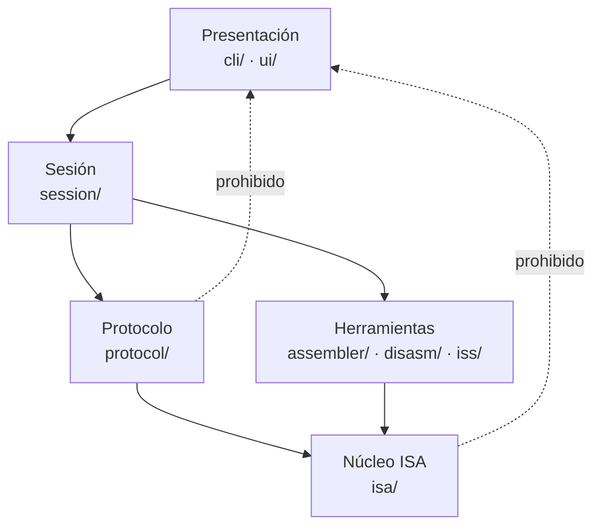
```mermaid
flowchart TD
    UI["Presentación<br/>cli/ · ui/"] --> SES["Sesión<br/>session/"]
    SES --> PROTO["Protocolo<br/>protocol/"]
    SES --> TOOLS["Herramientas<br/>assembler/ · disasm/ · iss/"]
    PROTO --> ISA["Núcleo ISA<br/>isa/"]
    TOOLS --> ISA
    ISA -.->|prohibido| UI
    PROTO -.->|prohibido| UI
```

- Nada fuera de `ui/` importa el framework gráfico. Si hubiera que cambiar Flet (ADR-012) por otro framework, solo se reescribe `ui/`.
- Nada fuera de `protocol/serial_transport.py` importa `pyserial`. Así, `FakeTransport` permite probar toda la GUI **sin placa**.

### 4.4 Patrones de diseño usados

- **Fuente única de verdad (tabla de instrucciones):** `isa/instrucciones.py` define las 33 instrucciones una vez; ensamblador, desensamblador y golden model la consumen. Evita que el ensamblador codifique `srai` de una forma y el desensamblador la interprete de otra.
- **Transporte intercambiable (Strategy):** `Transport` con `SerialTransport` (placa real) y `FakeTransport` (respaldado por el golden model, simula respuestas de la FPGA). Permite desarrollar la GUI en paralelo al hardware.
- **Snapshot inmutable:** cada volcado se convierte en un objeto `Snapshot` inmutable (`@dataclass(frozen=True)`); la vista compara dos snapshots para resaltar cambios.
- **Composition Root:** `cli/main.py` y `ui/app.py` son los únicos lugares donde se decide qué transporte se usa (`--port /dev/ttyUSB1` o `--fake`).

### 4.5 Estructura de directorios de referencia (software de PC)

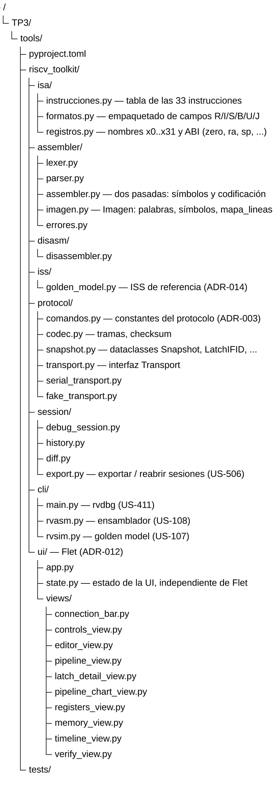
```mermaid
treeView-beta
    "TP3/"
        "tools/"
            "pyproject.toml"
            "riscv_toolkit/"
                "isa/"
                    "instrucciones.py — tabla de las 33 instrucciones"
                    "formatos.py — empaquetado de campos R/I/S/B/U/J"
                    "registros.py — nombres x0..x31 y ABI (zero, ra, sp, ...)"
                "assembler/"
                    "lexer.py"
                    "parser.py"
                    "assembler.py — dos pasadas: símbolos y codificación"
                    "imagen.py — Imagen: palabras, símbolos, mapa_lineas"
                    "errores.py"
                "disasm/"
                    "disassembler.py"
                "iss/"
                    "golden_model.py — ISS de referencia (ADR-014)"
                "protocol/"
                    "comandos.py — constantes del protocolo (ADR-003)"
                    "codec.py — tramas, checksum"
                    "snapshot.py — dataclasses Snapshot, LatchIFID, ..."
                    "transport.py — interfaz Transport"
                    "serial_transport.py"
                    "fake_transport.py"
                "session/"
                    "debug_session.py"
                    "history.py"
                    "diff.py"
                    "export.py — exportar / reabrir sesiones (US-506)"
                "cli/"
                    "main.py — rvdbg (US-411)"
                    "rvasm.py — ensamblador (US-108)"
                    "rvsim.py — golden model (US-107)"
                "ui/ — Flet (ADR-012)"
                    "app.py"
                    "state.py — estado de la UI, independiente de Flet"
                    "views/"
                        "connection_bar.py"
                        "controls_view.py"
                        "editor_view.py"
                        "pipeline_view.py"
                        "latch_detail_view.py"
                        "pipeline_chart_view.py"
                        "registers_view.py"
                        "memory_view.py"
                        "timeline_view.py"
                        "verify_view.py"
            "tests/"
```

### 4.6 ¿Qué va en cada capa? Guía práctica

- **"¿Dónde pongo el cálculo del inmediato de un branch?"** → en `isa/formatos.py`. Lo usan el ensamblador (para codificar) y el desensamblador/golden model (para decodificar).
- **"¿Dónde pongo la lógica de 'si el comando no recibe ACK en 2 s, reintentar'?"** → en `session/debug_session.py`, no en la GUI.
- **"¿Dónde pongo el color del stall en la vista del pipeline?"** → en `ui/views/pipeline_view.py`. La sesión solo informa `stall=True`; cómo se pinta es de la vista.
- **"¿Dónde pongo el parseo de los bytes del latch ID/EX?"** → en `protocol/snapshot.py`. La GUI recibe un objeto `LatchIDEX` con campos con nombre, nunca bytes.

---

## 5. Acuerdo de Ingeniería y Estándares

### 5.1 Estilo de Verilog (heredado del TP2)

- Prefijos de puertos `i_` / `o_`; registros internos `r_`; wires `w_`.
- Reset **sincrónico** en todos los módulos.
- Un bloque `always` por registro o grupo de registros relacionados (estilo acordado en el TP2 por legibilidad).
- Estados de FSM con `localparam`; FSM con bloque secuencial de estado y bloque combinacional de próximo estado/salidas.
- Separación control / datapath cuando el módulo tiene una FSM (como `uart_rx_fsm` / `uart_rx_datapath`).
- Lógica combinacional con valores por defecto al inicio del `always @(*)` para no inferir latches.
- Parámetros para anchos (`NBIT`, `ADDR_BITS`, etc.), nunca números mágicos.
- **Prohibido** cualquier expresión que involucre `clock` fuera de `@(posedge clock)`.

---

## 6. Reglas de Negocio Consolidadas

Reglas que aplican a todo el sistema. Las específicas de una historia están dentro de esa historia.

**Ejecución y pipeline:**

- **R-EJ-1.** El reloj del sistema nunca pasa por lógica combinacional. Pausar, avanzar o congelar el procesador se hace exclusivamente con `i_enable` (clock enable) y señales de flush/stall.
- **R-EJ-2.** Un "paso" (STEP) equivale a **exactamente un flanco de reloj con `i_enable = 1`** para el núcleo. Ni más, ni menos.
- **R-EJ-3.** La instrucción HALT se detecta en ID. A partir de ese ciclo, IF deja de buscar instrucciones (el PC se congela y a IF/ID entran burbujas) y el HALT sigue avanzando como una instrucción marcada.
- **R-EJ-4.** Si una instrucción más vieja que el HALT provoca un flush (branch/jump tomado), el HALT se descarta junto con las demás instrucciones especulativas: la ejecución continúa en el destino del salto.
- **R-EJ-4bis.** Una instrucción ilegal (opcode o combinación `funct3`/`funct7` no implementada) se trata como un HALT con causa de error: se detecta en ID, IF deja de buscar, avanza con `halt = 1` e `illegal = 1` sin escribir nada, y se descarta si un salto más viejo produce un flush (ADR-018).
- **R-EJ-5.** La ejecución se considera **terminada** cuando el HALT llega a WB. En ese momento todas las instrucciones anteriores ya completaron WB y no hay ninguna posterior en vuelo → el pipeline está vacío (todos los `valid = 0` en el ciclo siguiente). Recién entonces la Debug Unit pasa a `HALTED`. El snapshot final informa el **motivo** de la terminación: `HALTED` (HALT), `ILLEGAL` (instrucción ilegal, ADR-018) o `ABORTED` (comando `ABORT`, ADR-010). Los tres dejan el pipeline vacío.
- **R-EJ-6.** Una burbuja (`valid = 0`) nunca escribe registros ni memoria.
- **R-EJ-7.** El resultado de un programa debe ser idéntico en modo continuo y en modo paso a paso.

**Debug Unit y protocolo:**

- **R-DU-1.** Comandos válidos según estado (la tabla completa está en `docs/protocolo.md`):

  | Comando            | Estados válidos                                                                      |
  | ------------------ | ------------------------------------------------------------------------------------ |
  | `LOAD`, `RESET`    | `IDLE`, `READY`, `STEPPING`, `HALTED` (`RESET` sin programa cargado queda en `IDLE`) |
  | `RUN`, `STEP`      | `READY`, `STEPPING`                                                                  |
  | `DUMP`, `DUMP_MEM` | Todos salvo `RUN`                                                                    |
  | `ABORT`            | Solo `RUN`                                                                           |
  | `PING`             | Todos                                                                                |

  Un comando inválido para el estado actual responde `NACK` con código de error y no cambia nada. `HALTED`, `ILLEGAL` y `ABORTED` son motivos de terminación que viajan en el snapshot; el estado de la Debug Unit después de cualquiera de ellos es `HALTED`.

- **R-DU-2.** Todo comando recibe respuesta (`ACK`, `NACK` o datos). La PC nunca queda esperando indefinidamente sin saber si el comando llegó (timeout del lado de la PC).
- **R-DU-3.** Todo snapshot se toma con el núcleo congelado.
- **R-DU-4.** Toda trama de datos lleva un checksum (ADR-003); una carga con checksum inválido se rechaza completa: la IMEM queda rellena con HALT y la Debug Unit vuelve a `IDLE` (ADR-009).
- **R-DU-5.** Un byte con error de paridad (ADR-002) aborta el comando en curso y responde `NACK(paridad)`.
- **R-DU-6.** **Timeout de recepción:** si un comando con argumentos deja de recibir bytes durante el tiempo definido en `docs/protocolo.md` (propuesta: 100 ms), la Debug Unit responde `NACK(timeout)`. Si era un `LOAD`, se aplica lo mismo que con un checksum inválido (IMEM rellena con HALT, vuelve a `IDLE`); en cualquier otro comando vuelve al estado anterior.

**Programas:**

- **R-PR-1.** Todo programa debe terminar en HALT. El ensamblador agrega uno automáticamente al final si falta, con una advertencia (ADR-013).
- **R-PR-2.** El tamaño de un programa, contando el HALT final, no puede superar la capacidad de la IMEM (256 palabras, ADR-008); el ensamblador lo rechaza antes de enviar.
- **R-PR-3.** El PC arranca en la dirección 0 en cada ejecución nueva.

**Reprogramación** (política completa en ADR-009):

- **R-RP-1.** Cargar un programa nuevo deja el sistema en el mismo estado que un reset, salvo por el contenido de la IMEM: pipeline vacío, PC = 0, registros en 0, DMEM en 0, bitmap y contador de memoria usada en 0, contador de ciclos en 0. `RESET` hace lo mismo sin tocar la IMEM.

---

## 7. Requisitos No Funcionales (NFR)

| ID     | Requisito                            | Medición / Umbral                                                                                                                                                                                     | Severidad  |
| ------ | ------------------------------------ | ----------------------------------------------------------------------------------------------------------------------------------------------------------------------------------------------------- | ---------- |
| NFR-1  | Timing                               | WNS ≥ 0 y WHS ≥ 0 post-implementación a la frecuencia elegida en ADR-016                                                                                                                              | Bloqueante |
| NFR-2  | Reloj intacto                        | 0 instancias de lógica en la red de reloj (verificable en el esquemático post-síntesis y con `report_clock_networks`)                                                                                 | Bloqueante |
| NFR-3  | Recursos                             | Diseño completo < 50 % de LUTs del XC7A35T, incluidas las memorias en LUTRAM (ADR-005), con margen para depuración con ILA                                                                            | Media      |
| NFR-4  | Latencia de un paso                  | STEP + recepción del snapshot + actualización de la GUI < 1 s con el volcado típico (sección 3.5). Con toda la DMEM usada el volcado tarda ~1 s a 19200 bps (ADR-002): queda en el límite y se acepta | Alta       |
| NFR-5  | Tiempo de carga                      | Ensamblar y cargar un programa de 256 instrucciones < 3 s                                                                                                                                             | Alta       |
| NFR-6  | Robustez del enlace                  | Una trama corrupta (paridad o checksum inválidos) o incompleta (timeout) nunca deja la Debug Unit colgada (R-DU-4 a R-DU-6); un loop infinito se corta con `ABORT` (ADR-010)                          | Bloqueante |
| NFR-7  | Portabilidad del software de PC      | Funciona en Linux (Mint/Ubuntu) y Windows 10+, detectando el puerto serie de la Basys 3                                                                                                               | Alta       |
| NFR-8  | Reproducibilidad del proyecto Vivado | El repositorio contiene solo fuentes (`TP3/hw/rtl`, `TP3/hw/constraints`, `.xci` si hay IP): cualquiera arma su proyecto local en Vivado 2025.2 agregando esos archivos según el `TP3/README.md`, y ningún archivo generado por Vivado se versiona | Alta       |
| NFR-9  | Desarrollo sin placa                 | Toda la interfaz de PC es usable en modo `--fake` (sin FPGA)                                                                                                                                          | Media      |
| NFR-10 | Cobertura de tests Python            | ≥ 80 % general; ≥ 95 % en `isa/`, `assembler/` y `protocol/codec.py`                                                                                                                                  | Alta       |

---

## 8. Registro de Decisiones Arquitectónicas (ADR)

Cada decisión no trivial tiene su ADR en [`docs/adr/`](adr/) con la estructura Contexto → Decisión → Alternativas consideradas → Consecuencias (positivas / negativas / restricciones). Esta tabla es solo un índice: **el detalle y la justificación viven en cada ADR** y no se duplican acá, para que no diverjan. El índice también está en [`docs/adr/README.md`](adr/README.md).

| ID                                                         | Título                                                    | Estado    | Decisión                                                                                        | Bloquea                 |
| ---------------------------------------------------------- | --------------------------------------------------------- | --------- | ----------------------------------------------------------------------------------------------- | ----------------------- |
| [ADR-001](adr/ADR-001-control-ejecucion-clock-enable.md)   | Control de ejecución por clock enable                     | Aprobado  | `i_enable` como CE de todo el núcleo; sin clock gating ni BUFGCE                                | Hito 2                  |
| [ADR-002](adr/ADR-002-parametros-uart.md)                  | Parámetros de la UART                                     | Aprobado  | 19200 bps 8E1 como el TP2; paridad validada; `COUNT_MAX` calculado desde `CLK_FREQ_HZ` y `BAUD` | US-401                  |
| [ADR-003](adr/ADR-003-protocolo-debug-unit.md)             | Protocolo de comandos de la Debug Unit                    | Aprobado  | Comando ASCII de 1 byte + args binarios; respuestas en trama con XOR; `RUN` = `ACK` + snapshot  | US-104, Hito 4, US-410  |
| [ADR-004](adr/ADR-004-codificacion-halt.md)                | Codificación de HALT                                      | Aprobado  | Opcode _custom-0_, palabra `0x0000000B`; detección por opcode                                   | US-105, US-203          |
| [ADR-005](adr/ADR-005-implementacion-memorias.md)          | Implementación de memorias                                | Aprobado  | Memoria distribuida (LUTRAM) inferida, lectura combinacional                                    | US-204                  |
| [ADR-006](adr/ADR-006-resolucion-saltos.md)                | Punto de resolución de saltos                             | Aprobado  | `jal` en ID; `beq`/`bne`/`jalr` en EX; predict not-taken                                        | US-205 a US-207, US-303 |
| [ADR-007](adr/ADR-007-riesgos-datos-banco-registros.md)    | Estrategia de riesgos de datos y banco de registros       | Aprobado  | Forwarding completo + stall load-use; bypass interno en el banco                                | US-202, Hito 3          |
| [ADR-008](adr/ADR-008-tamanos-memoria-memoria-usada.md)    | Tamaños de memoria y definición de "memoria usada"        | Aprobado  | IMEM y DMEM de 256 palabras; bitmap de escritas + contador; comando `DUMP_MEM`                  | US-204, US-405, US-409  |
| [ADR-009](adr/ADR-009-politica-reprogramacion.md)          | Política de reprogramación                                | Aprobado  | `LOAD` limpia todo y rellena la IMEM con HALT; `RESET` igual sin tocar la IMEM                  | US-403                  |
| [ADR-010](adr/ADR-010-comportamiento-sin-halt.md)          | Comportamiento sin instrucción de parada                  | Aprobado  | Relleno con HALT + HALT automático del ensamblador + `ABORT`                                    | US-406                  |
| [ADR-011](adr/ADR-011-lenguaje-software-pc.md)             | Lenguaje del software de PC                               | Aprobado  | Python 3.11+; identificadores mixtos (dominio en español, términos técnicos en inglés)          | Hito 1 (US-105)         |
| [ADR-012](adr/ADR-012-tecnologia-interfaz-usuario.md)      | Tecnología de la interfaz de usuario                      | Aprobado  | Flet (GUI) + CLI                                                                                | Hito 5                  |
| [ADR-013](adr/ADR-013-ensamblador-propio.md)               | Ensamblador propio vs. toolchain externo                  | Aprobado  | Propio de dos pasadas; pseudo `nop`, `mv`, `j`, `ret`; GNU solo para validar                    | US-106, US-108          |
| [ADR-014](adr/ADR-014-golden-model.md)                     | Simulador de referencia (golden model)                    | Aprobado  | ISS propio en Python + firma en memoria                                                         | US-107, US-305, US-506  |
| [ADR-015](adr/ADR-015-simulador-hdl-verificacion.md)       | Simulador HDL y framework de verificación                 | Aprobado  | xsim + testbenches Verilog-2001 portables; CI con Python e Icarus                               | US-102                  |
| [ADR-016](adr/ADR-016-frecuencia-generacion-reloj.md)      | Frecuencia de operación y generación de reloj             | Propuesto | Criterio fijado (barrido, WNS ≥ 0,3 ns); se aprueba con los datos de US-601/602                 | Hito 6                  |
| [ADR-017](adr/ADR-017-formato-volcado-latches.md)          | Formato de volcado de latches                             | Aprobado  | Campo a campo alineado a byte, flags agrupados, LE; `instr` con `DEBUG_TRACE`                   | US-103, US-405          |
| [ADR-018](adr/ADR-018-desalineados-endianness-ilegales.md) | Accesos desalineados, endianness e instrucciones ilegales | Aprobado  | Little-endian; desalineado = ignorar bits bajos; ilegal = detener con estado `ILLEGAL`          | US-203, US-204          |
| [ADR-019](adr/ADR-019-reutilizacion-alu-tp1.md)            | Reutilización de la ALU del TP1                           | Aprobado  | ALU nueva de 32 bits con `alu_ctrl` de 4 bits; comparador de branches aparte                    | US-201, US-207          |
| [ADR-020](adr/ADR-020-version-vivado.md)                   | Versión de Vivado de referencia                           | Aprobado  | Vivado 2025.2                                                                                   | US-101                  |

---

## 9. Hitos, Épicas e Historias de Usuario

### 9.0 Visión general del plan

| Hito      | Versión | Nombre                                        | Épicas | Historias | Esfuerzo estimado     |
| --------- | ------- | --------------------------------------------- | ------ | --------- | --------------------- |
| 1         | v0.1    | Fundaciones, diseño y toolchain de ensamblado | 3      | 8         | ~19 días·persona      |
| 2         | v0.2    | Núcleo del pipeline con flush básico          | 2      | 10        | ~25 días·persona      |
| 3         | v0.3    | Manejo de riesgos y verificación              | 2      | 5         | ~13 días·persona      |
| 4         | v0.4    | Debug Unit, control por UART y CLI            | 4      | 11        | ~25 días·persona      |
| 5         | v0.5    | Interfaz gráfica en PC                        | 2      | 5         | ~13 días·persona      |
| 6         | v1.0    | Timing, integración final y entrega           | 3      | 5         | ~12 días·persona      |
| **Total** |         |                                               | **16** | **44**    | **~106 días·persona** |

**Numeración de historias:** cada historia conserva su número aunque se haya dividido; las partes nuevas toman el próximo número libre de su hito (por eso US-108 sigue a US-107, y US-210 a US-209). Las historias de codec y sesión/CLI (antes US-501/502) se movieron al Hito 4 como US-410/411, porque la validación en placa (US-407) las necesita.

**Paralelismo entre integrantes:** a partir del Hito 2 el trabajo se divide en dos **pistas** que avanzan en paralelo y se juntan en la integración en placa (US-407):

- **Pista A — Hardware del núcleo:** Hitos 2 y 3.
- **Pista B — Debug Unit y software de PC:** Hito 4 (contra un núcleo _stub_ hasta que el real esté listo, y con el software de control contra `FakeTransport`) y Hito 5.

---

### Hito 1 — Fundaciones, Diseño y Toolchain de Ensamblado (v0.1)

**Objetivo del hito:** dejar el repositorio listo para trabajar de a dos, el diseño del datapath y el protocolo congelados como contrato entre pistas, y el toolchain de PC capaz de convertir assembly en código máquina verificado. Al final del hito se puede escribir un programa, ensamblarlo y saber qué debería dar, aunque todavía no haya procesador.

**Épicas:** 3 · **Historias:** 8 · **Esfuerzo total estimado:** ~19 días·persona

**Decisiones previas requeridas:** ADR-011, ADR-013, ADR-014, ADR-015, ADR-020 (todas aprobadas). US-103 y US-104 necesitan además ADR-002 a ADR-008, ADR-017 y ADR-018 (aprobadas).

### Épica H1-E1: Repositorio y Entorno de Verificación

#### US-101 — Estructura de `TP3/` y Migración del TP2

- **Esfuerzo:** S (1–2 días) · **Prioridad:** Urgente (bloqueante) · **Dependencias:** ADR-020
- **Objetivo Funcional:** dejar la carpeta `TP3/` con la estructura del proyecto y los módulos reutilizados del TP2, de forma que cualquiera de los dos integrantes pueda clonar el repositorio, crear su proyecto local en Vivado agregando los fuentes, y sintetizar sin subir archivos generados.
- **Narrativa:** Como integrante del equipo, quiero una estructura de carpetas clara y un repositorio que solo tenga fuentes, para agregar los archivos a Vivado sin pelear con conflictos de `.xpr` ni con carpetas generadas en Git.
- **Detalle técnico:**
  - **Estructura de carpetas** dentro de `TP3/` según sección 12 (`hw/`, `asm/`, `tools/`). La documentación sigue en `docs/` y la configuración de GitHub en `.github/`, ambas en la raíz del repositorio.
  - **Proyecto de Vivado local, no versionado:** cada integrante crea su proyecto en Vivado 2025.2 (ADR-020) y agrega a mano los fuentes de `TP3/hw/rtl/` (salvo `legacy/`) y `TP3/hw/constraints/basys3.xdc`. El `TP3/README.md` indica qué carpetas agregar, cuál es el `top` y la versión de Vivado.
  - **Migración del TP2:** copiar `baudrate_gen.v`, `uart_rx*.v`, `uart_tx*.v` a `TP3/hw/rtl/uart/` sin modificaciones (los cambios de ADR-002 van en US-401). `uart_interface.v` y la `alu.v` del TP1 se guardan en `TP3/hw/rtl/legacy/` solo como referencia, fuera del proyecto de síntesis.
  - **`TP3/Makefile`** con objetivos `sim`, `sim-all` y `test-py` (se completan en US-102). La síntesis, implementación y programación de la placa se hacen desde la GUI de Vivado.
  - **`TP3/CHANGELOG.md`** con la sección `[Unreleased]` (sección 15).
  - **`.gitignore`** (el de la raíz) con las reglas de Vivado (`*.xpr`, `*.runs/`, `*.cache/`, `*.sim/`, `*.hw/`, `*.ip_user_files/`, `*.gen/`, `.Xil/`, `*.jou`, `*.log`, `*.str`) y de Python (`__pycache__/`, `.venv/`).
- **Criterios de Aceptación:**
  - **AC2.** Ningún archivo generado por Vivado aparece en `git status` después de sintetizar.
  - **AC3.** El `top` del TP2 (UART + ALU) sintetiza con los fuentes migrados y sigue funcionando en placa (prueba de humo de la migración).
  - **AC5.** ~~Plantilla y ADR-001 a ADR-020 en `docs/adr/`~~ — ya cumplido antes de iniciar el desarrollo.
- **Testing Mínimo:** _manual:_ clonar en la otra máquina del equipo, crear el proyecto siguiendo el README y sintetizar.
- **Archivos a crear:**

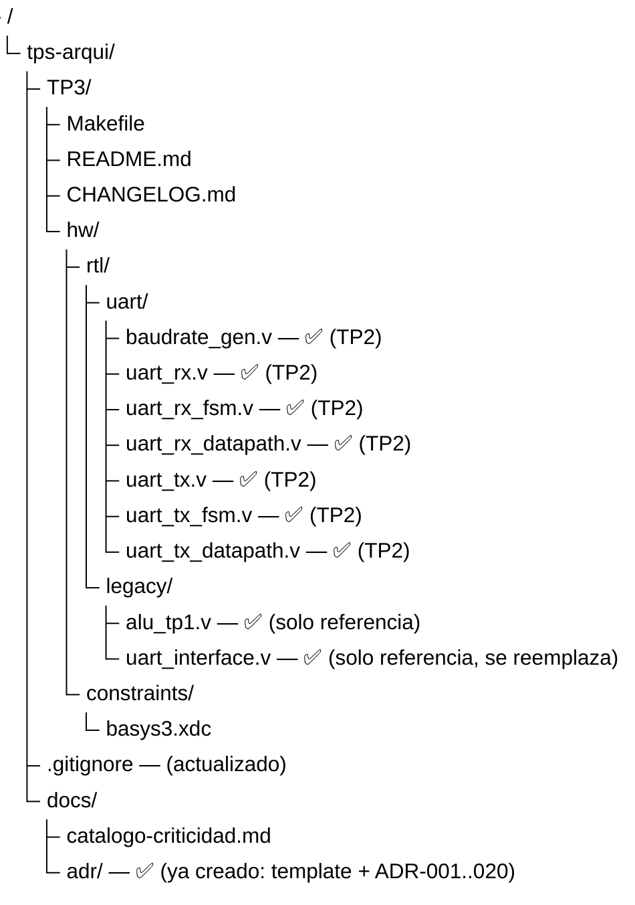
```mermaid
treeView-beta
    "tps-arqui/"
        "TP3/"
            "Makefile"
            "README.md"
            "CHANGELOG.md"
            "hw/"
                "rtl/"
                    "uart/"
                        "baudrate_gen.v — ✅ (TP2)"
                        "uart_rx.v — ✅ (TP2)"
                        "uart_rx_fsm.v — ✅ (TP2)"
                        "uart_rx_datapath.v — ✅ (TP2)"
                        "uart_tx.v — ✅ (TP2)"
                        "uart_tx_fsm.v — ✅ (TP2)"
                        "uart_tx_datapath.v — ✅ (TP2)"
                    "legacy/"
                        "alu_tp1.v — ✅ (solo referencia)"
                        "uart_interface.v — ✅ (solo referencia, se reemplaza)"
                "constraints/"
                    "basys3.xdc"
        ".gitignore — (actualizado)"
        "docs/"
            "catalogo-criticidad.md"
            "adr/ — ✅ (ya creado: template + ADR-001..020)"
```

#### US-102 — Infraestructura de Simulación y Testbenches Autoverificables

- **Esfuerzo:** M (3 días) · **Prioridad:** Urgente (bloqueante) · **Dependencias:** US-101, ADR-015
- **Objetivo Funcional:** tener una forma estándar y rápida de simular cualquier módulo y saber si pasó o falló sin mirar formas de onda, en xsim y en Icarus, y correrlo automáticamente en cada PR (ADR-015).
- **Narrativa:** Como desarrollador, quiero correr `make sim TB=tb_alu` y obtener un `PASS`/`FAIL` claro, para detectar regresiones en segundos.
- **Detalle técnico:**
  - **Include `hw/tb/common/tb_utils.vh`:** tareas `check_eq(nombre, obtenido, esperado)` que incrementa un contador de errores e imprime el detalle; `tb_finish()` que imprime `TEST PASSED` o `TEST FAILED (N errores)` y termina.
  - **Script `hw/scripts/sim.tcl`** (xsim en modo batch) que compila, elabora y corre un testbench por nombre, y devuelve código de salida ≠ 0 si el log contiene `TEST FAILED`.
  - **Soporte Icarus:** `make sim TB=… SIM=icarus` compila con `iverilog -g2001` y corre con `vvp`, con el mismo criterio de PASS/FAIL. Los testbenches que dependen de IP de Xilinx se marcan como solo-xsim (por ejemplo, con una lista en el Makefile).
  - **CI (`.github/workflows/ci.yml`):** en cada push y PR corre `ruff check`, `pytest --cov` sobre `tools/` y `make sim-all SIM=icarus`.
  - **Soporte `$readmemh`:** convención para cargar programas `.hex` en la IMEM desde el testbench (usada en US-209 en adelante).
  - **Testbench de ejemplo:** `tb_uart_loopback.v` (TX conectado a RX del TP2) como prueba de la infraestructura.
  - **Objetivo `make sim-all`:** corre todos los `tb_*.v` y resume cuántos pasaron.
- **Criterios de Aceptación:**
  - **AC1.** `make sim TB=tb_uart_loopback` imprime `TEST PASSED` y sale con código 0.
  - **AC2.** Si se modifica el dato esperado del testbench, imprime `TEST FAILED (1 errores)` y sale con código ≠ 0.
  - **AC3.** `make sim-all` lista cada testbench con su resultado y un total.
  - **AC4.** Los testbenches usan solo Verilog-2001 (sin SystemVerilog) y `make sim TB=tb_uart_loopback SIM=icarus` también imprime `TEST PASSED`.
  - **AC5.** Se puede generar el archivo de ondas (`.wdb`/`.vcd`) con `WAVES=1` para depurar.
  - **AC6.** El workflow de CI corre en un PR de prueba y queda en rojo si un testbench o un test de Python falla.
- **Testing Mínimo:** la propia prueba de loopback.
- **Archivos a crear:**

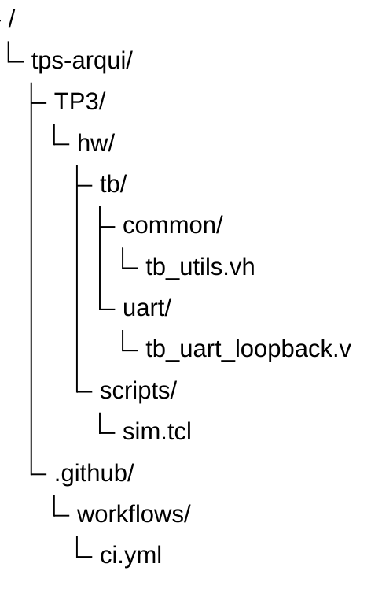
```mermaid
treeView-beta
    "tps-arqui/"
        "TP3/"
            "hw/"
                "tb/"
                    "common/"
                        "tb_utils.vh"
                    "uart/"
                        "tb_uart_loopback.v"
                "scripts/"
                    "sim.tcl"
        ".github/"
            "workflows/"
                "ci.yml"
```

### Épica H1-E2: Diseño y Contratos

#### US-103 — Diagrama del Datapath Segmentado y Especificación de Interfaces

- **Esfuerzo:** M (3 días) · **Prioridad:** Urgente (bloqueante) · **Dependencias:** ADR-005, ADR-006, ADR-007, ADR-010, ADR-017, ADR-018, ADR-019
- **Objetivo Funcional:** cumplir el tip del enunciado "diseñen, dibujen y esquematicen antes de escribir la primera línea", y congelar la interfaz del núcleo para que la pista B pueda construir la Debug Unit en paralelo.
- **Narrativa:** Como integrante del equipo, quiero un diagrama completo del datapath con todas las señales, para que ambos implementemos contra el mismo contrato y no descubramos incompatibilidades en la integración.
- **Detalle técnico:**
  - **Diagrama del datapath** (draw.io, exportado a SVG/PNG en `docs/diagramas/`): 5 etapas, 4 latches con sus campos (sección 3.2), multiplexores con nombre de su señal de selección, forwarding unit, hazard unit, comparador de branches (ADR-019), los dos puntos de redirección del PC con su prioridad (ADR-006), memorias distribuidas con lectura combinacional (ADR-005) y el mux del puerto de escritura de la DMEM (núcleo / Debug Unit).
  - **Tabla de señales de control** por instrucción (las 33): `reg_write`, `mem_read`, `mem_write`, `result_src`, `alu_src`, `alu_op`, `branch`, `jump`, `jalr`, `imm_type`, `halt`, `uses_rs1`, `uses_rs2`. Incluye la lista de combinaciones `opcode`/`funct3`/`funct7` **legales**; cualquier otra activa `illegal` (ADR-018).
  - **Especificación de la interfaz de `riscv_core`** en `docs/interfaces/riscv_core.md`:
    - Entradas: `clock`, `i_reset`, `i_enable`, `i_flush_all`, `i_stop_fetch` (ABORT, ADR-010), puerto de escritura IMEM (`i_imem_we`, `i_imem_addr`, `i_imem_wdata`), puerto de escritura de depuración de la DMEM para la limpieza (`i_dbg_dmem_we`, `i_dbg_dmem_addr`: escribe ceros y no marca el bitmap), `i_clear_used` (limpia bitmap y contador), puertos de lectura de depuración (`i_dbg_reg_addr`, `i_dbg_mem_addr`).
    - Salidas: `o_halted`, `o_illegal`, `o_pc`, `o_dbg_reg_data`, `o_dbg_mem_data`, `o_dbg_mem_used` (bit del bitmap de la dirección pedida), `o_dbg_used_count` (contador de palabras usadas, ADR-008), señales de riesgo del ciclo (`o_stall`, `o_flush_if_id`, `o_flush_id_ex`, `o_fwd_a`, `o_fwd_b`), y los latches como buses planos (`o_if_id`, `o_id_ex`, `o_ex_mem`, `o_mem_wb`) con anchos definidos.
  - **Diagrama de estados de la Debug Unit** (`IDLE`, `LOADING`, `READY`, `RUN`, `STEPPING`, `DUMPING`, `HALTED`) con transiciones por comando según R-DU-1, incluidos el timeout (R-DU-6) y los tres motivos de terminación (`HALTED`, `ILLEGAL`, `ABORTED`), que llevan todos al estado `HALTED`.
- **Criterios de Aceptación:**
  - **AC1.** El diagrama muestra cada señal que cruza un latch; ninguna señal "aparece" en una etapa sin haber viajado por el latch anterior.
  - **AC2.** La tabla de control cubre las 33 instrucciones y fue revisada por ambos integrantes contra la tabla de la sección 2.2.
  - **AC3.** Los anchos de `o_if_id`, `o_id_ex`, `o_ex_mem`, `o_mem_wb` están fijados en bits y coinciden con ADR-017.
  - **AC4.** Se recorrió "en papel" la ejecución de un programa de **10 instrucciones** con un load-use, un forwarding EX/MEM y un `beq` tomado, ciclo por ciclo (carta de pipeline), y el diagrama alcanza para explicarlo. Esta carta se reutiliza en US-507 AC2.
  - **AC5.** El documento de interfaz está versionado; cualquier cambio posterior requiere avisar a la otra pista y actualizar `docs/interfaces/`.
- **Entidades/Modelos implicados:** latches, señales de control, estados de la Debug Unit.
- **Testing Mínimo:** revisión cruzada (cada integrante revisa lo que diseñó el otro).
- **Archivos a crear:**

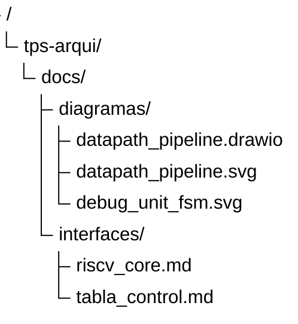
```mermaid
treeView-beta
    "tps-arqui/"
        "docs/"
            "diagramas/"
                "datapath_pipeline.drawio"
                "datapath_pipeline.svg"
                "debug_unit_fsm.svg"
            "interfaces/"
                "riscv_core.md"
                "tabla_control.md"
```

#### US-104 — Especificación del Protocolo de la Debug Unit

- **Esfuerzo:** S (1,5 días) · **Prioridad:** Urgente (bloqueante) · **Dependencias:** ADR-002, ADR-003, ADR-008, ADR-009, ADR-010, ADR-017, ADR-018
- **Objetivo Funcional:** fijar byte a byte el protocolo PC ↔ FPGA para que la Debug Unit (hardware) y el codec de Python (software) se implementen por separado y funcionen juntos al primer intento.
- **Narrativa:** Como desarrollador del software de PC, quiero una especificación exacta de cada comando y respuesta, para implementar el codec sin esperar a que el hardware esté listo.
- **Detalle técnico:**
  - **`docs/protocolo.md`** con: parámetros de UART (19200 bps, 8E1, ADR-002); tabla de comandos (ADR-003, incluido `DUMP_MEM` de ADR-008) con sus estados válidos (R-DU-1); formato de trama de respuesta; códigos de error de `NACK` (comando desconocido, comando inválido para el estado, checksum incorrecto, tamaño excedido, rango inválido de `DUMP_MEM`, timeout de recepción, error de paridad); motivos de terminación del snapshot (`HALTED`, `ILLEGAL`, `ABORTED`); layout completo del snapshot con offsets y bits de cada byte de flags (ADR-017); constantes compartidas (opcode de HALT, tamaños de memoria, dirección de firma); y secuencias de ejemplo con bytes reales en hexadecimal para cada comando.
  - **Diagrama de secuencia** de `LOAD` → `STEP` × 3 → `RUN` → snapshot final.
  - **Timeout de recepción en hardware** (R-DU-6): tiempo exacto (propuesta: 100 ms sin bytes), respuesta `NACK(timeout)` y estado resultante (`IDLE` con la IMEM rellena de HALT si era un `LOAD`; el estado anterior en cualquier otro caso).
  - **Sincronía de constantes:** `protocol/comandos.py` es la fuente; un script (`tools/scripts/gen_du_defs.py`) genera `hw/rtl/debug/du_defs.vh`, y un test verifica que el `.vh` versionado está al día (sección 13).
- **Criterios de Aceptación:**
  - **AC1.** Cada comando tiene al menos un ejemplo de bytes exactos de ida y de vuelta.
  - **AC2.** El layout del snapshot suma exactamente la cantidad de bytes declarada en el campo `longitud`.
  - **AC3.** Están definidos todos los códigos de error y en qué estado queda la Debug Unit después de cada uno.
  - **AC4.** El documento incluye un número de versión del protocolo, que devuelve el comando `PING`.
- **Reglas de Negocio:** R-DU-1 a R-DU-6.
- **Testing Mínimo:** los ejemplos de bytes del documento se convierten en casos de prueba de US-410 y del testbench de US-402; `test_du_defs_sync.py`.
- **Archivos a crear:**

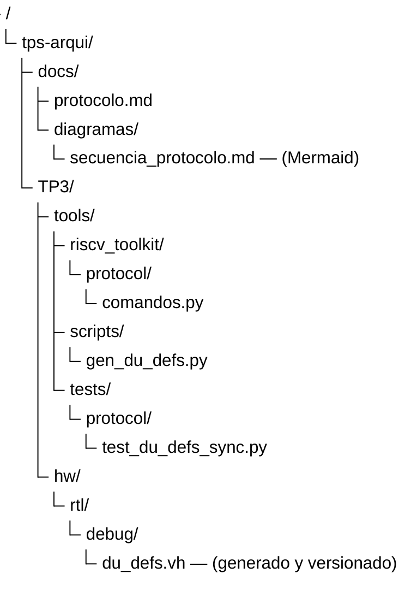
```mermaid
treeView-beta
    "tps-arqui/"
        "docs/"
            "protocolo.md"
            "diagramas/"
                "secuencia_protocolo.md — (Mermaid)"
        "TP3/"
            "tools/"
                "riscv_toolkit/"
                    "protocol/"
                        "comandos.py"
                "scripts/"
                    "gen_du_defs.py"
                "tests/"
                    "protocol/"
                        "test_du_defs_sync.py"
            "hw/"
                "rtl/"
                    "debug/"
                        "du_defs.vh — (generado y versionado)"
```

### Épica H1-E3: Toolchain de Ensamblado y Referencia

#### US-105 — Tabla ISA Compartida (Fuente Única de Verdad)

- **Esfuerzo:** S (1 día) · **Prioridad:** Urgente (bloqueante) · **Dependencias:** ADR-004, ADR-011
- **Objetivo Funcional:** definir las 33 instrucciones una sola vez en código, con funciones de codificación y decodificación de campos, para que ensamblador, desensamblador y golden model no puedan divergir.
- **Narrativa:** Como desarrollador, quiero una tabla ISA única, para que un error de codificación se corrija en un solo lugar.
- **Detalle técnico (`tools/riscv_toolkit/isa/`):**
  - **`instrucciones.py`:** `@dataclass(frozen=True) InstructionSpec(mnemonico, formato, opcode, funct3, funct7)` y el diccionario `INSTRUCCIONES` con las 33 entradas de la sección 2.2.
  - **`formatos.py`:** `encode_r(...)`, `encode_i(...)`, `encode_s(...)`, `encode_b(...)`, `encode_u(...)`, `encode_j(...)` y sus inversas `decode_*` que devuelven campos + inmediato extendido en signo; `sign_extend(valor, bits)`.
  - **`registros.py`:** mapeo `x0..x31` y nombres ABI (`zero`, `ra`, `sp`, `gp`, `tp`, `t0–t6`, `s0/fp–s11`, `a0–a7`).
- **Criterios de Aceptación:**
  - **AC1.** Las 33 instrucciones están en la tabla con los valores de la sección 2.2.
  - **AC2.** Para cada formato, `decode(encode(campos)) == campos` en todos los casos de prueba, incluyendo inmediatos negativos y extremos (−2048, 2047 en I/S; −4096, 4094 en B; ±1 MiB en J).
  - **AC3.** `encode_b` y `encode_j` rechazan inmediatos impares o fuera de rango con una excepción clara.
  - **AC4.** El módulo no importa nada fuera de la biblioteca estándar.
- **Testing Mínimo:** _unitarias_ (`tests/isa/test_formatos.py`): ida y vuelta por formato; casos borde de inmediatos; `test_tabla_completa` verifica que existen exactamente 33 mnemónicos.
- **Archivos a crear:**

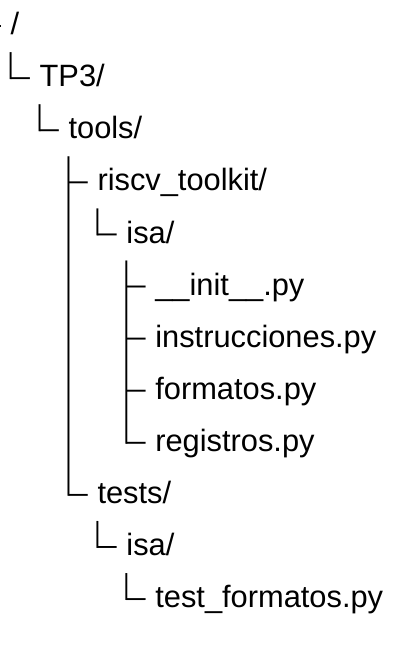
```mermaid
treeView-beta
    "TP3/"
        "tools/"
            "riscv_toolkit/"
                "isa/"
                    "__init__.py"
                    "instrucciones.py"
                    "formatos.py"
                    "registros.py"
            "tests/"
                "isa/"
                    "test_formatos.py"
```

#### US-106 — Ensamblador de Dos Pasadas

- **Esfuerzo:** M (4 días) · **Prioridad:** Urgente (bloqueante) · **Dependencias:** US-105, ADR-013
- **Objetivo Funcional:** cumplir el requisito del enunciado de "contar con un mecanismo para traducir instrucciones a lenguaje máquina": convertir texto assembly en una `Imagen` (palabras + símbolos + mapa de líneas) validada.
- **Narrativa:** Como usuario, quiero escribir mi programa en assembly con etiquetas y comentarios y obtener el código máquina, para no calcular a mano offsets de saltos ni inmediatos partidos.
- **Detalle técnico (`tools/riscv_toolkit/assembler/`):**
  - **`lexer.py`:** tokens (mnemónico, registro, inmediato decimal/hex/negativo, etiqueta, `(`, `)`, `,`, comentario `#`, directiva).
  - **`parser.py`:** una línea → `LineaAsm(etiqueta, mnemonico, operandos, nro_linea)`; valida cantidad y tipo de operandos por formato.
  - **`assembler.py`:** clase `Assembler` con `ensamblar(texto) -> Imagen`:
    - _Primera pasada:_ asigna direcciones (PC += 4 por instrucción; todas las pseudoinstrucciones se expanden a exactamente una instrucción) y arma la tabla de símbolos.
    - _Segunda pasada:_ resuelve etiquetas como offsets relativos al PC (branches, `jal`) y codifica con `isa/formatos.py`.
    - Agrega HALT final si falta (R-PR-1) con una advertencia.
  - **Alcance del lenguaje (ADR-013):** etiquetas, comentarios `#`, registros por número y ABI, inmediatos decimales/hex/negativos, sintaxis `offset(rs1)`, directiva `.word`, `halt` nativo. Sin sección `.data` (los datos iniciales se escriben con stores).
  - **Pseudoinstrucciones (ADR-013):** solo `nop`, `mv rd, rs`, `j etiqueta`, `ret`. `li` **no** se soporta.
  - **`Imagen`** (`imagen.py`): `palabras: list[int]`, `simbolos: dict[str,int]`, `mapa_lineas: dict[int, int]` (dirección → línea de fuente, para que la GUI resalte la línea en ejecución), `advertencias: list[str]`.
  - **Advertencias de desalineado (ADR-018):** si puede detectarlo estáticamente (por ejemplo, `lw` con offset no múltiplo de 4 y base `x0`), emite una advertencia sin abortar.
- **Criterios de Aceptación:**
  - **AC1.** Ensambla las 33 instrucciones con registros por número y por nombre ABI.
  - **AC2.** Las 32 instrucciones estándar producen **exactamente** la misma palabra que `riscv64-unknown-elf-as -march=rv32i` para un archivo de prueba que las contiene todas (ADR-013).
  - **AC3.** Etiquetas hacia adelante y hacia atrás se resuelven correctamente en `beq`, `bne` y `jal`.
  - **AC4.** Errores con número de línea y mensaje claro: mnemónico desconocido (incluido `li`), registro inválido, inmediato fuera de rango, etiqueta inexistente o duplicada, cantidad de operandos incorrecta. El ensamblado se aborta sin generar salida.
  - **AC5.** Un programa de más de 256 palabras, contando el HALT agregado, se rechaza (R-PR-2, ADR-008).
  - **AC6.** `nop`, `mv`, `j` y `ret` se expanden a su instrucción real y la expansión queda registrada en la `Imagen` (para el listado de US-108).
- **Reglas de Negocio:** R-PR-1, R-PR-2; inmediatos de `slli/srli/srai` limitados a 0–31.
- **Entidades/Modelos implicados:** `LineaAsm`, `Imagen`, `InstructionSpec`.
- **Testing Mínimo:**
  - _Unitarias:_ `test_lexer.py`, `test_parser.py`, `test_assembler.py` (una prueba por instrucción, por error, por pseudoinstrucción).
  - _Contraste:_ `test_vs_gnu.py` compara contra un archivo de referencia `.hex` generado una vez con el toolchain GNU y versionado en `tools/tests/fixtures/` (así los tests no requieren tener GNU instalado).
- **Archivos a crear:**

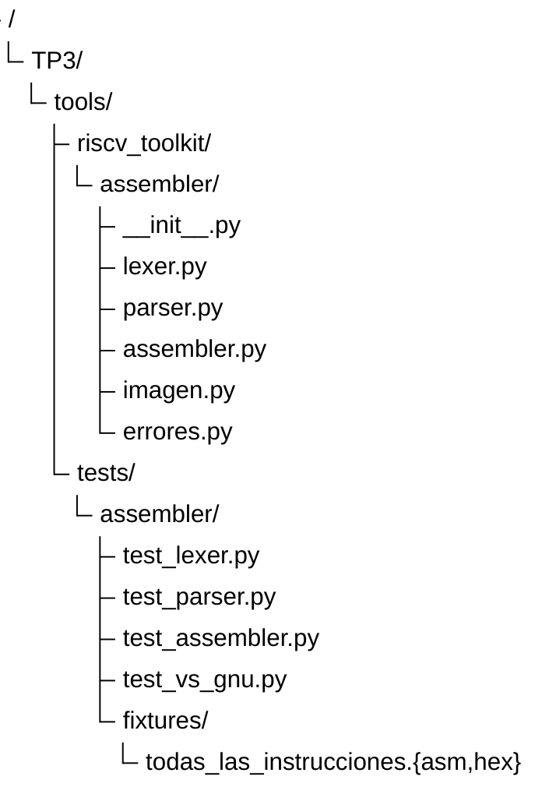
```mermaid
treeView-beta
    "TP3/"
        "tools/"
            "riscv_toolkit/"
                "assembler/"
                    "__init__.py"
                    "lexer.py"
                    "parser.py"
                    "assembler.py"
                    "imagen.py"
                    "errores.py"
            "tests/"
                "assembler/"
                    "test_lexer.py"
                    "test_parser.py"
                    "test_assembler.py"
                    "test_vs_gnu.py"
                    "fixtures/"
                        "todas_las_instrucciones.{asm,hex}"
```

#### US-108 — Desensamblador, Formatos de Salida y CLI `rvasm`

- **Esfuerzo:** S (2 días) · **Prioridad:** Urgente (bloqueante) · **Dependencias:** US-106
- **Objetivo Funcional:** producir los archivos que consumen la simulación (`.hex`), la carga por UART (`.bin`) y la GUI (`.lst`), y poder convertir cualquier palabra de vuelta a texto (lo usan la GUI y el golden model para mostrar instrucciones).
- **Narrativa:** Como usuario, quiero ensamblar desde la terminal y obtener el formato que necesito, y ver cualquier palabra de 32 bits como instrucción legible.
- **Detalle técnico:**
  - **Formatos de salida** (`assembler/salidas.py`): `.hex` (una palabra por línea, para `$readmemh`), `.bin` (little-endian, para UART) y listado `.lst` (dirección, palabra, fuente y expansión de pseudoinstrucciones).
  - **`disasm/disassembler.py`:** `desensamblar(palabra) -> str` (ej. `0x00A28293` → `addi t0, t0, 10`); `halt` para cualquier palabra con opcode _custom-0_ (ADR-004); para palabras ilegales devuelve `.word 0x...` (ADR-018).
  - **CLI:** `rvasm programa.asm -o programa.hex --format hex|bin|lst`; imprime advertencias (HALT agregado, desalineados) en stderr.
- **Criterios de Aceptación:**
  - **AC1.** `desensamblar(ensamblar(x))` reproduce la instrucción original para las 33 instrucciones (salvo formato de etiquetas, que se muestran como direcciones).
  - **AC2.** `0x00000000` y otras palabras ilegales se desensamblan como `.word 0x...`.
  - **AC3.** El `.hex` generado se carga con `$readmemh` en un testbench sin errores; el `.bin` tiene `4·N` bytes en little-endian.
  - **AC4.** El `.lst` muestra la expansión de cada pseudoinstrucción.
  - **AC5.** `rvasm` sale con código ≠ 0 si hay errores de ensamblado.
- **Testing Mínimo:** `test_disassembler.py` (ida y vuelta de las 33 + ilegales), `test_salidas.py`.
- **Archivos a crear:**

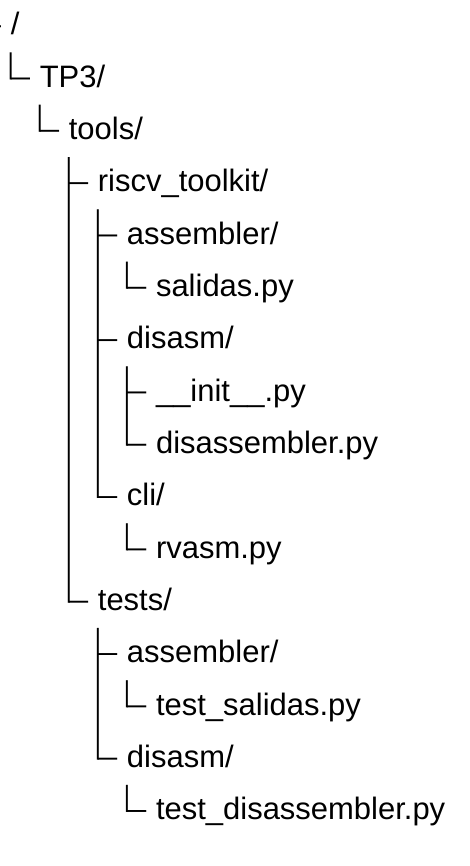
```mermaid
treeView-beta
    "TP3/"
        "tools/"
            "riscv_toolkit/"
                "assembler/"
                    "salidas.py"
                "disasm/"
                    "__init__.py"
                    "disassembler.py"
                "cli/"
                    "rvasm.py"
            "tests/"
                "assembler/"
                    "test_salidas.py"
                "disasm/"
                    "test_disassembler.py"
```

#### US-107 — Simulador de Referencia (Golden Model)

- **Esfuerzo:** M (3 días) · **Prioridad:** Alta · **Dependencias:** US-105, US-106 (solo para la CLI `rvsim`), ADR-014, ADR-018
- **Objetivo Funcional:** tener un "resultado esperado" automático para cualquier programa, y la base del modo sin placa de la GUI.
- **Narrativa:** Como desarrollador, quiero ejecutar un programa en un simulador de software fiel a la ISA, para comparar su estado final con el de la placa sin calcularlo a mano.
- **Detalle técnico (`tools/riscv_toolkit/iss/golden_model.py`):**
  - Clase `GoldenModel(imem_words, dmem_size)` con estado `pc`, `regs[32]`, `dmem: bytearray`, `mem_escrita: set[int]`, `instrucciones_retiradas`. Todo arranca en cero, igual que el hardware después de `LOAD` (ADR-009).
  - `step()` ejecuta **una instrucción** (no un ciclo: no modela el pipeline); `run(max_instr)` hasta HALT, instrucción ilegal o límite. El resultado indica el motivo: `HALTED`, `ILLEGAL` (con el PC de la instrucción) o `TIMEOUT`.
  - Semántica según sección 2.2: extensión de signo/cero en loads, enmascarado de `jalr` (`& ~1`), `shamt` de 5 bits, `x0` siempre 0, aritmética en 32 bits con `& 0xFFFFFFFF`.
  - Comportamiento de desalineados e ilegales según ADR-018: los desalineados ignoran los bits bajos y quedan registrados como **advertencia**; una ilegal detiene con `ILLEGAL`.
  - `estado_final() -> EstadoArquitectonico(regs, mem_usada, pc, motivo)` en el mismo formato que la sección de registros/memoria del snapshot.
  - CLI: `rvsim programa.asm --dump` imprime registros y memoria usada; `rvsim programa.asm --expect salida.expected` escribe el estado final en el formato que leen `tb_core_programs.v` (US-209) y `verify_rtl.py` (US-305).
- **Criterios de Aceptación:**
  - **AC1.** Cada una de las 33 instrucciones tiene un test con valores borde (overflow en `add`, `sra` de negativos, `sltu` con `-1`, `lb` de `0x80`, `lbu` de `0x80`, `jalr` con dirección impar).
  - **AC2.** Un programa con un loop infinito se detiene al llegar a `max_instr` e informa `TIMEOUT`, sin colgarse. Un programa que ejecuta `0x00000000` termina con `ILLEGAL` y el PC correcto.
  - **AC3.** `mem_escrita` coincide con la definición de "memoria usada" de ADR-008.
  - **AC4.** La clase `GoldenModel` no depende de `assembler/` (recibe palabras, no texto); solo la CLI `rvsim` ensambla.
  - **AC5.** Un `lw` desalineado da el mismo resultado que el alineado y genera una advertencia.
  - **AC6.** El formato de `--expect` está documentado y tiene un test de ida y vuelta.
- **Testing Mínimo:** _unitarias_ (`tests/iss/test_golden_model.py`) por instrucción; _integración:_ ensamblar y correr los programas de `asm/tests/` verificando la firma de éxito.
- **Archivos a crear:**

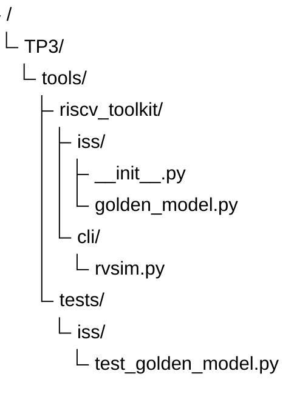
```mermaid
treeView-beta
    "TP3/"
        "tools/"
            "riscv_toolkit/"
                "iss/"
                    "__init__.py"
                    "golden_model.py"
                "cli/"
                    "rvsim.py"
            "tests/"
                "iss/"
                    "test_golden_model.py"
```

---

### Hito 2 — Núcleo del Pipeline con Flush Básico (v0.2)

**Objetivo del hito:** tener el procesador de 5 etapas ejecutando en simulación las 33 instrucciones, en programas **sin dependencias de datos cercanas** (separadas con NOPs a mano), con **flush básico** en saltos tomados (ADR-006), HALT, instrucciones ilegales y drenado del pipeline funcionando. Es la base sobre la que el Hito 3 agrega forwarding, stalls y los casos combinados de control.

**Épicas:** 2 · **Historias:** 10 · **Esfuerzo total estimado:** ~25 días·persona

**Decisiones previas requeridas:** ADR-001, ADR-004, ADR-005, ADR-006, ADR-008, ADR-018, ADR-019 (todas aprobadas). US-103 cerrada.

### Épica H2-E1: Bloques Funcionales

#### US-201 — ALU de 32 bits y Control de ALU

- **Esfuerzo:** M (3 días) · **Prioridad:** Urgente (bloqueante) · **Dependencias:** US-102, US-103, ADR-019
- **Objetivo Funcional:** ejecutar todas las operaciones aritméticas, lógicas, de comparación y desplazamiento de RV32I, evolucionando la ALU del TP1.
- **Narrativa:** Como procesador, necesito una ALU de 32 bits que resuelva las operaciones de RV32I, para ejecutar instrucciones R, I, `lui`, el cálculo de direcciones de loads/stores y el destino de `jalr`.
- **Detalle técnico:**
  - **`hw/rtl/core/alu.v`** — combinacional, parámetro `NBIT = 32`:
    - Entradas `i_a`, `i_b` (32), `i_alu_ctrl` (4). Salida `o_result` (32). Sin flag de overflow (ADR-019); `o_zero` solo si se usa para depuración, nunca para decidir branches.
    - 11 operaciones internas (`localparam` en `alu_defs.vh`, compartido con `alu_control.v`): `ALU_ADD`, `ALU_SUB`, `ALU_SLL`, `ALU_SLT`, `ALU_SLTU`, `ALU_XOR`, `ALU_SRL`, `ALU_SRA`, `ALU_OR`, `ALU_AND`, `ALU_PASS_B` (para `lui`).
    - Desplazamientos con `i_b[4:0]`; `SRA` con `$signed(i_a) >>> i_b[4:0]`; `SLT` con comparación `$signed`, `SLTU` sin signo.
    - Valores por defecto antes del `case` (sin latches), como en el TP1.
  - **`hw/rtl/core/alu_control.v`** — combinacional: a partir de `alu_op` (2 bits del control principal), `funct3` y `funct7_b5` genera `alu_ctrl`:
    - `alu_op = 00` → ADD (loads, stores, `jalr`).
    - `alu_op = 01` → PASS_B (`lui`: el inmediato ya viene desplazado desde `imm_gen`). Los branches **no** usan la ALU: se comparan en `branch_cmp` (US-207, ADR-019).
    - `alu_op = 10` → R-type: `funct3` + `funct7_b5`.
    - `alu_op = 11` → I-type aritmético: `funct3`; `funct7_b5` **solo** se mira si `funct3 = 101` (distingue `srli`/`srai`).
- **Criterios de Aceptación:**
  - **AC1.** Las 11 operaciones dan el resultado correcto en 32 bits, incluyendo casos borde: `0x7FFFFFFF + 1`, `0 − 1`, `SRA` de `0x80000000` por 31 (= `0xFFFFFFFF`), `SRL` del mismo (= `1`), `SLT(−1, 1) = 1`, `SLTU(−1, 1) = 0`, desplazamiento por 0 y por 31.
  - **AC2.** `alu_control` **no** interpreta `addi x1, x0, -1024` como `sub`: el bit 30 del inmediato de un `addi` (que puede ser 1) no afecta a la operación. Es el bug clásico de reutilizar la lógica de R-type para I-type.
  - **AC3.** `srai` y `srli` se distinguen correctamente por `funct7_b5`.
  - **AC4.** Síntesis sin latches inferidos en ambos módulos.
- **Reglas de Negocio:** aritmética módulo 2³², sin excepción por overflow (RV32I no las tiene).
- **Testing Mínimo:** `tb_alu.v` (tabla de vectores con los casos de AC1, ≥ 40 vectores), `tb_alu_control.v` (todas las combinaciones válidas de `alu_op`/`funct3`/`funct7_b5`).
- **Archivos a crear:**

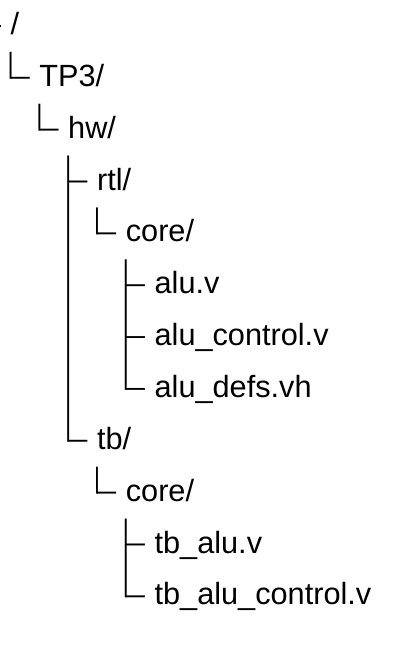
```mermaid
treeView-beta
    "TP3/"
        "hw/"
            "rtl/"
                "core/"
                    "alu.v"
                    "alu_control.v"
                    "alu_defs.vh"
            "tb/"
                "core/"
                    "tb_alu.v"
                    "tb_alu_control.v"
```

#### US-202 — Banco de Registros con Bypass y Puerto de Depuración

- **Esfuerzo:** S (1,5 días) · **Prioridad:** Urgente (bloqueante) · **Dependencias:** US-102, ADR-007
- **Objetivo Funcional:** almacenar los 32 registros con dos lecturas y una escritura por ciclo, resolviendo el riesgo WB→ID, y permitir que la Debug Unit lea cualquier registro sin interferir.
- **Narrativa:** Como procesador, necesito leer dos registros y escribir uno en el mismo ciclo, viendo en ID el valor que WB está escribiendo, para no necesitar un stall extra.
- **Detalle técnico (`hw/rtl/core/reg_file.v`):**
  - 32 × 32 bits implementado con flip-flops (permite reset sincrónico, requerido por ADR-009).
  - Lectura combinacional por `i_rs1_addr`, `i_rs2_addr`; escritura sincrónica con `i_we && i_enable && i_rd_addr != 0`.
  - **Bypass interno** (ADR-007): si se escribe y se lee la misma dirección (≠ 0) en el mismo ciclo, la lectura devuelve `i_wr_data`.
  - **Tercer puerto de lectura** `i_dbg_addr` → `o_dbg_data`, combinacional, para la Debug Unit.
  - `x0` devuelve siempre 0 en los tres puertos.
- **Criterios de Aceptación:**
  - **AC1.** Escribir `x0` no tiene efecto; leerlo da 0.
  - **AC2.** Lectura y escritura del mismo registro en el mismo ciclo devuelve el valor nuevo (bypass).
  - **AC3.** Con `i_enable = 0` no se escribe ningún registro aunque `i_we = 1`.
  - **AC4.** Tras `i_reset`, los 32 registros valen 0.
  - **AC5.** El puerto de depuración lee correctamente mientras los otros dos puertos operan.
- **Testing Mínimo:** `tb_reg_file.v` con los 5 casos de AC.
- **Archivos a crear:**

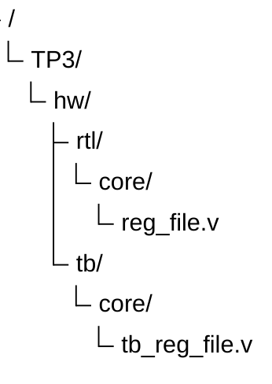
```mermaid
treeView-beta
    "TP3/"
        "hw/"
            "rtl/"
                "core/"
                    "reg_file.v"
            "tb/"
                "core/"
                    "tb_reg_file.v"
```

#### US-203 — Unidad de Control Principal y Generador de Inmediatos

- **Esfuerzo:** M (3 días) · **Prioridad:** Urgente (bloqueante) · **Dependencias:** US-103, ADR-004, ADR-018
- **Objetivo Funcional:** decodificar las 33 instrucciones en las señales de control de la tabla de US-103, detectar las instrucciones ilegales y extraer el inmediato correcto de cada formato.
- **Narrativa:** Como procesador, necesito traducir cada opcode en señales de control y reconstruir el inmediato partido de cada formato, para que las etapas siguientes sepan qué hacer.
- **Detalle técnico:**
  - **`hw/rtl/core/control_unit.v`** (combinacional, entradas `opcode`, `funct3`, `funct7`): salidas `reg_write`, `mem_read`, `mem_write`, `result_src[1:0]`, `alu_src`, `alu_op[1:0]`, `branch`, `jump`, `jalr`, `imm_type[2:0]`, `halt`, `illegal`, `uses_rs1`, `uses_rs2`. No hace falta un mux de operando A: `lui` usa `PASS_B` y la dirección de retorno de `jal`/`jalr` viaja como `pc_plus4` (ADR-019).
    - **Ilegales (ADR-018):** si el opcode no es uno de los de la sección 2.2 o la combinación `funct3`/`funct7` no es legal según `tabla_control.md`, activa `illegal = 1` y `halt = 1`, con todas las escrituras en 0.
    - **`uses_rs1` / `uses_rs2`:** indican si la instrucción realmente lee cada registro; la hazard unit los usa para no generar stalls falsos (US-302).
  - **`hw/rtl/core/imm_gen.v`** (combinacional): según `imm_type` arma el inmediato de 32 bits extendido en signo:
    - I: `{{20{inst[31]}}, inst[31:20]}`
    - S: `{{20{inst[31]}}, inst[31:25], inst[11:7]}`
    - B: `{{19{inst[31]}}, inst[31], inst[7], inst[30:25], inst[11:8], 1'b0}`
    - U: `{inst[31:12], 12'b0}`
    - J: `{{11{inst[31]}}, inst[31], inst[19:12], inst[20], inst[30:21], 1'b0}`
- **Criterios de Aceptación:**
  - **AC1.** Para cada una de las 33 instrucciones, las señales coinciden con `docs/interfaces/tabla_control.md`.
  - **AC2.** `imm_gen` coincide con `isa/formatos.py` (US-105) para un conjunto de ≥ 50 instrucciones generadas por el ensamblador con inmediatos positivos, negativos y extremos (el testbench lee el `.hex` y un archivo de inmediatos esperados generado por Python).
  - **AC3.** Cualquier palabra con opcode _custom-0_ activa `halt = 1`, `illegal = 0` y ninguna señal de escritura (ADR-004).
  - **AC4.** `0x00000000`, un opcode no listado y una combinación ilegal de un opcode válido (por ejemplo, `funct3 = 010` con opcode de branch) activan `illegal = 1` y ninguna escritura.
  - **AC5.** `uses_rs1`/`uses_rs2` coinciden con la tabla de control (por ejemplo, `lui` y `jal` no usan ninguno; los tipo I no usan `rs2`).
- **Testing Mínimo:** `tb_control_unit.v` (una verificación por instrucción + casos ilegales), `tb_imm_gen.v` (vectores cruzados con Python).
- **Archivos a crear:**

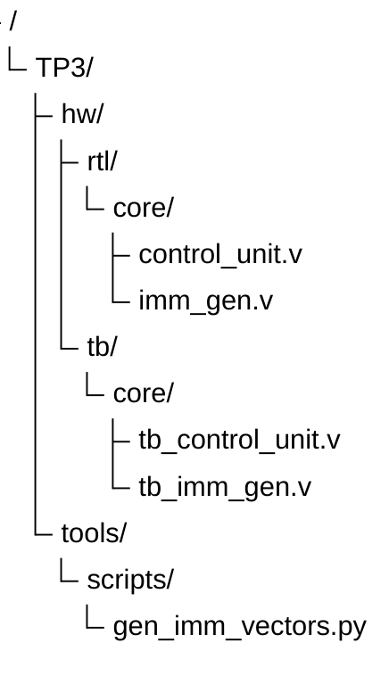
```mermaid
treeView-beta
    "TP3/"
        "hw/"
            "rtl/"
                "core/"
                    "control_unit.v"
                    "imm_gen.v"
            "tb/"
                "core/"
                    "tb_control_unit.v"
                    "tb_imm_gen.v"
        "tools/"
            "scripts/"
                "gen_imm_vectors.py"
```

#### US-204 — Memorias de Instrucciones y Datos (LUTRAM) con Bitmap de Memoria Usada

- **Esfuerzo:** S (2 días) · **Prioridad:** Urgente (bloqueante) · **Dependencias:** US-103, ADR-005, ADR-008, ADR-009
- **Objetivo Funcional:** proveer memoria de programa escribible desde la Debug Unit y memoria de datos con escritura por byte, observable y limpiable por la Debug Unit, que registre qué palabras usó el programa.
- **Narrativa:** Como procesador, necesito memorias separadas de instrucciones y datos para no tener riesgos estructurales, y como Debug Unit necesito poder cargarlas, limpiarlas y leer qué palabras usó el programa.
- **Detalle técnico (memoria distribuida inferida, ADR-005):**
  - **`hw/rtl/core/instr_mem.v`:** arreglo `reg [31:0] mem [0:IMEM_WORDS-1]` (256 por defecto). Lectura **combinacional** para IF (`instr = mem[pc[ADDR_BITS+1:2]]`); escritura sincrónica por el puerto de la Debug Unit (`i_we`, `i_addr`, `i_wdata`). Inicialización opcional con `$readmemh` solo para simulación.
  - **`hw/rtl/core/data_mem.v`:** palabras de 32 bits con **write enable por byte** (`i_be[3:0]`).
    - Lectura combinacional para el núcleo y un segundo puerto de lectura combinacional para la Debug Unit (Vivado replica la memoria).
    - Un único puerto de escritura con **mux**: núcleo (`mem_write && valid && i_enable`) o Debug Unit (limpieza, escribe ceros). La Debug Unit solo escribe con el núcleo detenido.
    - **Bitmap `used_bitmap[DMEM_WORDS-1:0]`** (flip-flops) + **contador `used_count`**: un store del núcleo pone en 1 el bit de la palabra y, si el bit pasaba de 0 a 1, incrementa el contador. Las escrituras de limpieza de la Debug Unit **no** marcan el bitmap. `i_clear_used` pone bitmap y contador en 0 (ADR-008/009).
    - Salidas de depuración: `o_dbg_data`, `o_dbg_used` (bit de la dirección pedida), `o_used_count`.
- **Criterios de Aceptación:**
  - **AC1.** IF obtiene la instrucción en el mismo ciclo en que presenta el PC (lectura combinacional); con `i_enable = 0` la salida no cambia porque el PC no cambia.
  - **AC2.** Un store del núcleo con `i_enable = 0` o `valid = 0` no escribe la memoria ni marca el bitmap.
  - **AC3.** El bitmap marca exactamente las palabras escritas por el núcleo; escribir dos veces la misma palabra incrementa el contador una sola vez; `i_clear_used` limpia ambos.
  - **AC4.** La limpieza por el puerto de la Debug Unit deja la DMEM en cero sin marcar el bitmap.
  - **AC5.** La Debug Unit puede escribir la IMEM y leer cualquier palabra de la DMEM mientras el núcleo está congelado.
  - **AC6.** El reporte de síntesis confirma que ambas memorias se implementaron como LUTRAM (memoria distribuida) y se anota cuántos LUTs ocupan (lo usa US-603).
- **Testing Mínimo:** `tb_instr_mem.v` (escritura por la Debug Unit, lectura combinacional), `tb_data_mem.v` (AC2–AC5).
- **Archivos a crear:**

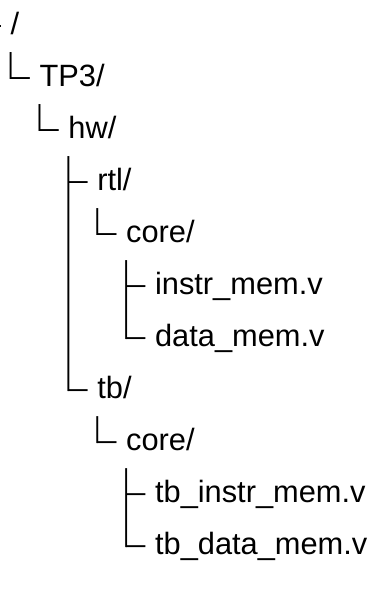
```mermaid
treeView-beta
    "TP3/"
        "hw/"
            "rtl/"
                "core/"
                    "instr_mem.v"
                    "data_mem.v"
            "tb/"
                "core/"
                    "tb_instr_mem.v"
                    "tb_data_mem.v"
```

#### US-210 — Alineación de Stores y Extensión de Loads (Byte y Media Palabra)

- **Esfuerzo:** S (2 días) · **Prioridad:** Urgente (bloqueante) · **Dependencias:** US-204, ADR-018
- **Objetivo Funcional:** soportar `lb/lh/lw/lbu/lhu/sb/sh/sw` sobre la DMEM de palabras, con little-endian y el tratamiento de desalineados de ADR-018.
- **Narrativa:** Como procesador, necesito leer y escribir bytes y medias palabras en la posición correcta de cada palabra, para ejecutar loads y stores de cualquier tamaño.
- **Detalle técnico:**
  - **`hw/rtl/core/store_align.v`:** a partir de `funct3` y `addr[1:0]` genera `be[3:0]` y el dato replicado en la posición correcta (`sb` en offset 2 → `be = 0100`, dato en `[23:16]`).
  - **`hw/rtl/core/load_extend.v`:** a partir de `funct3` y `addr[1:0]` selecciona el byte/media palabra de la palabra leída y extiende con signo (`lb`, `lh`) o con cero (`lbu`, `lhu`).
  - **Desalineados (ADR-018):** `lw`/`sw` ignoran `addr[1:0]`; `lh`/`lhu`/`sh` ignoran `addr[0]`. Sin señal de error.
- **Criterios de Aceptación:**
  - **AC1.** `sb` en cada uno de los 4 offsets modifica solo ese byte; `sh` en offsets 0 y 2 modifica solo esa media palabra.
  - **AC2.** `lb` de `0x80` da `0xFFFFFF80`; `lbu` da `0x00000080`; `lh` de `0x8000` da `0xFFFF8000`; `lhu` da `0x00008000`.
  - **AC3.** Little-endian: `sw 0x11223344` en la dirección 0 y luego `lbu` de la dirección 0 da `0x44`.
  - **AC4.** `lw` en la dirección 2 devuelve la palabra de la dirección 0; `lh` en la dirección 3 devuelve la media palabra de la dirección 2.
  - **AC5.** Las 16 combinaciones tamaño × offset × signo están cubiertas (sección 11.2).
- **Testing Mínimo:** `tb_load_store_align.v` conectado a `data_mem` (AC1–AC5).
- **Archivos a crear:**

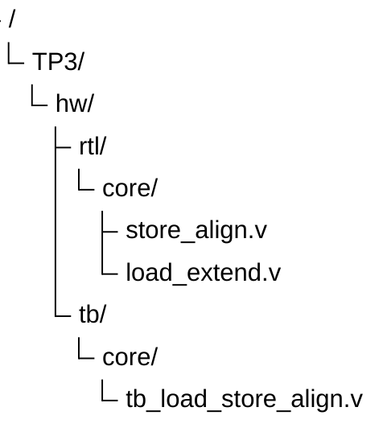
```mermaid
treeView-beta
    "TP3/"
        "hw/"
            "rtl/"
                "core/"
                    "store_align.v"
                    "load_extend.v"
            "tb/"
                "core/"
                    "tb_load_store_align.v"
```

### Épica H2-E2: Etapas, Latches e Integración del Núcleo

#### US-205 — Etapa IF, Registro PC y Latch IF/ID

- **Esfuerzo:** S (2,5 días) · **Prioridad:** Urgente (bloqueante) · **Dependencias:** US-204, ADR-006
- **Objetivo Funcional:** buscar una instrucción por ciclo, calcular el PC siguiente, aplicar las redirecciones y el flush básico de los saltos, y dejar el lugar preparado para stall y HALT.
- **Narrativa:** Como procesador, necesito buscar la instrucción apuntada por el PC y avanzar al siguiente, pudiendo congelarme o redirigirme cuando otra etapa lo pida.
- **Detalle técnico:**
  - **`hw/rtl/core/if_stage.v`:** registro `pc` (reset a 0, actualiza solo con `i_enable && !i_stall && !i_halt_fetch`); mux de próximo PC con prioridad (ADR-006): redirección de EX (branch tomado/`jalr`) > redirección de ID (`jal`) > `pc + 4`. Una redirección desde EX también vale con `i_halt_fetch = 1` (el HALT era especulativo; el caso completo se prueba en US-303). La IMEM se lee de forma combinacional (ADR-005), así que no hay alineación especial del PC.
  - **`hw/rtl/core/if_id_reg.v`:** campos `pc`, `pc_plus4`, `instr`, `valid`. Con `i_flush` → `valid = 0` e `instr = NOP`. Con `i_stall` → mantiene. Todo condicionado a `i_enable`.
  - **Flush básico (este hito):** `flush_if_id = redirect_ex || redirect_id_jal`. La señal `i_stall` queda prevista (siempre 0) hasta US-302.
- **Criterios de Aceptación:**
  - **AC1.** Sin stalls ni saltos, IF/ID recibe las instrucciones de las direcciones 0, 4, 8, … en ciclos consecutivos.
  - **AC2.** Con `i_stall = 1`, PC e IF/ID mantienen su valor.
  - **AC3.** Con `i_flush = 1`, IF/ID queda con `valid = 0` en el ciclo siguiente.
  - **AC4.** Con `i_enable = 0` nada cambia, durante cualquier cantidad de ciclos.
  - **AC5.** Con una redirección, la próxima instrucción buscada es la del destino y la instrucción que estaba en IF queda como burbuja en IF/ID.
  - **AC6.** Si en el mismo ciclo hay redirección de EX y de ID, gana la de EX.
- **Testing Mínimo:** `tb_if_stage.v` con la IMEM precargada.
- **Archivos a crear:**

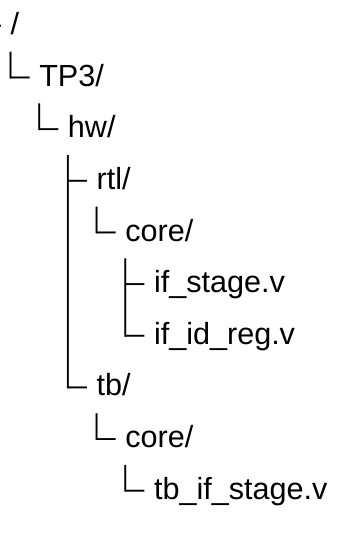
```mermaid
treeView-beta
    "TP3/"
        "hw/"
            "rtl/"
                "core/"
                    "if_stage.v"
                    "if_id_reg.v"
            "tb/"
                "core/"
                    "tb_if_stage.v"
```

#### US-206 — Etapa ID y Latch ID/EX

- **Esfuerzo:** S (1,5 días) · **Prioridad:** Urgente (bloqueante) · **Dependencias:** US-202, US-203, US-205
- **Objetivo Funcional:** decodificar la instrucción, leer registros, generar el inmediato y empaquetar todo en ID/EX; resolver `jal`; detectar HALT e instrucciones ilegales.
- **Narrativa:** Como procesador, necesito decodificar la instrucción de IF/ID y pasar a EX todo lo que necesita, incluyendo sus señales de control.
- **Detalle técnico:**
  - **`hw/rtl/core/id_stage.v`:** instancia `control_unit`, `imm_gen` y los puertos de lectura de `reg_file`; extrae `rs1`, `rs2`, `rd`, `funct3`, `funct7_b5`; calcula el destino de `jal` (`pc + imm_J`) con un sumador propio y genera `o_redirect_jal` (ADR-006); genera `o_halt_detected` para HALT **o** ilegal (solo si `valid`), que activa `halt_fetch`.
  - **`hw/rtl/core/id_ex_reg.v`:** campos de la sección 3.2 (incluidos `halt` e `illegal`). Con `i_bubble` (stall de load-use, Hito 3) o `i_flush` → `valid = 0` y controles de escritura en 0.
- **Criterios de Aceptación:**
  - **AC1.** Para cada tipo de instrucción, ID/EX contiene los operandos, el inmediato y las señales correctas en el ciclo siguiente.
  - **AC2.** Una instrucción con `valid = 0` en IF/ID produce `valid = 0` y controles en 0 en ID/EX.
  - **AC3.** `o_halt_detected` se activa solo para HALT o ilegal con `valid = 1`; en el caso ilegal, ID/EX lleva `illegal = 1`.
  - **AC4.** Un `jal` en ID genera `o_redirect_jal` con el destino correcto (offsets positivos y negativos) en el mismo ciclo.
- **Testing Mínimo:** `tb_id_stage.v`.
- **Archivos a crear:**

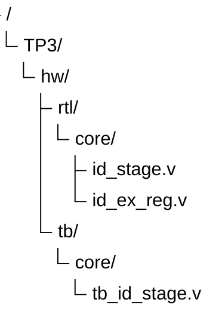
```mermaid
treeView-beta
    "TP3/"
        "hw/"
            "rtl/"
                "core/"
                    "id_stage.v"
                    "id_ex_reg.v"
            "tb/"
                "core/"
                    "tb_id_stage.v"
```

#### US-207 — Etapa EX y Latch EX/MEM

- **Esfuerzo:** S (2,5 días) · **Prioridad:** Urgente (bloqueante) · **Dependencias:** US-201, US-206, ADR-006, ADR-019
- **Objetivo Funcional:** ejecutar la operación, evaluar branches con el comparador dedicado, calcular destinos de salto, hacer el flush básico y dejar preparados los multiplexores de forwarding.
- **Narrativa:** Como procesador, necesito calcular el resultado de la instrucción y decidir si un branch se toma, para actualizar el flujo del programa.
- **Detalle técnico:**
  - **`hw/rtl/core/ex_stage.v`:**
    - Muxes de forwarding de 3 entradas para operando A y B (valor de ID/EX, EX/MEM, MEM/WB), con selectores `i_fwd_a`, `i_fwd_b` (en este hito siempre `00`).
    - Mux `alu_src` (registro / inmediato).
    - Instancia `alu` y `alu_control`.
    - **`branch_cmp.v`** (ADR-019): `eq = (op_a == op_b)` sobre los operandos ya forwardeados, en paralelo con la ALU. `branch_taken = valid && branch && (funct3 == BEQ ? eq : !eq)`.
    - Destinos: `pc + imm` (branch, sumador propio) y `(alu_result) & ~1` (`jalr`, la ALU calcula `rs1 + imm`). Salidas `o_redirect`, `o_redirect_pc`.
    - **Flush básico:** `o_redirect` (branch tomado o `jalr` válido) provoca flush de IF/ID e ID/EX (penalidad 2, ADR-006).
  - **`hw/rtl/core/ex_mem_reg.v`:** campos de la sección 3.2; `store_data` es el **rs2 ya forwardeado**.
- **Criterios de Aceptación:**
  - **AC1.** Resultados correctos de la ALU para R, I, load/store (dirección), `lui`.
  - **AC2.** `beq`/`bne` tomados y no tomados generan `o_redirect` correcto; el destino es correcto con offsets positivos y negativos.
  - **AC3.** `jalr` limpia el bit 0 del destino.
  - **AC4.** `store_data` toma el valor forwardeado cuando `i_fwd_b ≠ 00` (preparado para el Hito 3).
  - **AC5.** Un branch con `valid = 0` (burbuja) nunca redirige.
- **Testing Mínimo:** `tb_ex_stage.v`, `tb_branch_cmp.v`.
- **Archivos a crear:**

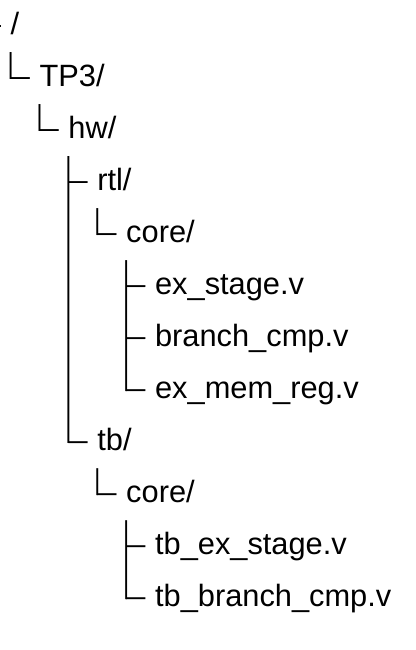
```mermaid
treeView-beta
    "TP3/"
        "hw/"
            "rtl/"
                "core/"
                    "ex_stage.v"
                    "branch_cmp.v"
                    "ex_mem_reg.v"
            "tb/"
                "core/"
                    "tb_ex_stage.v"
                    "tb_branch_cmp.v"
```

#### US-208 — Etapas MEM y WB, y Latch MEM/WB

- **Esfuerzo:** S (1,5 días) · **Prioridad:** Urgente (bloqueante) · **Dependencias:** US-204, US-207, US-210
- **Objetivo Funcional:** acceder a la memoria de datos y escribir el resultado final en el banco de registros.
- **Narrativa:** Como procesador, necesito leer o escribir la memoria de datos y luego elegir qué valor se escribe en el registro destino (ALU, memoria o PC+4).
- **Detalle técnico:**
  - **`hw/rtl/core/mem_stage.v`:** conecta `store_align`, `data_mem` (puerto del núcleo) y `load_extend`. Escritura solo si `valid && mem_write && i_enable`.
  - **`hw/rtl/core/mem_wb_reg.v`:** campos de la sección 3.2.
  - **`hw/rtl/core/wb_stage.v`:** mux `result_src`: `00` ALU, `01` memoria, `10` PC+4 (`jal`/`jalr`). Genera `o_wb_we = valid && reg_write`, `o_wb_rd`, `o_wb_data` hacia `reg_file` y hacia la forwarding unit. Genera `o_halt_retired` cuando llega un HALT válido a WB, junto con `o_illegal_retired` si además tiene `illegal = 1`.
  - La DMEM se lee de forma combinacional (ADR-005): el dato leído en MEM entra directamente a MEM/WB.
- **Criterios de Aceptación:**
  - **AC1.** Un `lw` escribe en `rd` el dato de memoria; un `add` el de la ALU; un `jal` el `pc + 4`.
  - **AC2.** Un store nunca escribe en el banco de registros.
  - **AC3.** `o_halt_retired` se activa exactamente un ciclo, cuando el HALT (o la ilegal) está en WB; `o_illegal_retired` distingue los dos casos.
- **Testing Mínimo:** `tb_mem_wb.v`.
- **Archivos a crear:**

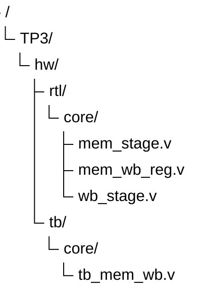
```mermaid
treeView-beta
    "TP3/"
        "hw/"
            "rtl/"
                "core/"
                    "mem_stage.v"
                    "mem_wb_reg.v"
                    "wb_stage.v"
            "tb/"
                "core/"
                    "tb_mem_wb.v"
```

#### US-209 — Integración del Núcleo, HALT y Drenado del Pipeline

- **Esfuerzo:** M (5 días) · **Prioridad:** Urgente (bloqueante) · **Dependencias:** US-205 a US-208, US-210, US-108, US-107
- **Objetivo Funcional:** unir todas las etapas en `riscv_core`, con la interfaz de US-103, y demostrar la ejecución correcta de programas sin dependencias de datos cercanas (incluidos saltos tomados, gracias al flush básico), terminando con el pipeline vacío.
- **Narrativa:** Como equipo, queremos correr un programa ensamblado en la simulación del núcleo completo y ver que el estado final coincide con el golden model, para tener la base funcional antes de agregar riesgos.
- **Detalle técnico:**
  - **`hw/rtl/core/riscv_core.v`:** instancia etapas, latches, `reg_file`, memorias; expone la interfaz de `docs/interfaces/riscv_core.md` (enable, flush global, puertos de depuración, latches como buses planos, `o_halted`).
  - **Lógica de HALT** (R-EJ-3 a R-EJ-5, R-EJ-4bis): al detectar HALT o ilegal en ID se activa `halt_fetch` (PC congelado, burbujas en IF/ID); cuando `o_halt_retired`, se levantan `o_halted` (y `o_illegal` si correspondía) y el núcleo ignora `i_enable` hasta un reset o `i_flush_all`.
  - **`i_flush_all`:** pone los 4 latches en `valid = 0`, el PC en 0 y el banco de registros en 0 (usado por la Debug Unit en ADR-009).
  - **Testbench de sistema `tb_core_programs.v`:** carga un `.hex` con `$readmemh`, corre hasta `o_halted` o un límite de ciclos, y compara los registros, la memoria usada y el motivo de terminación contra un archivo `.expected` generado por `rvsim --expect` (US-107). Corre en xsim y en Icarus (ADR-015).
  - **Programas de este hito** (`asm/tests/h2/`): uno por grupo de instrucciones (R, I aritméticas, shifts, loads/stores, `lui`, branches, `jal`/`jalr`), **con 3 NOPs entre instrucciones con dependencia de datos** (porque todavía no hay forwarding). Los saltos no necesitan NOPs: el flush básico descarta las instrucciones buscadas de más.
- **Criterios de Aceptación:**
  - **AC1.** Todos los programas de `asm/tests/h2/` terminan con registros y memoria idénticos al golden model.
  - **AC2.** Al activarse `o_halted`, los 4 latches tienen `valid = 0` (pipeline vacío).
  - **AC3.** Instrucciones posteriores al HALT en la memoria nunca llegan a EX.
  - **AC3b.** En `branches.asm` y `jumps.asm`, las instrucciones que siguen a un salto tomado nunca escriben registros ni memoria.
  - **AC3c.** Un programa que ejecuta una palabra ilegal termina con `o_illegal = 1`, pipeline vacío y el mismo estado que el golden model.
  - **AC4.** Con `i_enable` alternando aleatoriamente entre 0 y 1 durante la ejecución, el estado final es el mismo que con `i_enable = 1` fijo (prueba temprana de R-EJ-7).
  - **AC5.** El núcleo sintetiza e implementa a 100 MHz (primer dato de timing, sin optimizar); WNS/WHS se guardan en `hw/reports/` para seguir su evolución (ADR-016).
- **Reglas de Negocio:** R-EJ-2 a R-EJ-7.
- **Testing Mínimo:** `tb_core_programs.v` parametrizado por programa; `make sim-programs` corre toda la carpeta.
- **Archivos a crear:**

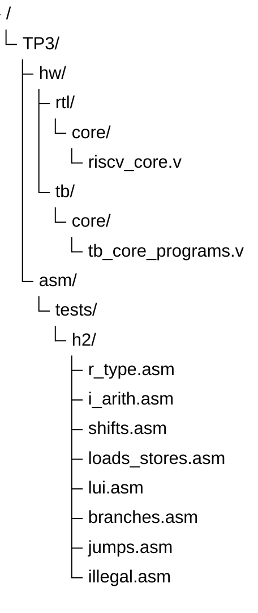
```mermaid
treeView-beta
    "TP3/"
        "hw/"
            "rtl/"
                "core/"
                    "riscv_core.v"
            "tb/"
                "core/"
                    "tb_core_programs.v"
        "asm/"
            "tests/"
                "h2/"
                    "r_type.asm"
                    "i_arith.asm"
                    "shifts.asm"
                    "loads_stores.asm"
                    "lui.asm"
                    "branches.asm"
                    "jumps.asm"
                    "illegal.asm"
```

---

### Hito 3 — Manejo de Riesgos y Verificación (v0.3)

**Objetivo del hito:** que el procesador ejecute correctamente cualquier programa, sin NOPs manuales, resolviendo riesgos de datos (forwarding y stall) y los casos combinados de control en hardware, y contar con una suite de programas de prueba que lo demuestre automáticamente contra el golden model.

**Épicas:** 2 · **Historias:** 5 · **Esfuerzo total estimado:** ~13 días·persona

**Decisiones previas requeridas:** ADR-006, ADR-007, ADR-014, ADR-018 (aprobadas).

### Épica H3-E1: Unidades de Riesgo

#### US-301 — Unidad de Forwarding

- **Esfuerzo:** M (3 días) · **Prioridad:** Urgente (bloqueante) · **Dependencias:** US-209, ADR-007
- **Objetivo Funcional:** eliminar los stalls por dependencias de datos entre instrucciones aritméticas consecutivas.
- **Narrativa:** Como procesador, quiero usar el resultado de una instrucción anterior apenas está calculado, sin esperar a que se escriba en el banco de registros.
- **Detalle técnico (`hw/rtl/core/forwarding_unit.v`, combinacional):**
  - Entradas: `id_ex_rs1`, `id_ex_rs2`, `ex_mem_rd`, `ex_mem_reg_write`, `ex_mem_valid`, `mem_wb_rd`, `mem_wb_reg_write`, `mem_wb_valid`.
  - Salidas `fwd_a`, `fwd_b`: `10` = desde EX/MEM, `01` = desde MEM/WB, `00` = sin forwarding.
  - Prioridad a EX/MEM (el dato más reciente) cuando ambos coinciden.
  - Nunca reenvía si `rd == 0` o si la instrucción productora no es válida.
  - El valor reenviado desde MEM/WB es el **resultado final de WB** (incluye dato de load y `pc + 4`).
  - Los operandos forwardeados alimentan la ALU, `store_data` **y** `branch_cmp` (ADR-006, ADR-019).
- **Criterios de Aceptación:**
  - **AC1.** `add x1,…` seguido de `sub x2,x1,…` → `fwd_a = 10`.
  - **AC2.** Productor a 2 instrucciones de distancia → `fwd = 01`.
  - **AC3.** Doble coincidencia (EX/MEM y MEM/WB escriben el mismo `rd`) → gana EX/MEM.
  - **AC4.** `rd = x0` nunca genera forwarding.
  - **AC5.** Forwarding sobre `rs2` de un store (`add x5,…` seguido de `sw x5, 0(x6)`) guarda el valor nuevo.
  - **AC6.** Forwarding del resultado de `jal` (`pc + 4`) hacia una instrucción que usa `ra`.
  - **AC7.** `addi x1,…` seguido de `beq x1, x2, …` compara con el valor nuevo de `x1` (forwarding hacia `branch_cmp`).
- **Testing Mínimo:** `tb_forwarding_unit.v` (vectores de AC1–AC4) + programas de US-304.
- **Archivos a crear:**

```mermaid
treeView-beta
    "TP3/"
        "hw/"
            "rtl/"
                "core/"
                    "forwarding_unit.v"
            "tb/"
                "core/"
                    "tb_forwarding_unit.v"
```

#### US-302 — Detección de Load-Use y Stall

- **Esfuerzo:** S (2 días) · **Prioridad:** Urgente (bloqueante) · **Dependencias:** US-301, US-203 (`uses_rs1`/`uses_rs2`)
- **Objetivo Funcional:** frenar el pipeline exactamente un ciclo cuando una instrucción usa el dato de un load inmediatamente anterior, el único caso que el forwarding no resuelve.
- **Narrativa:** Como procesador, necesito esperar un ciclo cuando el dato que necesito todavía está saliendo de la memoria, para no usar un valor viejo.
- **Detalle técnico (`hw/rtl/core/hazard_unit.v`):**
  - Condición: `id_ex_valid && id_ex_mem_read && id_ex_rd != 0 && ((uses_rs1 && id_ex_rd == if_id_rs1) || (uses_rs2 && id_ex_rd == if_id_rs2))`, con `uses_rs1`/`uses_rs2` de `control_unit` (US-203): `lui` y `jal` no generan stall falso.
  - Acción: `stall` → PC e IF/ID se mantienen; `bubble` → ID/EX recibe una burbuja. Solo actúa con `i_enable = 1` (ADR-001).
  - Exponer `o_stall` hacia afuera del núcleo para el volcado (ADR-017).
- **Criterios de Aceptación:**
  - **AC1.** `lw x1,0(x2)` + `add x3,x1,x4` → exactamente 1 ciclo de stall y resultado correcto.
  - **AC2.** `lw x1,…` + instrucción independiente + `add x3,x1,…` → 0 stalls (lo resuelve el forwarding desde MEM/WB).
  - **AC3.** `lw x1,…` + `lui x1,…` → 0 stalls (no hay lectura de `x1`).
  - **AC4.** `lw x1,…` + `sw x1,…` (el dato cargado se guarda) → exactamente 1 stall y resultado correcto (no hay forwarding MEM→MEM, ADR-007).
  - **AC5.** `lw x0,…` + uso de `x0` → 0 stalls.
- **Testing Mínimo:** `tb_hazard_unit.v` + programas de US-304.
- **Archivos a crear:**

```mermaid
treeView-beta
    "TP3/"
        "hw/"
            "rtl/"
                "core/"
                    "hazard_unit.v"
            "tb/"
                "core/"
                    "tb_hazard_unit.v"
```

#### US-303 — Riesgos de Control: Flush en Branches y Saltos

- **Esfuerzo:** S (2,5 días) · **Prioridad:** Urgente (bloqueante) · **Dependencias:** US-301, US-302, ADR-006, ADR-018
- **Objetivo Funcional:** completar el manejo de riesgos de control sobre el flush básico del Hito 2: prioridades entre eventos simultáneos e interacción con HALT, ilegales especulativas y stalls.
- **Narrativa:** Como procesador, necesito anular las instrucciones que entraron al pipeline por error después de un salto, para que nunca modifiquen el estado.
- **Detalle técnico:**
  - Se mueve la generación de `flush_if_id` y `flush_id_ex` (hecha en el Hito 2 dentro de las etapas) a `hazard_unit.v`, junto con el stall, para tener toda la lógica de prioridad en un solo lugar: branch tomado / `jalr` en EX → flush de IF/ID e ID/EX (penalidad 2); `jal` en ID → flush de IF/ID (penalidad 1).
  - **Prioridades cuando coinciden eventos en el mismo ciclo** (ADR-006): redirección de EX > `jal` en ID > stall de load-use > HALT/ilegal detectado en ID. Una redirección desde EX anula cualquier stall o redirección originada en ID (la instrucción de ID era especulativa).
  - **HALT e ilegal especulativos** (R-EJ-4, R-EJ-4bis): si están en IF/ID o ID/EX cuando EX redirige, se descartan y `halt_fetch` se desactiva.
  - Exponer `o_flush_if_id` y `o_flush_id_ex` para el volcado (ADR-017).
- **Criterios de Aceptación:**
  - **AC1.** `beq` tomado: las 2 instrucciones siguientes en memoria nunca escriben registros ni memoria.
  - **AC2.** `beq` no tomado: 0 ciclos de penalidad.
  - **AC3.** Loop con contador (`addi` + `bne` hacia atrás) ejecuta la cantidad exacta de iteraciones.
  - **AC4.** `jal` guarda `pc + 4` y salta; `jalr` a una dirección calculada (retorno de subrutina con `ret`).
  - **AC5.** Branch que depende del resultado de un `lw` inmediatamente anterior: stall + comparación correcta.
  - **AC6.** HALT ubicado inmediatamente después de un `beq` tomado **no** detiene la ejecución.
  - **AC7.** Branch tomado mientras hay un stall de load-use en ID: el comportamiento es correcto (gana el flush).
  - **AC8.** `jal` en ID y branch tomado en EX en el mismo ciclo: gana el branch y el `jal` se descarta.
  - **AC9.** Una palabra ilegal ubicada inmediatamente después de un `beq` tomado **no** detiene la ejecución.
- **Testing Mínimo:** programas de US-304 (grupo control).
- **Archivos a crear:**

```mermaid
treeView-beta
    "TP3/"
        "hw/"
            "rtl/"
                "core/"
                    "hazard_unit.v — (extensión)"
                    "riscv_core.v — (conexión de flush/stall)"
```

### Épica H3-E2: Suite de Programas y Verificación Cruzada

#### US-304 — Suite de Programas de Prueba en Assembly

- **Esfuerzo:** M (3 días) · **Prioridad:** Alta · **Dependencias:** US-106, US-107
- **Objetivo Funcional:** cumplir el requisito "el programa debe estar escrito en ensamblador" con un conjunto de programas que cubra todas las instrucciones, todos los riesgos y sirva de demostración.
- **Narrativa:** Como equipo, queremos programas que se autoverifiquen, para demostrar en la defensa que cada instrucción y cada riesgo funcionan.
- **Detalle técnico (`asm/`):**
  - **`asm/tests/instr/`:** un programa por instrucción o familia, con casos borde (los de US-201 y US-204) y firma en memoria (convención en `asm/README.md`, ADR-014).
  - **`asm/tests/hazards/`:** `fwd_ex_mem.asm`, `fwd_mem_wb.asm`, `fwd_doble.asm`, `fwd_store_data.asm`, `fwd_branch.asm`, `load_use.asm`, `load_use_store.asm`, `x0_no_forward.asm`, `branch_taken.asm`, `branch_not_taken.asm`, `branch_after_load.asm`, `jal_jalr.asm`, `jal_branch_same_cycle.asm`, `halt_after_branch.asm`, `halt_speculative.asm`, `illegal_speculative.asm`.
  - **`asm/tests/instr/`** incluye además `misaligned.asm` (ADR-018: el resultado es el de la dirección alineada).
  - **`asm/demos/`:** programas "lindos" para la defensa: suma de un arreglo, Fibonacci iterativo, copia de cadena byte a byte (`lbu`/`sb`), ordenamiento burbuja de 8 números, subrutina con `jal`/`ret`.
  - **`asm/special/`:** `no_halt.asm` (sin HALT), `infinite_loop.asm` (para ADR-010), `illegal.asm` (termina con `ILLEGAL`, ADR-018).
  - **Firma (ADR-014):** cada programa de `tests/` escribe en `0x3FC` (última palabra de la DMEM) `0x00000001` si todos sus chequeos pasan, o el número del caso que falló. La convención se documenta en `asm/README.md` y ningún programa usa esa dirección para otra cosa.
  - Cada archivo con un encabezado de comentario: qué prueba y valores esperados. La cantidad de ciclos no se escribe a mano: la mide US-305.
- **Criterios de Aceptación:**
  - **AC1.** Las 33 instrucciones aparecen en al menos un programa de `asm/tests/instr/`.
  - **AC2.** Todos los casos de riesgo de la métrica "Cobertura de riesgos" (sección 1.4) tienen un programa.
  - **AC3.** Cada programa de `tests/` escribe su firma de éxito/falla en `0x3FC`.
  - **AC4.** Todos ensamblan sin errores y pasan en el golden model.
- **Testing Mínimo:** `tools/tests/test_asm_suite.py` ensambla y corre toda la carpeta en el golden model.
- **Archivos a crear:**

```mermaid
treeView-beta
    "TP3/"
        "asm/"
            "README.md — (convención de firma y dirección de resultado)"
            "tests/"
                "instr/"
                    "*.asm"
                "hazards/"
                    "*.asm"
            "demos/"
                "*.asm"
            "special/"
                "*.asm"
```

#### US-305 — Verificación Cruzada Automática Núcleo vs. Golden Model

- **Esfuerzo:** S (2 días) · **Prioridad:** Alta · **Dependencias:** US-107, US-209, US-301 a US-304
- **Objetivo Funcional:** correr toda la suite en simulación del RTL y comparar automáticamente con el golden model, reportando además la cantidad de ciclos (para calcular CPI en el informe).
- **Narrativa:** Como equipo, queremos un único comando que nos diga si el procesador pasa todos los programas, para detectar regresiones cada vez que tocamos el hardware.
- **Detalle técnico:**
  - **`tools/scripts/verify_rtl.py`:** para cada `.asm` → ensambla, genera `.expected` con el golden model, corre `tb_core_programs` en el simulador elegido (`--sim xsim|icarus`, ADR-015), parsea el volcado final del testbench y compara registros, memoria usada, firma y motivo de terminación; reporta tabla `programa | resultado | ciclos | instrucciones | CPI | stalls | flushes`.
  - El testbench cuenta stalls y flushes observando las señales expuestas.
  - Objetivo `make verify` (`SIM=xsim` por defecto); el CI corre `make verify SIM=icarus`.
- **Criterios de Aceptación:**
  - **AC1.** `make verify` corre toda la suite y termina con código ≠ 0 si algún programa falla.
  - **AC2.** Ante una diferencia, muestra qué registro/dirección difiere, con valor esperado y obtenido.
  - **AC3.** La tabla de ciclos/CPI se guarda en `docs/informe/datos/cpi.csv` para usar en el informe.
  - **AC4.** 100 % de la suite pasa al cerrar el hito.
- **Testing Mínimo:** el propio script sobre la suite; una prueba negativa (romper a propósito el forwarding) debe hacer fallar programas de `hazards/`.
- **Archivos a crear:**

```mermaid
treeView-beta
    "tps-arqui/"
        "TP3/"
            "tools/"
                "scripts/"
                    "verify_rtl.py"
        "docs/"
            "informe/"
                "datos/"
                    "cpi.csv"
```

---

### Hito 4 — Debug Unit y Control por UART (v0.4)

**Objetivo del hito:** reemplazar `uart_interface` por una Debug Unit que permita cargar programas, ejecutarlos en modo continuo o paso a paso y volcar el estado completo a la PC, todo por UART y sin resintetizar, y construir el software de control de la PC (codec, sesión y CLI). Al final del hito, el procesador funciona **en la placa** controlado por la CLI.

**Épicas:** 4 · **Historias:** 11 · **Esfuerzo total estimado:** ~25 días·persona

**Decisiones previas requeridas:** ADR-002, ADR-003, ADR-008, ADR-009, ADR-010, ADR-011, ADR-014, ADR-017, ADR-018 (aprobadas). US-104 cerrada.

**Nota de paralelismo:** US-401 a US-406 y US-409 se desarrollan contra un **núcleo stub** (US-408). US-410/411 se desarrollan contra `FakeTransport`. Así la pista B no espera al Hito 3.

### Épica H4-E1: Comunicación y Recepción de Comandos

#### US-401 — Adaptación de la UART del TP2 y Nuevo Top

- **Esfuerzo:** S (1,5 días) · **Prioridad:** Urgente (bloqueante) · **Dependencias:** US-101, ADR-002
- **Objetivo Funcional:** reutilizar la UART del TP2 a 19200 bps 8E1 (ADR-002), con `COUNT_MAX` parametrizado, validación de paridad y las mejoras pendientes que el propio informe del TP2 identificó.
- **Narrativa:** Como equipo, queremos reutilizar la UART ya probada, independiente de la frecuencia del reloj y con el sincronizador bien restringido, para no reescribir algo que funciona.
- **Detalle técnico:**
  - **`baudrate_gen.v`:** `COUNT_MAX` pasa a calcularse desde los parámetros `CLK_FREQ_HZ` y `BAUD` en el `top` (`localparam COUNT_MAX = (CLK_FREQ_HZ + 8*BAUD) / (16*BAUD)`, redondeo), y el ancho `BITS` se deriva con `$clog2`.
  - **Validación de paridad en RX** (ADR-002): `uart_rx` expone `o_parity_err` comparando `p_reg` con `^b_reg`; el byte con error no se entrega como dato válido.
  - **Sincronizador:** atributo `(* ASYNC_REG = "TRUE" *)` en `r_rx_meta` y `r_rx_sync`, y `set_false_path -from [get_ports rx]` en el `.xdc` (mejoras señaladas en la sección 4.2.3 del informe del TP2).
  - **`hw/rtl/top.v` nuevo:** parámetros `CLK_FREQ_HZ` (100 MHz por defecto, ADR-016) y `BAUD` (19200); `clock`, `i_reset` (BTNC), `rx`, `tx`, LEDs de estado (ej. LED0 = `READY`, LED1 = `RUN`, LED2 = `HALTED`, LED3 = error de trama/paridad) e instancias de UART, Debug Unit y núcleo (stub o real).
- **Criterios de Aceptación:**
  - **AC1.** Loopback en placa a 19200 bps 8E1: la PC envía 1000 bytes aleatorios a un eco temporal y los recibe sin errores.
  - **AC2.** `COUNT_MAX` resultante produce un error de baud rate < 2 % (verificado en un comentario y en el testbench).
  - **AC3.** El reporte de _Check Timing_ ya no marca `rx` como entrada sin restricción.
  - **AC4.** Un byte con paridad errónea (inyectado en simulación) activa `o_parity_err`.
- **Testing Mínimo:** `tb_uart_loopback.v` con `COUNT_MAX` calculado y un caso de paridad errónea; prueba en placa con `tools/scripts/uart_echo_test.py`.
- **Archivos a crear:**

```mermaid
treeView-beta
    "TP3/"
        "hw/"
            "rtl/"
                "top.v — (nuevo)"
                "uart/"
                    "baudrate_gen.v — ⚠️ (TP2, se parametriza)"
                    "uart_rx.v — ⚠️ (TP2, se agrega o_parity_err)"
            "constraints/"
                "basys3.xdc — (false path + LEDs)"
        "tools/"
            "scripts/"
                "uart_echo_test.py"
```

#### US-408 — Infraestructura de Pruebas de la Pista B: Núcleo Stub y Modelo de UART de PC

- **Esfuerzo:** S (1 día) · **Prioridad:** Urgente (bloqueante) · **Dependencias:** US-102, US-103
- **Objetivo Funcional:** poder probar toda la Debug Unit en simulación sin depender del núcleo real ni de la placa.
- **Narrativa:** Como desarrollador de la pista B, quiero un núcleo falso con la misma interfaz que el real y un modelo de la PC en el testbench, para avanzar con la Debug Unit mientras la pista A termina el núcleo.
- **Detalle técnico:**
  - **`hw/tb/debug/core_stub.v`:** misma interfaz que `riscv_core` (US-103): registros y latches con valores conocidos (fijos o que cambian con un contador por cada ciclo con `i_enable = 1`), memoria de datos pequeña con bitmap y contador, `o_halted`/`o_illegal` programables por parámetro (por ejemplo, "terminar después de N ciclos"), y respuesta a `i_stop_fetch` y `i_flush_all`.
  - **`hw/tb/common/uart_host_model.vh`:** tareas `send_byte`, `recv_byte`, `send_cmd`, `recv_frame` (valida cabecera, longitud y checksum) a 19200 bps 8E1, con opción de inyectar un error de paridad o cortar una trama a la mitad.
- **Criterios de Aceptación:**
  - **AC1.** `core_stub` sintetiza y tiene exactamente los mismos puertos y anchos que `docs/interfaces/riscv_core.md`.
  - **AC2.** Un testbench de prueba manda un byte con `send_byte` a `uart_rx` y lo recibe con `recv_byte` desde `uart_tx` (loopback a través del modelo).
  - **AC3.** El modelo puede inyectar un byte con paridad errónea y una trama truncada.
- **Testing Mínimo:** `tb_uart_host_model.v`.
- **Archivos a crear:**

```mermaid
treeView-beta
    "TP3/"
        "hw/"
            "tb/"
                "debug/"
                    "core_stub.v"
                    "tb_uart_host_model.v"
                "common/"
                    "uart_host_model.vh"
```

#### US-402 — Intérprete de Comandos de la Debug Unit

- **Esfuerzo:** M (2,5 días) · **Prioridad:** Urgente (bloqueante) · **Dependencias:** US-104, US-401, US-408
- **Objetivo Funcional:** recibir bytes de la UART, reconocer comandos, validarlos según el estado actual y despachar la acción al submódulo correspondiente.
- **Narrativa:** Como usuario de la PC, quiero que la placa entienda mis comandos y me avise si uno no es válido en ese momento, para nunca dejarla en un estado incierto.
- **Detalle técnico:**
  - **`hw/rtl/debug/debug_unit.v`:** wrapper que instancia `du_cmd_fsm`, `du_loader`, `du_exec_ctrl`, `du_dumper` y un multiplexor de acceso a `uart_tx` (solo un submódulo transmite a la vez).
  - **`hw/rtl/debug/du_cmd_fsm.v`:** FSM con los estados de US-103 (`IDLE`, `LOADING`, `READY`, `RUN`, `STEPPING`, `DUMPING`, `HALTED`), separada en control/datapath como en el TP2.
    - Tabla de comandos válidos por estado (R-DU-1, incluidos `LOAD`/`RESET` en `STEPPING` y `DUMP_MEM`); comando inválido → `NACK(ERR_ESTADO)`.
    - Comando desconocido → `NACK(ERR_CMD)`.
    - **Error de paridad** (R-DU-5): `o_parity_err` de `uart_rx` aborta el comando en curso y responde `NACK(ERR_PARIDAD)`.
    - **Timeout de recepción** (R-DU-6): contador que, si se interrumpe una trama con argumentos, responde `NACK(ERR_TIMEOUT)`; si era un `LOAD` delega en `du_loader` el relleno con HALT y vuelve a `IDLE`, y en otro caso vuelve al estado anterior.
    - Durante `RUN`, sigue escuchando la UART para aceptar `ABORT`; cualquier otro comando responde `NACK(ERR_ESTADO)`.
  - **`hw/rtl/debug/du_tx_mux.v`** con handshake `i_tx_done`.
- **Criterios de Aceptación:**
  - **AC1.** `PING` responde `ACK` + versión en cualquier estado.
  - **AC2.** `STEP` en `IDLE` (sin programa cargado) responde `NACK(ERR_ESTADO)` y el estado no cambia.
  - **AC3.** Un byte desconocido responde `NACK(ERR_CMD)`.
  - **AC4.** Un `LOAD` interrumpido a la mitad responde `NACK(ERR_TIMEOUT)`, deja la IMEM rellena con HALT, vuelve a `IDLE` y el siguiente `PING` funciona.
  - **AC5.** Los ejemplos de bytes de `docs/protocolo.md` se reproducen exactamente en el testbench.
  - **AC6.** Un byte con paridad errónea en medio de un comando responde `NACK(ERR_PARIDAD)` y la Debug Unit sigue respondiendo.
- **Reglas de Negocio:** R-DU-1, R-DU-2, R-DU-5, R-DU-6.
- **Testing Mínimo:** `tb_du_cmd_fsm.v` con `uart_host_model.vh` y `core_stub` (US-408).
- **Archivos a crear:**

```mermaid
treeView-beta
    "TP3/"
        "hw/"
            "rtl/"
                "debug/"
                    "debug_unit.v"
                    "du_cmd_fsm.v"
                    "du_tx_mux.v"
            "tb/"
                "debug/"
                    "tb_du_cmd_fsm.v"
```

### Épica H4-E2: Carga y Ejecución

#### US-403 — Carga y Reprogramación Dinámica del Programa

- **Esfuerzo:** M (3 días) · **Prioridad:** Urgente (bloqueante) · **Dependencias:** US-402, US-204, ADR-009
- **Objetivo Funcional:** cumplir "la carga del programa debe llevarse a cabo a través de UART y sin resintetizar" y "permitir la reprogramación de manera dinámica", con la política de limpieza de ADR-009.
- **Narrativa:** Como usuario, quiero cargar un programa nuevo cuantas veces quiera sin tocar Vivado, y que cada ejecución arranque desde un estado limpio.
- **Detalle técnico (`hw/rtl/debug/du_loader.v`):**
  - Recibe `N` (2 bytes) y valida `N ≤ IMEM_WORDS` → si no, `NACK(ERR_TAMANO)`.
  - Arma palabras de 4 bytes little-endian y las escribe en la IMEM por el puerto de la Debug Unit; acumula el checksum XOR (ADR-003).
  - Al final: si el checksum no coincide → `NACK(ERR_CHECKSUM)`, **toda** la IMEM queda rellena con HALT y vuelve a `IDLE` (R-DU-4). Lo mismo ante un timeout (R-DU-6). Si coincide:
    1. rellena las posiciones `N..IMEM_WORDS-1` con HALT (ADR-009 d) y, en paralelo, escribe ceros en toda la DMEM por el puerto de depuración y activa `i_clear_used` (bitmap y contador);
    2. activa `i_flush_all` del núcleo (pipeline vacío, PC = 0, registros en 0) y pone el contador de ciclos en 0;
    3. responde `ACK` y pasa a `READY`.
  - `RESET` ejecuta la limpieza de DMEM y el paso 2 sin tocar la IMEM, y pasa a `READY` (o se queda en `IDLE` si no hay programa cargado). Tanto `LOAD` como `RESET` son válidos también desde `STEPPING` (ADR-010).
- **Criterios de Aceptación:**
  - **AC1.** Un programa cargado se ejecuta correctamente; cargando otro distinto a continuación, el segundo se ejecuta correctamente sin restos del primero (ni en registros, ni en memoria, ni en el pipeline).
  - **AC2.** Cargar un programa más corto que el anterior: las instrucciones viejas que quedaban después nunca se ejecutan (relleno con HALT).
  - **AC3.** Checksum incorrecto → `NACK` y no se puede ejecutar hasta una carga válida.
  - **AC4.** `RESET` + `RUN` del mismo programa da exactamente el mismo resultado que la primera ejecución.
  - **AC5.** Cinco cargas consecutivas de programas distintos, todas correctas (métrica de la sección 1.4).
  - **AC6.** `LOAD` en medio de una ejecución paso a paso (`STEPPING`) deja el sistema igual que una carga desde `IDLE`.
- **Reglas de Negocio:** R-RP-1, R-PR-3, R-DU-4, R-DU-6.
- **Testing Mínimo:** `tb_du_loader.v` (AC1–AC4 en simulación con el núcleo real cuando esté disponible).
- **Archivos a crear:**

```mermaid
treeView-beta
    "TP3/"
        "hw/"
            "rtl/"
                "debug/"
                    "du_loader.v"
            "tb/"
                "debug/"
                    "tb_du_loader.v"
```

#### US-404 — Modos de Ejecución Continuo y Paso a Paso

- **Esfuerzo:** M (3 días) · **Prioridad:** Urgente (bloqueante) · **Dependencias:** US-402, US-209, ADR-001
- **Objetivo Funcional:** cumplir los dos modos de operación del enunciado controlando el núcleo exclusivamente con `i_enable`.
- **Narrativa:** Como usuario, quiero ejecutar el programa completo con un comando o avanzar de a un ciclo de clock, viendo el estado en cada paso.
- **Detalle técnico (`hw/rtl/debug/du_exec_ctrl.v`):**
  - **`RUN`:** responde `ACK`, mantiene `i_enable = 1` hasta `o_halted` del núcleo (o `ABORT`, US-406); luego dispara el volcado (US-405) con el motivo de terminación (`HALTED` o `ILLEGAL` según `o_illegal`) y pasa a `HALTED`.
  - **`STEP`:** pulso de `i_enable` de **exactamente 1 ciclo** (R-EJ-2), luego volcado, y queda en `STEPPING`; si ese paso completó el HALT (o la ilegal), pasa a `HALTED`.
  - Contador de ciclos ejecutados (32 bits) incluido en el snapshot.
  - `i_enable` sale de un flip-flop (no de lógica combinacional), para facilitar el timing (ADR-001).
- **Criterios de Aceptación:**
  - **AC1.** Cada `STEP` avanza el contador de ciclos en exactamente 1 y el PC/latches cambian lo que corresponde a un ciclo.
  - **AC2.** El mismo programa ejecutado con `RUN` y con `STEP` repetido hasta `HALTED` termina con idéntico estado (R-EJ-7).
  - **AC3.** Al terminar en ambos modos, el snapshot final muestra los 4 latches con `valid = 0`.
  - **AC4.** El reloj no aparece en ninguna expresión lógica (verificado por revisión de código y por `report_clock_networks`: un único reloj, sin compuertas).
  - **AC5.** `STEP` en `HALTED` responde `NACK(ERR_ESTADO)`.
  - **AC6.** Un programa que termina en una instrucción ilegal envía el snapshot final con motivo `ILLEGAL` en ambos modos.
- **Reglas de Negocio:** R-EJ-1, R-EJ-2, R-EJ-4bis, R-EJ-5, R-EJ-7.
- **Testing Mínimo:** `tb_du_exec_ctrl.v` con el núcleo real y un programa de la suite, comparando `RUN` vs. `STEP`.
- **Archivos a crear:**

```mermaid
treeView-beta
    "TP3/"
        "hw/"
            "rtl/"
                "debug/"
                    "du_exec_ctrl.v"
            "tb/"
                "debug/"
                    "tb_du_exec_ctrl.v"
```

#### US-406 — Programas sin Instrucción de Parada y Comando ABORT

- **Esfuerzo:** S (1 día) · **Prioridad:** Alta · **Dependencias:** US-404, ADR-010, ADR-018
- **Objetivo Funcional:** responder en la práctica la pregunta "¿qué sucede si en mi memoria no se encuentra una instrucción de parada?" y garantizar que la placa nunca quede fuera de control.
- **Narrativa:** Como usuario, quiero poder detener un programa que quedó en un loop infinito y ver en qué estado quedó, sin reiniciar la placa.
- **Detalle técnico:**
  - **`ABORT`** en `du_exec_ctrl.v` (ADR-010): activa en el núcleo la entrada `i_stop_fetch`, que reutiliza la lógica del HALT (PC congelado, burbujas en IF/ID, se descarta la instrucción que estaba en IF/ID); el núcleo sigue habilitado hasta que los 4 latches quedan con `valid = 0` (como máximo 3 ciclos). Después se envía el snapshot con motivo `ABORTED` y la Debug Unit pasa a `HALTED`.
  - **Sin watchdog:** ADR-010 lo descartó; queda en el roadmap (sección 15).
  - **Experimento para el informe** (pregunta "¿qué pasa sin HALT?"), en simulación con un parámetro que desactiva el relleno con HALT del `du_loader`:
    1. cargar primero un programa largo y después `no_halt.asm` (más corto) sin relleno: el PC sigue de largo y el procesador **re-ejecuta el final del programa anterior**;
    2. con la IMEM en cero después del final del programa: la ejecución termina con motivo `ILLEGAL` al encontrar `0x00000000` (ADR-018), en vez de dar la vuelta.
- **Criterios de Aceptación:**
  - **AC1.** `infinite_loop.asm` en `RUN` + `ABORT` → snapshot con estado `ABORTED` y latches vacíos.
  - **AC2.** `no_halt.asm` cargado normalmente termina solo gracias al relleno con HALT.
  - **AC3.** La simulación sin relleno muestra los dos casos del experimento (re-ejecución de memoria vieja y terminación `ILLEGAL` con memoria en cero), con capturas o logs para el informe.
- **Testing Mínimo:** `tb_du_abort.v`; prueba manual en placa.
- **Archivos a crear:**

```mermaid
treeView-beta
    "TP3/"
        "hw/"
            "rtl/"
                "debug/"
                    "du_exec_ctrl.v — (extensión)"
                "core/"
                    "riscv_core.v — (i_stop_fetch)"
            "tb/"
                "debug/"
                    "tb_du_abort.v"
```

### Épica H4-E3: Volcado de Estado y Validación en Placa

#### US-405 — Volcado de Registros, Latches y Memoria Usada

- **Esfuerzo:** M (5 días) · **Prioridad:** Urgente (bloqueante) · **Dependencias:** US-402, US-103, ADR-008, ADR-017
- **Objetivo Funcional:** cumplir "se deben enviar a la PC: el contenido de los 32 registros, de los latches intermedios y de la memoria de datos usada".
- **Narrativa:** Como usuario, quiero recibir en la PC una foto completa del procesador en el ciclo actual, para visualizarla e interpretarla.
- **Detalle técnico (`hw/rtl/debug/du_dumper.v`):**
  - FSM serializadora que arma la trama `[0xA5][tipo][longitud][payload][checksum]` con el layout de ADR-017:
    1. Cabecera: estado/motivo de la Debug Unit, contador de ciclos, PC; luego el byte de señales de riesgo del ciclo (`stall`, `flush_if_id`, `flush_id_ex`, `fwd_a`, `fwd_b`).
    2. 32 registros: recorre `i_dbg_reg_addr` de 0 a 31 y envía 4 bytes little-endian de cada uno.
    3. Latches: toma una **copia** de los buses `o_if_id`, `o_id_ex`, `o_ex_mem`, `o_mem_wb` al empezar (el núcleo está congelado, pero la copia hace explícito que todo es del mismo ciclo, R-DU-3) y los envía byte a byte en el orden de ADR-017.
    4. Memoria usada: envía la cantidad de palabras `K` (2 bytes) y luego recorre el bitmap; por cada palabra marcada envía `dirección (2 bytes) + dato (4 bytes)`, en orden creciente.
  - La longitud total se conoce antes de transmitir gracias al contador de palabras usadas del núcleo (`o_dbg_used_count`, ADR-008): `longitud = tamaño fijo + 2 + 6·K`.
  - El serializador de tramas (cabecera, longitud, checksum al vuelo) es genérico y lo reutiliza `DUMP_MEM` (US-409).
  - Handshake con `uart_tx` vía `du_tx_mux`.
- **Criterios de Aceptación:**
  - **AC1.** El snapshot contiene exactamente los campos de `docs/protocolo.md` en el orden definido, con el checksum correcto.
  - **AC2.** Los valores de registros y memoria coinciden con los del núcleo en simulación, en al menos 3 momentos distintos de un programa.
  - **AC3.** Un programa que no escribe memoria envía 0 palabras en la sección de memoria.
  - **AC4.** El núcleo no avanza durante el volcado.
  - **AC5.** Tiempo de volcado medido en simulación consistente con la sección 3.5.
- **Reglas de Negocio:** R-DU-3, R-DU-4.
- **Testing Mínimo:** `tb_du_dumper.v` con decodificador del snapshot en el testbench; en Python, `test_snapshot.py` (US-410) decodifica una captura real de la simulación.
- **Archivos a crear:**

```mermaid
treeView-beta
    "TP3/"
        "hw/"
            "rtl/"
                "debug/"
                    "du_dumper.v"
            "tb/"
                "debug/"
                    "tb_du_dumper.v"
        "tools/"
            "tests/"
                "fixtures/"
                    "snapshot_sim.bin"
```

#### US-409 — Comando `DUMP_MEM` (Lectura de un Rango de la DMEM)

- **Esfuerzo:** S (1 día) · **Prioridad:** Media · **Dependencias:** US-402, US-405, ADR-008
- **Objetivo Funcional:** poder ver datos de la DMEM que el programa lee pero no escribe (y que por eso no aparecen en la "memoria usada" del snapshot).
- **Narrativa:** Como usuario, quiero pedir un rango cualquiera de la memoria de datos, para inspeccionar zonas que el programa no marcó como usadas.
- **Detalle técnico:**
  - **Comando `0x4D` ('M')** (ADR-003/008): dirección inicial (2 bytes, LE) + cantidad de palabras (2 bytes, LE). Válido en todos los estados salvo `RUN`.
  - Si el rango se sale de la DMEM → `NACK(ERR_RANGO)`.
  - Respuesta: trama con `[dirección inicial][palabras…]`, usando el serializador de tramas de US-405 y el puerto de lectura de depuración de la DMEM.
- **Criterios de Aceptación:**
  - **AC1.** `DUMP_MEM 0x000, 4` devuelve las 4 primeras palabras, coincidiendo con el contenido de la DMEM en simulación.
  - **AC2.** Un rango que se sale de la DMEM responde `NACK(ERR_RANGO)` y no cambia el estado.
  - **AC3.** `DUMP_MEM` en `RUN` responde `NACK(ERR_ESTADO)`.
  - **AC4.** El ejemplo de bytes de `docs/protocolo.md` se reproduce exactamente.
- **Testing Mínimo:** `tb_du_dump_mem.v` con `core_stub` y `uart_host_model`.
- **Archivos a crear:**

```mermaid
treeView-beta
    "TP3/"
        "hw/"
            "rtl/"
                "debug/"
                    "du_dumper.v — (extensión)"
                    "du_cmd_fsm.v — (extensión)"
            "tb/"
                "debug/"
                    "tb_du_dump_mem.v"
```

#### US-407 — Validación de Extremo a Extremo en Placa

- **Esfuerzo:** M (3 días) · **Prioridad:** Urgente (bloqueante) · **Dependencias:** US-403 a US-406, US-409, US-305, US-411
- **Objetivo Funcional:** demostrar en la Basys 3 que todo el flujo funciona: ensamblar → cargar → ejecutar → volcar → comparar, para toda la suite.
- **Narrativa:** Como equipo, queremos correr toda la suite de programas en la placa real con un comando, para medir la North Star y tener evidencia para el informe.
- **Detalle técnico:**
  - Integración del núcleo real (Hito 3) en `top.v` en lugar del stub.
  - **`tools/scripts/verify_board.py`:** usa `DebugSession` (US-411) para, por cada programa: `LOAD` → `RUN` → comparar el snapshot final contra el golden model. Modo `--step` que ejecuta todo con `STEP` y compara el resultado con el de `RUN`.
  - Prueba de reprogramación: cargar y ejecutar 5 programas distintos seguidos sin reset.
  - Reporte en `docs/informe/datos/resultados_placa.md`.
- **Criterios de Aceptación:**
  - **AC1.** 100 % de la suite pasa en placa en modo `RUN` (North Star).
  - **AC2.** Modo `--step` da el mismo resultado que `RUN` en toda la suite.
  - **AC3.** 5 reprogramaciones consecutivas correctas.
  - **AC4.** El bitstream usado se guarda con su hash de commit para poder reproducir la prueba.
- **Testing Mínimo:** el propio script.
- **Archivos a crear:**

```mermaid
treeView-beta
    "tps-arqui/"
        "TP3/"
            "tools/"
                "scripts/"
                    "verify_board.py"
        "docs/"
            "informe/"
                "datos/"
                    "resultados_placa.md"
```

### Épica H4-E4: Software de Control en la PC

#### US-410 — Codec del Protocolo y Transportes (Serie y Simulado)

- **Esfuerzo:** S (2 días) · **Prioridad:** Urgente (bloqueante) · **Dependencias:** US-104, US-107, ADR-003, ADR-017
- **Objetivo Funcional:** traducir comandos a bytes y bytes a objetos `Snapshot`, independizando al resto del software del puerto serie.
- **Narrativa:** Como desarrollador de la GUI, quiero trabajar con objetos `Snapshot` con campos con nombre y poder usar un transporte simulado, para desarrollar la interfaz antes de que la placa esté lista.
- **Detalle técnico (`tools/riscv_toolkit/protocol/`):**
  - **`comandos.py`:** ya creado en US-104 (constantes de comandos, tipos de trama, códigos de error, motivos de terminación); acá solo se usa.
  - **`codec.py`:** `encode_load(palabras)`, `encode_cmd(cmd)`, `encode_dump_mem(addr, n)`, `FrameReader` que acumula bytes y devuelve tramas completas validando cabecera (`0xA5`), longitud y checksum XOR (que incluye tipo y longitud, ADR-003).
  - **`snapshot.py`:** `@dataclass(frozen=True)` `Snapshot` (con `motivo`: `HALTED`/`ILLEGAL`/`ABORTED` o `None` si sigue en ejecución), `LatchIFID`, `LatchIDEX`, `LatchEXMEM`, `LatchMEMWB` (con flags `valid`, `halt`, `illegal`), `RiesgosCiclo`; `Snapshot.from_bytes(payload)` según el layout de ADR-017; `MemRange.from_bytes` para la respuesta de `DUMP_MEM`.
  - **`transport.py`:** interfaz `Transport` con `write(bytes)`, `read(n, timeout)`, `close()`.
  - **`serial_transport.py`:** `pyserial`; detección automática del puerto de la Basys 3 (VID/PID del conversor FTDI) con opción de elegirlo manualmente.
  - **`fake_transport.py`:** implementa el protocolo respaldado por `GoldenModel`: `LOAD`/`RUN`/`STEP`/`DUMP`/`DUMP_MEM`/`RESET`/`ABORT` operan sobre el ISS y respetan R-DU-1 (responde los mismos `NACK`); los latches se completan con las instrucciones más recientes (aproximación sin riesgos) y el snapshot se marca `simulado = True`.
- **Criterios de Aceptación:**
  - **AC1.** Los ejemplos de bytes de `docs/protocolo.md` se codifican/decodifican exactamente (tests de tabla).
  - **AC2.** `Snapshot.from_bytes` decodifica la captura real `snapshot_sim.bin` de US-405.
  - **AC3.** Tramas con checksum erróneo, longitud inconsistente o truncadas se rechazan con una excepción específica, sin romper la lectura de la trama siguiente.
  - **AC4.** Con `FakeTransport`, ejecutar un programa de la suite con `RUN` da el mismo estado final que el golden model, incluido el motivo `ILLEGAL` cuando corresponde.
  - **AC5.** Solo `serial_transport.py` importa `serial`.
  - **AC6.** `SerialTransport` abre el puerto a 19200 bps, paridad par, 1 stop, 8 bits (ADR-002).
- **Testing Mínimo:** `test_codec.py`, `test_snapshot.py`, `test_fake_transport.py`.
- **Archivos a crear:**

```mermaid
treeView-beta
    "TP3/"
        "tools/"
            "riscv_toolkit/"
                "protocol/"
                    "codec.py"
                    "snapshot.py"
                    "transport.py"
                    "serial_transport.py"
                    "fake_transport.py"
            "tests/"
                "protocol/"
                    "test_codec.py"
                    "test_snapshot.py"
                    "test_fake_transport.py"
```

#### US-411 — Sesión de Depuración y CLI

- **Esfuerzo:** S (2 días) · **Prioridad:** Urgente (bloqueante) · **Dependencias:** US-410, US-106, US-108
- **Objetivo Funcional:** ofrecer los casos de uso (cargar, correr, paso, volcar, leer memoria, abortar) como API reutilizable y como línea de comandos, base de la GUI y de las pruebas automáticas en placa.
- **Narrativa:** Como usuario, quiero manejar la placa desde la terminal con comandos simples, y como desarrollador, quiero que la GUI y los scripts usen exactamente la misma lógica.
- **Detalle técnico:**
  - **`session/debug_session.py`:** clase `DebugSession(transport)` con `ping()`, `load(imagen)`, `run()`, `step()`, `dump()`, `dump_mem(addr, n)`, `reset()`, `abort()`; manejo de `ACK`/`NACK` como excepciones con el código de error; timeouts configurables (durante `RUN` espera el snapshot final sin timeout corto, ADR-003); reintento de `PING` al conectar.
  - **`session/history.py`:** `SnapshotHistory` (lista de snapshots de la sesión, con índice actual).
  - **`session/diff.py`:** `diff(a, b) -> CambiosEstado` (registros y palabras de memoria que cambiaron).
  - **`cli/main.py`** (comando `rvdbg`): subcomandos `ping`, `load <archivo.asm>`, `run`, `step [N]`, `dump`, `dump-mem <addr> <n>`, `reset`, `abort`, y `shell` (modo interactivo); opciones `--port`, `--fake`, `--json` (salida en JSON para scripts). `run` permite cortar con Ctrl+C, que envía `ABORT`.
- **Criterios de Aceptación:**
  - **AC1.** `rvdbg --fake load demos/fibonacci.asm && rvdbg --fake run` muestra registros y memoria finales.
  - **AC2.** Un `NACK` se muestra con un mensaje legible (ej. "No se puede ejecutar STEP: el procesador está detenido (HALTED). Cargá o reseteá el programa.").
  - **AC3.** Si la placa no responde, el comando termina con error tras el timeout, sin colgarse.
  - **AC4.** `--json` produce salida parseable usada por `verify_board.py`.
  - **AC5.** Ctrl+C durante `rvdbg run` sobre `infinite_loop.asm` envía `ABORT` y muestra el snapshot con motivo `ABORTED`.
- **Testing Mínimo:** `test_debug_session.py` con `FakeTransport` y con un transporte que inyecta errores; `test_history.py` y `test_diff.py`.
- **Archivos a crear:**

```mermaid
treeView-beta
    "TP3/"
        "tools/"
            "riscv_toolkit/"
                "session/"
                    "debug_session.py"
                    "history.py"
                    "diff.py"
                "cli/"
                    "main.py"
            "tests/"
                "session/"
                    "test_debug_session.py"
                    "test_history.py"
                    "test_diff.py"
```

---

### Hito 5 — Interfaz Gráfica en PC (v0.5)

**Objetivo del hito:** una GUI prolija en Flet que permita escribir o abrir un programa, ensamblarlo, cargarlo, ejecutarlo en ambos modos y **entender** qué pasa en el pipeline en cada ciclo. La sesión, el codec y la CLI ya existen desde el Hito 4 (US-410/411).

**Épicas:** 2 · **Historias:** 5 · **Esfuerzo total estimado:** ~13 días·persona

**Decisiones previas requeridas:** ADR-012 (aprobada). US-411 cerrada.

**Mínimo viable si falta tiempo:** US-503 y US-504. US-505 puede reducirse a tablas sin resaltado; US-507 y US-506 son las primeras candidatas a recortar, en ese orden.

### Épica H5-E1: Interfaz Base y Visualización del Pipeline

#### US-503 — Estructura de la Interfaz: Conexión, Programa y Controles

- **Esfuerzo:** M (3 días) · **Prioridad:** Alta · **Dependencias:** US-411, ADR-012
- **Objetivo Funcional:** la pantalla principal desde la que se hace todo el flujo sin tocar la terminal.
- **Narrativa:** Como usuario en la defensa, quiero abrir un programa, ensamblarlo, cargarlo y ejecutarlo desde una sola pantalla con botones o atajos claros.
- **Detalle técnico (`tools/riscv_toolkit/ui/`, Flet según ADR-012; versión de Flet fijada en `pyproject.toml`):**
  - **Barra de conexión:** puerto serie (lista detectada), botón conectar, indicador de estado (desconectado / conectado / simulado), versión de hardware (de `PING`).
  - **Panel de programa:** abrir `.asm`, editar (campo de texto multilínea de Flet con numeración de líneas; Flet no trae resaltado de sintaxis, así que el resaltado se limita al listado ensamblado, ADR-012), botón **Ensamblar** con lista de errores y advertencias clickeable (lleva a la línea), vista del listado `.lst` (dirección / hex / instrucción, US-108).
  - **Controles de ejecución:** Cargar, Correr, Paso, Paso ×N, Abortar, Reset; habilitados/deshabilitados según el estado de la Debug Unit (espejo de R-DU-1; por ejemplo, Cargar y Reset también en `STEPPING`).
  - **Barra de estado:** estado de la Debug Unit, motivo de terminación (`HALTED`/`ILLEGAL`/`ABORTED`), ciclo actual, PC, cantidad de stalls/flushes acumulados.
  - Atajos de teclado (ej. `F5` correr, `F10` paso, `Ctrl+L` cargar).
  - Las operaciones de UART corren fuera del hilo de la interfaz (async o un hilo de trabajo en `session/`; la UI nunca se congela).
- **Criterios de Aceptación:**
  - **AC1.** Flujo completo abrir → ensamblar → cargar → correr sin usar la terminal, con placa y en modo `--fake`.
  - **AC2.** Un error de ensamblado muestra línea y mensaje y no permite cargar.
  - **AC3.** Los botones inválidos para el estado actual están deshabilitados.
  - **AC4.** Durante un `RUN` largo la interfaz sigue respondiendo y el botón Abortar funciona.
  - **AC5.** La línea del programa correspondiente a la instrucción en IF (o en WB, configurable) se resalta en el editor tras cada paso (usa `mapa_lineas` de US-106).
  - **AC6.** Un programa que termina en una instrucción ilegal muestra el motivo `ILLEGAL` y resalta la línea de esa instrucción.
- **Testing Mínimo:** manual guiado con checklist en `docs/manual/checklist_ui.md`; pruebas automáticas de la lógica de habilitación de botones si el framework lo permite.
- **Archivos a crear:**

```mermaid
treeView-beta
    "tps-arqui/"
        "TP3/"
            "tools/"
                "riscv_toolkit/"
                    "ui/"
                        "app.py"
                        "state.py — (estado de la UI, independiente del framework)"
                        "views/"
                            "connection_bar.py"
                            "editor_view.py"
                            "controls_view.py"
        "docs/"
            "manual/"
                "checklist_ui.md"
```

#### US-504 — Vista del Pipeline y Detalle de Latches

- **Esfuerzo:** M (3 días) · **Prioridad:** Alta · **Dependencias:** US-503, US-108
- **Objetivo Funcional:** la pieza "creativa" central: ver de un vistazo qué instrucción está en cada etapa y qué mecanismos de riesgo actuaron en el ciclo.
- **Narrativa:** Como usuario, quiero ver las 5 etapas con la instrucción desensamblada en cada una y señalados los stalls, flushes y forwardings, para entender el funcionamiento del pipeline paso a paso.
- **Detalle técnico (`ui/views/pipeline_view.py`, `latch_detail_view.py`):**
  - **De dónde sale cada columna.** El snapshot no tiene un latch "antes" de IF, así que el mapeo es:

    | Columna | Fuente de la instrucción mostrada                                                     |
    | ------- | ------------------------------------------------------------------------------------- |
    | IF      | `Snapshot.pc` buscado en la `Imagen` cargada (la IMEM no cambia durante la ejecución) |
    | ID      | `instr` de IF/ID                                                                      |
    | EX      | `instr` de ID/EX                                                                      |
    | MEM     | `instr` de EX/MEM                                                                     |
    | WB      | `instr` de MEM/WB                                                                     |

    Este mapeo se documenta en el código y en el manual, porque es fácil confundirlo.

  - **5 columnas** IF / ID / EX / MEM / WB con: instrucción desensamblada (US-108), PC, y marca visual de **burbuja** si `valid = 0`; las instrucciones con `halt` o `illegal` se marcan distinto.
  - **Indicadores del ciclo** (de `RiesgosCiclo`): stall (IF e ID congelados, burbuja en EX), flush (instrucciones anuladas tachadas, según `flush_if_id`/`flush_id_ex`), forwarding (flecha o etiqueta "A ← EX/MEM", "B ← MEM/WB" sobre EX).
  - **Detalle de latch:** al seleccionar un latch se muestran todos sus campos con nombre (tabla campo / valor hex / valor decimal).

- **Criterios de Aceptación:**
  - **AC1.** En `load_use.asm`, en el ciclo del stall la vista muestra la burbuja en EX y la misma instrucción en ID durante dos ciclos.
  - **AC2.** En `branch_taken.asm`, las instrucciones anuladas se ven marcadas como flush.
  - **AC3.** En `fwd_ex_mem.asm` se ve el indicador de forwarding en el ciclo correcto.
  - **AC4.** Todos los campos de los 4 latches son visibles con su nombre.
  - **AC5.** La columna IF muestra la instrucción correcta también justo después de un salto tomado (la del destino).
- **Testing Mínimo:** manual con los programas de `asm/tests/hazards/`; captura de pantalla de cada caso para el informe; test unitario del mapeo columna → instrucción.
- **Archivos a crear:**

```mermaid
treeView-beta
    "TP3/"
        "tools/"
            "riscv_toolkit/"
                "ui/"
                    "views/"
                        "pipeline_view.py"
                        "latch_detail_view.py"
```

#### US-507 — Carta de Pipeline (Instrucciones × Ciclos)

- **Esfuerzo:** S (2 días) · **Prioridad:** Media · **Dependencias:** US-504, US-411 (`history.py`)
- **Objetivo Funcional:** reproducir en la GUI la figura clásica de "Segmentado" del enunciado (instrucciones en filas, ciclos en columnas), construida a partir del historial de la sesión.
- **Narrativa:** Como usuario, quiero ver toda la ejecución como una carta de pipeline, para explicar en la defensa dónde hubo stalls y flushes sin ir ciclo por ciclo.
- **Detalle técnico (`ui/views/pipeline_chart_view.py`):**
  - Recorre `SnapshotHistory` y, para cada ciclo, ubica cada instrucción (identificada por su PC y la vuelta en que se ejecutó) en la etapa que ocupaba, con el mismo mapeo de columnas de US-504.
  - Marca burbujas, stalls y flushes con los mismos colores que la vista del pipeline.
  - Funciona solo con historial paso a paso (en `RUN` solo hay snapshot final); la UI lo aclara.
- **Criterios de Aceptación:**
  - **AC1.** La carta de `load_use.asm` muestra la burbuja y la repetición de ID en el ciclo correcto.
  - **AC2.** La carta del programa de 10 instrucciones de US-103 AC4 coincide con la dibujada a mano.
  - **AC3.** Una instrucción dentro de un loop aparece en filas distintas por cada iteración.
- **Testing Mínimo:** test unitario que arma la carta desde un historial sintético; captura para el informe.
- **Archivos a crear:**

```mermaid
treeView-beta
    "TP3/"
        "tools/"
            "riscv_toolkit/"
                "ui/"
                    "views/"
                        "pipeline_chart_view.py"
            "tests/"
                "ui/"
                    "test_pipeline_chart.py"
```

### Épica H5-E2: Estado Arquitectónico e Historial

#### US-505 — Vistas de Registros y Memoria con Resaltado de Cambios

- **Esfuerzo:** S (2 días) · **Prioridad:** Alta · **Dependencias:** US-503
- **Objetivo Funcional:** mostrar los 32 registros y la memoria usada de forma legible, destacando qué cambió en el último paso.
- **Narrativa:** Como usuario, quiero ver los registros con su nombre ABI y la memoria usada, y que se resalte lo que acaba de cambiar, para seguir la ejecución sin comparar números a ojo.
- **Detalle técnico:**
  - **`registers_view.py`:** tabla 32 filas: `xN`, nombre ABI, valor en hex, decimal con signo y sin signo (formato conmutable); fila resaltada si cambió respecto del snapshot anterior (usa `session/diff.py`).
  - **`memory_view.py`:** tabla de palabras usadas: dirección, hex, 4 bytes individuales, ASCII (útil para el demo de cadenas); resaltado de cambios; opción de pedir un rango con `DUMP_MEM` (`DebugSession.dump_mem`, US-411).
- **Criterios de Aceptación:**
  - **AC1.** Tras un `addi x5,x0,-1`, `x5 (t0)` se muestra como `0xFFFFFFFF`, `-1` y `4294967295`, y resaltado.
  - **AC2.** Un `sb` resalta la palabra afectada y el byte cambiado.
  - **AC3.** La vista de memoria muestra solo la memoria usada por defecto, y un rango pedido con `DUMP_MEM` se muestra aparte, marcado como "leído a pedido".
- **Testing Mínimo:** manual (el test de `diff.py` ya existe desde US-411).
- **Archivos a crear:**

```mermaid
treeView-beta
    "TP3/"
        "tools/"
            "riscv_toolkit/"
                "ui/"
                    "views/"
                        "registers_view.py"
                        "memory_view.py"
```

#### US-506 — Historial de Pasos, Exportación y Verificación contra Golden Model

- **Esfuerzo:** M (3 días) · **Prioridad:** Media · **Dependencias:** US-504, US-505, US-107, US-411
- **Objetivo Funcional:** permitir "volver atrás" para revisar ciclos anteriores (del lado de la PC) y verificar con un clic si el resultado de la placa es el esperado.
- **Narrativa:** Como usuario, quiero revisar el estado de ciclos anteriores sin re-ejecutar, y comprobar automáticamente que el resultado de la placa coincide con el esperado.
- **Detalle técnico:**
  - **Línea de tiempo:** control para navegar por los snapshots de la sesión (solo lectura: el hardware no retrocede; se aclara en la UI).
  - **Exportar sesión** a JSON (todos los snapshots + programa) y **reabrirla** sin placa, para el informe o para mostrar en la defensa si la placa falla.
  - **Botón Verificar:** corre el mismo programa en el golden model y muestra un panel con las diferencias (registro/dirección, esperado, obtenido) o "✔ coincide".
- **Criterios de Aceptación:**
  - **AC1.** Navegar hacia atrás muestra exactamente el estado de ese ciclo en todas las vistas.
  - **AC2.** Una sesión exportada se reabre y se navega igual que en vivo.
  - **AC3.** Verificar sobre un programa correcto indica coincidencia; alterando a mano un valor en un snapshot de prueba, muestra la diferencia.
- **Testing Mínimo:** `test_export_import.py` (la navegación del historial ya se prueba en `test_history.py`, US-411); manual para la vista.
- **Archivos a crear:**

```mermaid
treeView-beta
    "TP3/"
        "tools/"
            "riscv_toolkit/"
                "ui/"
                    "views/"
                        "timeline_view.py"
                        "verify_view.py"
                "session/"
                    "export.py"
            "tests/"
                "session/"
                    "test_export_import.py"
```

---

### Hito 6 — Timing, Integración Final y Entrega (v1.0)

**Objetivo del hito:** responder las preguntas de la sección "Clock" del enunciado con datos de Vivado, aplicar la frecuencia óptima, cerrar el informe y dejar la defensa preparada.

**Épicas:** 3 · **Historias:** 5 · **Esfuerzo total estimado:** ~12 días·persona

**Decisiones previas requeridas:** ADR-016 está en estado Propuesto con el criterio ya fijado; se aprueba dentro de este hito con los datos de US-601/602.

### Épica H6-E1: Análisis y Ajuste de Timing

#### US-601 — Análisis del Camino Crítico y del Skew

- **Esfuerzo:** S (2 días) · **Prioridad:** Urgente (bloqueante) · **Dependencias:** US-407
- **Objetivo Funcional:** responder "¿cuál es el camino crítico de mi sistema?" y "¿genera skew? ¿qué consecuencias tiene?" con evidencia de los reportes.
- **Narrativa:** Como equipo, queremos identificar el camino más lento del sistema integrado y entender si hay problemas de skew, para decidir la frecuencia con fundamentos.
- **Detalle técnico:**
  - `report_timing_summary`, `report_timing -max_paths 10 -sort_by slack` (setup) y `-delay_type min` (hold), `report_clock_networks`, `report_clock_utilization`.
  - Para el peor camino: tabla etapa por etapa (como en el informe del TP2: registro de origen, niveles de lógica, ruteo, destino), identificando a qué parte del pipeline corresponde. Candidatos esperables: forwarding → `branch_cmp` → mux de PC (ADR-006/019); lectura combinacional de LUTRAM → `load_extend` → forwarding (ADR-005); fan-out de `i_enable` (ADR-001).
  - **Skew:** extraer el _clock skew_ reportado en los caminos críticos; explicar por qué es chico (una sola red global, sin lógica en el reloj — consecuencia directa de ADR-001) y qué pasaría si se hubiera usado clock gating.
- **Criterios de Aceptación:**
  - **AC1.** Documento `docs/informe/timing.md` con los 10 peores caminos de setup y de hold, y el análisis detallado del peor.
  - **AC2.** Valor de skew de los caminos críticos, con explicación de su origen y consecuencias.
  - **AC3.** Respuesta explícita a las dos preguntas del enunciado.
- **Testing Mínimo:** no aplica (análisis).
- **Archivos a crear:**

```mermaid
treeView-beta
    "tps-arqui/"
        "docs/"
            "informe/"
                "timing.md"
        "TP3/"
            "hw/"
                "reports/"
                    "timing_*.rpt"
```

#### US-602 — Frecuencia Óptima y Clock Wizard

- **Esfuerzo:** M (3 días) · **Prioridad:** Alta · **Dependencias:** US-601, US-407, ADR-016
- **Objetivo Funcional:** "encontrar la frecuencia de funcionamiento óptima" y "aplicarla en el sistema", con el criterio fijado en ADR-016, y cerrar ese ADR.
- **Narrativa:** Como equipo, queremos que el procesador corra a la mayor frecuencia que cumpla timing con margen, usando el Clock Wizard solo si hace falta.
- **Detalle técnico:**
  - **Barrido** (`freq_sweep.tcl`): implementar con restricciones de reloj a varias frecuencias, por debajo y por encima de 100 MHz (ej. 50, 75, 100, 110, 125, 140, 150 MHz), registrando WNS/WHS de cada una. La óptima es la mayor con **WNS ≥ 0,3 ns y WHS ≥ 0** (ADR-016).
  - **Aplicación según el resultado** (tabla de ADR-016):
    - si la óptima es 100 MHz → se usa el reloj de la placa directo, sin MMCM, y se documenta por qué no hace falta el Clock Wizard;
    - si es distinta de 100 MHz → se instancia el **Clock Wizard** (MMCM) con esa frecuencia, salida por BUFG, `locked` como condición de reset del sistema, y se versiona el `.xci` (ADR-020).
  - Recalcular `COUNT_MAX` (ADR-002) con la `CLK_FREQ_HZ` final.
  - Re-correr `verify_board.py` completo con la frecuencia final.
  - Pasar ADR-016 a **Aprobado**, completando su sección "Pendiente para aprobar".
- **Criterios de Aceptación:**
  - **AC1.** Tabla frecuencia → WNS/WHS en `docs/informe/timing.md`.
  - **AC2.** El diseño final cumple timing a la frecuencia elegida (NFR-1).
  - **AC3.** La UART sigue funcionando (error de baud < 2 %) y la suite completa pasa en placa (North Star al 100 % a la frecuencia final).
  - **AC4.** Si se usa MMCM, el reset del sistema espera a `locked`.
  - **AC5.** ADR-016 queda aprobado con los datos y la decisión.
- **Testing Mínimo:** `verify_board.py` completo.
- **Archivos a crear:**

```mermaid
treeView-beta
    "tps-arqui/"
        "TP3/"
            "hw/"
                "scripts/"
                    "freq_sweep.tcl"
                "ip/"
                    "clk_wiz_0/"
                        "clk_wiz_0.xci — (solo si se usa MMCM)"
                "rtl/"
                    "top.v — (instancia del MMCM, solo si se usa)"
        "docs/"
            "adr/"
                "ADR-016-frecuencia-generacion-reloj.md — (aprobado)"
```

### Épica H6-E2: Métricas del Sistema

#### US-603 — Métricas de Recursos, Potencia y Rendimiento

- **Esfuerzo:** S (1,5 días) · **Prioridad:** Media · **Dependencias:** US-602
- **Objetivo Funcional:** "generar métricas de funcionamiento utilizando las herramientas de Vivado", más métricas de rendimiento del procesador.
- **Narrativa:** Como equipo, queremos cuantificar cuánto ocupa, cuánto consume y qué tan rápido ejecuta el procesador, para el informe.
- **Detalle técnico:**
  - Utilización total y **por módulo** (síntesis con `-flatten_hierarchy none`, como en el TP2): núcleo, cada unidad de riesgo, Debug Unit, UART, memorias. Se reporta aparte cuántos LUTs ocupan IMEM y DMEM en LUTRAM (restricción de ADR-005) y cuántos flip-flops agrega `DEBUG_TRACE` (ADR-017).
  - Potencia estática/dinámica (`report_power`).
  - Rendimiento: CPI por programa (de `cpi.csv`, US-305), penalidad promedio por branch, % de ciclos perdidos en stalls/flushes; tiempo de ejecución a la frecuencia final.
  - Comparación con el TP2 (recursos y frecuencia).
- **Criterios de Aceptación:**
  - **AC1.** Tablas de utilización total y por módulo, potencia y CPI en `docs/informe/metricas.md`.
  - **AC2.** Cada tabla tiene al menos un párrafo de interpretación (qué ocupa más y por qué).
- **Archivos a crear:**

```mermaid
treeView-beta
    "tps-arqui/"
        "docs/"
            "informe/"
                "metricas.md"
        "TP3/"
            "hw/"
                "reports/"
                    "utilization_hier.rpt"
                    "power.rpt"
```

### Épica H6-E3: Documentación y Defensa

#### US-604 — Informe Final

- **Esfuerzo:** M (5 días) · **Prioridad:** Urgente (bloqueante) · **Dependencias:** US-601 a US-603
- **Objetivo Funcional:** entregar el informe que documente el diseño, las decisiones y sus porqués (requisito explícito del enunciado) y responda todas las preguntas planteadas.
- **Narrativa:** Como equipo, queremos un informe completo y consistente con el código, para aprobar el trabajo y que sirva como referencia.
- **Detalle técnico (`docs/informe/`, Markdown + Mermaid como en el TP2, _formato a confirmar con la cátedra_):**
  1. Introducción y marco teórico (pipeline, riesgos) — breve.
  2. Especificación: ISA implementada, HALT, instrucciones ilegales y desalineados, errores del enunciado detectados (sección 14 de este PRD).
  3. Diseño del núcleo: datapath, latches, control, riesgos (con cartas de pipeline de la GUI).
  4. Debug Unit: estados, protocolo, carga, modos.
  5. Software de PC: ensamblador, golden model, interfaz (capturas).
  6. Verificación: estrategia, suite, resultados en simulación y en placa.
  7. **Respuestas a las preguntas del enunciado:** ¿vaciar memoria? ¿registros? ¿pipeline? ¿memoria de programa? (ADR-009); ¿qué pasa sin HALT? (ADR-010 + experimento de US-406); camino crítico, skew y frecuencia (US-601/602).
  8. Síntesis e implementación: métricas (US-603).
  9. Decisiones de diseño: resumen de todos los ADR.
  10. Manual de usuario (instalación del software, uso de la GUI y la CLI).
- **Criterios de Aceptación:**
  - **AC1.** Las 8 preguntas explícitas del enunciado tienen una respuesta identificable con título propio.
  - **AC2.** Todos los ADR aprobados están resumidos con su porqué.
  - **AC3.** Todos los números del informe salen de reportes o scripts versionados (no se escriben a mano).
  - **AC4.** El manual permite a alguien ajeno al equipo instalar y usar la GUI.
- **Archivos a crear:**

```mermaid
treeView-beta
    "tps-arqui/"
        "docs/"
            "informe/"
                "informe.md"
                "timing.md"
                "metricas.md"
                "datos/"
                "img/"
            "manual/"
                "usuario.md"
```

#### US-605 — Preparación de la Demostración y la Defensa

- **Esfuerzo:** S (1 día) · **Prioridad:** Alta · **Dependencias:** US-604, US-503 a US-506
- **Objetivo Funcional:** llegar a la defensa con un guion probado y un plan B.
- **Narrativa:** Como equipo, queremos un guion de demostración ensayado, para mostrar todo en pocos minutos y sin sorpresas.
- **Detalle técnico:**
  - Guion: carga de un demo → paso a paso mostrando un load-use y un branch tomado en la vista del pipeline → `RUN` de otro demo → reprogramación → `ABORT` de un loop infinito → verificación contra golden model.
  - **Plan B:** sesiones exportadas (US-506) de todos los casos, para mostrar sin placa si algo falla; bitstream del release `v1.0` descargable (sección 15).
  - Checklist de hardware: cable, drivers, puerto, versión del bitstream.
- **Criterios de Aceptación:**
  - **AC1.** El guion se ensayó completo al menos una vez en una máquina distinta a la de desarrollo.
  - **AC2.** Las sesiones de plan B están en el repositorio.
- **Archivos a crear:**

```mermaid
treeView-beta
    "tps-arqui/"
        "docs/"
            "defensa/"
                "guion.md"
                "sesiones/"
                    "*.json"
```

---

## 10. Definición de "Hecho" (DoD)

Una historia de usuario se considera **Hecha** cuando cumple **todos** los puntos que le apliquen:

1. **Código integrado:** merge a `develop` por Pull Request revisado por el otro integrante, con el **CI en verde** (ADR-015); commits con formato `tipo(alcance): descripción` (sección 15).
2. **Hardware — testbench:** cada módulo nuevo o modificado tiene su testbench autoverificable y `make sim-all` pasa completo en xsim y en Icarus (salvo los marcados como solo-xsim).
3. **Hardware — regresión:** si la historia toca el núcleo o la Debug Unit, `make verify` (US-305) pasa al 100 %.
4. **Hardware — síntesis limpia:** sintetiza sin _critical warnings_, sin latches inferidos y sin nuevas advertencias de _multi-driven nets_; implementa cumpliendo timing a la frecuencia vigente (a partir del Hito 2).
5. **Reloj intacto:** ninguna expresión usa `clock` fuera de `@(posedge clock)` (revisión en el PR).
6. **Software:** `pytest` pasa, `ruff` sin errores, cobertura según NFR-10.
7. **Contratos actualizados:** si cambió la interfaz del núcleo, el protocolo o el contenido de un latch, están actualizados `docs/interfaces/`, `docs/protocolo.md`, `du_dumper.v` y `protocol/snapshot.py` **en el mismo PR**.
8. **ADR:** si la historia requirió una decisión, el ADR está aprobado y en `docs/adr/`; si contradice un ADR existente, se escribe uno nuevo que lo reemplace (no se edita la decisión en silencio).
9. **Estilo:** respeta la sección 5.1 (Verilog) y la sección 13 (convenciones).
10. **Documentación:** encabezado de comentario en cada módulo Verilog (propósito, puertos, parámetros) y docstring en cada función pública de Python.
11. **Si incluye UI:** probada con placa y en modo `--fake`.
12. **CHANGELOG:** entrada en `[Unreleased]`.

---

## 11. Catálogo Técnico de Criticidad

### 11.1 Severidad de defectos

| Severidad   | Definición en este proyecto                                                                           | Ejemplos                                                                                       | Tiempo de respuesta esperado                                         |
| ----------- | ----------------------------------------------------------------------------------------------------- | ---------------------------------------------------------------------------------------------- | -------------------------------------------------------------------- |
| **Crítico** | El procesador produce un resultado arquitectónico incorrecto, se cuelga, o la placa deja de responder | Forwarding de `x0`; flush que no anula un store; Debug Unit que no vuelve de un `LOAD` cortado | Se atiende antes de cualquier otra tarea; bloquea merges a `develop` |
| **Alto**    | El estado se ejecuta bien pero se **observa** mal, o falla un modo de operación                       | Latch volcado con campos corridos; `STEP` que avanza 2 ciclos                                  | Dentro de la semana; bloquea el cierre del hito                      |
| **Medio**   | Falla del software de PC con alternativa                                                              | La GUI no resalta cambios; el ensamblador da un mensaje de error confuso                       | Antes del cierre del hito                                            |
| **Bajo**    | Cosmético o de documentación                                                                          | Colores, textos, typos                                                                         | Cuando haya tiempo                                                   |

### 11.2 Módulos críticos

Un módulo es **crítico** si cumple al menos uno: decide qué instrucción se ejecuta o se anula; decide qué dato se escribe en estado arquitectónico; o es parte del contrato PC ↔ FPGA.

| Módulo                                                   | Criticidad | Justificación                                           | Cobertura objetivo                   |
| -------------------------------------------------------- | ---------- | ------------------------------------------------------- | ------------------------------------ |
| `forwarding_unit.v`, `hazard_unit.v`                     | Crítico    | Un error produce resultados silenciosamente incorrectos | 100 % de los casos de US-301/302/303 |
| `if_stage.v`, `ex_stage.v`, `branch_cmp.v` (redirección) | Crítico    | Controlan el flujo del programa                         | Todos los programas de `hazards/`    |
| `control_unit.v`                                         | Crítico    | Decide qué es HALT y qué es ilegal (ADR-004, ADR-018)   | 33 instrucciones + casos ilegales    |
| `data_mem.v` (bitmap y contador)                         | Crítico    | Define la "memoria usada" que se vuelca (ADR-008)       | AC de US-204                         |
| `store_align.v`, `load_extend.v`                         | Crítico    | 16 combinaciones tamaño × offset × signo                | 100 % de combinaciones               |
| `du_exec_ctrl.v`                                         | Crítico    | Garantiza R-EJ-2 (un paso = un ciclo)                   | AC de US-404                         |
| `du_loader.v`                                            | Crítico    | Reprogramación y política de limpieza                   | AC de US-403                         |
| `du_cmd_fsm.v`                                           | Crítico    | Nunca debe quedar colgada (NFR-6)                       | AC de US-402 (timeout y paridad)     |
| `isa/`, `assembler/`                                     | Crítico    | Un error de codificación invalida todas las pruebas     | ≥ 95 % + contraste con GNU           |
| `protocol/codec.py`, `du_dumper.v`                       | Crítico    | Contrato de observabilidad                              | ≥ 95 % + captura real                |
| `ui/`                                                    | No crítico | Solo presentación                                       | Checklist manual                     |

**Ubicación del catálogo vivo:** `docs/catalogo-criticidad.md` (se inicializa en US-101 y se revisa al cierre de cada hito).

---

## 12. Estructura de Repositorio Final

Todo el código del TP3 vive en la carpeta **`TP3/`** del repositorio `tps-arqui` (al lado de `TP1/` y `TP2/`). La documentación (`docs/`) y la configuración de GitHub (`.github/`, incluido el CI) quedan en la raíz. **Las rutas que aparecen en las historias de usuario (`hw/…`, `asm/…`, `tools/…`) son relativas a `TP3/`**; las que empiezan con `docs/` o `.github/` son relativas a la raíz.

```mermaid
treeView-beta
    "tps-arqui/"
        ".github/"
            "workflows/"
                "ci.yml — ruff + pytest + Icarus (ADR-015)"
        "TP3/"
            "Makefile — sim, sim-all, verify, test-py"
            "README.md — versiones de herramientas y cómo empezar"
            "CHANGELOG.md"
            "hw/"
                "rtl/"
                    "top.v — UART + Debug Unit + núcleo + MMCM"
                    "uart/ — reutilizado del TP2 (baudrate_gen, uart_rx*, uart_tx*)"
                    "core/ — riscv_core y todas sus etapas, latches y unidades"
                    "debug/ — debug_unit y submódulos du_*"
                    "legacy/ — alu del TP1 y uart_interface (solo referencia, fuera de síntesis)"
                "tb/"
                    "common/ — tb_utils.vh, uart_host_model.vh"
                    "uart/"
                    "core/"
                    "debug/ — incluye core_stub.v"
                "constraints/"
                    "basys3.xdc"
                "ip/ — .xci del Clock Wizard, solo si ADR-016 lo requiere"
                "scripts/ — sim.tcl (xsim/icarus), freq_sweep.tcl"
                "reports/ — reportes exportados desde Vivado (timing, utilización, potencia)"
            "asm/"
                "README.md — convención de firma de resultado"
                "tests/ — h2/, instr/, hazards/ (firma en 0x3FC)"
                "demos/ — programas para la defensa"
                "special/ — no_halt, infinite_loop, illegal"
            "tools/ — software de PC (Python)"
                "pyproject.toml"
                "riscv_toolkit/ — isa, assembler, disasm, iss, protocol, session, cli, ui"
                "scripts/ — verify_rtl.py, verify_board.py, uart_echo_test.py, gen_du_defs.py, gen_*.py"
                "tests/"
        "docs/"
            "PRD-pipeline-riscv.md — este documento"
            "adr/ — ADR-001 … ADR-020 + README (índice) + template"
            "interfaces/ — riscv_core.md, tabla_control.md"
            "protocolo.md"
            "diagramas/"
            "catalogo-criticidad.md"
            "informe/"
            "manual/"
            "defensa/"
```

---

## 13. Convenciones Rápidas

- **Idioma:** documentación, comentarios e informe en español; nombres de módulos, señales, clases y funciones siguiendo el estilo del TP2 (identificadores en inglés técnico con prefijos `i_`/`o_`/`r_`/`w_`). _Si el equipo prefiere nombres en español en Python, se fija acá y se aplica a todo `tools/`._
- **Un módulo Verilog por archivo**, con el mismo nombre que el archivo.
- **Constantes compartidas hardware/software** (comandos, códigos de error, motivos de terminación, opcode de HALT, tamaños de memoria, dirección de firma): se definen en `docs/protocolo.md`; la fuente en código es `tools/riscv_toolkit/protocol/comandos.py` y `tools/scripts/gen_du_defs.py` genera `hw/rtl/debug/du_defs.vh`. Un test verifica que el `.vh` versionado está al día (US-104).
- **Identificadores en Python** (ADR-011): nombres de dominio en español (`instrucciones.py`, `ensamblar()`, `Imagen`, `LineaAsm`) y términos técnicos sin traducción natural en inglés (`Transport`, `Snapshot`, `encode_r`). Comentarios y docstrings en español.
- **Direcciones y valores en hexadecimal** en logs, GUI e informe (`0x0000_0010`), con separador cada 4 dígitos en la GUI.
- **Registros** se muestran como `xN (abi)` en la GUI, ej. `x5 (t0)`.
- **Programas de prueba:** un archivo por caso, nombre en minúsculas con guion bajo, encabezado con qué prueba y resultado esperado.
- **Nada de números mágicos** en Verilog: todo tamaño es un parámetro o `localparam`.
- **Reportes de Vivado** que respalden números del informe se guardan en `hw/reports/` con la versión del release.

---

## 14. Incoherencias y Errores de la Presentación del TP

Revisión de la presentación `TRABAJO_FINAL_2026.pdf` contra la especificación oficial de RISC-V. Se documenta para: (1) no implementar algo mal por seguir la diapositiva; (2) dejar asentado en el informe cada interpretación que tomó el equipo; (3) llevar preguntas concretas a la cátedra.

### 14.1 Errores técnicos

| #   | Diapositiva    | Qué dice                                                                            | Qué es correcto (especificación RV32I)                                                                                                                                                                                                                                                                                                                                                                      | Impacto en el proyecto                                                                                           |
| --- | -------------- | ----------------------------------------------------------------------------------- | ----------------------------------------------------------------------------------------------------------------------------------------------------------------------------------------------------------------------------------------------------------------------------------------------------------------------------------------------------------------------------------------------------------- | ---------------------------------------------------------------------------------------------------------------- |
| E1  | Tipo J (`jal`) | "La dirección a la que se salta es la almacenada en el registro rd"                 | `rd` **recibe** la dirección de retorno (`PC + 4`). El destino del salto es `PC + imm`, con el inmediato de 21 bits codificado en la instrucción. El salto a una dirección contenida en un registro es `jalr` (tipo I, destino `(rs1 + imm) & ~1`).                                                                                                                                                         | Se implementa según la especificación (US-207, US-303).                                                          |
| E2  | B-Type (`beq`) | La figura de codificación rotula como `rs1` tanto los bits [24:20] como los [19:15] | Los bits [24:20] son **`rs2`** y los [19:15] son `rs1`. `beq` compara dos registros distintos.                                                                                                                                                                                                                                                                                                              | Se usa la tabla de la sección 2.2.                                                                               |
| E3  | Tipo I         | La tabla de ejemplo incluye `ld` (_load doubleword_, funct3 `011`)                  | `ld` pertenece a **RV64I** (registros de 64 bits), no a RV32I. Tampoco figura en la lista de instrucciones a implementar, que pide `lb/lh/lw/lbu/lhu`.                                                                                                                                                                                                                                                      | No se implementa `ld`. Se toma RV32I como base (ver A1).                                                         |
| E4  | Clock          | "¿Este camino crítico genera skew en mi sistema?"                                   | Conceptualmente, el camino crítico (retardo de **datos** entre registros) no genera skew. El skew es la diferencia de llegada del **reloj** a distintos flip-flops y lo causan la red de distribución del reloj y cualquier lógica que se le intercale (por eso se prohíbe intervenir el clock). Lo que sí ocurre es que el skew **afecta** al margen del camino crítico (puede sumarle o restarle tiempo). | En el informe (US-601) se responde la pregunta aclarando la distinción, con el valor de skew que reporta Vivado. |
| E5  | Clock          | "De encontrarse skew: encontrar la frecuencia óptima…"                              | En un diseño real **siempre** hay algo de skew; la condición relevante es si el diseño cumple timing (WNS/WHS ≥ 0) a la frecuencia deseada.                                                                                                                                                                                                                                                                 | Se interpreta como "si el análisis muestra problemas de timing o margen insuficiente" (ADR-016).                 |

### 14.2 Cosas que el enunciado no define

| #   | Tema                                           | Qué falta definir                                                                                                                                                                                                         | Interpretación / decisión del equipo                                                                    |
| --- | ---------------------------------------------- | ------------------------------------------------------------------------------------------------------------------------------------------------------------------------------------------------------------------------- | ------------------------------------------------------------------------------------------------------- |
| A1  | Variante de la ISA                             | Dice "RISC-V" sin aclarar RV32 o RV64. El ejemplo de `ld` y el libro de referencia (edición RISC-V de Patterson & Hennessy usa RV64) sugieren 64 bits; la lista de instrucciones sugiere 32 (hay `lw`, no hay `ld`/`sd`). | **RV32I** (registros de 32 bits).                                                                       |
| A2  | Instrucción HALT                               | Se exige "contar con una instrucción HALT o de stop", pero no existe en RV32I y no se da una codificación.                                                                                                                | ADR-004: opcode _custom-0_, palabra `0x0000000B`.                                                       |
| A3  | "Memoria de datos usada"                       | No se define "usada": ¿escrita?, ¿leída?, ¿un rango?, ¿toda?                                                                                                                                                              | ADR-008: palabras escritas por el programa desde la última carga, más el comando `DUMP_MEM`.            |
| A4  | Contenido de los latches                       | "El contenido de los latches intermedios" no especifica qué campos deben enviarse (¿solo datos o también señales de control?).                                                                                            | Sección 4.2 y ADR-017: datos + control + `valid` + instrucción.                                         |
| A5  | Protocolo de comunicación                      | No se define formato de comandos, respuestas, ni detección de errores.                                                                                                                                                    | ADR-003: comando ASCII de 1 byte + tramas con XOR.                                                      |
| A6  | Baud rate y trama                              | No se indica si se mantienen los parámetros del TP2 (19200 bps).                                                                                                                                                          | ADR-002: se mantienen 19200 bps 8E1, con paridad validada.                                              |
| A7  | Tamaños de memoria                             | No se indica tamaño de memoria de programa ni de datos.                                                                                                                                                                   | ADR-008: 256 + 256 palabras (1 KiB + 1 KiB), parametrizable.                                            |
| A8  | Manejo de riesgos                              | Se enumeran los tipos de riesgo pero no se exige una solución concreta (forwarding, stalls, NOPs por software).                                                                                                           | ADR-007 (forwarding + stall load-use) y ADR-006 (predict not-taken + flush; `jal` en ID).               |
| A9  | Accesos desalineados e instrucciones inválidas | No se menciona qué debe pasar.                                                                                                                                                                                            | ADR-018: desalineado = se ignoran los bits bajos; ilegal = se detiene con estado `ILLEGAL`.             |
| A10 | Endianness                                     | No se menciona. RISC-V es little-endian por especificación.                                                                                                                                                               | Little-endian.                                                                                          |
| A11 | Qué significa "terminar" en modo paso a paso   | Se exige pipeline vacío "al momento de terminar la ejecución" en ambos modos, pero en paso a paso el usuario podría dejar de avanzar en cualquier momento.                                                                | "Terminar" = el HALT llegó a WB (R-EJ-5), en cualquier modo. Además, `ABORT` también drena el pipeline. |
| A12 | Datos iniciales en memoria                     | No se indica si el programa puede traer datos precargados en la memoria de datos.                                                                                                                                         | No: los datos iniciales se escriben con stores (ADR-013); `.data` queda en el roadmap.                  |
| A13 | Pseudoinstrucciones                            | No se indica si el ensamblador debe soportar `li`, `mv`, `j`, `ret`, `nop`.                                                                                                                                               | ADR-013: `nop`, `mv`, `j`, `ret`; `li` no.                                                              |
| A14 | Formato del informe y de la defensa            | No se especifica formato de entrega, extensión, ni duración de la defensa.                                                                                                                                                | A confirmar con la cátedra; se asume Markdown como en el TP2.                                           |
| A15 | Bibliografía                                   | "Pipeline: Libro" no identifica el libro ni la edición.                                                                                                                                                                   | A confirmar (probablemente Patterson & Hennessy, _Computer Organization and Design — RISC-V Edition_).  |

### 14.3 Aparentes contradicciones

| #   | Contradicción aparente                                                                                                                         | Resolución                                                                                                                                                                                                                               |
| --- | ---------------------------------------------------------------------------------------------------------------------------------------------- | ---------------------------------------------------------------------------------------------------------------------------------------------------------------------------------------------------------------------------------------- |
| C1  | "Paso a paso: enviando un comando se ejecuta **un ciclo de clock**" vs. "El clock no debe verse intervenido en ninguna parte del proyecto".    | Se resuelve con _clock enable_: el reloj corre siempre, y lo que se habilita por un ciclo es el avance del procesador (ADR-001).                                                                                                         |
| C2  | "Investiguen … Clock Wizard" vs. "el clock no debe verse intervenido".                                                                         | Generar una frecuencia distinta con el MMCM por la red dedicada de reloj **no** es intervenirlo; lo prohibido es meter lógica en el camino del reloj (compuertas, divisores con flip-flops usados como reloj). Se explica en el informe. |
| C3  | "Tipo J … la dirección a la que se salta es la almacenada en rd" (describe `jalr`) vs. `jalr` listado correctamente dentro de I-Type al final. | La diapositiva de tipo J mezcla la semántica de `jal` y `jalr`; se sigue la especificación (E1).                                                                                                                                         |

---

## 15. Versionado, Ramas y Roadmap

### 15.1 Ramas y commits

- **`main`:** solo recibe merges desde `develop` al cerrar un hito; cada merge se etiqueta con la versión del hito.
- **`develop`:** rama de integración. Todo entra por Pull Request revisado por el otro integrante, con el CI en verde (DoD, sección 10).
- **Ramas de trabajo:** `feature/US-XXX-descripcion-corta` (una por historia) y `fix/descripcion` para correcciones.
- **Commits:** `tipo(alcance): descripción` con `tipo` ∈ {`feat`, `fix`, `docs`, `test`, `refactor`, `chore`} y `alcance` = `core`, `debug`, `uart`, `isa`, `asm`, `protocol`, `ui`, `docs`, etc. Ejemplo: `feat(core): agrega forwarding desde MEM/WB (US-301)`.
- Las plantillas de issues y PR del repositorio (hitos, épicas e historias) se usan para seguir el avance.

### 15.2 Versiones y releases

| Versión | Se etiqueta cuando… | Contenido del release                                                                      |
| ------- | ------------------- | ------------------------------------------------------------------------------------------ |
| v0.1    | Cierra el Hito 1    | Toolchain de PC (ensamblador, desensamblador, golden model), protocolo y diseño congelados |
| v0.2    | Cierra el Hito 2    | Núcleo en simulación con flush básico                                                      |
| v0.3    | Cierra el Hito 3    | Núcleo con riesgos, suite completa en simulación, `cpi.csv`                                |
| v0.4    | Cierra el Hito 4    | **Primer bitstream** + CLI; resultados en placa                                            |
| v0.5    | Cierra el Hito 5    | GUI                                                                                        |
| v1.0    | Cierra el Hito 6    | Bitstream final a la frecuencia elegida, informe, manual, sesiones de plan B               |

- A partir de v0.4, cada release de GitHub adjunta el **bitstream** (`.bit`) generado desde ese commit, los reportes de `hw/reports/` y el hash del commit (US-407 AC4).
- `CHANGELOG.md` sigue el formato _Keep a Changelog_: cada historia agrega su entrada en `[Unreleased]`, y al etiquetar se mueve a la versión.
- La versión del protocolo/formato del snapshot (`PING`, ADR-003/017) es independiente de la versión del proyecto y solo sube cuando cambia el layout.

### 15.3 Roadmap (fuera del alcance de v1.0)

Mejoras identificadas durante el diseño y descartadas para v1.0 por costo o plazo. Si sobra tiempo, se toman en este orden:

| #   | Mejora                                                     | Origen  | Qué cambiaría                                                                                      |
| --- | ---------------------------------------------------------- | ------- | -------------------------------------------------------------------------------------------------- |
| 1   | UART a 115200 bps                                          | ADR-002 | Snapshots ~6 veces más rápidos; solo cambia el parámetro `BAUD` y se repite la prueba de eco       |
| 2   | Watchdog de ciclos con estado `TIMEOUT`                    | ADR-010 | Un loop infinito en `RUN` termina solo, sin `ABORT`                                                |
| 3   | Resolución de branches en ID                               | ADR-006 | Penalidad de 1 ciclo en todos los saltos; requiere forwarding hacia ID y stalls nuevos             |
| 4   | Pseudoinstrucción `li` y sección `.data` en el ensamblador | ADR-013 | Constantes grandes y datos iniciales sin escribirlos con stores; `LOAD` tendría que cargar la DMEM |
| 5   | Memorias en BRAM                                           | ADR-005 | Libera LUTs y escala a memorias grandes; obliga a realinear IF y MEM con la lectura sincrónica     |
| 6   | Testbenches con cocotb reutilizando el golden model        | ADR-015 | Verificación más expresiva en Python                                                               |
| 7   | Detección de accesos desalineados en hardware              | ADR-018 | Estado `MISALIGNED` en lugar de ignorar los bits bajos                                             |
