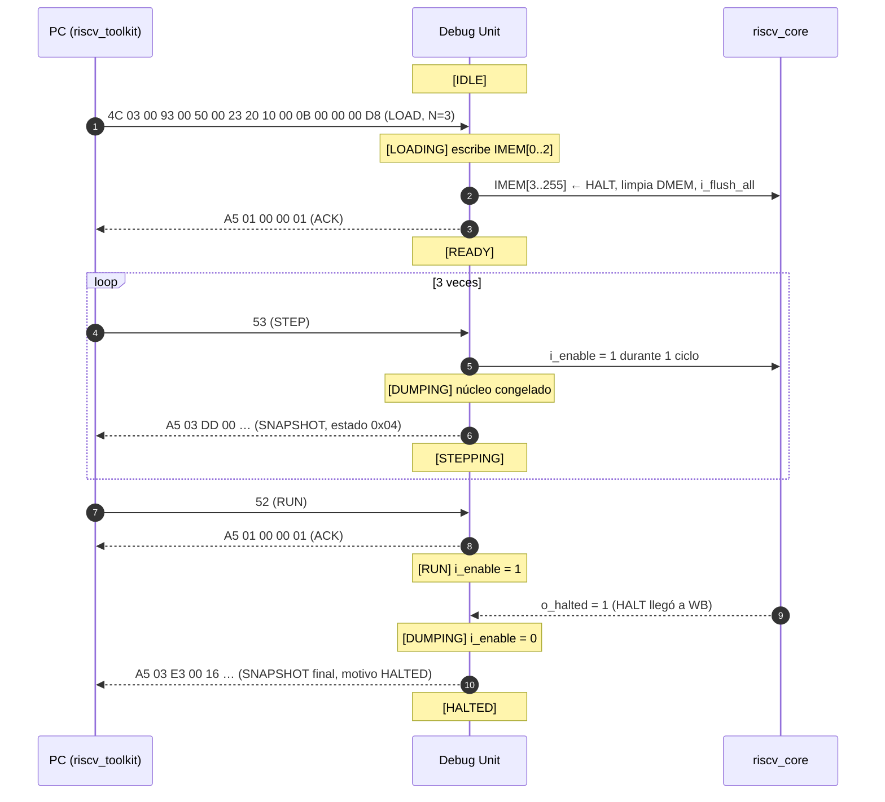

# Secuencia del protocolo: LOAD → STEP × 3 → RUN

Programa y bytes de [`../protocolo.md`](../protocolo.md) §8. Estados de la Debug Unit entre corchetes.

```mermaid
sequenceDiagram
    autonumber
    participant PC as PC (riscv_toolkit)
    participant DU as Debug Unit
    participant C as riscv_core

    Note over DU: [IDLE]
    PC->>DU: 4C 03 00 93 00 50 00 23 20 10 00 0B 00 00 00 D8 (LOAD, N=3)
    Note over DU: [LOADING] escribe IMEM[0..2]
    DU->>C: IMEM[3..255] ← HALT, limpia DMEM, i_flush_all
    DU-->>PC: A5 01 00 00 01 (ACK)
    Note over DU: [READY]

    loop 3 veces
        PC->>DU: 53 (STEP)
        DU->>C: i_enable = 1 durante 1 ciclo
        Note over DU: [DUMPING] núcleo congelado
        DU-->>PC: A5 03 DD 00 … (SNAPSHOT, estado 0x04)
        Note over DU: [STEPPING]
    end

    PC->>DU: 52 (RUN)
    DU-->>PC: A5 01 00 00 01 (ACK)
    Note over DU: [RUN] i_enable = 1
    C-->>DU: o_halted = 1 (HALT llegó a WB)
    Note over DU: [DUMPING] i_enable = 0
    DU-->>PC: A5 03 E3 00 16 … (SNAPSHOT final, motivo HALTED)
    Note over DU: [HALTED]
```
